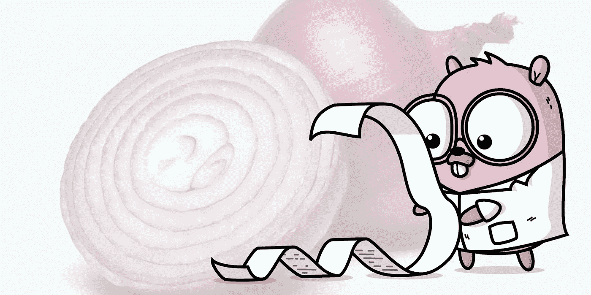

# Go 中的干净架构

> 原文：<https://medium.com/codex/clean-architecture-in-go-a7a28540b3d9?source=collection_archive---------0----------------------->

## 如何让您的 Go 应用程序快速可靠地扩展

几个月前，我写了一篇关于清洁架构原则的文章，重点是一个 Java 应用程序。如果您不熟悉[洋葱架构](https://jeffreypalermo.com/2008/07/the-onion-architecture-part-1/)和[业务逻辑关注点分离](https://www.ben-morris.com/what-do-we-actually-mean-when-we-say-business-logic/)，我建议您阅读一下，以便更熟悉我们将在这里讨论的一些概念。