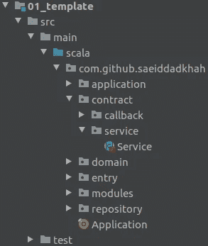

# Scala 中干净的架构

> 原文：<https://medium.com/codex/clean-architecture-in-scala-41d1ab05a618?source=collection_archive---------3----------------------->

首先，什么是干净的架构？罗伯特·c·马丁(鲍勃大叔)声称，尽管系统架构在细节上有所不同，但它们非常相似。六边形建筑和洋葱形建筑是比较流行的。这些架构将引导程序员开发具有以下特征的系统:

*   独立于框架
*   可试验的
*   独立于用户界面
*   独立于数据库
*   独立于任何外部机构

你可以在他的[博客](https://blog.cleancoder.com/uncle-bob/2012/08/13/the-clean-architecture.html)或者他的书*清洁架构:软件结构和设计的工匠指南*中读到更多。

# 我们的风格

虽然每个人都期望一个架构提供一组确切的组件，并指示他们做什么，但是干净的架构是一个让我们修改和利用它的指南。这个示意图是我们干净的建筑风格。

我们干净的建筑

如你所见，这和鲍勃叔叔的风格非常相似。它由四层组成，分别是企业层、应用层、适配器层和基础设施层。

包含领域实体和领域相关用例的企业层是应用层的底层。另一方面，示意图试图同时显示架构和请求流，因为域在流中不起作用，所以实体不是示意图的一部分。然而，黄框应该被认为是企业的领域，那么进入体系结构这一部分的任何对象都应该是已定义的实体或原始数据。把[数据传输对象(DTO)](https://en.wikipedia.org/wiki/Data_transfer_object) 和[数据访问对象(DAO)](https://en.wikipedia.org/wiki/Data_access_object) 转换成这个区域边界的域对象，就是工厂的作用。每个外部接口和存储库可能都有自己的 DTO 或 DAO，因此为每个接口和存储库创建一个适配器包是非常重要的。

鲍勃叔叔的干净建筑

# Scala 模板

在实现应用程序之前，我想创建一个模板。以下所有的结构和代码都可以在[我的 GitHub 库](https://github.com/SaeidDadkhah/clean-arch-example)中找到。随意制造问题和公关。

此项目包含多个子项目。在这里，我将描述一下`./01_template`中的`template`项目。下图是该项目的包装。

01.模板—包装

# 企业层

构建一个应用程序需要一个起点，而`Application.scala`就是我们应用程序的起点。`domain`包是最重要的包，也是我们应用程序的核心，它将包含实体和企业规则。为了显示它与架构的关系，它是企业层中唯一的包。

# 应用层

毫无疑问，程序员会在这一层投入相当多的逻辑和精力，所以在这里使用一些抽象是个好主意。应用层由`application`和`contract`包组成，`contract`包只包含抽象。`service`包是`contract`包中的一个包。所有用例的定义都将在这个包中，它们都应该继承`c.s.Service`类。下面是实现。

`Service`抽象类定义了调用服务时我们应该期望什么。每个服务应该只有一个公共成员可以使用。服务的所有结果和响应都应该包装在一个容器类中，让我们以一种功能性的方式处理异常。`Try`和`Either`可能是我们的潜在选择，但它们有一个严重的缺点，那就是同步性。不使用任何外部框架和库的最佳选择是使用 Scala 的`Future`。因此每个服务都有一个方法`call`获取一个参数和一个`ExecutionContext`并返回一个`Future`对象。例如，我们可以像使用`checkUserService.call("Saeid")`一样使用`CheckUserService[String, Boolean]`的一个实例，并期待一个`Future[Boolean]`对象。

`callback`包将包含几乎所有带有简单 CRUD 操作签名的实体的抽象回调类。我们将把所有服务的实现放在`application`包中。

# 适配器层

E 企业和应用层将完成这项工作，但我们需要触发它们并存储副作用和结果。适配器层负责连接逻辑和基础设施。`entry`包，顾名思义，就是我们将外部接口连接到服务 ***(非用例)*** 的地方，我们可以使用`repository`包中的数据源。如果我们决定在某个时候更改数据库，它只会影响这里。如果新旧数据库都支持同一个连接器，比如说 JDBC，即使在这里也不会有影响。因此这就是鲍勃大叔声称它是 ***独立于数据库*** 的原因。

# 基础设施层和配置

现在简化模板很容易。我们需要将我们的应用程序连接到基础设施，并且我们只需要一组配置来完成这项工作。有趣的是，我直到现在才谈到框架，这就是为什么 Bob 叔叔声称它是独立于框架的**和独立于 UI 的*。***

**请继续关注实现应用程序的下一篇文章。请随意查看 GitHub 库和未解决的问题。我希望你喜欢这个教程。谢谢你。**