# 干净的代码-注释(摘要)

> 原文：<https://medium.com/codex/clean-code-comments-833e11a706dc?source=collection_archive---------1----------------------->


由[卢卡·布拉沃](https://unsplash.com/@lucabravo?utm_source=medium&utm_medium=referral)在 [Unsplash](https://unsplash.com?utm_source=medium&utm_medium=referral) 上拍摄

注释在编程中很重要。一个恰当的注释对程序员来说是非常有帮助的，另一方面，轻率的教条式的注释是非常有害的，可能会给出错误的信息。但是如果我们的代码足够清晰，并且能够讲述一个关于代码块的“好故事”，我们就不需要使用注释。

# 注释不能弥补糟糕的代码

程序员使用注释的常见原因是为了解释错误的代码。但这是一个坏习惯，我们最好清除它，而不是评论一堆乱七八糟的代码。带有少量注释的清晰代码要比带有大量注释的混乱复杂的代码好得多。

> "不要评论糟糕的代码——重写它."布莱恩·w·克尼根和 p·j·普劳格尔

# 用代码解释你自己

我们应该重写代码，而不是在注释中给出解释。了解不同之处:

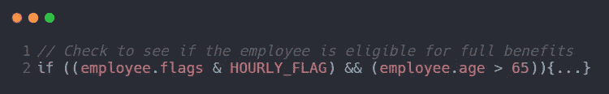

和

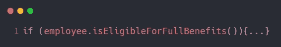

这只是简单地创建一个函数，它说的和我们想写的注释一样。

# 好评

一些评论是必要的。但是请记住，唯一真正好的评论是你设法**不写**的评论。

## 法律意见

有时，公司出于法律原因强迫我们写一些评论。例如版权和著作权。

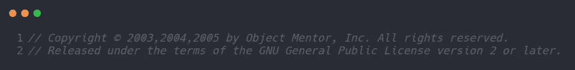

尽可能多地参考标准许可证或其他外部文档，而不是将所有条款和条件放入注释中。

## 信息丰富的评论

用注释提供基本信息是很有用的。比如函数的输入格式。

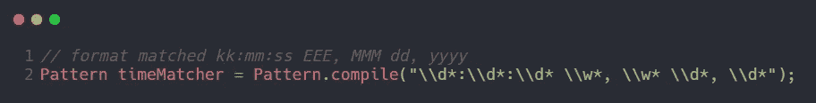

上面的代码解释了正则表达式旨在匹配时间和日期，以及使用指定格式字符串的函数。

## 意图解释

有时，评论被用来解释决策背后的意图

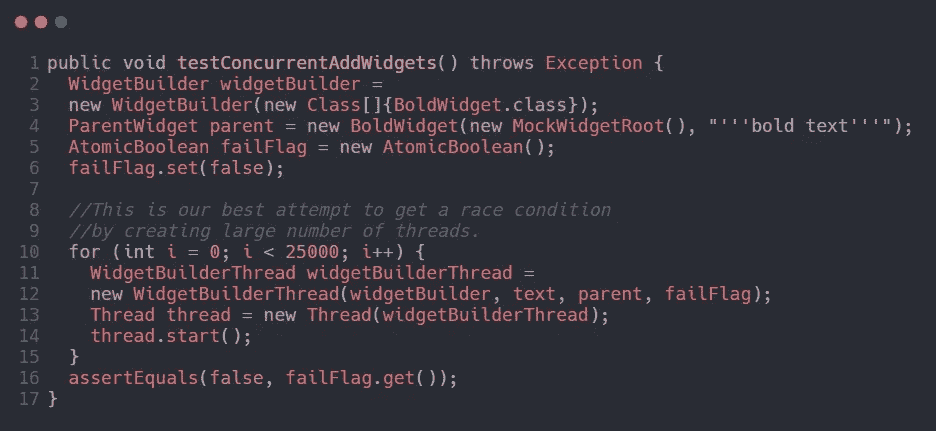

关注程序员试图解释他为什么选择那个数字的评论。

## 澄清

有时候，将一段代码的意思翻译成可读的东西是很有帮助的。一般来说，最好是找到一种方法，使代码块本身变得清晰。

## 后果警告

警告其他程序员某些后果是有用的。例如:

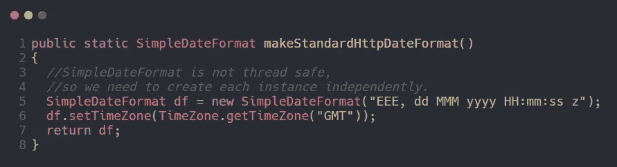

还是那句话，还是解决问题比较好。但是这些评论是合理的，它给了程序员一个警告。

## 待办事项注释

当有程序员认为应该做的工作，但由于某种原因一时做不了的时候，以`//TODO`注释的形式留下一些“待办事项”的笔记也是不错的。`//TODO`注释可以给出一个关于函数的未来应该是什么的信息。

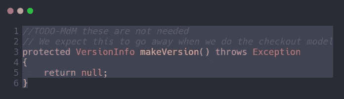

## 扩大

评论可以用来强调一些看起来无关紧要的事情的重要性。

# 不好的评论

## 咕哝

如果你决定写一篇评论，那么花必要的时间来确保这是你能写的最好的评论，并且不会给读者一个模糊的理解。任何迫使你在另一个模块中寻找该注释含义的注释都无法传达给你，并且不值得你花费这些时间。

## 多余的评论

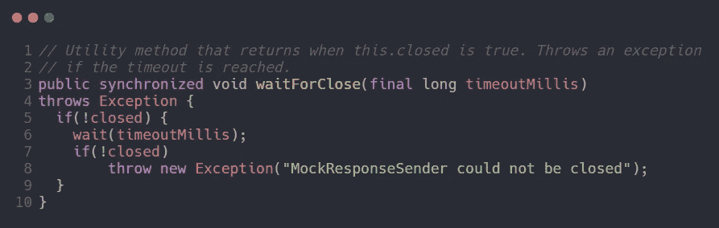

那个评论完全是多余的。阅读起来可能比代码本身还要费时。

## 误导性的评论

此外，上图中的评论具有误导性。当`this.closed`变为`true`时，该方法不返回。否则，它会等待一个盲目的超时，如果`this.closed is`仍然**不**为真，它就会抛出一个异常。

## 强制性意见

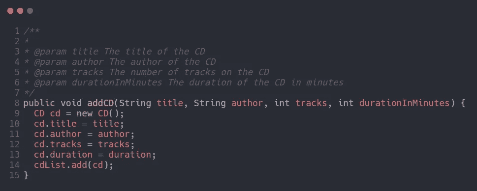

有一个规则说每个函数都必须有一个 javadoc，或者每个变量都必须有一个注释，这不是一个好主意。像这样的注释只会弄乱代码，传播谎言，并导致普遍的混乱和混乱。

## 日志注释

```
* Changes (from 11-Oct-2001)
* --------------------------
* 11-Oct-2001 : Re-organised the class and moved it to new package
*               com.jrefinery.date (DG);
* 05-Nov-2001 : Added a getDescription() method, and eliminated           *               NotableDate class (DG);
* 12-Nov-2001 : IBD requires setDescription() method, now that
*               NotableDate class is gone (DG); Changed 
*               getPreviousDayOfWeek(), getFollowingDayOfWeek() and 
*               getNearestDayOfWeek() to correct bugs (DG);
* 05-Dec-2001 : Fixed bug in SpreadsheetDate class (DG);
```

很久以前，当我们没有版本控制系统时，上面的日志可能会有所帮助。如今，这些长日志只是更加混乱，混淆了模块

## 属性和署名

```
/* Added by Rick */
```

和以前一样。版本控制系统有助于记住谁在何时添加了什么。

## 注释掉的代码

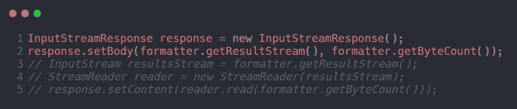

其他看到注释掉的代码的人不会有勇气删除它。他们会认为这是有原因的，而且太重要了，不能删除。再次，我们有一个很好的资源版本控制系统。那些系统会为我们记住密码。我们不必再对它进行评论了。删了代码就行了。

## 噪音评论

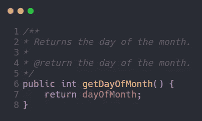

从上图来看，噪音评论是不好的，无所作为，不提供新的信息。

## 可怕的噪音

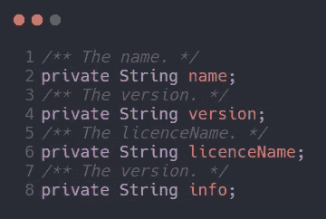

Javadocs 也可能很吵。他们只是多余的提供文档。

## 当可以使用函数或变量时，不要使用注释

考虑下面这段代码:

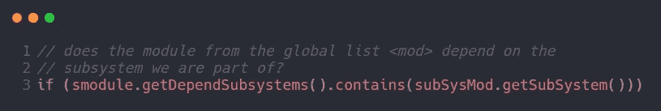

这可以不加评论地重新措辞为

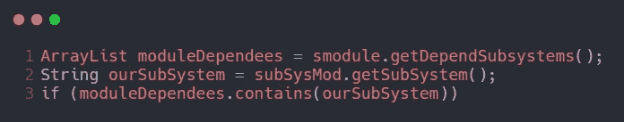

## 位置标记

```
// Actions //////////////////////////////////
```

也许你见过这样的位置标记。实际上，你很少看到位置标记。所以要非常谨慎地使用它们，只有在好处显著的时候才使用。否则，它们将会被淹没在背景噪音中而被忽略。

## 右大括号注释

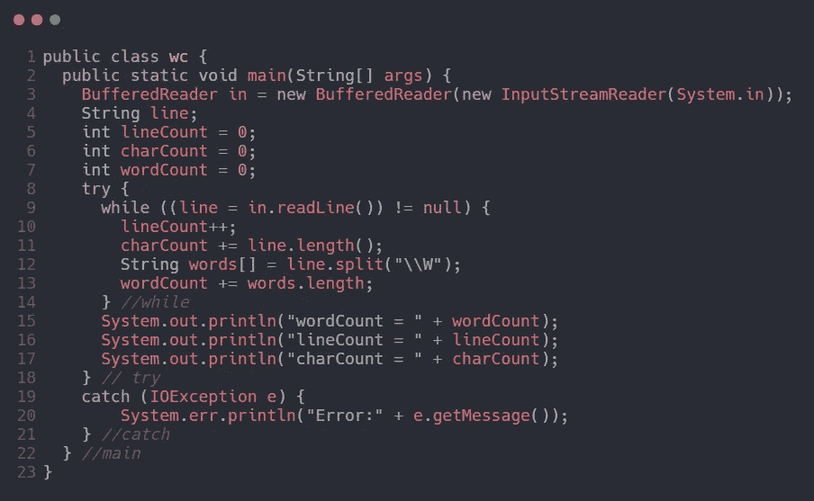

有时候程序员会在右大括号上加上特殊的注释。所以如果你发现自己想要标记你的右括号，试着缩短你的函数。

## 非局部信息

如果你必须写一个注释，那么确保它描述了出现在**和**附近的代码。不要在本地注释的上下文中提供系统范围的信息。

## 信息太多

不要像下面这个例子一样，把有趣的历史讨论或者无关紧要的细节描述放到评论里。

```
/*RFC 2045 - Multipurpose Internet Mail Extensions (MIME)Part One: Format of Internet Message Bodiessection 6.8\. Base64 Content-Transfer-EncodingThe encoding process represents 24-bit groups of input bits as outputstrings of 4 encoded characters. Proceeding from left to right, a24-bit input group is formed by concatenating 3 8-bit input groups.These 24 bits are then treated as 4 concatenated 6-bit groups, eachof which is translated into a single digit in the base64 alphabet.When encoding a bit stream via the base64 encoding, the bit streammust be presumed to be ordered with the most-significant-bit first.That is, the first bit in the stream will be the high-order bit inthe first 8-bit byte, and the eighth bit will be the low-order bit inthe first 8-bit byte, and so on.*/
```

## 不明显的联系

注释和它描述的代码之间的联系应该是显而易见的。确保读者能够理解评论的内容。

## 函数标题

短函数不需要过多描述。为做一件事的小函数选择一个好名字通常比注释头要好。

## 非公共代码中的 Javadocs

为系统内部的类和函数生成 javadoc 页面通常没有什么用处，只会造成更多的混乱和干扰。

这些都是我一直在努力学习的那本书的第四章总结，并且得到了书名为《干净的代码》的那本书的要点，作者是 Robert C. Martin。

请随时提供一些建议和反馈。谢了。

# 参考

罗伯特·c·马丁的《干净的代码》