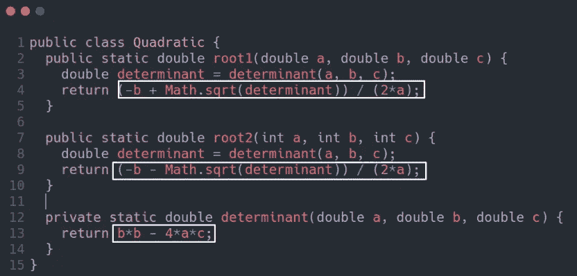

# 清除代码—格式化(摘要)

> 原文：<https://medium.com/codex/clean-code-formatting-summary-9a475ba10ac8?source=collection_archive---------13----------------------->

阿里萨·查塔萨在 [Unsplash](https://unsplash.com?utm_source=medium&utm_medium=referral) 上的照片

> 代码格式很重要。它与沟通有关，而沟通是专业开发人员的首要任务。

# 垂直格式

## 报纸隐喻

想一篇写得很好的报纸文章。你垂直阅读它。在顶部，你期待一个能告诉你故事内容的标题。第一段给了你整个故事的梗概。继续往下，细节会增加，直到你有了所有的日期、名字、引用、声明和其他细节。

和报纸一样，你应该有一个写得很好的代码。名称应该足以告诉我们是否在正确的模块中。源文件的最上面部分应该提供高层次的概念和算法。随着我们向下移动，细节应该增加，直到最后我们在源文件中找到最低级别的函数和细节。

## 概念之间的纵向开放性

每行代表一个表达式或一个子句，每组行代表一个完整的思想。你应该用空行把每一个想法分开。了解不同之处:

随着

哪个代码可读性更好？

## 垂直密度

紧密相关的代码行应该看起来垂直密集(彼此靠近)。看到区别了吗:\

随着

第一张图片有一些无用的评论，第二张图片更容易阅读，无需移动头部或眼睛。

## 垂直距离

> 密切相关的概念应该在垂直方向上相互靠近

执行上述规则有一些提示:

1.  **变量声明**。变量的声明应该尽可能接近它们的用法，局部变量应该出现在每个函数的顶部。

循环的控制变量**通常应该在循环语句**中声明

****

****实例变量**应该在类的顶部声明，因为它们被类的许多方法使用。关于实例变量该何去何从，有过很多争论。在 C++中，通常把所有的实例变量放在底部。与 Java 不同的是，Java 的惯例是把它们都放在类的顶部。但是重要的是实例变量要在**一个众所周知的地方**声明。**

****依赖函数。**如果一个函数调用另一个函数，它们应该**垂直靠近**，调用方应该在被调用方之上**

******概念一致性。**如果一组功能执行相似的操作，共享共同的命名方案，并执行相同基本任务的变体。他们应该靠得很近。****

## ****垂直排序****

****被调用的函数应该在执行调用的函数之下。这创建了从高级到低级的源代码模块的良好流程。****

# ****水平格式****

****作者说，他过去常常遵循这样一条规则，即你永远不必向右滚动，并亲自将屏幕上的字符限制在 120 个。****

## ****横向开放度和密度****

****使用水平的**空白**来关联**强相关**的事物，并分离**弱相关**的事物。例如:****

********

****从上图看，作者有一些建议，重点是:****

*   ****用空格将赋值运算符括起来，以突出它们。空格使这种分离变得明显(**弱相关**)。****
*   ****不要在函数名和左括号之间加空格。把它们分开，让它们看起来是脱节的，而不是连体的(**强相关**)。****
*   ****分隔函数中的参数以强调逗号，并显示参数是独立的。****

****空白的另一个用途是强调运算符的**优先级**。例如:****

********

****这些因素在等式之间没有空格，因为它们具有高优先级。因为加法和减法的优先级**比**低，所以术语用空格**分隔**。****

## ****水平线向****

********

****水平校准**无用**。这种排列方式似乎**强调了错误的东西**，并且将视线从真正的意图上引开。上面的声明列表试图在不查看变量类型的情况下读取变量名列表。同样，赋值语句列表试图向下查看值列表，但从未看到赋值操作符。****

****不要对声明和赋值使用水平对齐，如下所示。****

********

## ****刻痕****

******按照源代码行在层次结构中的位置比例缩进**源代码行，以使这个层次结构的作用域**可见**。遵循以下要点:****

*   ****文件级的语句，如大多数类声明，根本不缩进。****
*   ****类中的方法在类的右边缩进一级。****
*   ****这些方法的实现在方法声明的右边缩进了一级。****
*   ****块实现被**缩进**到其包含块的右边一级。****

****考虑以下在语法和语义上完全相同的程序:****

********

****随着****

********

****有时候，对于短的`if`语句、短的`while`循环或像这样的短函数，打破缩进规则是很诱人的:****

********

****但是，尽可能尝试扩展和缩进范围，就像这样:****

********

## ****虚拟示波器****

****当你有一个 while 或 for 语句的伪体时，如下所示，要避免这种结构。****

********

# ****团队规则****

> ****一个好的软件系统是由一组易读的文档组成的。他们需要有一致流畅的风格。****

****一个开发团队应该就单一的格式样式达成一致，然后该团队的每个成员都应该使用该样式。目标是，软件要有一致的风格。****

# ****鲍勃叔叔的格式规则****

****请将此视为代码如何成为最佳编码标准文档的示例。****

********

****这些都是我一直在努力学习的那本书的第 5 章总结，并且得到了书名为《干净的代码》的那本书的要点，作者是 Robert C. Martin。****

******请随时给出一些建议和反馈。谢了。******

# ****参考****

****罗伯特·c·马丁的《干净的代码》****