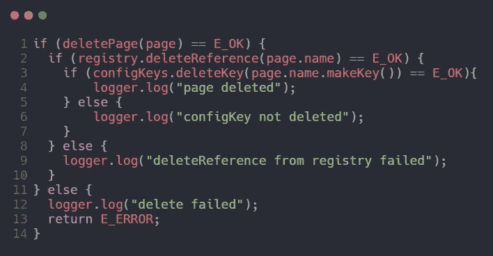

# 干净代码—功能(摘要)

> 原文：<https://medium.com/codex/clean-code-function-sumarry-7cc1b0ce1c19?source=collection_archive---------15----------------------->

照片由[沙哈达特·拉赫曼](https://unsplash.com/@hishahadat?utm_source=medium&utm_medium=referral)在 [Unsplash](https://unsplash.com?utm_source=medium&utm_medium=referral) 上拍摄

# 小！

> “函数的首要规则是它们应该很小。函数的第二个规则是它们应该比那个小。”

这不是一个合理的说法。但是作者编写了几个 100 到 300 行的函数，也编写了 20 到 30 行的函数。有一个建议，经过长时间的反复试验，是应该小的。

你的函数应该有多短？

到

从上面的例子中，我们知道我们可以通过创建一个处理特定事情的子函数来使函数变得更小。

函数不应该大到足以容纳嵌套结构。
因此，一个函数的缩进量不能大于**一个**或**两个**。当然，这使得函数**更容易阅读和理解。**

# 做一件事

> “功能应该做一件事。他们应该做好这件事。他们只应该这样做。”

现在，问题是“一件事”是什么意思？

如果一个函数只做一些比它的名字低一级的步骤，那么这个函数只做一件事。了解一个函数不仅仅做“一件事”的另一种方法是，你是否可以从中提取另一个函数。

# 每个功能一个抽象层次

如果你想让你的函数做“一件事”，确保函数中的
语句都在同一抽象层次。

# Switch 语句

很难做一个小小的`switch`声明。即使只有两种情况的 switch 语句也比单个块或函数要长。就其本质而言，开关盒执行 N 种职责。如果可能的话，不应该使用 switch 语句。但是有些情况下我们无法避免 switch 语句。在这种情况下，使用多态性，确保每个 switch 语句都隐藏在一个低级类中，并且永远不要重复。

# 使用描述性名称

名字对于编写干净的代码是很重要的。不要害怕让名字变长。一个长的描述性的名字比一个短的神秘的名字更好。一个长的描述性名称比一个长的描述性注释更好。不要害怕花时间选择一个名字。名字应该听起来像一个故事，函数名应该是一个动词。

# 函数参数

一个函数的理想参数个数是零(niladic)。接下来是**一个**(一元)，紧接着是**两个**(二元)。应尽可能避免三个参数(三元组)。**反正三个以上**(多元数)不应该用！。

从测试的角度来看，论证更加困难。如果没有争论，这是微不足道的。如果有一个论点，也不是太难。有了两个参数，问题变得更具挑战性。如果有两个以上的参数，测试每个适当值的组合可能会令人困惑。

## 常见的一元形式(一个参数)

将单个参数传递给函数有三个常见原因:

*   **提问:**你可能会问一个关于布尔值`fileExists(“MyFile”).`的问题
*   **操作、转换和返回:**你可以操作那个参数，把它转换成别的东西并返回。InputStream `fileOpen(“MyFile”).`将字符串文件名参数转换成一个`InputStream` 返回值。
*   **事件:**将函数调用解释为**事件**，并使用参数**改变系统的状态**。比如 void `passwordAttemptFailedNtimes(int attempts)`。

## 标志参数

标志参数很难看。将布尔值传递给函数是一种非常糟糕的做法。根据设计，该函数不止做一件事。如果标志为真，它做一件事；如果标志为假，它做另一件事！

## 二元函数(两个自变量)

有两个参数的函数比只有一个参数的函数更难理解。但是，有时两个论点是恰当的。例如，`Point p = new Point(0,0);`是完全合理的。笛卡尔点自然带有两个参数。

但是，本例中的两个参数是单个值的**有序组件！。**比如`assertEquals(expected, actual)`都有问题。每次你都可以检查`expected` 是第一个参数还是第二个参数。

二元结构并不邪恶，如果有必要，只要在论点有自然衔接或自然排序时使用它们。

## 三元组(三个参数)

带有三个参数的函数比带有两个参数的函数更难理解。排序、暂停和忽略的问题增加了一倍多。尽量避免吧！。

## 参数对象

当函数需要两个或三个以上的参数时，它们(参数)可能被包装成自己的类。

## 参数列表

有时函数可以传递可变数量的参数。如果变量参数都被同等对待，那么它们就等同于类型为`List`的单个参数。

## 动词和关键词

同样，为函数选择好的名字可以解释函数的意图，而且可以解释参数的意图。比如`write(name)`。不管这个`name`是什么，它正在被“书写”

# 没有副作用

该函数应该做一件事。有时，它会对自己类的变量进行意外的更改，这会导致**时间耦合**和**顺序依赖**。

`checkPassword` 函数应该只返回布尔值。但是它有可能引起副作用的`Session.initialize()`。调用`Session.initialize()`会导致在检查用户合法性时删除现有会话数据的风险。

如果你必须有一个时间上的耦合，你应该在函数的名字里说清楚。在这种情况下，您可以将上面的函数重命名为`checkPasswordAndInitializeSession()`。记住，那肯定违反了“做一件事”

## 避免输出参数

输出参数比输入参数更难理解，因为我们通常不期望信息通过参数传递出去。因此，不使用输入参数，而是使用返回值。

# 命令查询分离

函数应该做些什么或者回答些什么，但不能两者都做。两者都做往往会导致混乱。例如

从读者的角度想象一下。这是什么意思？是在问“用户名”属性之前是否设置为“Andiko”？还是在问“用户名”属性是否成功设置为“Andiko”？

解决方案是通过创建一个新函数`attributeExists(atribute)`将命令与查询分开，这样就不会出现歧义。

# 首选异常，而不是返回错误代码

从命令函数返回错误代码是对命令查询分离的微妙违反。它可能会导致深度嵌套的结构。

您可以使用异常来代替返回的错误代码。

## 提取 Try/Catch 块

最好将 try 和 catch 块的主体提取到它们自己的函数中

## 错误处理是一回事

函数应该做一件事。错误处理是一回事。如果关键字`try` 存在于一个函数中，它应该是函数中的第一个单词，并且在 catch/finally 块之后应该是空的。

# 干(不重复)

你不应该每次都重复你的代码，当它需要改变的时候，它会折磨你或者其他人。**复制可能是软件中一切罪恶的根源。**

# 结构化程序设计

保持你的函数小一些，偶尔出现多个`return`、`break`或`continue` 语句可能没有坏处，有时甚至比单入口单出口规则更有表现力。您应该避免使用`goto` 语句，因为它只在大型函数中有意义。

# 结论

每一个系统都是由程序员设计的领域特定语言构建而成，以**描述该系统**。函数是该语言的**动词**，类是**名词**。

编程大师认为**系统是要被**讲述的**故事，而不是要被**编写的**程序。函数描述了系统中发生的所有动作。**

如果你遵循这些规则，你的函数将会很短，命名良好，组织良好。但是，不要忘记，我们的目标是讲述系统的故事。所以你需要调整它，让它变得干净，来帮助你写一个好故事。

这些都是我一直在努力学习的那本书的第三章的总结，并且得到了书名为《干净的代码》的那本书的要点，作者是 Robert C. Martin。

**请随时给出一些建议和反馈。谢了。**

# 参考

罗伯特·c·马丁的《干净的代码》