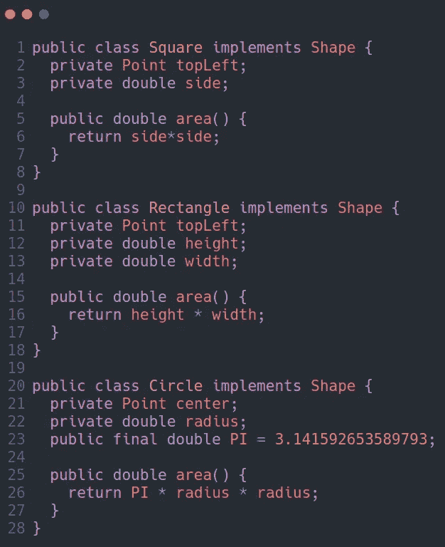

# 干净的代码—对象和数据结构(摘要)

> 原文：<https://medium.com/codex/clean-code-objects-and-data-structures-summary-1aa5d2058f84?source=collection_archive---------4----------------------->

克林特·王茂林在 [Unsplash](https://unsplash.com?utm_source=medium&utm_medium=referral) 上拍摄的照片

# 数据抽象

隐藏实现是关于抽象的。但是，它并没有简单地将变量私有，而是使用 getters 和 setters 来访问这些变量。相反，它公开了抽象接口，允许用户操作数据的**本质**，**而不必知道其实现**。例如:

和

第一种使用具体术语来表示车辆的燃油油位，而第二种则使用百分比的抽象概念。上述第二种选择更可取。相反，我们希望用抽象的术语来表达我们的数据。这不仅可以通过使用接口和/或 getters 和 setters 来实现。

# 数据/对象反对称

简单地说，对象和数据结构的区别是:

*   **对象**:将它们的数据隐藏在抽象之后，并公开对这些数据进行操作的函数。
*   **数据结构**:暴露自己的数据，没有有意义的函数。

例如，考虑程序形状示例。`Geometry`类操作三个形状类。形状类是没有任何行为的简单数据结构。所有的行为都在`Geometry`类中。

观察如果我给`Geometry`添加`perimeter()`函数会发生什么。表单类不会受到影响。另一方面，如果我添加一个新的形状(一个新的数据结构)，我必须改变`Geometry`中的所有函数来处理它。

现在考虑面向对象的解决方案。这里的 `area()`方法是多态的。不需要`Geometry`类。因此，如果我添加一个新的形状，现有的功能都不会受到影响，但如果我添加一个新的功能，所有的形状都必须改变！

对象和数据结构之间的基本二分法是:

> 过程代码(使用数据结构的代码)使得在不改变现有数据结构的情况下添加新功能变得容易。另一方面，OO 代码使得在不改变现有功能的情况下添加新类变得容易。

补码

> 过程代码使得添加新的数据结构变得困难，因为所有的函数都必须改变。面向对象代码很难添加新的功能，因为所有的类都必须改变。

关键是有些事情对于 OO 来说**难，对于程序**来说**容易，对于程序**来说**难的事情对于 OO** 来说**容易！**

当我们想要**添加新的数据类型**而不是新的函数时， **OO** 是最合适的。当我们想要**添加新的函数**而不是数据类型时，**数据结构**会更合适。

# 德米特里定律

Demeter 的 L *aw 表示一个模块不应该知道它所操作的*对象*的内部结构。这意味着对象不应该通过访问器公开其内部结构。*

更准确地说，假设您有一个方法`f`和一个类`C`。Demeter 法则说一个类`C`的方法`f`应该只调用这些方法:

*   `C`(本身)
*   由`f`创建的对象
*   作为参数传递给`f`的对象
*   保存在`C`的实例变量中的对象

例如:

该方法不应调用由任何允许的函数返回的对象上的方法。换句话说，和朋友说话，不要和陌生人说话。

## 火车失事

看看下面违反德米特里定律的代码

它违反了 Demeter 定律，因为它对`getOptions()`的返回值调用`getScratchDir()`函数，然后对`getScratchDir()`的返回值调用`getAbsolutePath()`。这种代码通常被称为火车残骸，因为它看起来像一堆耦合的火车车厢。最佳解决方案是按如下方式将其拆分:

这是否违反了 Demeter 取决于`ctxt`、`Options`和`ScratchDir` 是对象还是数据结构。如果它们是**对象**，那么它们的内部结构应该是**隐藏**而不是暴露。另一方面，如果`ctxt`、`Options`和`ScratchDir` 只是没有行为的**数据结构**，那么**自然会暴露**它们的内部结构，因此 Demeter 不适用。

## 杂种

混合结构是一半对象一半数据的结构。混合使得增加新的功能变得困难，但是也使得增加新的数据结构变得困难。**避免**制造它们。

# 数据传输对象

数据结构的典型形式是一个有公共变量而没有函数的类，它被称为数据传输对象或 DTO。dto 是非常有用的结构，尤其是在与数据库通信或解析来自套接字的消息时，等等。

更常见的叫做“豆”形。Beans 拥有由 getters 和 setters 操作的私有变量。

## 活动记录

活动记录是具有公共(或被访问过的)变量的数据结构。但是它们通常有像`save` 和`find`这样的导航方法。通常，这些活动记录是从数据库表或其他数据源直接翻译而来的。

**不要把业务规则方法放入这些数据结构中，把它们当成对象。解决方案是将活动记录视为一个数据结构，并创建包含业务规则和隐藏其内部数据的单独对象。**

# 结论

*   **对象**暴露行为，隐藏数据。这使得在不改变现有行为的情况下添加新类型的对象变得容易，但是使得向现有对象添加新行为变得困难。
*   **数据结构**公开数据，没有显著的行为。这使得向现有数据结构添加新行为变得容易，但是向现有函数添加新数据结构变得困难。
*   当我们希望灵活地添加新的**数据类型**时，我们更喜欢将**对象**用于系统的那个部分。
*   当我们希望灵活地添加新的**行为**时，我们更喜欢将**数据结构**用于系统的那个部分。
*   优秀的软件开发人员不带偏见地理解这些问题，并为工作选择最佳方法。

这些都是我一直在努力学习的书的第 6 章总结，得到了书名为《干净的代码》的书的要点，作者是 Robert C. Martin。

请随时提供一些建议和反馈。谢了。

# 参考

罗伯特·c·马丁的《干净的代码》