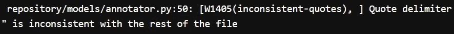
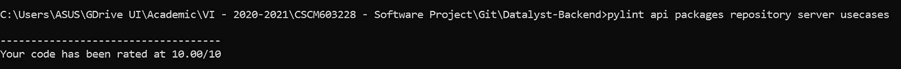
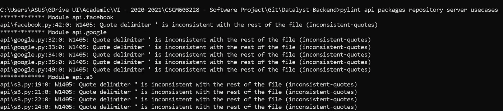

# 干净代码标准:方便还是麻烦？

> 原文：<https://medium.com/codex/clean-code-standards-convenience-or-nuisance-9f557c75a468?source=collection_archive---------9----------------------->


阿诺·弗朗西斯卡在 [Unsplash](https://unsplash.com?utm_source=medium&utm_medium=referral) 上的照片

与实际交付一个工作产品相比，交付一个“干净”的产品似乎不那么重要，特别是因为产品的代码在生产中不会被最终用户看到。虽然这在现实世界中有些正确，但是它忽略了关于可持续软件工程过程的一些要点。在[的上一篇文章](https://rmdra08.medium.com/test-develop-maintain-short-guide-for-sustainable-programming-f78d6bcc13f5)中，我们已经看到了测试驱动开发(TDD)在通过强调全面的计划、一致性和可维护性来维护可持续软件工程过程中的作用。**干净代码**也通过不同的策略强调相同的特质，把它放在和 TDD 一样的优先级。然而，问题仍然存在:**什么是“干净”的代码？**

**注意:**本文将提供一些来自 Nice PeoPLe 团队的 Crowd+开发项目的干净代码实践的例子。由于后端代码库是用 Python 编写的，所以本文遵循 Python 的标准和最佳实践。有些可能与其他语言无关。

# 我们都同意:干净的代码=可读的代码

对于预期长期维护的软件，要考虑的最重要的事情之一是代码库必须是开发团队可读的，这样团队的任何成员都可以很容易地对它做出贡献。虽然这是一个主观的标准，但是通过遵循**领域驱动开发(DDD)** 原则，代码可以很容易地变得可读。这个原则要求代码实现反映实现的预期业务目的，以便在所有涉众之间维护一致的“术语表”，而不仅仅是特定的开发人员，甚至是开发团队。

让我们看看下面这个使用领域驱动开发的干净代码效果的经典例子:

干净代码和不干净代码的例子，强调了**可读性**的不同。

对于上下文，上面的代码用于从用户的电子邮件和请求日期的散列组合中为用户生成唯一的代码。不干净的代码简单的把变量显示为`email`、`date`、`code`，太笼统，没有上下文很难理解(谁的邮箱？什么日期？什么代码？).因此，打算重构或引用这些变量的开发人员可能需要询问最初的开发人员，或者更糟糕的是，无意或有意地废弃代码，并在其位置上编写新的代码。重构后的干净代码简单地将变量重命名为更容易理解的`user_email`、`code_request_date`和`generated_code`，显示出代码可读性的显著提高。

可读(并且，通过扩展，可解释)的代码在 Python 中被认真对待，并且包含在 Python 的 Zen(PEP 20)中，这可以被视为 Python 的指导原则:

```
Beautiful is better than ugly.
Explicit is better than implicit.
Simple is better than complex.
...
**Readability counts**.
...
If the implementation is hard to explain, it's a bad idea.
If the implementation is easy to explain, it may be a good idea.
...
```

然而，如前所述，可读性是一个主观的问题，如果没有开发人员自己明确的良心，很难自动强制执行可读的代码。

# 略有争议:干净的代码==一致的代码

在大多数情况下，在一个代码实现中有多种方式来表达同一个解决方案。虽然一次使用其中的一些或全部很有诱惑力，但这可能会导致不一致，并在需要时使重构变得复杂。一致代码的优势不如可读代码明显，因为可读的不一致代码仍然可以被仍然能够理解它的开发人员认为是可接受的。

在 Python 的例子中，虽然 Python 为一个程序推荐了一个单一的显而易见的解决方案，但在某些情况下，解决方案的多样性是在语言本身中形成的。一个这样的例子是对字符串使用引号:

上面的代码片段展示了在 Python 中封装字符串的三种不同方法，每种方法都有自己的主要用途。单引号(')和双引号(")之间的区别是为了在字符串本身需要引号时减少转义字符的数量。例如，如果我们想在字符串本身中包含单引号(')，我们可以使用双引号作为字符串的外壳。另一方面，三重双引号用于将多行字符串括起来。

正如我们在上面看到的，在一个代码文件中使用多种字符串封装类型不会影响可读性。但是，当没有任何目的需要特定的闭包时，它有助于使闭包均匀化，特别是对双引号(")，这是大多数编程语言中的标准字符串闭包。

一些一致性检查可以使用诸如 Pylint 之类的 linters 自动完成。字符串包含一致性受 W1405(不一致引号)规则控制，如下所示:



Pylint 检测到**不一致的字符串括引号**

# 房间里的大象:杂项规则和干净代码标准套件

这一部分通常是干净编码中最有争议的部分，因为规则通常是随意创建的，没有明显的目的。通常，这些规则的目的可能不会直接影响可读性、一致性或可维护性，但可能会间接引发影响它们的其他问题。

让我们以 PEP 8 (Python 的默认样式指南)关于字符限制的规则为例。该指南建议一行最多 79 个字符，这似乎是一个武断且过于严格的规则。这个数字实际上来自传统终端的 79 个字符的最大宽度，如果不超过这个数字，水平滚动可以被阻止。然而，随着 GUI 和可调整大小的窗口的出现，这条规则变得越来越不适用。在 Google 的 Python 风格指南中，这个限制稍微放宽到每行 100 个字符。然而，我们确实需要看到这条规则背后的道德价值:

1.  这条规则不鼓励使用复杂的单行代码
2.  这条规则间接地阻止了创建带有大量参数的函数

下一个问题是编码风格标准套件。一种语言的维护者或一些专业的开发团队开发他们自己的干净的编码规则，并经常发布给其他开发人员使用，例如:

1.  来自 Python 的 PEP 8 (Python)
2.  来自 Google 的 Styleguide (Python)
3.  来自 airbnb 的 eslint-config-airbnb (JS)

虽然这些套件对于不了解特定语言的干净代码实践的开发人员来说是一个很好的开始，但是由于个人偏好也是干净代码中的一个因素，一些规则可能会成为一个麻烦。例如，Google 的 Styleguide 实施了严格的文档规则，其中每个函数都应该有自己的 docstring。

最终，自定义规则和干净代码标准套件都只是开发人员要遵循的一组规则，并被配置到自动化工具(如 linters)中。干净代码的执行依赖于开发人员对可持续软件工程过程的理解。规则可以适应开发者的需求，工具可以重新配置，只要有足够的理由添加/删除它们。

# 额外收获:用 Google Styleguide 为 Python 项目配置 Pylint

这篇额外的指南将带您通过 Google 的 Styleguide 为 Python 项目配置 Pylint，包括随意排除规则的方法。

## 第一步。安装 Pylint

Pylint 是一个外部库，需要通过包管理器安装。如果您使用 Python 的默认包管理器(`pip`)，您可以使用下面的命令来安装 Pylint:

```
# You may need to replace pip with pip3 for macOS and Linux
pip install pylint
```

一些大型项目可能会使用更高级的包管理器，比如`poetry`。以下命令使用诗歌安装 Pylint 并更新依赖项列表:

```
poetry add pylint
```

## 第二步。配置 Google 样式指南

Pylint 使用`pylintrc`文件作为 Pylint 在特定项目中的配置方法。Google 的 Styleguide 为您预先配置了这个文件，这样您就可以立即将文件放入项目的根目录中。该文件可以通过风格指南的官方网站([链接](https://google.github.io/styleguide/pyguide.html))下载。

在 Python 项目中，实际上排除比包含更好，以确保最大的项目覆盖率。在某些情况下，确实存在一些需要排除的目录，例如虚拟环境文件夹或与其他语言相关的文件夹(例如:React)。可以将 Pylint 配置为忽略这些文件和目录，方法是将它们输入到 pylintrc，如下所示(Pylint 只接受基本名称，不接受路径):

```
ignore=file1,folder1,file2,folder2,...
# Example: ignore=env,migrations,tests,backend_datalyst,manage.py
```

## 第三步。运行 Pylint

Pylint 是一个 CLI 应用程序，可以执行它来获得一个报告，该报告参照已建立的规则集显示代码的质量。要执行 Pylint，在项目的根目录下运行以下命令(在`pylintrc` 文件旁边):

```
pylint module-name-1 module-name-2 module-name-3 ....
# Example: pylint api packages repository server usecases
```



没有发现违规时 Pylint 的代码质量报告视图。



当根据已建立的规则集发现违规时，Pylint 的代码质量报告视图。

除了列出扫描过程中发现的违规，Pylint 还根据违规的数量给出了总体代码分数。该分数可用于判断整体代码质量，并被解析为存储库徽章。Pylint 还可以集成到各种 ide 中，以便在保存或提交时进行自动检查。