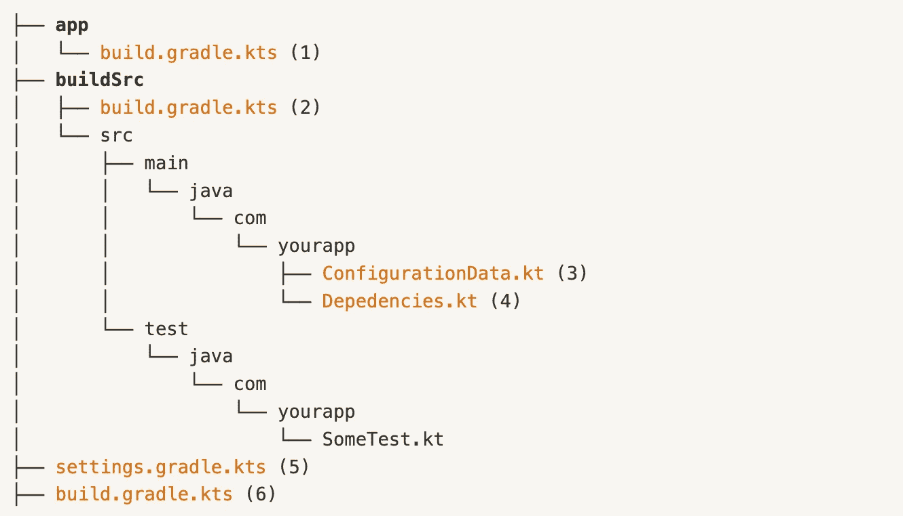

# 多模块 Android 项目中的干净依赖管理

> 原文：<https://medium.com/codex/clean-dependency-management-in-multi-module-android-projects-49f2a0df8d2f?source=collection_archive---------2----------------------->

图片由 [pixabay](https://pixabay.com/photos/toys-play-plastic-funny-ant-man-4982760/)

如果您正在开发一个多模块的 Android 应用程序，并且正在寻找一种干净的、可扩展的方式来组织所有的依赖项并构建项目的配置，那么这篇文章就是为您准备的。我们将介绍一种方法，这种方法将构建配置组织在一个公共位置，并利用 Kotlin 的 DSL 支持来实现清晰的语法、强大的 Kotlin 功能以及构建文件中的平滑导航。

# 我们将使用的工具

如今，不使用 Gradle 作为 Android 项目的构建自动化工具是愚蠢的。Gradle 不仅提供了比其他构建工具更高的性能和可定制性，而且它还附带了一个非常大的[插件库](https://plugins.gradle.org/)，这使它成为一项非常强大的资产。

事实上，你可能已经使用了一个插件[来集成 Gradle 和 Android Studio。我们还将利用](https://developer.android.com/studio/releases/gradle-plugin) [kotlin-dsl 插件](https://github.com/gradle/kotlin-dsl-samples)来无缝地用 kotlin 编写我们的构建逻辑，并将其添加到 Gradle 文件中。

# 我们将遵循的结构

通常的做法是使用一个`buildSrc`目录来封装构建逻辑。Google 经常在他们的[示例架构项目](https://github.com/android/compose-samples)中使用这种方法，Gradle 本身也在他们的[文档](https://docs.gradle.org/current/userguide/organizing_gradle_projects.html#sec:build_sources)中包含了一些关于这方面的技巧。

> 简而言之，诸如依赖版本控制、配置数据、代码质量脚本和其他构建脚本之类的逻辑可以包含在`buildSrc`目录中。使用这种目录模型的主要优点是，Gradle 会自动编译和测试这段代码，并将其添加到您的构建脚本的类路径中，从而更容易维护、重构和测试代码。

这里需要注意的重要一点是，Gradle 期望一个单独的`buildSrc`目录，它必须存在于项目根目录中。如果你仍然好奇，你可以在这里阅读更多关于 Gradle 的构建生命周期是如何工作的。

# 创建 buildSrc 目录

为了使它更容易，您可以在阅读本文剩余部分的同时跟随[源代码](https://github.com/frezafoltran/MultiModuleDependencyManagementSample)。我们将从创建一个`buildSrc`目录来托管我们的构建逻辑开始。为了便于说明，我们将在`Dependencies.kt`中包含依赖版本控制，在`ConfigurationData.kt`中包含配置数据。但是请记住，随着项目的增长，您可以在这个目录中编写更复杂的构建脚本。

要创建`buildSrc`目录，只需转到项目的根目录，点击*新建*，然后点击*目录*并将其命名为`buildSrc`。

上图显示了你的`buildSrc`目录应该有的初始结构，橙色的文件(1 到 6)是我们将要修改的。

# 添加 kotlin-dsl 插件

您可能已经注意到,`.gradle`文件被修改成包含一个`.kts`扩展名。这是因为我们希望在这些文件中使用 Kotlin，但是在我们这样做之前，我们还必须添加 kotlin-dsl gradle 插件。为此，修改`buildSrc`的`build.gradle.kts`(即。文件 2)包含:

如果你不确定什么是 DSL，它代表*领域特定语言*，它是 Kotlin 的更高抽象层次，针对特定问题进行了优化。你可以从[文档](https://kotlinlang.org/docs/type-safe-builders.html#how-it-works)中找到一个很好的例子。

# 添加逻辑以构建 Src

好了，现在我们的`.gradle`文件理解 Kotlin，但是我们还没有任何数据给他们。更改您的`ConfigurationData.kt`以包含实际配置数据，例如:

并将所需依赖项的版本数据添加到`Dependencies.kt`:

用于`Dependencies.kt`的格式允许您组织对象中的依赖关系和对象中的对象，这在您的项目增长时非常有用。请查看[源代码](https://github.com/frezafoltran/MultiModuleDependencyManagementSample)获取所有文件的完整版本。

# 从 buildSrc 向 gradle 脚本添加逻辑

很好，我们在`buildSrc`目录中用 Kotlin 干净地写了一些构建信息。多亏了 [kotlin-dsl 插件](https://github.com/gradle/kotlin-dsl-samples)，我们可以从`.gradle`文件中访问它们。为此，更改您的应用程序模块的`build.gradle.kts` *(文件 1)* 以包括:

请注意，配置数据和库的版本可以从 gradle 脚本中直接访问。

# 探索优势

这种处理构建配置的建议方法有一些值得注意的优点:

*   **对于多模块项目表现良好。**也就是说，如果多个模块依赖于同一个库，他们可以很容易地从公共库`buildSrc`中获得库的版本，并在他们自己的`build.gradle.kts`中使用。此外，模块也可以共享其他构建脚本。
*   **支持可测试、可维护的构建脚本**。请记住，`buildSrc`有 Kotlin 代码，这意味着您可以使用 Kotlin 编写您的构建逻辑，并使用 Gradle 自动测试它。
*   它允许你充分利用你的 IDE。进入你的 app 模块的`build.gradle.kts` *(文件 1)* ，按住*命令*(或 *Ctrl* ，点击`implementation(Libs.Kotlin.stdlib)`中的`stdlib`。您应该直接导航到`stdlib`的定义。除了自动导航之外，您现在还可以在编写代码时享受自动完成建议，就像您已经对常规 Kotlin 文件所做的那样。

感谢您的阅读！别忘了查看一下[源代码](https://github.com/frezafoltran/MultiModuleDependencyManagementSample)，如果你想把它作为一个项目的基础，你可以随时派生它。如果你喜欢的内容，不要忘记鼓掌，并关注更多！