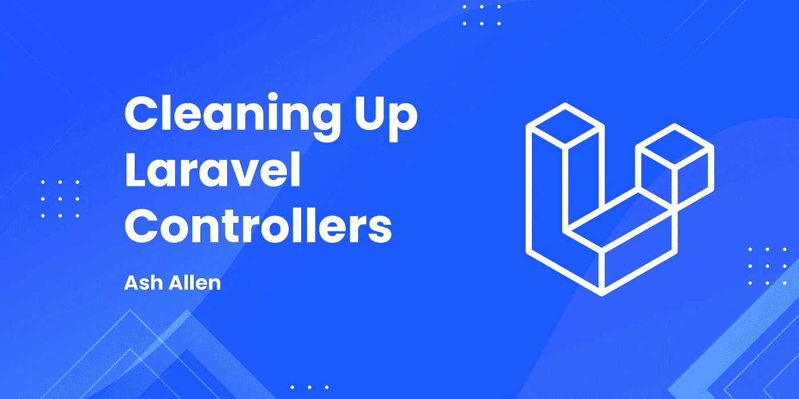

# 清理 Laravel 控制器

> 原文：<https://medium.com/codex/cleaning-up-laravel-controllers-a2934b7bf1c?source=collection_archive---------1----------------------->



# 介绍

控制器在任何基于 [MVC](https://www.guru99.com/mvc-tutorial.html) (模型视图控制器)的项目中扮演着巨大的角色。它们实际上是“粘合剂”，接受用户的请求，执行某种逻辑，然后返回响应。如果你曾经做过任何相当大的项目，你会注意到你会有很多控制器，它们会在你没有意识到的情况下很快变得混乱。在这篇文章中，我们将看看如何在 [Laravel](https://laravel.com) 中清理臃肿的控制器。

# 臃肿的控制器的问题

臃肿的控制器会给开发人员带来几个问题。他们可以:

1.  **使追踪特定的代码或功能变得困难。**如果你想在一个臃肿的控制器中处理一段特定的代码，你可能需要花一些时间来追踪这个方法实际上在哪个控制器中。当使用逻辑上分离的干净控制器时，这要容易得多。
2.  使发现错误的准确位置变得困难。正如我们将在后面的代码示例中看到的，如果我们在一个地方处理授权、验证、业务逻辑和响应构建，可能很难准确定位错误。
3.  为更复杂的请求编写测试变得更加困难。有时为复杂的控制器方法编写测试会很困难，这些方法有很多行，并且做许多不同的事情。清理代码使测试变得更加容易。如果你有兴趣了解如何让你的 Laravel 应用程序更具可测试性[，请查看这篇文章。](https://ashallendesign.co.uk/blog/how-to-make-your-laravel-app-more-testable)

# 臃肿的控制器

对于本文，我们将使用一个例子`UserController`:

```
class UserController extends Controller
{
    public function store(Request $request): RedirectResponse
    {
        $this->authorize('create', User::class); $request->validate([
            'name'     => 'string|required|max:50',
            'email'    => 'email|required|unique:users',
            'password' => 'string|required|confirmed',
        ]); $user = User::create([
            'name'     => $request->name,
            'email'    => $request->email,
            'password' => $request->password,
        ]); $user->generateAvatar();
        $this->dispatch(RegisterUserToNewsletter::class); return redirect(route('users.index'));
    } public function unsubscribe(User $user): RedirectResponse
    {
        $user->unsubscribeFromNewsletter(); return redirect(route('users.index'));
    }
}
```

为了让事情看起来简单明了，我没有在控制器中包含`index()`、`create()`、`edit()`、`update()`和`delete()`方法。但是我们将假设它们在那里，并且我们也使用下面的技术来清理那些方法。在本文的大部分时间里，我们将专注于优化`store()`方法。

# 1.将验证和授权提升到表单请求

我们可以对控制器做的第一件事是将任何验证和授权从控制器中取出，放入一个[表单请求](https://laravel.com/docs/8.x/validation#form-request-validation)类中。所以，让我们来看看如何为控制器的`store()`方法做这件事。

我们将使用下面的 Artisan 命令创建一个新的表单请求:

```
php artisan make:request StoreUserRequest
```

上面的命令将创建一个新的`app/Http/Requests/StoreUserRequest.php`类，如下所示:

```
class StoreUserRequest extends FormRequest
{
    /**
     * Determine if the user is authorized to make this request.
     *
     * [@return](http://twitter.com/return) bool
     */
    public function authorize()
    {
        return false;
    } /**
     * Get the validation rules that apply to the request.
     *
     * [@return](http://twitter.com/return) array
     */
    public function rules()
    {
        return [
            //
        ];
    }
}
```

我们可以使用`authorize()`方法来决定是否允许用户执行请求。如果可以，该方法应该返回`true`，如果不能，应该返回`false`。我们还可以使用`rules()`方法来指定应该在请求体上运行的任何验证规则。在我们运行控制器方法中的任何代码之前，这两个方法都会自动运行，而不需要我们手动调用它们中的任何一个。

```
class StoreUserRequest extends FormRequest
{
    /**
     * Determine if the user is authorized to make this request.
     *
     * [@return](http://twitter.com/return) bool
     */
    public function authorize(): bool
    {
        return Gate::allows('create', User::class);
    } /**
     * Get the validation rules that apply to the request.
     *
     * [@return](http://twitter.com/return) array
     */
    public function rules(): array
    {
        return [
            'name'     => 'string|required|max:50',
            'email'    => 'email|required|unique:users',
            'password' => 'string|required|confirmed',
        ];
    }
}
```

我们的控制器现在看起来也应该像这样:

```
class UserController extends Controller
{
    public function store(StoreUserRequest $request): RedirectResponse
    {
        $user = User::create([
            'name'     => $request->name,
            'email'    => $request->email,
            'password' => $request->password,
        ]); $user->generateAvatar();
        $this->dispatch(RegisterUserToNewsletter::class); return redirect(route('users.index'));
    } public function unsubscribe(User $user): RedirectResponse
    {
        $user->unsubscribeFromNewsletter(); return redirect(route('users.index'));
    }
}
```

**注意**:为了自动工作，你需要确保你的控制器正在使用`\Illuminate\Foundation\Auth\Access\AuthorizesRequests`和`\Illuminate\Foundation\Validation\ValidatesRequests`特征。这些自动包含在 Laravel 为您提供的全新安装的控制器中。因此，如果您正在扩展控制器，您就可以开始了。如果没有，请确保将这些特征包含到您的控制器中。

# 2.将通用逻辑移动到动作或服务中

我们可以采取的清理`store()`方法的另一个步骤是将我们的“业务逻辑”转移到一个单独的动作或服务类中。

在这个特定的用例中，我们可以看到`store()`方法的主要功能是创建一个用户，生成他们的头像，然后分派一个队列作业，将用户注册到时事通讯中。在我个人看来，一个动作比一个服务更适合这个例子。我更喜欢用行动来完成只做特定事情的小任务。而对于可能长达数百行并执行多项任务的大量代码，它更适合于服务。

```
class StoreUserAction
{
    public function execute(Request $request): void
    {
        $user = User::create([
            'name'     => $request->name,
            'email'    => $request->email,
            'password' => $request->password,
        ]); $user->generateAvatar();
        $this->dispatch(RegisterUserToNewsletter::class);
    }
}
```

现在我们可以更新我们的控制器来使用动作:

```
class UserController extends Controller
{
    public function store(StoreUserRequest $request, StoreUserAction $storeUserAction): RedirectResponse
    {
        $storeUserAction->execute($request); return redirect(route('users.index'));
    } public function unsubscribe(User $user): RedirectResponse
    {
        $user->unsubscribeFromNewsletter(); return redirect(route('users.index'));
    }
}
```

正如您所看到的，我们现在已经能够将业务逻辑从控制器方法中提升到操作中。这很有用，因为正如我之前提到的，控制器本质上是我们请求和响应的“粘合剂”。所以，我们通过保持代码逻辑上的分离，减少了理解一个方法做什么的认知负荷。例如，如果我们想要检查授权或验证，我们知道要检查表单请求。如果我们想检查对请求数据做了什么，我们可以检查操作。

将代码抽象成这些独立的类的另一个巨大好处是，它可以使测试变得更加容易和快速。我在我过去的文章[中简单地谈到了这一点，如何让你的 Laravel 应用程序更具可测试性](https://ashallendesign.co.uk/blog/how-to-make-your-laravel-app-more-testable)；所以，如果你还没有读过，我强烈建议你读一读。

# 将 dto 与操作一起使用

将业务逻辑提取到服务和类中的另一个好处是，您现在可以在不同的地方使用该逻辑，而无需复制代码。例如，假设我们有一个处理传统 web 请求的`UserController`和一个处理 API 请求的`Api\UserController`。为了便于讨论，我们可以假设这些控制器的`store()`方法的一般结构是相同的。但是，如果我们的 API 要求我们不使用`email`字段，而是使用`email_address`字段，我们该怎么办？我们不能将我们的请求对象传递给`StoreUserAction`类，因为它期望一个具有`email`字段的请求对象。

为了解决这个问题，我们可以使用[dto](https://en.wikipedia.org/wiki/Data_transfer_object)(数据传输对象)。这是一种非常有用的解耦数据的方法，可以在系统代码中传递数据，而不会与任何东西(在本例中是请求)紧密耦合。要将 dto 添加到我们的项目中，我们将使用 Spatie 的`spatie/data-transfer-object` [包](https://github.com/spatie/data-transfer-object)，并使用以下 Artisan 命令安装它:

```
composer require spatie/data-transfer-object
```

现在我们已经安装了这个包，让我们在我们的`App`文件夹中创建一个新的`DataTransferObjects`文件夹，并创建一个新的`StoreUserDTO.php`类。然后，我们需要确保我们的 d to 扩展`Spatie\DataTransferObject\DataTransferObject`。我们可以这样定义我们的三个字段:

```
class StoreUserDTO extends DataTransferObject
{
    public string $name;

    public string $email;

    public string $password;
}
```

现在我们已经完成了，我们可以在前面的`StoreUserRequest`中添加一个新方法来创建并返回一个`StoreUserDTO`类，如下所示:

```
class StoreUserRequest extends FormRequest
{
    /**
     * Determine if the user is authorized to make this request.
     *
     * [@return](http://twitter.com/return) bool
     */
    public function authorize(): bool
    {
        return Gate::allows('create', User::class);
    } /**
     * Get the validation rules that apply to the request.
     *
     * [@return](http://twitter.com/return) array
     */
    public function rules(): array
    {
        return [
            'name'     => 'string|required|max:50',
            'email'    => 'email|required|unique:users',
            'password' => 'string|required|confirmed',
        ];
    }

    /**
     * Build and return a DTO.
     *
     * [@return](http://twitter.com/return) StoreUserDTO
     */
    public function toDTO(): StoreUserDTO
    {
        return new StoreUserDTO(
            name: $this->name,
            email: $this->email,
            password: $this->password,
        );
    } 
}
```

我们现在可以更新控制器，将 DTO 传递给动作类:

```
class UserController extends Controller
{
    public function store(StoreUserRequest $request, StoreUserAction $storeUserAction): RedirectResponse
    {
        $storeUserAction->execute($request->toDTO()); return redirect(route('users.index'));
    } public function unsubscribe(User $user): RedirectResponse
    {
        $user->unsubscribeFromNewsletter(); return redirect(route('users.index'));
    }
}
```

最后，我们需要更新动作的方法，以接受 d to 作为参数，而不是请求对象:

```
class StoreUserAction
{
    public function execute(StoreUserDTO $storeUserDTO): void
    {
        $user = User::create([
            'name'     => $storeUserDTO->name,
            'email'    => $storeUserDTO->email,
            'password' => $storeUserDTO->password,
        ]); $user->generateAvatar();
        $this->dispatch(RegisterUserToNewsletter::class);
    }
}
```

作为完成所有这些工作的结果，我们现在已经将我们的操作与请求对象完全分离了。这意味着我们可以在整个系统的多个地方重用这个动作，而不必绑定到特定的请求结构。我们现在还能够在 CLI 环境或不依赖于 web 请求的队列作业中使用这种方法。例如，如果我们的应用程序具有从 CSV 文件导入用户的功能，我们将能够从 CSV 数据构建 dto 并将其传递给操作。

```
class StoreUserAPIRequest extends FormRequest
{
    /**
     * Determine if the user is authorized to make this request.
     *
     * [@return](http://twitter.com/return) bool
     */
    public function authorize(): bool
    {
        return Gate::allows('create', User::class);
    } /**
     * Get the validation rules that apply to the request.
     *
     * [@return](http://twitter.com/return) array
     */
    public function rules(): array
    {
        return [
            'name'          => 'string|required|max:50',
            'email_address' => 'email|required|unique:users',
            'password'      => 'string|required|confirmed',
        ];
    }

    /**
     * Build and return a DTO.
     *
     * [@return](http://twitter.com/return) StoreUserDTO
     */
    public function toDTO(): StoreUserDTO
    {
        return new StoreUserDTO(
            name: $this->name,
            email: $this->email_address,
            password: $this->password,
        );
    } 
}
```

# 3.使用资源或单一用途控制器

保持控制器干净的一个好方法是确保它们要么是"[资源控制器](https://laravel.com/docs/8.x/controllers#resource-controllers)要么是"[单用途控制器](https://laravel.com/docs/8.x/controllers#single-action-controllers)"。在我们进一步尝试更新我们的示例控制器之前，让我们看看这两个术语的含义。

资源控制器是基于特定资源提供功能的控制器。因此，在我们的例子中，我们的资源是`User`模型，我们希望能够在这个模型上执行所有的 [CRUD](https://www.codecademy.com/articles/what-is-crud) (创建、更新、更新、删除)操作。一个资源控制器通常包含`index()`、`create()`、`store()`、`show()`、`edit()`、`update()`和`destroy()`方法。它不一定要包括所有这些方法，但是它不会有任何不在这个列表中的方法。通过使用这些类型的控制器，我们可以使我们的路由 RESTful。关于 REST 和 RESTful 路由的更多信息，[点击这里查看本文](https://www.codecademy.com/articles/what-is-rest)。

单一用途控制器是只有一个公共`__invoke()`方法的控制器。如果你有一个不适合 RESTful 方法的控制器，这些真的很有用。

因此，让我们使用以下 Artisan 命令创建一个新的控制器:

```
php artisan make:controller UnsubscribeUserController -i
```

注意我们是如何将`-i`传递给命令的，这样新的控制器将是一个可调用的、单一用途的控制器。我们现在应该有一个类似这样的控制器:

```
class UnsubscribeUserController extends Controller
{
    public function __invoke(Request $request)
    {
        //
    }
}
```

我们现在可以移动我们方法的代码，并从我们的旧控制器中删除`unsubscribe`方法:

```
class UnsubscribeUserController extends Controller
{
    public function __invoke(Request $request): RedirectResponse
    {
        $user->unsubscribeFromNewsletter(); return redirect(route('users.index'));
    }
}
```

# 结论

希望这篇文章能让你深入了解在 Laravel 项目中清理控制器的不同方法。请记住，虽然我在这里使用的技术只是我个人的意见。我确信还有其他开发者会使用完全不同的方法来构建他们的控制器。最重要的部分是保持一致，使用适合你(和你的团队)工作流程的方法。

我很想在评论中听到你使用什么类型的技术来编写干净的控制器。

如果你也觉得这篇文章有用，请随意[注册我的时事通讯](https://ashallendesign.co.uk/blog)，这样每当我发布类似这篇文章的新帖子时，你都能得到通知。

继续建造令人敬畏的东西！🚀

*原载于*[*https://ashallendesign.co.uk*](https://ashallendesign.co.uk/blog/cleaning-up-laravel-controllers)*。*