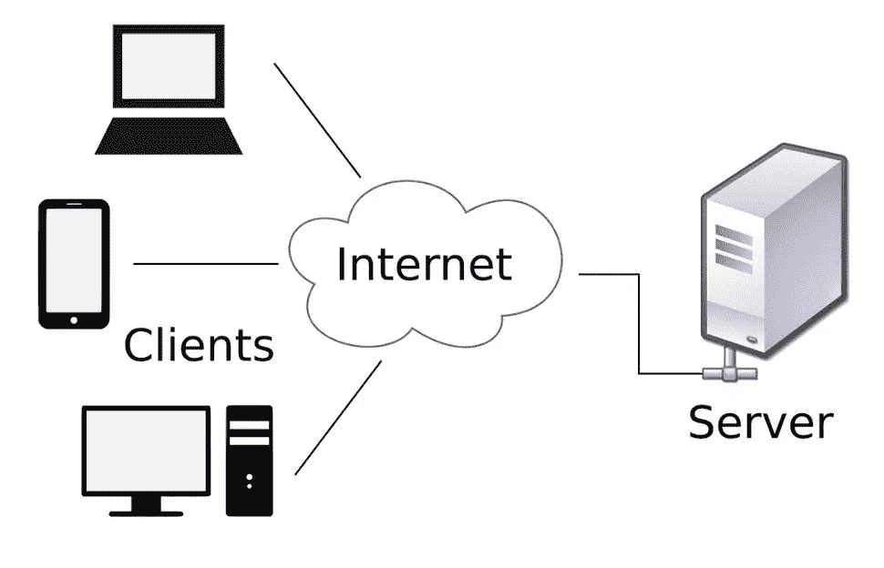
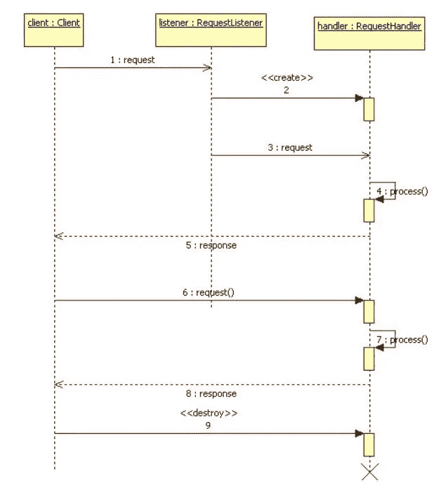
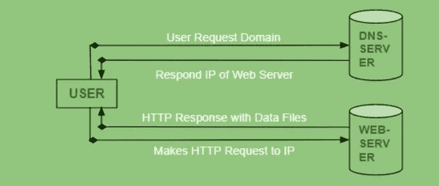

# 客户机-服务器体系结构

> 原文：<https://medium.com/codex/client-server-architecture-5e103aa0106d?source=collection_archive---------6----------------------->

[粘土银行](https://unsplash.com/@claybanks)在 [Unsplash](https://unsplash.com) 拍摄的照片

T 这篇文章与我之前关于分布式系统架构的文章相关。通过这篇文章，我想分享客户机-服务器模型的基本概念。正如我在上一篇文章中提到的，客户机-服务器是分布式系统中的一种架构，但目前在 web 应用程序中并不常见。点对点获得了更多的赞赏和接受。所以，现在让我们讨论更多关于客户-服务器模型及其用法。

 [## 分布式系统中的架构

### 分布式系统已经流行了一段时间了。每个人都想构建一个系统或应用程序…

medium.com](/codex/introduction-to-distributed-systems-66502ac8289) 

客户机-服务器模型是一种分布式应用程序结构，它在资源或服务的提供者(称为服务器)和服务请求者(称为客户机)之间划分任务或工作负载。利用客户机-服务器结构的应用程序有电子邮件、网络打印、万维网等等。

客户机-服务器模型

服务器是所有基本处理发生的地方，而在客户端，用户可以访问服务器提供的服务。大多数情况下，只有一台服务器在远程端，但是为了安全和效率，我们使用多台服务器，这些服务器使用负载平衡技术。

负载平衡在设计可靠的体系结构时非常重要。它有助于在多台服务器之间分配网络流量，以提高应用程序响应能力并避免流量聚合。我们将在接下来的文章中讨论更多关于负载平衡算法和技术的内容。

现在，为了理解客户端和服务器之间的通信，我们需要正确理解以下术语:

*   **请求**:请求从客户端发出，目的是向服务器请求一些数据，比如文件，或者通知服务器正在发生的活动，比如用户想要用他的凭证登录。
*   **响应**:响应从服务器发送到客户端，是服务器对客户端请求的反应。例如，认证结果。
*   **服务**:服务是服务器提供给客户端使用的特定任务，比如下载图片

此外，一台计算机可以同时运行 web 服务器和文件服务器软件，为发出不同请求的不同客户端提供不同的数据。

## 客户端和服务器通信

客户端和服务器以请求-响应消息传递模式交换消息。客户端发送请求，服务器对收到的请求返回响应。这种消息交换是进程间通信的典型例子。服务器组件持续监听来自客户端组件的请求。当收到请求时，服务器处理该请求，然后将响应发送回客户端。服务器可以进一步分为无状态服务器或有状态服务器。

*   有状态服务器从一个请求到下一个请求记住客户机数据(状态)。这些服务器存储会话状态。此外，它们跟踪哪些客户端打开了哪些文件、文件上的当前读写指针、哪些文件被哪些客户端锁定等等。
*   无状态服务器不保存状态信息。这些服务器不存储任何会话状态。这意味着每个客户端请求都被独立处理，而不是新会话或现有会话的一部分。

为了同时处理来自多个客户机的请求，服务器经常使用主从模式。在这种情况下，主服务器持续监听客户端请求。当接收到请求时，主设备创建一个从设备来处理该请求，然后再次继续监听。同时，从机执行与客户端的所有后续通信。

下面的序列图清楚地解释了典型的客户端-服务器交互:

## 浏览器通常如何与服务器交互？

*   用户输入网站或文件的 URL(统一资源定位器)。然后浏览器请求 DNS(域名系统)服务器。
*   DNS 服务器查找 Web 服务器的地址。
*   DNS 服务器以 Web 服务器的 IP 地址作为响应。
*   浏览器向 Web 服务器的 IP(由 DNS 服务器提供)发送 HTTP/HTTPS 请求。
*   服务器发送网站的必要文件。
*   然后，浏览器呈现文件，并显示网站。这种渲染是在 DOM(文档对象模型)解释器、CSS 解释器和 JS 引擎的帮助下完成的，它们统称为 JIT 或(即时)编译器。

## **客户端-服务器模式的优势**

1.  集中化— 客户机-服务器网络的主要优点是集中控制。所有必要的信息都放在一个位置。这对于网络管理员来说尤其有益，因为他们拥有对管理的完全控制权。无论整个网络出现什么问题，都可以在一个地方解决。也正因如此，更新资源和数据的工作变得毫不费力。
2.  安全性—在客户机-服务器网络中，由于其集中式架构，数据得到了很好的保护。它可以通过访问控制来实施，这样只有授权用户才被授予访问权限。其中一种方法是使用用户名和密码等凭证。此外，如果数据丢失，可以通过一次备份轻松恢复文件。
3.  可扩展性—客户端-服务器网络具有高度的可扩展性。只要用户需要，他们就可以增加客户机和服务器等资源的数量。因此，在没有太多中断的情况下增加服务器的大小。即使大小增加了，由于服务器是集中的，对网络资源的许可也没有犹豫。因此，配置所需的人员数量非常少。
4.  管理—由于所有文件都存储在中央服务器中，因此很容易管理文件。客户机-服务器网络可以很容易地跟踪和找到所需文件的记录。
5.  可访问性—无论位置或平台如何，每个客户端都有机会登录系统。通过这种方式，所有用户将能够访问他们的公司信息，而不需要使用终端模式或处理器。

## 客户机-服务器模式的缺点

1.  流量拥塞—客户机/服务器网络的主要缺点是流量拥塞。如果太多的客户端从同一个服务器发出请求，将会导致连接崩溃或变慢。过载的服务器可能会在访问信息时产生许多问题。
2.  健壮性——正如我们已经知道的，客户端服务器网络是集中式的。如果主服务器发生故障或受到干扰，那么整个网络都会中断。因此，客户端服务器网络缺乏健壮性。
3.  成本——在客户机/服务器网络中，有时设置和维护服务器的成本很高。由于网络功能强大，购买起来可能会很贵。因此，所有用户都买不起。
4.  维护—当实施服务器时，它们通常会不间断地工作。这意味着必须对每台服务器给予适当的关注。如果有任何问题，必须立即解决，不得拖延。因此，应该指定专门的网络管理员来维护服务器。

这些发现来自各种经过核实的资源。请随时检查或纠正这篇文章中提到的细节。我们将在接下来的文章中讨论更多关于其他架构及其用法的内容。不幸的是，我无法在这里面面俱到。敬请关注。快乐学习！:)