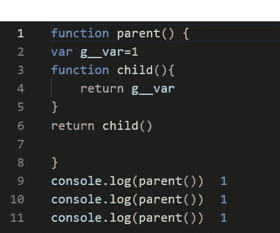
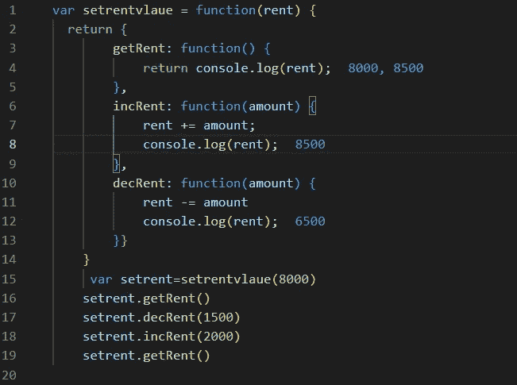
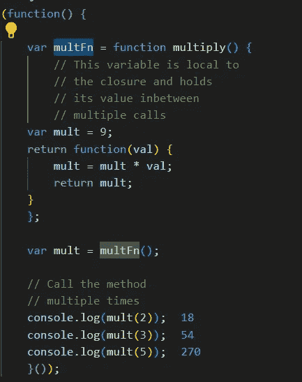

# JS 中的闭包

> 原文：<https://medium.com/codex/closure-in-js-7cb0c4d592b?source=collection_archive---------21----------------------->

闭包是 JavaScript 中的一个概念。这是一个普遍令人困惑的概念，在与 web 开发人员的常见访谈中会被问到。我们将在这个博客中讨论这个概念。

在继续之前，我们将熟悉 JavaScript 中的变量作用域。

JS 有三种类型的作用域。

全局范围:-在函数外部声明的变量，称为全局范围变量。您可以在 javascript 程序的任何地方访问这些变量。

局部作用域:-在函数内部声明的变量，不能在函数外部访问这些变量。

如果用“let 或 var”声明的变量是可变的。您可以随时更改该变量的值。另一方面，“const”声明的变量本质上是不可变的。您不能更改此变量值。

# C losure:-在 JavaScript 中，函数中引用外部作用域中变量的闭包形成其内部作用域。闭包保留了外部作用域和内部作用域。

简单地说，闭包可以定义为包含两个嵌套函数或返回类型的 JS 特性，子函数可以访问父函数变量。你可以说，为了提供一个函数全局作用域变量，创建了另一个函数。Shah 沙阿

让我们借助一个例子来看看闭包是如何工作的

上面的代码是一个简单的闭包函数的例子。在这段代码中有两个名为 child 和 parent 的函数。子函数访问子函数内部的父函数变量“g__var”。如您所见，父函数为子函数提供了子变量的可访问性。

# JavaScript 中闭包的实际用途是什么？

1.  使用私有变量和方法
2.  维护每个函数调用之间的状态:

使用私有变量和方法

上面的代码是用函数私有变量和方法的闭包。主要函数是 setrentvalue，当我们在 setrentvalue 中传递参数时，就设置了租金变量的初始值。并且它使全局类型成为方法的范围。该方法使用这个变量作为全局变量，我们可以执行各种操作，如增加租金和减少租金等。

维护函数调用之间的状态

上面的代码主要说明函数调用之间的条件。如你所见，当我们第一次调用 multivalue = 9 时，调用这个函数后，下一次调用 multi 的初始值等于 multi 的初始值 9 * 2 = 18。18.值的倍数与之前的值相等。

谢谢