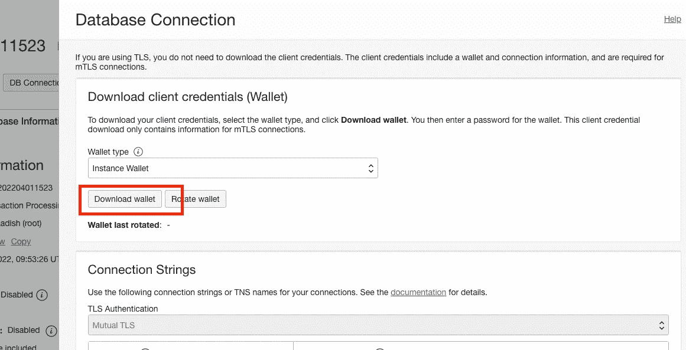

# Oracle 云基础架构中云计算到云数据库的连接

> 原文：<https://medium.com/codex/cloud-compute-to-cloud-database-connectivity-in-oracle-cloud-infrastructure-77f58562a2b3?source=collection_archive---------27----------------------->

## 填补我努力寻找的缺失部分。


鲁道夫·夸德罗斯在 [Unsplash](https://unsplash.com?utm_source=medium&utm_medium=referral) 拍摄的照片

在我职业生涯的大部分时间里，我习惯于连接本地数据库。慢慢地，当我的职业生涯进入云阶段时，连接到云数据库也不是一件难事。但是，突然之间，我不得不将一个云虚拟机连接到一个云数据库，并且我总是失败。

几天后，想到这个麻烦让我笑了，是的，当然是带着自怜。:).但最终这被证明是很好的学习。

# **挑战**

我的要求是使用 Oracle Cloud VM 作为只运行 shell 脚本或 python 的访问网关，并且应该连接到 Oracle Cloud 中的自治事务数据库。虽然这听起来很简单，但是完成起来很麻烦，无论是文档还是博客都会提到大部分细节，但会遗漏一些，最终你会迷失方向。
因此，真正的挑战是找到该遵循哪一条。

# 设置基础

设置 VM 和 ATP 数据库非常简单，并且有很好的文档记录。您可以设置对虚拟机的 SSH 访问。您必须为 ATP 生成例程 wallet。下载钱包，因为我们稍后会需要它。



下载钱包

mTLS wallet 是一个打包了多个文件的 zip 文件。这些文件可用于通过各种客户端建立与特定数据库的连接，例如 SQL*Plus、Python、JDBC 等。由于我使用的是 SQL*Plus，我主要对包中的两个文件感兴趣——sqlnet . ora 和 tnsnames.ora。您可以使用本地 SQL Developer 中的 wallet 检查您的数据库连接是否一切正常。检查步骤[此处](https://docs.oracle.com/en/cloud/paas/autonomous-data-warehouse-cloud/cswgs/autonomous-connect-sql-developer.html)。

# **在虚拟机中设置 Oracle 即时客户端和 SQL * Plus**

如前所述，我的目标是从 Oracle 计算实例连接到 ATP 数据库。我们需要在 Linux 虚拟机中设置 Oracle 客户端和 SQL*Plus。
这里详细介绍了[的步骤。但是最后还需要一些额外的步骤。](https://www.geeksforgeeks.org/how-to-install-sqlplus-on-linux/)

**步骤 1:** 使用以下命令下载基础包(ZIP):

```
wget [https://download.oracle.com/otn_software/linux/instantclient/214000/instantclient-basic-linux.x64-21.4.0.0.0dbru.zip](https://download.oracle.com/otn_software/linux/instantclient/214000/instantclient-basic-linux.x64-21.4.0.0.0dbru.zip)
```

**步骤 2:** 使用以下命令下载 SQL*Plus 包(ZIP):

```
wget https://download.oracle.com/otn_software/linux/instantclient/214000/instantclient-sqlplus-linux.x64-21.4.0.0.0dbru.zip
```

**第三步:**为即时客户端新建一个目录。

```
sudo mkdir -p /opt/oracle
```

**第四步:**在新创建的目录下解压基础包。

```
*sudo unzip -d /opt/oracle instantclient-basic-linux.x64-21.4.0.0.0dbru.zip*
```

**第五步:**在新创建的目录下解压 SQL *Plus 包。

```
sudo unzip -d /opt/oracle instantclient-sqlplus-linux.x64–21.4.0.0.0dbru.zip
```

**第七步:**在你的~/中设置 LD_LIBRARY_PATH。bashrc 源文件。
在 vi 中打开文件，并将这些行添加到文件的末尾

```
export LD_LIBRARY_PATH=/opt/oracle/instantclient_21_4:$LD_LIBRARY_PATH
```

**第 8 步:**在你的~/中设置 ORACLE_HOME 变量。bashrc

```
export ORACLE_HOME=/opt/oracle/instantclient_21_4
```

**第九步:**在你的~/中设置 ORACLE_HOME。bashrc

```
export ORACLE_HOME=/opt/oracle/instantclient_21_4
```

**第十步:**在你的~/中设置路径 env vars。bashrc

```
export PATH=$ORACLE_HOME:$LD_LIBRARY_PATH:$PATH
```

**步骤 11:** 运行 sqlplus -V 命令，确认是否安装。

```
sqlplus -V
```

步骤 11 应该不会给你任何错误。

但是我们还没有完成。我们现在需要使用我们之前下载的 mTLS wallet 来连接数据库。

# **使用钱包(mTLS)连接数据库**

我发现[卢卡斯·杰利马](https://medium.com/u/4ac8c86cd8df?source=post_page-----77f58562a2b3--------------------------------)的[博客](https://technology.amis.nl/oracle-cloud/connecting-sqlplus-in-cloud-shell-to-an-autonomous-database/)在这里很有帮助。他解释了如何将云 shell 连接到云数据库实例。对我来说，这种情况有点不同，我需要在计算实例中做同样的事情。

**步骤 1:** 将 wallet zip 文件上传到计算实例:
*由于我已经将我的 ssh 公钥上传到了 VM，所以我能够使用 SCP 命令来完成这项工作。*

```
scp ~/Downloads/Wallet_labd.zip opc@<VM Public IP Address>:
```

**第二步:**创建一个目录 *db* ，将 zip 文件的内容解压到这个目录中:

```
unzip wallet.zip -d db
```

**步骤 3:** 在 vi 编辑器中打开 sqlnet.ora，并将目录设置为指向当前目录，该目录包含 tnsnames.ora 文件。保存 sqlnet.ora 文件。

```
WALLET_LOCATION = (SOURCE = (METHOD = file) (METHOD_DATA = (DIRECTORY="/home/opc/db")))
SSL_SERVER_DN_MATCH=yes
```

**第四步:**在你的~/中设置 TNS_ADMIN 变量。bashrc

```
export TNS_ADMIN=/home/opc/db
```

**第五步:**源你的~/。bashrc 文件

```
source ~/.bashrc
```

**步骤 6:** 从 SQL*Plus 测试您的数据库连接

```
sqlplus admin@<TNS Name>
```

# 关键要点

关键在于设置 3 个环境变量，即。LD_LIBRARY_PATH，ORACLE_HOME，TNS_ADMIN。

*   **LD_LIBRARY_PATH:** 用来告诉动态链接加载器，一个启动你所有应用的小程序，决定在哪里寻找一个应用所链接的动态共享库。冒号(:)分隔目录列表，甚至在内置搜索路径和常规位置(如(/lib，/usr/lib)之前检查该列表..).
*   **ORACLE_HOME** 环境变量指向安装 ORACLE 数据库客户端软件的目录。
*   **TNS_ADMIN** 是一个环境变量，它指向 SQL*Net 配置文件所在的目录(如 sqlnet。ora 和 tnsnames。ora)的位置。