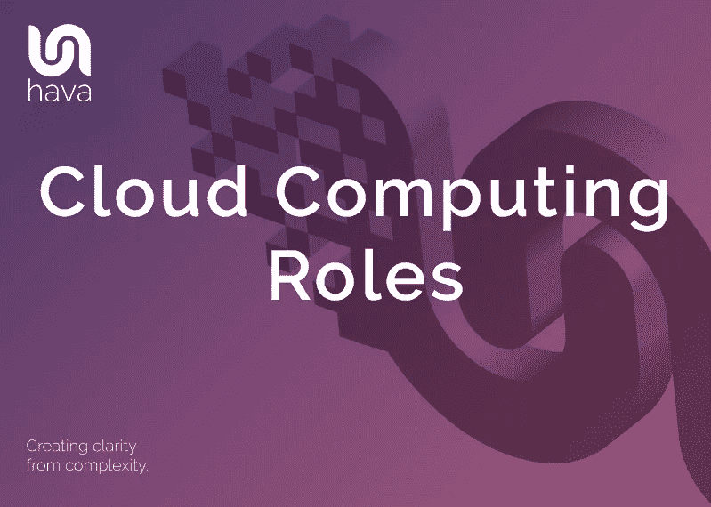

# 云计算角色

> 原文：<https://medium.com/codex/cloud-computing-roles-1c1cb3513020?source=collection_archive---------18----------------------->

云计算为希望从事 IT 工作的人，或者已经在传统 IT 领域站稳脚跟、希望重新掌握技能并进入云计算领域的人，提供了一条极具吸引力的职业道路。

如果您目前在传统的内部 IT 部门中担任传统角色，您可能属于以下一个或多个类别:

# 建筑师。

IT 架构师角色涵盖了一系列围绕设计 IT 框架以实现预期业务成果的职责。这些角色可能包括企业体系结构、应用程序体系结构、存储体系结构、网络体系结构以及最终的安全体系结构。下面描述了传统的架构师角色:

**企业架构师。**

企业或系统架构师与业务管理一起创建整体架构设计，将期望的业务成果转化为可以构建的具体设计计划。系统架构师通常会管理一个设计师和开发人员团队，将整个系统设计变为现实。

**应用架构师。**

应用程序架构师设计应用程序、应用程序用户界面和后端软件服务，以满足系统需求或企业架构师的愿景。应用程序架构师将把应用程序设计和需求传达给最终构建解决方案的软件开发团队。

**存储架构师。**

存储架构师规划和设计支持正在构建的应用程序所需的存储基础架构，并最终确保足够的存储、数据检索和数据完整性，以实现企业架构师概述的业务目标。

**网络架构师。**

网络架构师负责设计和实施支持企业业务应用程序所需的网络基础设施。除了初始设计和实施之外，网络架构师通常还负责保持网络正常运行，并在网络出现问题时解决问题。

**安全架构师**。

安全架构师设计并指定网络和应用程序必须满足的安全参数。安全架构师规划和研究 IT 环境的安全要求，并确保在应用程序投入生产后，这些要求继续得到满足。安全架构师通常会将安全功能的开发委托给开发人员，并与开发和操作级别的技术团队保持联系，以确保安全配置正确。

# **系统管理员。**

系统管理员的角色可以跨越广泛的任务，并且在不同的组织之间有很大的不同。系统管理员角色的核心是负责安装和维护计算机系统和服务器，并在安装后确保它们得到支持。

在传统的内部 IT 生态系统中，系统管理员将负责安装并可能采购计算机硬件和软件，维修和修补硬件，更换过时或有故障的硬件，并执行例行维护功能，如软件更新、清洁和更换过滤器和移动部件。

系统管理员监控硬件和软件性能，确保存储和处理器容量维持在支持最佳应用程序性能的水平，并密切关注网络流量和日志文件，以确保不会发生错误或不必要的网络事件。

系统管理员是系统停机期间第一个被呼叫的人，通常负责从停机中恢复并监督操作系统更新、补丁和安装的安装。作为角色的一部分，系统管理员将监督文件系统及其性能，安排和审查系统增量和完整的系统备份，并在需要时监督还原和恢复过程。

系统管理员的最后一项任务是管理用户和访问控制。系统管理员通常会创建用户帐户，授予或撤销个人用户对数据和服务的访问权限。

# **应用管理员**

应用程序管理员负责保持应用程序正常运行，并在提供可接受的用户体验的级别上执行，以便企业开发的应用程序能够交付所需的业务成果。

应用程序管理员负责安装和更新部署的应用程序，微调性能，并确保应用程序以最佳性能运行。如果没有，应用程序管理员需要排除故障并诊断停机或性能问题的原因。

除了与开发和技术团队沟通以确保应用程序运行良好并监控应用程序日志之外，应用程序管理员还可能负责管理与应用程序相关的文档。

# **数据库管理员**

顾名思义，数据库管理员(DBA)负责安装和维护数据库，以支持组织中使用的应用程序。

您可能还需要与其他技术团队联络，并提供关于使用您创建的数据库的信息和培训。

通常，您将创建和维护数据库，围绕数据库的访问和使用以及数据库管理系统的维护、使用和安全性制定策略。

# **运营 DBA**

操作 DBA 负责数据库的日常操作。他们提供数据库的持续维护，并通常遵循每日、每周和每月的任务计划，以保持数据库以最佳性能运行。

作为应用程序升级的一部分，Ops DBA 还可能负责安排和执行变更脚本。

# **开发 DBA**

开发 DBA 负责设计新的数据库应用程序，设计和实现对现有数据库应用程序的更改。他们通常会从性能、数据完整性和安全性的角度评估应用程序更新所需的数据库结构更改的影响。开发 DBA 将编写和测试数据库更改脚本

# **数据管理员**

数据管理员主要管理对数据库中数据的访问。数据管理员管理访问策略，以控制谁拥有或有权访问您的数据。这些策略控制谁有权读取/写入/更改或删除数据库数据。

# **网络管理员**

网络管理员负责设计、配置和维护 LAN 和 WAN 网络的所有方面，以支持您的业务运营。

在传统的内部网络中，网络管理员负责网络交换机和路由器，配置网段和广域网连接，并需要对物理硬件和虚拟专用网络基础架构的设计和实施做出决策。

网络管理员负责根据网络架构师提供的设计安装和配置网络基础设施。

一旦安装了网络设备和基础设施，网络管理员就要负责日常网络维护，包括添加或删除设备、实施安全配置以及监控日志和性能。

随着你的组织扩张，你的网络也会扩张。网络管理员需要增加您网络的覆盖范围，并在需要时将现有设备加入到扩展的网络中。

# **存储管理员**

存储管理员将管理整个 IT 网络的数据存储需求。在内部环境中，这可能涉及基于磁盘、文件服务器和磁带的系统。

存储管理员负责安装、配置和更换网络中承载数据和应用程序的存储系统。他们需要确保存储保持高度可访问性和可用性，并定期测试和监控存储系统中使用的介质的性能。

存储管理员的另一项关键职能是管理其控制下的存储系统中数据的备份和恢复。他们需要确保备份机制能够处理存储的扩展数据，并监控存储设备的持续性能。

存储管理员通常会与应用程序管理员密切合作，以确保有足够的容量来保持应用程序以最佳性能运行。

# **安全管理员**

安全管理员负责安装、配置、监控和维护安全解决方案，并实施安全架构师制定的策略，为网络中的用户和应用程序提供强大的保护和适当的访问级别。

任何安全管理员的主要成果都是防止未经授权的访问、更新或删除公司或应用程序数据，并监控网络流量以检测未经授权的访问企图。

安全管理员工具箱中的主要工具包括安全支持工具、防火墙、访问策略和防病毒软件，用于在造成任何损害之前检测和防止未经授权的访问。

安全管理员的一项关键技能是执行漏洞审计和网络渗透测试，以便在网络弱点被不良分子发现和利用之前发现它们。

许多组织都遵循 ISO 或 PCI 等标准，安全管理员是最有可能负责管理和实施这些标准的角色。

# 云计算角色。

在云环境中，通常有许多责任领域，每个领域都有特定的角色和责任。

这些通常属于业务管理、基础设施、安全和应用程序基础设施的范畴。

在顶层，云企业架构师在每个领域都有专门的角色。他们可能会与业务管理部门的项目和财务经理、云基础架构部门的基础架构架构师和开发人员、云安全团队的安全架构师和工程师以及云应用程序基础架构部门的应用程序架构师、开发人员和开发人员打交道。

# **云企业架构师。**

云企业架构师的角色是理解业务需求，并交付满足业务目标的解决方案。这个角色本质上负责整个云环境，并将与 CIO 联系，以了解业务目标和用例，并将其转化为开发人员和工程师要构建的软件需求。

然后，云企业架构师将开发模型、验证和改进独立于解决方案的架构，与每项技术或业务流程的专家联系，以确保企业架构将交付并继续交付适合业务的解决方案。

# **项目经理。**

项目经理负责确保企业云得到适当的管理和运行。项目经理负责在开发和运营方面交付解决方案的团队，并与云供应商联络，以确保满足性能和资金价值 KPI。

项目经理将监控和管理重要指标，通常负责报告应用程序性能和服务水平。

# **财务经理**

云财务经理将负责监控云成本，并将累计的云支出分配给各个业务部门。

这一角色的很大一部分涉及监控成本和确定优化云成本的机会。这可能包括识别未使用的资源，识别共享资源的机会，识别指定的资源实例，并与各个团队联系以合理化这些成本。

在 AWS 云生态系统中，财务经理将了解何时何地可以使用 EC2 spot 实例、预留实例和按需实例来显著降低云支出。

# **云基础架构架构师。**

云基础架构架构师负责根据企业架构师提供的框架中的业务需求，设计支持您的团队正在开发的解决方案所需的基础架构。

云基础架构架构师开发和维护云基础架构的路线图，以确保资源和数据容量的容量和可用性，从而支持正在开发和部署的应用程序。

基础架构架构师向上与企业架构师协作，向下与各个团队协作，以确保满足业务目标，并且所有必需的基础架构都是为开发和运营团队设计的，可用于交付他们各自的职责。

# **云运营工程师。**

运营工程师负责构建和部署云基础架构，监控和维护业务应用程序实现业务目标所需的资源和共享服务。

云运营工程师与基础架构架构师密切合作，以确保所有必需的服务都以最佳性能构建和运行。

在供应服务之上，云运营工程师将负责计算实例操作系统修补和更新，管理用于供应基础设施的模板(如代码)以及控制版本和文档。

此角色的其他任务包括适当标记资源、管理存储和其他资源的容量、调配和管理虚拟网络。

监控基础设施也是这个角色的主要部分。发生事故时，运营工程师的任务是识别和解决支持部署的应用程序所需的资源，以及在公司云中运行的其他专用和共享资源。

除了监控资源的问题之外，运营工程师还将监控资源的性能，并根据需要调整设置，以保持应用程序以最佳运行性能运行。一旦确定了根本原因，运营工程师就可以将问题上报给相应的专家。

文档审查和所需的更改通常由 ops 工程师负责，就像您的业务需要遵守的法规遵从性要求的报告一样。

最后，支持和执行备份是运营工程师的责任，灾难恢复期间的恢复操作和恢复也是如此。

# **云安全架构师**

云安全架构师为您的应用程序和与之相关的数据定义安全需求。安全级别将取决于所存储数据的敏感性。

定义之后，安全架构师将指导开发和运营团队在您的云平台上实现的安全级别。

为此，优秀的云安全架构师将设计和维护安全配置和清单，开发人员和工程师可以根据这些配置和清单来确保遵守安全策略。

安全架构师还将设计和维护风险和威胁评估计划，设计和维护公司安全政策和程序，包括离线安全程序，并在检测到事故或安全漏洞时准备事故响应计划。

# **安全运营工程师。**

安全运营工程师处于任何企业安全工作的第一线，负责建立、管理、监控和实施整个企业云的安全。

SecOps 工程师根据安全架构师提供的策略来设置安全性，并管理和强制遵守您的企业必须遵守的任何外部法规遵从性标准。

从技术角度来看，安全运营工程师可以利用批准的模板在资源调配时应用安全控制措施，或者作为以代码形式部署基础架构时使用的脚本的一部分。

SecOps 工程师负责管理 IAM(身份和访问管理)以及与联合身份源和经批准的服务(如 SSO 提供商)的集成。

在 AWS 中，该角色设置安全组，以确保用户只能访问他们有权访问的系统和数据。

从减轻威胁的角度来看，安全运营工程师将进行风险分析、漏洞和渗透测试，并可能被要求编写安全审计报告。

# **云应用架构师。**

云应用架构师负责设计云优化应用。他们提供技术专业知识来创建应用程序的技术设计，并在遵循企业和基础架构架构师的计划和指导时引领技术能力。

该角色确保定义的需求在技术上是可实现的，并定义容量和可伸缩性方面的要求，然后使用复杂的软件开发知识，将需求转化为开发团队要遵循的指南和路线图。

# **应用开发者**

顾名思义，应用程序开发人员主要负责按照应用程序架构师提供的要求编写应用程序。

开发团队还负责版本管理，并将更新推送到代码库中进行测试和部署。

在某些场景中，开发人员会将代码部署到生产环境中，而在其他场景中，开发团队会将测试和部署工作交给 DevOps 工程师。

开发人员通常会为应用程序提供支持，管理文档，微调和优化代码，并在必要时提供应用程序培训。

# **DevOps 工程师**

开发运维工程师负责构建和执行快速可扩展的工作流，以便在开发人员发布应用代码时进行部署。

现代 CI/CD 管道确保补丁和新功能快速、持续地到达最终用户手中。

在传统的软件开发周期中，用户有时会为一个新版本等待数月，而 DevOps 工程师在开发人员工作时使用自动化来部署和管理频繁的代码发布。这些构建每天都会发生，因此 DevOps 工程师的主要职能是创建和部署可用的构建，并使用工具和自动化对失败的构建进行监控和故障排除。

一个好的 DevOps 工程师应该能够自动化几乎所有的事情，从持续的构建/部署管道到以代码形式创建基础设施。

除了与开发人员保持密切联系，DevOps 工程师还将不断审查更新和代码版本的流程，并提出通常是自动进行的改进建议。

**总之:**
无论是在传统的内部部署服务器/网络 IT 基础设施中，还是在“云角色”一节中描述的角色，都是大型组织的典型角色。企业规模越大，这些专业角色就越有可能被分离出来，落到在特定角色上有专长的个人手中。

较小的组织更有可能雇佣扮演上述多重角色的 IT 员工，即使他们没有意识到这一点。一个小的开发团队成员可能同时是应用程序开发人员、开发运维工程师和至少两个架构师角色。

随着越来越多的企业将内部硬件和应用程序基础架构过渡到基于云的解决方案，对上述文章中定义的任何基于云的角色的技能需求都将增加。由于当前许多基于云的学科技能短缺，现在是过渡到基于云的技能组合的最佳时机。

如果您目前正在 AWS、Azure 或 GCP 上构建或操作应用程序，并且尚未自动化您的云文档，我们邀请您访问 https://www.hava.io 查看 Hava

*原发表于*[*https://www . hava . io*](https://www.hava.io/blog/cloud-computing-roles)*。*