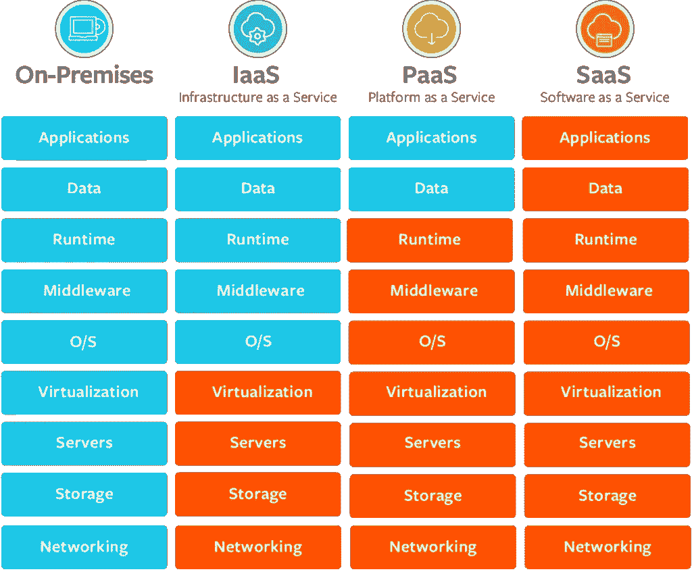

# 云数据安全

> 原文：<https://medium.com/codex/cloud-data-security-b7acdbb3de2a?source=collection_archive---------13----------------------->

[https://s 27389 . pcdn . co/WP-content/uploads/2017/02/adobe stock _ 119317881-1024 x768 . JPEG . webp](https://s27389.pcdn.co/wp-content/uploads/2017/02/AdobeStock_119317881-1024x768.jpeg.webp)

**这篇博客描述了云托管应用生命周期中不同层面的数据安全。**

***数据安全*** 是指在数字信息的整个生命周期中，保护数字信息免受未经授权的访问、破坏或窃取。这个概念涵盖了信息安全的方方面面，从硬件和存储设备的物理安全到管理和访问控制，以及软件应用程序的逻辑安全。它还包括组织政策和程序。

***云托管应用*** 是一个软件程序，其中基于云的组件和本地组件协同工作。这种模型依赖远程服务器来处理逻辑，这些逻辑通过持续连接互联网的 web 浏览器来访问。

云应用服务器通常位于由第三方云服务基础设施提供商运营的远程数据中心。基于云的应用程序任务可能包括电子邮件、文件存储和共享、订单输入、库存管理、文字处理、客户关系管理(CRM)、数据收集或财务会计功能。

[https://s 7280 . pcdn . co/WP-content/uploads/2017/09/SaaS-vs-PAAs-vs-iaas . png](https://s7280.pcdn.co/wp-content/uploads/2017/09/saas-vs-paas-vs-iaas.png)

云托管本质上是一种共享环境，您的虚拟机(VM)与其他云租户共享基础架构、硬件和软件。您不知道与您共享环境的客户的身份，甚至不知道他们的数量。因此，您应该仔细研究您的云提供商，以检查所有适用的安全云计算机制是否都已实施并按设计运行。

**数据安全**云托管应用的潜在威胁载体和暴露:

*   ***静态数据安全性*** 表示您在工作负载中的任何持续时间内，在非易失性存储中保存的任何数据。这包括块存储、对象存储、数据库、归档、物联网设备以及任何其他保存数据的存储介质。实施加密和适当的访问控制后，保护静态数据可以降低未经授权访问的风险。
*   *网络数据安全对于保护托管网络和数据的完整性和可用性非常重要。它包括集成到托管平台中的软件和硬件技术。有效的网络安全处理网络访问。它针对各种攻击，并限制黑客通过网络进入或执行他们想要的威胁，并获得对应用程序数据的访问。*
*   ****计算时的数据安全性*** ，当一个应用程序正在使用时，用户或应用程序特定的数据可能会存储在云主机(RAM/Disk)中，并且在用户注销或会话超时时不会被正确清除。应用程序可能会将使用数据存储在内存/磁盘中(甚至在使用后)，直到内存/磁盘被回收，甚至加密密钥也可能会保留在内存中。攻击者可以获得访问权并附加一个调试器来从应用程序中转储内存，或者加载一个内核模块来转储 RAM 的全部内容。这可能是对应用程序的安全威胁，可能导致缓冲区溢出、格式字符串、数据泄漏和其他漏洞。*

# *潜在威胁媒介的补救*

# ***保护静态数据***

*   ****静态加密*** ，始终确保存储数据的唯一方式是通过使用加密。通过 ecryptfs 等工具保护静态数据，以实现加密**，**无论何时数据未加载，都应使用某个密钥保持加密状态。*
*   ****实现令牌化*** *，*是将一段有意义的数据，比如一个账号，变成一个随机的字符串称为令牌的过程，如果被攻破就没有任何有意义的价值。标记作为对原始数据的引用，但不能用来猜测这些值。这是因为，与加密不同，令牌化不使用数学过程将敏感信息转换为令牌。没有密钥或算法可用于导出令牌的原始数据。相反，令牌化使用一个称为令牌库的数据库，它存储敏感值和令牌之间的关系。保险库中的真实数据通常通过加密得到保护。*
*   ****保存您用于加密的密钥*** 并继续旋转密钥进行加密。永远不要存储/硬编码加密密钥。*
*   ****对用于加密的密钥*** 的访问应受到监控和限制。*
*   ****加密关键 PII* ，**识别所有关键 PII(社会安全号、PIN、密码、健康记录等。)并确保它们不是以纯文本的形式存储在系统中。始终加密/哈希关键 PII 并存储。也不要记录关键的 PII。*

# *保护网络中的数据(运动)*

*   ****保护网络*** 中的数据，使用安全的数据传输方式，而不是使用 TLS、SSL 等以加密的形式将数据从源传输到目的地。*
*   ****受保护的网络*** 比起使用互联网更喜欢虚拟专用网络或者托管在云端的私有局域网。*
*   ****识别威胁载体*** 如关键 PII(个人身份信息)，并在通过网络传输关键 PII 之前提供哈希、加密等机制。*
*   ****数据丢失防护(DLP)工具*** 可能会使用多种不同的技术和工具来保护数据，使其不会被意外或恶意地与公司以外的人共享或上传到私有云存储。数据丢失防护(DLP)软件使用组织制定的规则来确定哪些数据应该保密，并可以检测可能危及这些数据安全的活动。*
*   ****保持安全意识*，**始终掌握最新趋势和技术，以保护移动中的数据。如果发现了新的威胁，您需要适应这种变化，以保护数据免受这种威胁。*

# ***保护计算数据:***

*   ***(例如，脏牛的脆弱性)***
*   ****审计和监控*** *、*对安全相关事件进行持续审计和监控，一旦出现严重违规，立即发出警报并采取自动纠正措施。*
*   ****秘密轮换*** ，确保秘密密钥轮换通常部署一种策略。如果凭据、密码或密钥被泄露，那么公司必须能够撤销它并防止进一步的访问。旋转密钥定期确保被盗的密钥不能长时间使用。*
*   ****实现认证*，**是确定访问资源/主机的安全主体的身份的过程。*
*   ****实现授权*** *，*是授予被认证的主体执行动作或访问资源/主机的权限的行为。*
*   ****应用防火墙*** 设备或程序，控制采用不同安全状态的*网络*或*主机*之间*网络*流量的流动。*
*   ****实施网络策略*** *其中*是一个以应用为中心的构造，允许您指定如何允许工作负载通过网络与另一个网络“实体”通信。*
*   ****工作负载安全策略*** 是定义应用工作负载必须满足哪些安全相关条件才能被云主机接受的配置。它们规定了工作负载与主机资源(如网络和存储)的交互方式。它们还可以用于为托管基础架构配置基于角色的访问控制。*
*   ****云应用程序扫描器*** 是一种工具，可让组织发现并修复其云部署中的安全弱点。扫描器是整体云安全策略不可或缺的一部分，必须包含在 DevSecOps 实践中。*
*   ****速率限制*** 是通过恶意流量源试图访问网络内资源的速率来识别恶意流量源。web 安全解决方案监控来自每个请求者的传入请求的频率和时间。当给定的请求者超过指定的速率限制时，该请求者在指定的时间长度内被阻止进一步访问。速率限制在现代威胁环境中至关重要，因为有许多形式的攻击主要通过监控传入请求的速率来检测。*
*   ****应用程序白名单*** 是一种应用程序控制形式，它在服务器端采用以信任为中心的方法，只允许已知的良好应用程序。从本质上讲，授权只授予被分类为必需且可安全执行的应用程序、文件、目录或进程。默认情况下，其他所有内容都被拒绝。应用程序白名单是使用文件名、源 IP、文件大小和/或目录路径等属性来完成的。一些高级白名单解决方案还提供了添加规则的灵活性，这些规则决定了谁以及如何访问特定的应用程序或进程。*
*   ****运行时应用程序自我保护* (RASP)** 是一种运行在服务器上的技术，在应用程序运行时启动。它旨在实时检测对应用程序的攻击。当应用程序开始运行时，RASP 可以通过分析应用程序的行为和该行为的上下文来保护它免受恶意输入或行为的影响。通过使用该应用程序持续监控其自身行为，可以在没有人工干预的情况下立即识别和缓解攻击。*

# *云数据安全快速参考:*

*如果这篇文章有帮助，请点击拍手👏按钮几下，以示你对作者的支持👇*