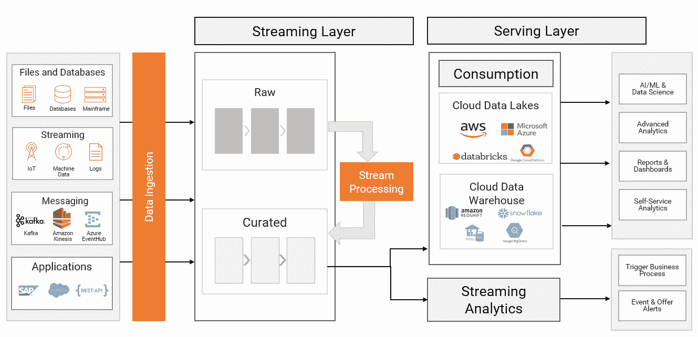

# 云原生企业应用集成

> 原文：<https://medium.com/codex/cloud-native-enterprise-application-integration-95336db86a14?source=collection_archive---------11----------------------->

## **敏捷开发时代的 EAI**

[https://www . cloudamqp . com/blog/when-to-use-rabbit MQ-or-Apache-Kafka . html](https://www.cloudamqp.com/blog/when-to-use-rabbitmq-or-apache-kafka.html)

该行业正朝着完全云原生架构的方向发展，在这种架构中，任何东西都可以弹性地扩展/缩小，并在需要时优雅地删除和重新部署，以应对不可预测的工作负载峰值和不可避免的故障，甚至是灾难性的故障。所有这些都避免了由于大量未充分利用的服务器长时间闲置而产生的不必要成本。我相信，这种通过微服务在应用程序开发领域开始的趋势也正在企业集成领域获得牵引力。

# 容器

容器已经成为首选的部署技术，因为它们在工作负载隔离和 IT 资源消耗之间有很好的平衡。因此，毫不奇怪，根据[CNCF 2020 年调查](https://www.cncf.io/wp-content/uploads/2020/11/CNCF_Survey_Report_2020.pdf)，2020 年生产中容器的使用增加到 92%。容器编排是在生产环境中正确运行和管理容器所必需的，根据 Datadog 的 2020 容器[报告](https://www.datadoghq.com/container-report/):

> Kubernetes 已经成为容器编排事实上的标准。今天，一半运行容器的组织使用 Kubernetes，无论是在自我管理的集群中，还是通过云提供商服务，如谷歌 Kubernetes 引擎(GKE)，Azure Kubernetes 服务(AKS)，或亚马逊弹性 Kubernetes 服务(EKS)。自 2017 年以来，Kubernetes 的采用量增加了一倍多，并继续稳步增长，没有任何放缓的迹象

在 Kubernetes 上运行我们的集成中间件允许我们利用它的功能来解决许多第二天的挑战，例如:内务管理、高可用性、自我修复、自动伸缩、日志记录、滚动升级等等。

*来源:*[*https://www.datadoghq.com/container-report/*](https://www.datadoghq.com/container-report/)

# ESB 怎么了？

我在上面提到过，随着微服务的出现，集成环境正在采用容器。然而，值得注意的是，微服务架构的采用也使集成环境远离了企业服务总线(ESB ),因为由于其整体性，它们往往会成为基础架构和开发灵活性方面的瓶颈。

正如詹姆斯·刘易斯和马丁·福勒在著名的[文章](https://martinfowler.com/articles/microservices.html#SmartEndpointsAndDumbPipes)中提到的，微服务架构风格的标志之一是使用以下方法:

> 智能端点和哑管道

# 分布式消息代理

当然，微服务继续使用*异步通信*，但是它们只使用*消息传递结构*，而不指望任何由 ESB 集中执行的集成/转换逻辑。作为开源软件的忠实粉丝，我推荐使用 [RabbitMQ](https://www.rabbitmq.com/) 作为[分布式消息代理](https://www.rabbitmq.com/distributed.html)。它用 Erlang 编写，这赋予了它效率和失重感，有助于在复杂的路由场景中高效地传递消息。

*来源:*[*https://www . cloudamqp . com/blog/part 1-rabbit MQ-best-practice . html*](https://www.cloudamqp.com/blog/part1-rabbitmq-best-practice.html)

# 批量呢？

在敏捷和 CI/CD 时代，开发团队应该能够每天在生产中部署新特性，甚至更快，夜间基于文件和批处理的集成无法跟上业务和客户期望的步伐。如今的需求是由*快速数据*或*流数据架构*提供的实时集成。

*来源:*[*https://blogs . informatica . com/2020/05/13/adopt-a-kappa-architecture-for-streaming-and-ingesting-data/*](https://blogs.informatica.com/2020/05/13/adopt-a-kappa-architecture-for-streaming-and-ingesting-data/)

# 分布式 API 管理

当我们有许多分散的团队，所有东西都是分布式的——应用程序、服务甚至集成——我们最好在所有相关部分之间有明确的合同，换句话说，我们需要一个可靠的 **API 优先**策略，这意味着 API 被视为*一等公民*。但是，对于实践 DevOps 的组织来说，使用由集中团队管理的传统 API 网关以基于票证的方式工作并不是一个可行的选择。

[Spring Cloud Gateway for Kubernetes](https://docs.pivotal.io/scg-k8s/1-0/)，它基于非常成功的同名 OSS 项目，当与全新的 [API portal for VMware Tanzu](https://docs.pivotal.io/api-portal/1-0/) 结合使用时，负责后端服务(微服务、monoliths、遗留应用程序或任何其他相关内容)的分布式团队可以控制 API 的定义/发布。API 配置可以使用它们自己的 CI/CD 管道 *以及它们的发布过程*进行*版本控制和部署，换句话说，就是 API 的**GitOps**。因此，API 生命周期由拥有后端服务的团队联合和控制。这就是我们所说的[分布式 API 网关](https://redmonk.com/videos/what-is-a-distributed-api-gateway/)。您可以在下面找到一个在混合云环境中部署的分布式 API 网关的示例。*

在安装了*Spring Cloud Gateway Kubernetes Operator*、*用于 VMware Tanzu 的 API 门户*并配置您的 API 门户以指向您的 API 网关之后，您可以将以下配置应用到您的集群:

*   部署三个 API 网关实例:

*   配置到 GitHub 的路由

*   将新创建的路由映射到适当的网关实例

现在，您应该能够打开 API 门户并读取已配置路由的 OpenAPI 定义:

如果你想尝试一下，你可以在这里找到上面所有的代码和部署整个环境的脚本以及一些其他有趣的东西。

# 结论

企业应用集成(EAI)不能忽视从敏捷、开发运维以及云迁移中学到的技术和良好实践，也不能忽视从集中的象牙塔中获得的技术和良好实践。在我看来，实现可伸缩性和可持续性的唯一方法是通过多个*小型、*联合和*自主*团队合作，在*安全的环境中工作，任何错误的影响范围都是有限的*。

我建议**使用 API 优先的方法，结合由分布式、弹性和可靠的消息传递结构支撑的持续事件驱动架构**来处理企业集成。