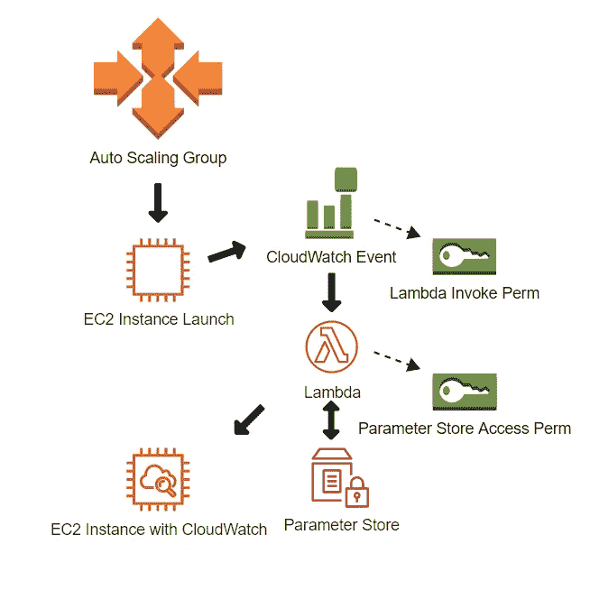

# 由 ASG 横向扩展事件触发的源代码控制软件安装的云形成

> 原文：<https://medium.com/codex/cloudformation-to-source-control-software-installs-triggered-by-asg-scale-out-events-497383d5c318?source=collection_archive---------25----------------------->

我一直在探索在 AWS 自动缩放组事件 ***和*** 期间自动安装软件的方法，将配置存储在源代码控制中。作为代码的基础设施是重要的，当人们离开岗位时，必须理解用于部署代码的遗留方法。对此有几种选择，在这种情况下，我探索了使用 CloudFormation 堆栈来记录该过程。CloudFormation 可以存储在源代码控制中，在本例中是一个 [github repo](https://github.com/cabrennan/AWS_CloudFormationExamples) ，记录整个过程并跟踪随时间的变化。

在本例中，CloudFormation 将检测 EC2 自动扩展组上的横向扩展事件。然后，它将使用从参数存储中访问的定制 JSON 配置来安装 CloudWatch 代理。此外，权限被配置为允许事件触发 lambda 函数，并允许 lambda 函数访问参数存储。



首先，创建将存储在参数存储中的 CloudWatch 配置 JSON。参数名来自一个输入参数，我们稍后将使用相同的名称来生成 Systems Manager 文档名，并命名权限策略。

因为配置是用 JSON 编写的，所以云结构是用 YAML 编写的。目前，无法在 JSON CloudWatch 配置文件中将 JSON 作为参数输入。也许可以将 JSON 转换成字符串，但我发现这很乏味，难以阅读。

```
CloudwatchConfigFileUbuntu: 
    Type: AWS::SSM::Parameter
    Properties: 
      Name: !Ref SSMDocName
      Type: String
      Value: !Sub |    
    {
      "agent": {
        "metrics_collection_interval": 10,
        "logfile": "/opt/aws/amazon-cloudwatch-agent/logs/amazon-cloudwatch-agent.log"
      },
      .
      .
      .

      "log_stream_name": "/ec2/${aws:AutoScalingGroupName}"
    }
```

现在配置文件已经准备好了，是时候创建 lambda 来安装它了。lambda 引用先前在参数存储中创建的配置文件。由于这个 lambda 的代码相当短，我选择直接把它放在 CloudFormation 中，但这也可以从外部 S3 文件中读入。

lambda 首先需要 EC2 instance_id，因此它知道在哪里安装软件。它可以从 CloudWatch 传入的事件信息中读取 instance_id:

```
def handler(event, context):              
  detail = event['detail']
  instance_id = event['detail']['EC2InstanceId']
  instance_ids = []
  instance_ids.append(instance_id)
```

instance_id 被附加到一个数组中——稍后由执行 CloudWatch 安装的 SSM 文档对其进行格式化。

在开发这个堆栈时，我发现在实例准备好接受系统管理器命令之前几秒钟，会触发成功启动事件规则。我添加了一个带有短睡眠命令的测试，这样 lambda 将反复尝试发送命令，直到成功(或者 lamba 超时)。

```
ready = False
while ready != True: 
  try: 
    resp=ssm_client.send_command(
           InstanceIds=instance_ids, 
           DocumentName=docname)
  except botocore.exceptions.ClientError as e:
    LOGGER.error(e)
    ec = e.response['Error']['Code']
    if ec == "InvalidInstanceId":
      LOGGER.error("Instance %s not ready to receive commands. 
      LOGGER.error("Sleep then try again" % instance_id)
      time.sleep(15)
    else:
      raise e 
  ready=True 
```

lambda 函数块引用 lambda_function_role_arn，它将在其中获得 IAM 权限。除了一般的 lambda 执行权限之外，该块还要求 lambda 可以承担授予从参数存储中访问配置文件的权限的角色

```
LambdaFunctionRole:
  Type: AWS::IAM::Role
  Properties: 
    RoleName: ASGCloudWatchInStallUbuntu
    AssumeRolePolicyDocument: 
      Version: 2012-10-17
      Statement: 
      - Effect: Allow
        Principal: 
          Service: 
          - lambda.amazonaws.com
        Action: 
          - sts:AssumeRole
    Path: "/"
    Policies:
    - PolicyName: !Ref AWS::StackName
      PolicyDocument: 
        Version: 2012-10-17
        Statement: 
        - Effect: Allow
          Action: 
            - ssm:ListCommandInvocations
          Resource: '*'
        - Effect: Allow 
          Action: ssm:GetParameter
          Resource: 
          - !Join
              - ""
              - - "arn:aws:ssm:*:*:parameter/Doc_"
              - !Ref SSMDocName
        - Effect: Allow
          Action: ssm:SendCommand
          Resource:
            - arn:aws:ec2:*:*:instance/*
            - arn:aws:ssm:*:*:managed-instance/*
            - !Join
                - ""
                - - "arn:aws:ssm:*:*:document/Doc_"
               - !Ref SSMDocName              
    ManagedPolicyArns:
      - arn:aws:iam::aws:policy/service-role/AWSLambdaBasicExecutionRole
```

然后我创建了一个 SSM 文档，它将运行在 Ubuntu 实例上安装 CloudWatch 代理的步骤。这是一个简单的脚本，首先检查以确保实例在 Linux 家族中，然后下载最新的 CloudWatch 代理，安装它，然后使用存储在参数存储中的配置文件启动它:

```
CWInstallUbuntuDocument:
    Type: AWS::SSM::Document
    Properties: 
      Name: 
        !Join
          - ''
          - - "Doc_"
            - !Ref SSMDocName
      DocumentType: Command
      Content: 
        schemaVersion: '2.2'
        description: "Install CloudWatch on EC2 Ubuntu Instance"
        parameters: 
          configFile:  
            description: "Config File imported from Parameter Store"
            type: String
            default: !Ref SSMDocName
        mainSteps:
        - name: InstallCloudWatchAgent
          action: aws:runShellScript
          inputs: 
            timeoutSeconds: 60
            runCommand: 
              - echo "downloading agent"
              - curl -o /var/tmp/amazon-cloudwatch-agent.deb [https://s3.amazonaws.com/amazoncloudwatch-agent/debian/amd64/latest/amazon-cloudwatch-agent.deb](https://s3.amazonaws.com/amazoncloudwatch-agent/debian/amd64/latest/amazon-cloudwatch-agent.deb)
              - echo "installing agent"
              - sudo dpkg -i -E /var/tmp/amazon-cloudwatch-agent.deb
              - echo "starting agent"
              - !Sub 'sudo /opt/aws/amazon-cloudwatch-agent/bin/amazon-cloudwatch-agent-ctl -a fetch-config -m ec2 -s -c ssm:${SSMDocName}'
              - echo "done"               
          precondition: 
            StringEquals: 
            - platformType
            - Linux
```

现在是时候创建事件规则了，它将监控自动缩放组并启动必须创建的整个过程。ASG 名称以逗号分隔的参数列表形式传入。

```
ASGScaleOutRule:
    Type: AWS::Events::Rule
    Properties: 
      Description: "Rule that triggers lambda on ASG scale out"
      EventPattern:
        source: ['aws.autoscaling']
        detail-type: ['EC2 Instance Launch Successful']
        detail: 
          AutoScalingGroupName:
            !Ref AutoScalingGroupNames
      State: "ENABLED"
      Targets:
        - Arn: !GetAtt CloudWatchInstallLambda.Arn
```

最后，允许事件调用 lambda 函数需要权限:

```
CWLambdaInvokePerms: 
    Type: AWS::Lambda::Permission
    Properties: 
      FunctionName: !GetAtt CloudWatchInstallLambda.Arn
      Action: lambda:invokeFunction
      Principal: "events.amazonaws.com"
      SourceArn: !GetAtt ASGScaleOutRule.Arn
```

这六个步骤在最终的云结构中组合在一起，形成一个工作流来监控 ASG，并在新实例向外扩展时部署和配置软件。

将所有这些步骤连接在一起的完整云结构不到 300 行代码。这可以存储在版本控制中，以跟踪随时间的变化。

我希望这个例子能够帮助您理解如何使用 CloudFormation 来创建代码形式的基础设施。请喜欢并随时评论下面的问题和其他你想看的东西。

参考资料:

*   [AWS::Lambda::函数](https://docs.aws.amazon.com/AWSCloudFormation/latest/UserGuide/aws-resource-lambda-function.html)
*   [AWS::SSM::参数](https://docs.aws.amazon.com/AWSCloudFormation/latest/UserGuide/aws-resource-ssm-parameter.html)
*   [AWS::SSM::文档](https://docs.aws.amazon.com/AWSCloudFormation/latest/UserGuide/aws-resource-ssm-document.html)
*   [AWS::IAM::Role](https://docs.aws.amazon.com/AWSCloudFormation/latest/UserGuide/aws-resource-iam-role.html)
*   [AWS::Events::Rule](https://docs.aws.amazon.com/AWSCloudFormation/latest/UserGuide/aws-resource-events-rule.html)
*   [AWS::Lambda::权限](https://docs.aws.amazon.com/AWSCloudFormation/latest/UserGuide/aws-resource-lambda-permission.html)