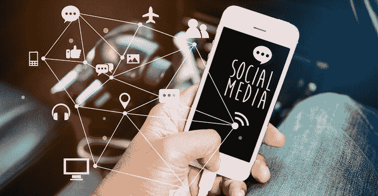

# 俱乐部——与你的部落保持联系！

> 原文：<https://medium.com/codex/clubhouse-staying-connected-with-your-tribe-8e2c728ce78f?source=collection_archive---------6----------------------->

# 社交媒体有什么好的？

连通性是我们的基本权利！我们主要关心的是与其他人保持联系，并通过各种方式实现这一点。社交媒体是通过技术将不同国家的人们聚集在一起的主要手段。它的力量在于推动必要改革的能力。作为一种交流方式…