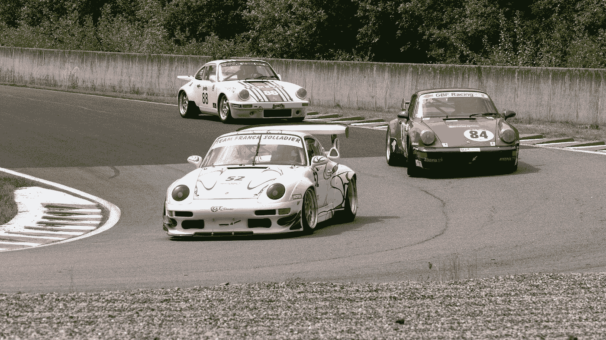
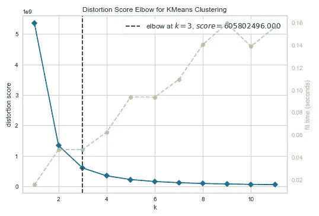
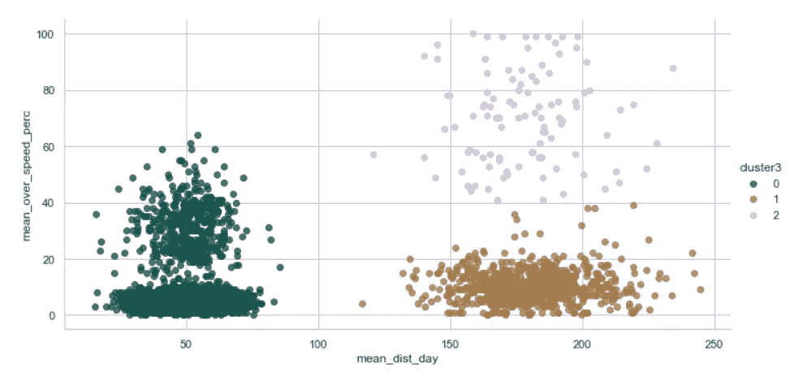

# 驾驶员细分的聚类算法

> 原文：<https://medium.com/codex/clustering-algorithm-for-driver-segmentation-9e5d18ed30cf?source=collection_archive---------21----------------------->

## **根据每天行驶的平均距离和平均超速百分比对驾驶员进行分组**



由[尼古拉斯·佩罗尔](https://unsplash.com/@nicolaspeyrol?utm_source=medium&utm_medium=referral)在 [Unsplash](https://unsplash.com?utm_source=medium&utm_medium=referral) 上拍摄的照片

你好，欢迎来到我的文章！在这篇文章中，你将学习当你有未标记的数据时如何使用聚类技术。使用 KMeans 集群，您将能够通过考虑各种特征来对它们进行集群。让我们开始吧。

## 数据集描述

在这里找到数据集[](https://www.kaggle.com/datasets/dhruvalpatel30/driver-dataset)*。为了简单起见，只取两个特征:*

1.  *平均每天行驶的距离*
2.  *司机超过限速每小时 5 英里以上的平均时间百分比*

*以下是数据所代表的内容:*

*   ***id:** 司机的唯一 id*
*   ***mean_dist_day:** 驾驶员每天驾驶的平均距离*
*   ***mean_over_speed_perc:** 司机超过限速 5 英里/小时的平均时间百分比>*

****(1)导入所需库和数据集—****

```
*import numpy as pn
import pandas as pd
import sklearn
import matplotlib.pyplot as plt
import seaborn as sns
sns.set()
import warnings
warnings.filterwarnings(‘ignore’)
%matplotlib inline*
```

*首先，导入所需的库，然后导入数据集。*

```
*df=pd.read_csv('driver-data.csv')
df.head()*
```

****(2)检查信息和必要数据分布—****

```
*# Check the no. of records - it should be 4000
df.info()# Check the basic distribution of data
df.describe()*
```

*我们准备使用聚类技术，但是有一个问题。我们应该使用多少个集群？因此，我们将利用肘方法来确定集群的数量。*

****(3)用肘法确定聚类数—****

*WCSS(聚类平方和内)是聚类中每个点与其质心之间距离的平方和。当我们用 K 值绘制 WCSS 时，我们得到一个[](https://www.scikit-yb.org/en/latest/api/cluster/elbow.html)*。**

**WCSS 值随着集群数量的增加而减小。当 K = 1 时，WCSS 值最高。**

**我们将使用 Yellowbrick，它是一个结合了 scikit-learn 和 matplotlib 的 Python 库。Yellowbrick 增强了 Scikit-Learn API，使模型选择和超参数调整更加容易。Matplotlib 在后台使用。**

```
**!pip install yellowbrick #if you haven't install yellowbrick yet
from yellowbrick.cluster import KElbowVisualizer
model = KMeans()
visualizer = KElbowVisualizer(model, k=(1,12)).fit(df)
visualizer.show()**
```

****

****用于 k 均值聚类的弯头****

**这里，聚类的最佳数量= 3 或 k = 3。**

*****(4)运行 K=3 的算法—*****

```
****# using the KMeans from sklearn** from sklearn.cluster import KMeans**# create an instance of a k-means model with 3 clusters** kmeans = KMeans(n_clusters = 3)
df_analyze = df.drop('id',axis=1)**# fit the model to all the data, except for the id label** kmeans.fit(df_analyze)**# get cluster center vectors** kmeans.cluster_centers_**# *Output*** array([[  50.04763438,    8.82875   ],
       [ 180.017075  ,   18.29      ]])**
```

**让我们检查数据点的标签。标签的大小应该与数据集计数相匹配。**

```
****# check the labels of the data points**
kmeans.labels_**# how many drivers are there in 1st, 2nd and 3rd cluster** from collections import Counter
Counter(kmeans.labels_)***# Output***
Counter({0: 3200, 2: 104, 1: 696})**
```

**现在我们已经准备好绘图了，但是首先，让我们制作一个表示每个数据点的聚类数的列。**

```
****# create a column for cluster label**
df_analyze['cluster'] = kmeans.labels_**# plot the data**
sns.set_style('whitegrid')
sns.lmplot(x = 'mean_dist_day', y = 'mean_over_speed_perc', 
data = df_analyze, hue = 'cluster', palette = 'cubehelix', 
size = 5, aspect = 2, fit_reg = False)**
```

****

****k 均值聚类****

## **洞察力**

**我得出了一些见解，如下:**

1.  **有 696 名司机平均每天行驶超过 110 英里，但平均超速百分比不到 40%。**
2.  **在 4000 名司机中，有 104 人喜欢超速行驶(> 40%)，平均每天行驶超过 110 英里。**
3.  **3200 名司机每天开车不到 90 英里，最高超速率为 60%。**

## **参考**

1.  **https://www.scikit-yb.org/en/latest/api/cluster/elbow.html**
2.  **【https://www.scikit-yb.org/en/latest/index.html **

**感谢您的阅读！如果您关注我或与他人分享这篇文章，我将不胜感激。最美好的祝愿。**

## **你会支持 awesome❤️**