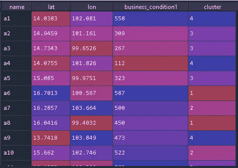
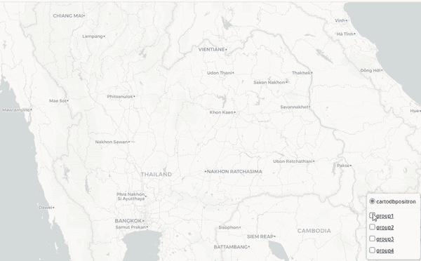
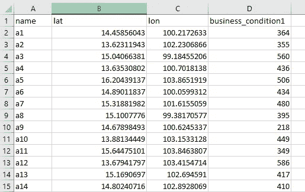
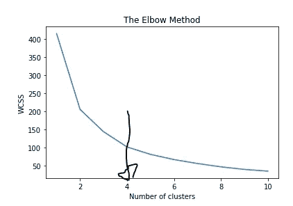

# python 中交互式地图上地理数据的聚类

> 原文：<https://medium.com/codex/clustering-geographic-data-on-an-interactive-map-in-python-60a5d13d6452?source=collection_archive---------4----------------------->

新冠肺炎已经和我们在一起 3 年了，人们必须改变他们的行为，而且有很多新工作的机会。然而，数据科学仍然是最受欢迎的工作之一。当然，**数据可视化**和**机器学习**是这个角色的关键技能。想象一下，两个数据科学家必须将他们的机器学习输出带到商业术语中。第一个只是在电子表格中显示输出，另一个在交互式图形视图中显示输出。后者将有机会吸引听众更多的注意力。



第一位数据科学家的示例输出



后一位数据科学家的示例输出

后面这位数据科学家多酷啊！

因此，本故事将给出一个示例，通过使用 K-mean 方法集成聚类地理数据(纬度和经度),并在 python 中的交互式地图上绘制结果。*(注意，本文不会解释我们将使用的每一种理论，而是集中于整合它们以获得商业案例的结果)*。好，我们来编码。

商业案例:一家公司有许多商店为我们的客户服务。但是，该公司希望将他们聚集到一些组中，通过在每个组中共享资源来加强商店，因为一些商店有时会出现一些问题，无法为客户服务。作为一名数据科学家，你必须向这家公司建议我们应该有多少个集群，以及每个群组的界限是什么

我们将使用的 python 包

1.  熊猫[用于数据处理]
2.  sk learn[用于 K 均值聚类]
3.  matplotlib[用于 K 均值聚类]
4.  scipy[用于聚类边界创建]
5.  如果你想了解更多关于叶子的背景知识，你可以阅读[我之前的文章了解更多细节](/@tanakanchua/features-you-need-to-know-of-an-interactive-business-analytic-map-with-python-6454f0e06967)

首先，我为这个业务案例创建了随机数据，如下所示。



示例输入数据

1.  *名称=店铺名称，*
2.  *纬度=纬度，*
3.  *lon=longtiude，*
4.  *business _ condition =导致店铺无法营业的指标，我假设超过 500*

我们必须从 pandas 导入这些数据，并通过使用 elbow 方法找出最佳的聚类数，从而找出应该使用多少个聚类。*(然而，在现实生活中，我们可能有已经指定了我们将集群多少个组的业务约束，所以在这种情况下，我们不需要使用肘方法。)*

```
import pandas as pd
import matplotlib.pyplot as plt
from sklearn.cluster import KMeans
from scipy.spatial import ConvexHull
import foliumdf_map = pd.read_excel('input_clustering.xlsx')
# 1\. Clustering your data into KMeans clustering one of the unsupervise clsutering method
#1.1 data preparation
X = df_map .iloc[:, 1:3].values
# Using the elbow method to find the optimal number of clusters
wcss = []
for i in range(1, 11):
    kmeans = KMeans(n_clusters = i, init = 'k-means++', random_state = 42)
    kmeans.fit(X)
    wcss.append(kmeans.inertia_)
plt.plot(range(1, 11), wcss)
plt.title('The Elbow Method')
plt.xlabel('Number of clusters')
plt.ylabel('WCSS')
plt.show()
```



这一次我们将使用 4 组，这是图的拐点。我们通过 K-mean 在 4 个簇上再次对我们的数据进行聚类。

```
# 1.2 Training the K-Means model regarding to your elbow method or business logic groups
kmeans = KMeans(n_clusters = 4, init = 'k-means++', random_state = 42)
y_kmeans = kmeans.fit_predict(X)
# 1.3 map data back to df
df_map['cluster'] = y_kmeans +1 # to step up to group 1 to 4
```

到目前为止，我们已经有了类似上面第一张图的输出，这是第一个数据科学家的示例。接下来，我们通过使用 leav 在交互式地图中绘制这个结果，以成为后期的数据科学家。

```
#2.plot data to map
# Create the map object called m which is the base layer of the map
m = folium.Map(location=[df_map['lat'].mean(), df_map['lon'].mean()],
               tiles='CartoDB positron',
               zoom_start=7)# create layers based on your clustering groups
layer1 = folium.FeatureGroup(name= '<u><b>group1</b></u>',show= True)
m.add_child(layer1)layer2 = folium.FeatureGroup(name= '<u><b>group2</b></u>',show= True)
m.add_child(layer2)layer3 = folium.FeatureGroup(name= '<u><b>group3</b></u>',show= True)
m.add_child(layer3)layer4 = folium.FeatureGroup(name= '<u><b>group4</b></u>',show= True)
m.add_child(layer4)#draw marker class for each group by adding CSS class
my_symbol_css_class= """ <style>
.fa-g1:before {
    font-family: Arial; 
    font-weight: bold;
    font-size: 12px;
    color: black;
    background-color:white;
    border-radius: 10px; 
    white-space: pre;
    content: ' g1 ';
    }.fa-g2:before {
    font-family: Arial; 
    font-weight: bold;
    font-size: 12px;
    color: black;
    background-color:white;
    border-radius: 10px; 
    white-space: pre;
    content: ' g2 ';
    }.fa-g3:before {
    font-family: Arial; 
    font-weight: bold;
    font-size: 12px;
    color: black;
    background-color:white;
    border-radius: 10px; 
    white-space: pre;
    content: ' g3 ';
    }.fa-g4:before {
    font-family: Arial; 
    font-weight: bold;
    font-size: 12px;
    color: black;
    background-color:white;
    border-radius: 10px; 
    white-space: pre;
    content: ' g4 ';
    }.fa-g1bad:before {
    font-family: Arial; 
    font-weight: bold;
    font-size: 12px;
    color: white;
    background-color:red;
    border-radius: 10px; 
    white-space: pre;
    content: ' g1 ';
    }.fa-g2bad:before {
    font-family: Arial; 
    font-weight: bold;
    font-size: 12px;
    color: white;
    background-color:red;
    border-radius: 10px; 
    white-space: pre;
    content: ' g2 ';
    }.fa-g3bad:before {
    font-family: Arial; 
    font-weight: bold;
    font-size: 12px;
    color: white;
    background-color:red;
    border-radius: 10px; 
    white-space: pre;
    content: ' g3 ';
    }.fa-g4bad:before {
    font-family: Arial; 
    font-weight: bold;
    font-size: 12px;
    color: white;
    background-color:red;
    border-radius: 10px; 
    white-space: pre;
    content: ' g4 ';
    }
</style>"""
# the below is just add above  CSS class to folium root map      
m.get_root().html.add_child(folium.Element(my_symbol_css_class))# then we just create marker and specific your css class in icon like below
for index, row in df_map.iterrows():
    if row['cluster'] == 1 and row['business_condition1'] < 500 :
        color='black'
        fa_symbol = 'fa-g1'
        lay = layer1
    elif row['cluster'] == 1 and row['business_condition1'] >= 500 :
        color='black'
        fa_symbol = 'fa-g1bad'
        lay = layer1
    elif row['cluster'] == 2 and row['business_condition1'] < 500:
        color='purple'
        fa_symbol = 'fa-g2'
        lay = layer2
    elif row['cluster'] == 2 and row['business_condition1'] >= 500:
        color='purple'
        fa_symbol = 'fa-g2bad'
        lay = layer2        
    elif row['cluster'] == 3 and row['business_condition1'] < 500:
        color='orange'
        fa_symbol = 'fa-g3'
        lay = layer3
    elif row['cluster'] == 3 and row['business_condition1'] >= 500:
        color='orange'
        fa_symbol = 'fa-g3bad'
        lay = layer3
    elif row['cluster'] == 4 and row['business_condition1'] < 500:
        color='blue'
        fa_symbol = 'fa-g4'
        lay = layer4
    else:
        color='blue'
        fa_symbol = 'fa-g4bad'
        lay = layer4

    folium.Marker(
        location=[row['lat'], row['lon']],
        title = row['name']+ 'group:{}'.format(str(row['name'])),
        popup = row['name']+ 'group:{}'.format(str(row['name'])),
        icon= folium.Icon(color=color, icon=fa_symbol, prefix='fa')).add_to(lay)
```

上面的代码显示了标记及其名称，代表地图上的每个商店，用 4 种颜色分为 4 组。此外，如果一些商店的 business_condition1 ≥ 500，则标记名称会以红色背景突出显示，以表示该商店无法营业。最后要做的事情是为每个组划定界限。我们应用[凸包](https://en.wikipedia.org/wiki/Convex_hull)来解决这个问题，scipy 软件包可以帮助你。

```
#draw cluster each group
#flat line to group path
#prepare layer and color for each group
layer_list = [layer1,layer2,layer3,layer4]
color_list = ['black','purple','orange','blue']
for g in df_map['cluster'].unique():# this part we apply ConvexHull theory to find the boundary of each group
    # first, we have to cut the lat lon in each group 
    latlon_cut =df_map[df_map['cluster']==g].iloc[:, 1:3]
    # second, scipy already provides  the great function for ConvexHull
    # we just throw our dataframe with lat lon in this function
    hull = ConvexHull(latlon_cut.values)
    # and with magic, we can have new lat lon boundary of each group
    Lat = latlon_cut.values[hull.vertices,0]
    Long = latlon_cut.values[hull.vertices,1] 
    # the we create dataframe boundary and convert it to list of lat lon 
    # for plotting polygon in folium
    cluster = pd.DataFrame({'lat':Lat,'lon':Long })       
    area = list(zip(cluster['lat'],cluster['lon']))
    # plot polygon
    list_index = g-1 # minus 1 to get the same index 
    lay_cluster = layer_list[list_index ] 
    folium.Polygon(locations=area,
        color=color_list[list_index],
        weight=2,
        fill=True,
        fill_opacity=0.1,
        opacity=0.8).add_to(lay_cluster) 

# to let the map have selectd layer1 layer2 you created
folium.LayerControl(collapsed=False,position= 'bottomright').add_to(m)# save it to html then we can send the file to our colleagues
m.save('mymap_clustering.html')
```

通过代码，我们得到了类似后来的数据科学家的图片的输出。


代码后面的输出

这个例子只是一个基本的用例。我希望它能帮助所有的读者了解这幅画，并能把它应用到真实的商业案例中。例如，您可以使用[地理围栏](https://en.wikipedia.org/wiki/Geo-fence)的边界来通知您的合作伙伴何时进入每个边界，并做出一些响应。最后，感谢 StackOverflow，它帮助我创建了出色的交互式地图。