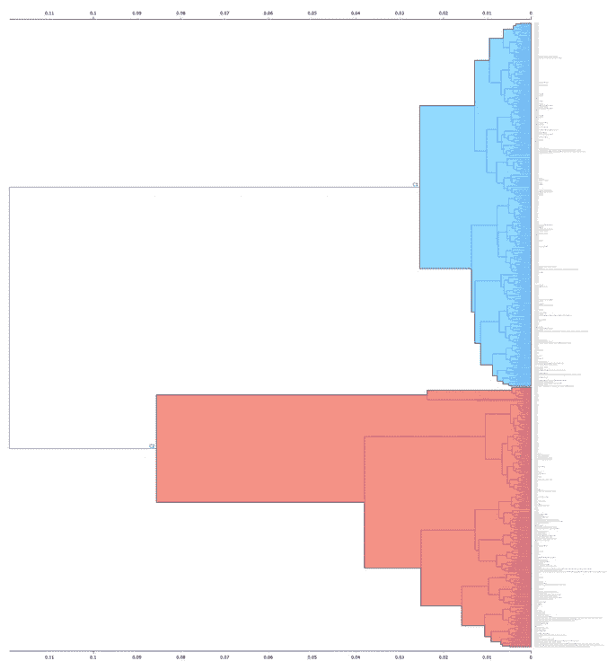
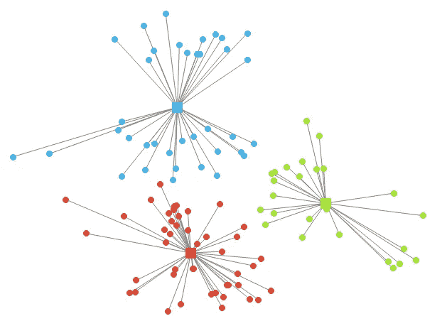

# 聚类:两种方法

> 原文：<https://medium.com/codex/clustering-two-approaches-f914dd9d23a6?source=collection_archive---------5----------------------->

在 [Unsplash](https://unsplash.com/s/photos/clusters?utm_source=unsplash&utm_medium=referral&utm_content=creditCopyText) 上 [Kier In Sight](https://unsplash.com/@kierinsight?utm_source=unsplash&utm_medium=referral&utm_content=creditCopyText) 的照片

W 什么是集群？这是在数据中寻找独立组(如果存在的话)的过程。这样的组就是集群。它们是无监督建模的一部分。

当我们需要在数据中找到一般模式并且没有任何特定目标时，我们在机器学习(ML)中使用无监督建模。我们可能只有一些独立变量。

***注:*** 我们使用聚类作为*无监督* ML 方法是很关键的一点，因为有监督 ML 方法旨在基于我们已知的独立变量(类别、结果、标签或因变量)预测目标的值。

怎么集群？有两种方法:

**1。层次聚类**

这是我们重复合并聚类的过程，这些聚类由每个数据点表示，直到它们到达单个数据点。结果是一个集群层次结构。

一些专家指出，表示层次聚类的最佳方式是创建一个树状图。这是一种树状的可视化。树状图有分支，它们的长度对应于聚类之间的距离。

作者图片

它具有优势，因为它在某种程度上提供了对数据中聚类数量的洞察。我们可以用特定的算法得到它。

我们将截止点设置在某个点，在这个点上，集群之间的距离开始更快地增长。然后，我们应该定义两个数据实例集群之间的距离。我们可以选择不同类型的距离:

*   完全联动(最远的一对点)；
*   单连杆机构(最接近的点对)；
*   平均联动(平均分距)；
*   沃德联系(一种基于集群内方差的度量)。

许多学者选择支持最后一种。他们对此有一些主要论点，但我们不会在这里深入探讨，因为这是一个单独的讨论主题。如果你想知道更多细节，请在本文的评论部分告诉我。

**2。k-均值聚类**

K-means 聚类是聚类过程的另一种方法。我们应该设置集群的编号(k)来开始。这种方法的工作原理是将 k-质心放在随机位置，将每个数据点分配给最近的一个，k-means 方法创建聚类。

作者图片

该算法将每个 k 形心移动到相应的聚类中心。然后，它根据新的质心位置重新分配每个数据点。它再次重复质心的运动。

**方法之间的差异**

上述两种方法(层次聚类和 K-均值聚类)在几个关键方面有所不同。

K-means 聚类计算*坐标*之间的欧几里德距离，而层次聚类从距离矩阵开始，该距离矩阵不一定对应于可观察的坐标。

分层聚类方法的优点是它提供了一个有代表性的可视化。它有助于聚类估计的质量和*聚类数*的确定。而 k 均值并没有给这样的机会。

K-means 法的优点是*速度*。它通常更快，除了次优位置的情况。为了获得最佳结果，我们多次重新启动该过程。就层次聚类而言，它可能会很慢，因为这种方法会消耗大量内存。

***注:*** 层次聚类法结果是一个层次。运行程序后，我们选择集群的编号。当我们使用 K-means 方法时，这也是我们的选择。*但是*我们在这里预先设置了集群的数量。

在实践中，切换几个集群的数字，分析师选择最佳的基础上最高的剪影得分。这是一个单独讨论的话题。如果你对它感兴趣，我可以把它发展成另一篇文章。

*感谢您的阅读！如果你想和我分享你的观点或想法，你可以在评论区自由写作。如有任何建议或疑问，请随时通过* [*LinkedIn 个人资料*](https://www.linkedin.com/in/margarita-a-2767a5200/) *联系我。*

祝你有愉快的一天！