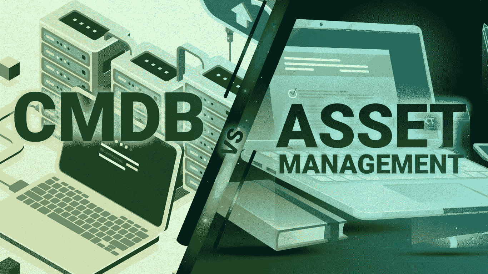

# CMDB 与资产管理:区别是什么，如何利用它们

> 原文：<https://medium.com/codex/cmdb-vs-asset-management-whatre-the-differences-and-how-to-utilize-them-c3f84f0ffe1?source=collection_archive---------8----------------------->

每一种产品和服务都由硬件和软件组件支持。管理这些基本组件并不简单，但在 It 服务管理中，这样做是必不可少的，也是价值驱动的。这种管理包括组织可用的所有资源，包括人员、数据和技术，以及价值流、流程、合作伙伴和供应商。

本文将定义资产和配置管理数据库(CMDBs)，资产管理和配置管理之间的区别，并提供额外的资源。

**CMDB**被定义为用于存储关于 IT 基础设施的数据的数据仓库。发现、管理和跟踪 IT 资产之间的联系是 CMDB 的三项主要任务。同时强调每个人的独特之处。

实施有效的变革管理不是简单的目标。在服务管理领域，配置管理被视为独角兽。实际上，遵循最佳实践的配置管理实例并不多。必须在管理配置信息和配置管理之间取得微妙的平衡。与之相关的流程不会因为信息太少而受益，而无效或低效的管理是因为知识太多而导致的。

这些方法看似相同，但实际上是不同的。CMDB 包含一些资产，但是资产管理超越了构成配置管理的配置项。以下是 CMDB 和资产管理之间的区别:

1.  例如，资产可以是你企业的财务资源。这些资产有助于最终的结果。另一方面，配置项受制于变更控制，这是基线化的——并不是对每个资产都是如此。
2.  资产管理跟踪资产。从物品被购买的那一刻起，直到它被出售，它在资产的整个生命周期中被管理。另一方面，CMDB 并不是一个真正的过程。它是一个集中存储有关对象、资产或配置项的所有数据的系统。
3.  资产管理可以建立 it 资产管理(ITAM ),它对企业更有价值，因为企业是主要的利益相关者，它们从 IT 中获得最高的价值。CMDB 对商业服务人群更有价值，因为它更关注运营、可用性和服务。

独联体是 CMDB 的主要结构基石。为提供 IT 服务而必须监控的基础设施 IT 环境的每个组件都应该在 CMDB 上有自己的 CI 记录。因此，CMDB 在创建有效的 ITIL 执行方面的作用是不可避免的。

这些是如何利用 CMDB 和资产管理的方法！

**1。充当 IT 资产和基础架构的中心参考点:** CMDB 在一个系统下管理所有的基础架构和 IT 资产，该系统充当单一联系点

**3。支持对新的变更和部署进行准确的风险评估:**变更经理可以利用 CMDB 来了解、预测和实施减少业务中断的策略

**5。纳入 SKMS 和知识管理流程:**组织需要一个强大且最新的 CMDBs 来进行有效的知识管理

**7。促进问题配置项的调查:** CMDB 允许 IT 组织识别有问题的资产类别，并持续监控事件/问题报告

**9。填充和维护可以自动化:**通过自动化保持组织的变更和记录是最新的

CMDBs 和服务资产配置管理流程是 ITIL 的关键组成部分，可促进各个层面的成功。CMDB 制定了高效的 IT 资产管理程序，使组织能够简化事件管理，使用自动化流程收集数据，并直接用于新的修改。

了解更多有关如何提高您的服务管理绩效，同时最大限度地降低即将到来的风险的信息。

我们将帮助您通过有效的 ITSM 战略实现高性能的 IT 服务管理，并增强最新的服务管理技能。