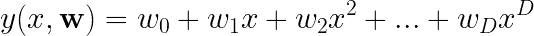
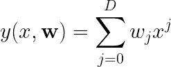
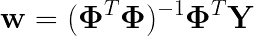
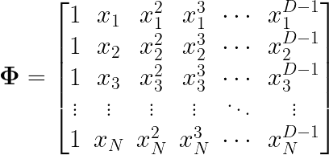
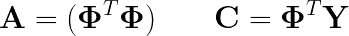
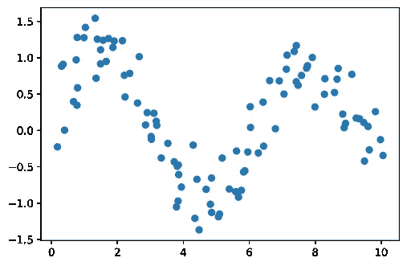
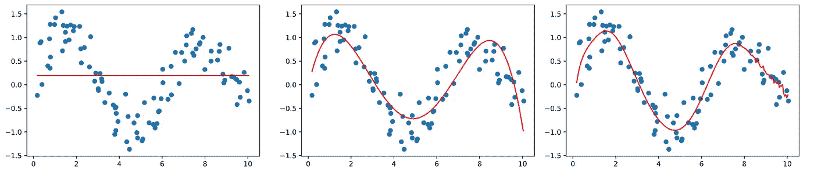
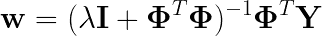
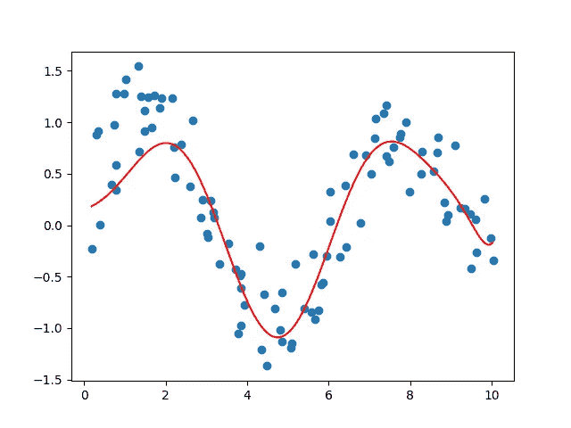

# 使用 Python 从头开始编写多项式回归模型

> 原文：<https://medium.com/codex/code-a-polynomial-regression-model-from-scratch-using-python-6f02d708177?source=collection_archive---------1----------------------->


潘卡杰·帕特尔在 [Unsplash](https://unsplash.com?utm_source=medium&utm_medium=referral) 上的照片

## 了解多项式回归背后的基本数学，以及如何使用 Python 从头开始实现它。

在机器学习和统计分析中，回归模型是一种可以与已知数据点相关联的模型，以便估计某个函数 *F* 并逼近关于数据点 *X.* 的 *Y* 的值

在本文中，我们将快速回顾回归背后的数学，然后我们将学习如何使用 Python 和 Numpy 编写多项式回归模型。最后，我们将看到如何防止我们的模型过度拟合，尽管使用了高学历。

# 数学的快速概述

为了估计某个 *X* 的值 *Y* ，我们需要运行这个等式:



这可以简化为:



其中 *D* 是多项式的次数。

现在的问题是，我们如何找到这些重量？简而言之，我们可以用我们的数据 ***X*** 形成的设计矩阵来估计矢量 *w* ，使用以下等式:



其中*φ*是设计矩阵**Y是每个目标 *y* 形成的向量。
尺寸 *N* x *D* 的设计矩阵是这样建立的，每个 *x* 都是我们训练集中的一个数据点:**



# 回归模型类

我们现在要对这个类进行编码。请记住，它不是最优化的模型实现，但我相信它很容易理解。首先，初始化函数:

```
def __init__(self, d=5): 
    self.d = d
```

这里变量 *d* 是我们多项式的次数。注意，如果 *d* 等于 1，那么我们将有一个线性回归。
现在进入拟合功能:

```
def fit(self, X, y):
    A = []
    C = []
    for i in range(self.d):
        A_row = []
        for j in range(self.d):
            A_row.append(numpy.sum([x**(i+j) for x in X]))
        A.append(A_row)
        C.append(numpy.sum(numpy.multiply([x**i for x in X], y)))
    w = numpy.linalg.inv(A) * numpy.transpose(C)
    self.w = w
```

我们在这里使用两个矩阵计算上一节中给出的等式，例如:



使用我们刚刚找到的权重，我们现在可以估计一些数据点的值*Y*X:

```
def predict(self, X): 
    pred = [] 
    for x in X:
    pred.append(numpy.sum([w_j * x**j for j, w_j in
                enumerate(self.w)])) 
    return pred
```

我们的回归模型完成了，让我们看看它的表现如何。
首先，我们需要创建一些数据:

```
numpy.random.seed(0)X = numpy.arange(0, 10, 0.1)
X = X + numpy.random.normal(0, 0.2, X.shape)
y = numpy.sin(X)
y = y + numpy.random.normal(0, 0.3, y.shape)plt.scatter(X, y)
plt.show()
```

这段代码只创建了一个正弦波，我在其中添加了一些噪声:



我们现在实例化模型，并使用拟合函数找到权重:

```
model = regressionModel(d=5)
model.fit(X, y)
```

然后，我们可以在分散的数据上绘制回归线，看看它是否吻合。

```
plt.scatter(X, y)
x_min = min(X)
x_max = max(X)
xx = numpy.arange(x_min, x_max, 0.05)
plt.plot(xx, model.predict(xx), c="red")
plt.show()
```

我画了 3 个例子，这样你就能看出高低学位的区别:



d=1、d=5 和 d=12 的多项式回归

请注意，当 *d* =1 时，这只是一个线性回归，当 *d* =12 时，模型过度拟合，而 *d* =5 则很好地代表了我们的数据。因此，选择合适的学位非常重要。

如果你仍然需要使用高学位，你需要防止这种过度拟合，这可以通过正则化来实现。

# 具有 L2 正则化的回归模型类

L2 正则化，或权重衰减，如果一些权重的影响较小，会对它们增加惩罚。换句话说，没有数据支持的权重将向零衰减。

对于多项式回归，可以通过在我们的矩阵 ***A*** 中添加一个值为λ的对角矩阵来进行这种正则化(关于 ***A*** 的定义见上文)。这样，我们的权重向量可以计算如下:



然后，采用 L2 正则化的回归模型类变为:

```
class regressionModel: 
    def __init__(self, d=5, lbda=0.5): 
        self.d = d
        self.lbda = lbda     def fit(self, X, y): 
        A = [] 
        C = [] 
        for i in range(self.d): 
            A_row = [] 
            for j in range(self.d): 
                lbda = 0 if i != j else self.lbda 
                A_row.append(numpy.sum([x**(i+j) + 
                             lbda for x in X]))
            A.append(A_row) 
            C.append(numpy.sum(
                     numpy.multiply([x**i for x in X], y))) 
        w = numpy.linalg.inv(A) * numpy.transpose(C) 
        self.w = w     def predict(self, X): 
        pred = [] 
        for x in X: 
            pred.append(numpy.sum(
                 [w_j * x**j for j, w_j in enumerate(self.w)]))
        return pred
```

使用与之前相同的代码来生成数据并拟合我们的模型，这是当 *d* =12 且λ= 0.5 时的回归曲线:



看起来好多了，不是吗？

选择度数和λ值的良好组合通常需要反复试验。幸运的是，大多数机器学习库，如 Scikit-Learn，都有 K 倍验证算法的实现来帮助您找到这些值。

你可以在这里进一步阅读 K-Fold 验证:[https://sci kit-learn . org/stable/modules/generated/sk learn . model _ selection。KFold.html](https://scikit-learn.org/stable/modules/generated/sklearn.model_selection.KFold.html)