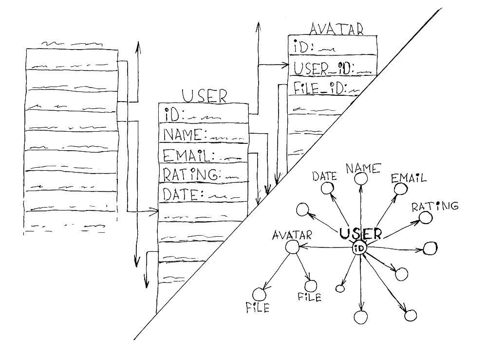
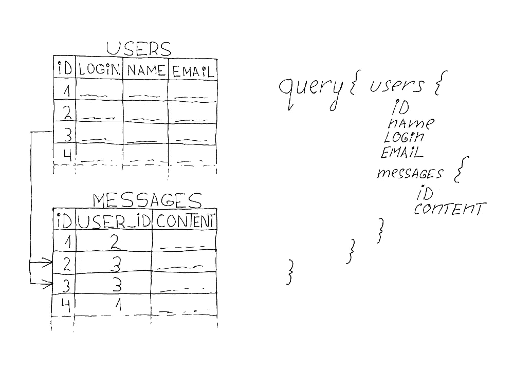
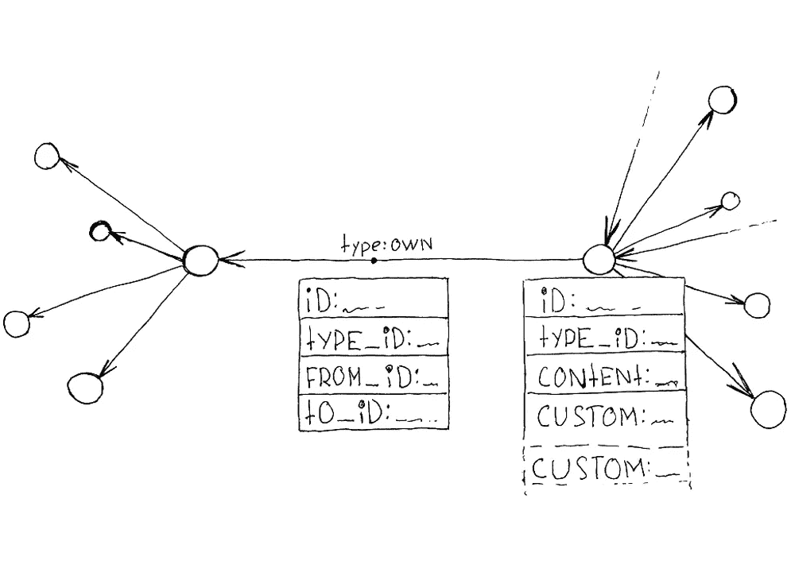
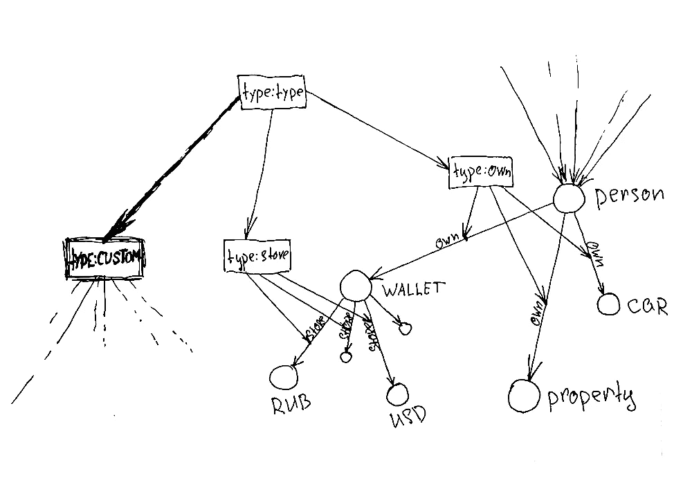

# 重构因素

> 原文：<https://medium.com/codex/code-is-dependent-on-data-and-models-and-therefore-on-the-abstractions-used-in-them-so-603e083b3434?source=collection_archive---------22----------------------->

> 这篇文章由 Deep Foundation 的联合创始人康斯坦丁·迪亚琴科翻译。

代码依赖于数据和模型，因此依赖于数据和模型中使用的抽象，所以重构在今天是不可避免的。为什么？通常，重构意味着为了以新的方式使用数据，需要对代码进行修改。我们将讨论导致滚雪球效应的最常见和最不喜欢的重构类型。当数据模型、表结构和业务逻辑发生变化时，就会发生这种情况。

> *深渊哲学用一个环节的概念描述一切。任何对象都是一个链接，任何关系都是一个链接。该关系始终具有指定的* `*from*` *和* `*to*` *字段。在独立对象中，* `*from*` *和* `*to*` *字段未被指定。这也将 Deep 的哲学与图数据库区分开来，在图数据库中，边不能作为关系的对象。*

# 根据数据模型可以改变什么？

*   字段重命名。
*   一对一/多关系的改变
*   添加抽象
*   贬低抽象概念

您总是可以通过添加新的适配器和层来尝试修补向后兼容性问题。但这种对抗症状的斗争只会推迟真正问题的后果。随着商业逻辑的每一次变化，洋葱效应只会越来越大。而且会有更多的抽象相互交织。

许多程序员会争论——这是一个干净代码文化的问题。我们不同意。干净代码的文化仅仅是关于它的实现。问题不在于我们如何编写代码，不管我们多么愿意相信它。问题是，原则上，它依赖于业务逻辑的抽象。程序员正在试图修复这个问题的后果，它并没有降低代码的复杂度，只是成倍增加了代码的复杂度。与此同时，程序员让自己沉浸在想象中的舒适和对局势的控制之中。

> *深。凯斯的目标是打败这个敌人。数据模型根本不需要重构就可以发展。怎么会？为了解释，我们必须挖掘问题的根源。*

# 字段的重命名

代码架构有很多种类型。您可以使用 GraphQL 和模式生成器，也可以自己通过 ORM/ODM 映射 API 和数据抽象，将转发表规则映射到您的代码。您可以从服务器获得功能 API 和 REST API。但是，可能在任何情况下，使用这些 API 的方式要么在 API 级别定义，要么在表中的列名级别定义。因此，我们通过向开发人员支付更新数据库、生成器、解析器和 API 的费用来补偿诱发的变化。这里的问题是功能实现的分离及其与业务逻辑的集成。这一层抽象被业务逻辑规则的交集和列连接方式的数量所倍增，最终使得每一波重构的代价高度依赖于项目的年龄。准确计算依赖系数是不可能的，但是这个价格总是比业务场景中仅仅字段修改和行为改变的成本高好几倍。

> *在这里，您还必须始终考虑用户权限和任何其他业务规则。这增加了这种重构浪潮的成本，是业务规则数量的数倍。* [*深沉。案例*](http://deep.Case) *让你彻底忘掉这个问题！*

无论我们如何沉迷于能够预测一切的幻想，显然事实并非如此。即使是最理想的模式也会改变。我们所认为的单一联系将变成多重联系。我们认为是多重的将从几个地方开始被引用。设想在某些地方使用的模型有必要在许多其他地方应用。今天，每一个这样的变化都需要开发人员的参与，一次又一次。

用[深。案例](http://deep.Case)数据分为:

*   作为回答`WHAT`问题的节点(对象|点)的链接，例如:支付、交易量、需求、时刻和其他
*   用作回答`HOW IS RELATED`问题的关系(链接)的链接，比如:X 想要 Y，W 看了 Z，T 拥有 R，T 回答 P
*   由数据模型提供的自定义表，可从相应类型的节点访问。这种表的目的是存储自定义的非引用数据，通过单独的表来描述更方便。

描述关系的链接最初不被系统限制为一个或多个。创建每种类型的链接的规则可以在模型级别上描述，并且随后很容易更改。

这意味着对于从`one`到`many`的转换，允许创建某种类型的多个链接就足够了。

例如，当你需要创建一个新的链接类型和新的实体时。与[关系深厚。案例](http://deep.case/)，你不再需要经历一个改变数据结构、ORM/ODM 模型的完整周期，或者考虑代码如何反映所需的抽象，它的不灵活性减缓了业务逻辑的变化。**你不再需要后端开发者来完成这种改变。**只需创建一个新类型的链接，并描述在什么情况下可以在周围空间创建和更改该链接。它将通过一个 GraphQL/REST API 立即变得可用，而不会破坏旧的抽象和链接，因此也不会破坏相关的代码。

# 摒弃旧的抽象层次

由于不再有自己编写的 API 解析器层，对旧抽象的反对被简化为在新代码中不使用某些链接**的建议。但是由于接口和处理程序的一些子集可以与它们的存在联系在一起，所以它们的存在可以简单地在数据库级别维护。即使提供数据模型的包希望切换到不同类型的链接，在创建新链接时，也不会阻止维护基于这些链接的镜像结构。**

# 支持关联技术

我们创建了一个开发环境(盒装 CE / EE 版本和 SaaS 版本)，它允许您使用数据存储来解决您的业务问题，并能够使用关联方法来适应任何业务变化。我们将在一个单一的关联空间中创建一个服务器集群的分布式网络，这样在创建项目时就不必考虑地区法规。我们创造了一种发布可重用数据模型及其行为的文化。

加入我们的不和谐社区。在我们的等待名单上注册提前访问或在 Patreon 上支持我们。[http://deep.foundation/](https://deep.foundation/?utm_source=medium&utm_medium=article&utm_content=article1)

在我们的网站上，您可以找到开发中未来文章草稿的链接、代码源的链接、项目和产品管理计划以及 invest 演示文稿的链接。