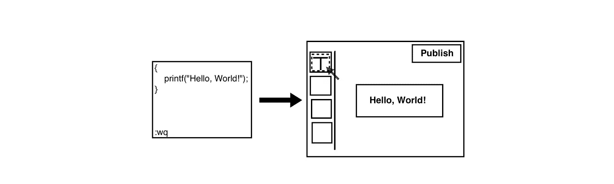

# 代码。专业代码。低码。没有代码。

> 原文：<https://medium.com/codex/code-pro-code-low-code-no-code-b99878bd5de4?source=collection_archive---------11----------------------->

过于简化，但你明白了

自从我开始工作以来，我的职业重心发生了很大的变化，从主要从事技术工作到现在主要关注业务成果和相应的规划工具/流程。有趣的是，代码在我自己的职业生涯中扮演的角色与软件行业的进化/时代精神相类似。让我解释一下，但首先是一些背景。

我认识一对物理学家兼电气工程师夫妇，丈夫曾半开玩笑地对妻子说:“一个物理学家一生的工作就是电气工程师教科书第 443 页上的一个小图表”。这让我难以忘怀，因为这有点符合 API 的逻辑，它是现代软件工程的基石:我调用 foo()，而其他人花了一年时间编写 foo，对我隐藏了它的所有复杂性。考虑以下过度简化的抽象层次:

*物理→电气工程→操作系统/系统软件→软件应用层*

当你从左向右看时，你会注意到每个阶段艰苦创新的影响使下一个消费者阶段更容易/更快/更便宜地做大事，但也导致该阶段不成比例地创造更多的产品和就业机会。考虑到这一点，这个故事。

**代号**。我的职业生涯始于一名系统软件开发人员，为内核、设备驱动程序和分布式系统编写代码。我进入这个领域的主要原因是我在克莱姆森(Clemson)学习计算机科学的学校，那里很尊重系统软件，这主要归功于一位超级明星操作系统教授。事实证明，自从我开始以来，系统技术已经发生了很多变化:由于 Linux 内核、各种级别的虚拟化和大规模分布式系统的发展，云计算成为了主流架构。系统中仍然有大量的创新，但它为使用这些系统建立自己的业务的全新公司创造了更多的工作机会——构建软件应用程序。在软件工程中，内核编程是尽可能复杂的“代码”,但也是设计中可视化工具最少的领域(因为 WYSInotWYG)。进入下一阶段。

**Pro 代码**。我的下一站是我的第一家创业公司，在那里我使用 Wifi 强制门户(当你连接到公共 Wifi 时，你会看到一个小小的注册窗口)和移动网络，构建与平台无关、特定位置的移动用户体验，不需要安装应用程序。这纯粹是用 PHP/JS/etc 编写的应用程序代码..传统的移动原生应用，在这个时候成为了技术的中心舞台，使用 Java/Objective-C(当然我也合作出版了几个半成功的 Android 应用)。向开发者开放移动应用平台导致应用经济创造了数百万个就业机会，并极大地改变了我们的生活。这都是亲代码，在那里写代码，但有友好的 IDEs 仍然非常，非常技术性。

**低调**。当我决定继续从事全职产品管理工作时，我加入了一家在移动浪潮中表现出色的公司，其 USP 是“编写一次代码，为 6 个移动平台编译”。6 最终变成了 3 (Android、iOS 和 Web)。核心产品是一个应用程序开发平台，提供拖放可视化/所见即所得工具，在那里你仍然可以为高级用例/工作流编写定制代码，这在企业市场是不可避免的。后端也是如此——该产品带有简单的开箱即用的中间件集成。要成为一名低代码开发人员，你仍然需要技术，但是工具让你在加速应用程序开发方面有了相当大的优势。但是低代码平台很贵，而且是企业级的。更友好的开源 JavaScript 栈在此期间取得了飞跃性的进展，主要是针对 web 甚至后端，这不断简化了开发，递归地将我们带到了现在。

**无代码**

当我开始用有限的资源构建[宇迦](https://www.yugahq.com)时，我了解到了大量的无代码平台。当我四处打探时，我意识到这些是合法的、字面上的无代码——你可以不用一行代码就构建复杂的功能(前端和后端工作流)!宇迦是 SaaS 的产品——基本上是商业流程的网络应用版本——是这些平台的完美匹配。无代码意味着你构建的时间+成本是超低的，拆除的成本是超低的，“总拥有成本”是超低的。

你听到各种各样的产品/企业声称“把 X 留给我们，这样你就可以专注于你的业务”——无代码是这种说法的顶峰。你猜怎么着——你不必是技术人员——我的团队伙伴开发了我们的应用程序，他是一个顶尖的商学院 MBA，他可以，但不想做技术工作，他不介意没有代码:)

无代码是开发者工具数以万计的创新和发展的顶点，最终使非技术人员的应用开发成为可能。现在还是早期阶段，no-code 确实有局限性(它主要是 web 专用的/非移动的，显然不适合大量的事情),可能存在规模问题——在我自己的例子中，我的计划是假设 JS 堆栈/团队来构建我的路线图。但是对于开始一个新项目或者快速原型化/验证来说，无代码是完美的:本文的目的仅仅是传播消息。我们的职业规划应用程序([g](https://app.yugahq.com)et access at[yugahq.com](https://www.yugahq.com))是建立在 Bubble ( [bubble.io](http://bubble.io) )之上的——看看我们的应用程序，但一定要看看 Bubble、Webflow 或任何其他无代码平台。你知道你已经在这个想法上搁置太久了——无论是在工作中还是作为个人的副业——现在是时候去创造一些有趣的东西了。尽情享受吧！

PS:我是新的媒介(双关语)，并希望有后续。查看一下我的其他与职业相关的帖子，包括一个讲述员工辞职的电影剧本，我想你会喜欢的。[这是我的工作](/@kirankanakadandi/yuga-employee-retention-saas-designed-in-2021-for-the-new-normal-e8a6bb803503)。

# code # lowcode # nocode # software #软件工程

#员工离职#未来工作# SaaS #新常态#员工离职