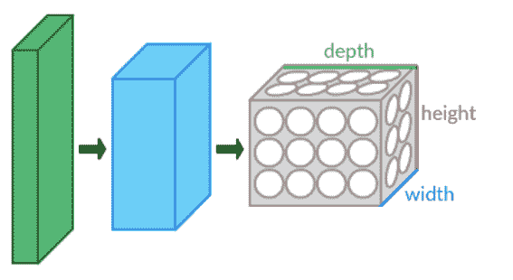

# 代码审查:我如何在 CIFAR10 数据集中检索测试集预测

> 原文：<https://medium.com/codex/code-review-how-i-retrieved-the-test-set-predictions-in-the-cifar10-dataset-c60c8daa35d7?source=collection_archive---------10----------------------->

与 Python 的另一个机器学习库 sklearn 相比，我的学习曲线非常陡峭。随着数据集变得越来越大，其中包含的数据也变得越来越复杂，因此，对于任何有抱负的数据科学家来说，获取能够基于这些更大、更复杂的数据集进行预测的技能都是势在必行的。