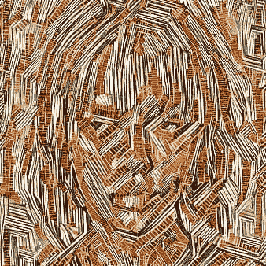

# 代码回顾:如何使用 PyTorch 传输图像

> 原文：<https://medium.com/codex/code-review-how-to-transfer-images-using-pytorch-9d8c8c23602e?source=collection_archive---------12----------------------->

我看了很多 YouTube 视频，并注意到许多内容创作者使用变形图像来规避版权法。我个人只尝试在我所有的帖子中使用无版权的图片，但有些人更喜欢使用当前最新的照片。创作者，如阴暗的梅格，凯尔特新闻，或其他人倾向于使用哈里王子和梅根汗·马克尔的变形图像，以避免因使用…