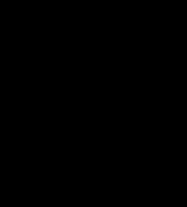

# 编码纹理

> 原文：<https://medium.com/codex/code-textures-d67bd27f67a4?source=collection_archive---------22----------------------->

不，这不是打印错误。在这篇笔记中，我们谈论的不是结构，而是纹理，即程序代码的纹理。

为了解释它是什么，为什么这个概念对我很重要，我给你讲个故事。

那是很久以前的事了，在二十世纪七十年代末。然后我们编写了一个大型系统。IDE(集成开发环境)的概念还不存在，我们使用一些特殊的编辑器来编写程序代码。我们使用的编辑器有一个有趣的特性。通过从光盘上加载一个带有程序文本的文件，它首先显示它，在监视器屏幕上从第一行“滚动”到最后一行。加载的文本在我眼前飞快地闪过，所以很难在运行中识别出单独的行。

一天早上，我的同事，在附近的桌子上工作，突然大声说:“哦，多美啊！”。

他不是很情绪化，所以我们饶有兴趣地走到他的桌前，想了解他如此热情的原因。

原来，在前夜，他接受了一项任务，对我们的一位大师早先写的程序稍加修改。对于他身后的观众，他再次打开了从磁盘加载程序文本。自下而上的线条在屏幕上快速游动。但是这些完全不同于我们所熟悉的由点和虚线构成的纹理。它们充满了和谐和某种魔力。他们罕见的美丽和迷人。我当时想:“这样的代码会错吗？”

也许吧。从那以后，我用各种编程语言浏览、有时分析、有时修改或编写了数百万行代码。在大多数情况下，我相信优秀的程序员会给出“漂亮”的代码和高质量的代码——不仅仅是“漂亮”,还有一些“视觉和谐”的代码。

然而，我必须预订。这条规则只适用于手动编写的代码。生成器有时会给出一个非常结构化但充满 bug 的代码。

# 代码结构和纹理

嗯，我们几乎在概念上达成一致。与程序代码的经典结构不同，程序代码的经典结构是通过将其分成多个部分以及各个部分的格式来定义的，程序代码的纹理是指屏幕上的视觉表示。

很明显，我们在七十年代看到的纹理，或者现在可以在现代高分辨率显示器上看到的纹理，最终都是程序代码结构的反映。

当我们考虑编码结构时，编程的模式几乎自动浮现在脑海中。

在我看来，使用或不使用经典编程模式对代码是否会变得“漂亮”影响不大。

代码的美丽受到非常不同的结构的影响。

这些结构可以分为几个层次。

第一个级别现在由 IDE 中内置的配置良好的代码编辑器提供。它们会自动截断缩进，添加被遗忘的括号和其他符号，还会为标准方法或函数的代码生成格式正确的框架。

第二层的结构取决于对单个程序块(例如类或方法)的责任选择、继承的实现以及将小程序块组合成大程序块。正是这些二级结构决定性地影响了代码的结构和它的“美”

代码的视觉美感不是专业编程的目标。然而，当我看到视觉上优雅的代码结构时，我经常想在屏幕上进一步滚动代码，也许会看到一些漂亮的代码纹理。

# 而不是总结

那么，我想用这张便条表达什么呢？这是什么:

代码的结构反映了思维的结构。

代码纹理代表代码结构。

于是:纹理代码——这是思想的物化之一。

如果代码在视觉上是美丽的，那么创造者的思想也是优雅的。

而优雅和思维方式是高度职业化不可或缺的标志。

最后——我对程序员的呼吁:

关注并享受美丽的代码纹理，如果有的话，你会遇到。这种快乐只有我们这一行的人才享受得到。

# 有趣的链接:

**https://dgopstein.github.io/articles/ioccc-ascii-art/ OCCC ascii 艺术:**T2

https://benfry.com/distellamap/

(感谢用户 [true-grue](https://habr.com/ru/users/true-grue/) )

[图片:pixybay.com](https://pixabay.com/de/unbekannt-denken-betrachten-1769656/)