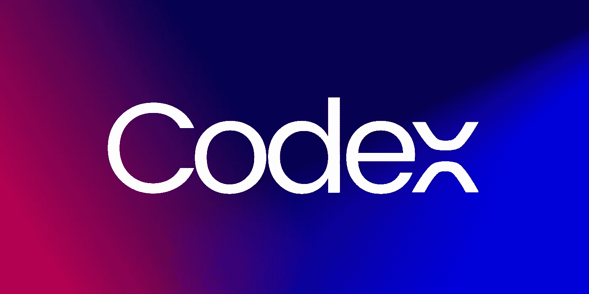
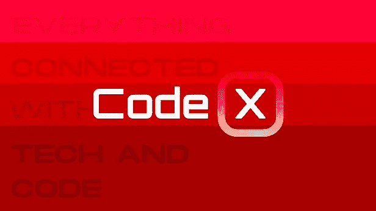
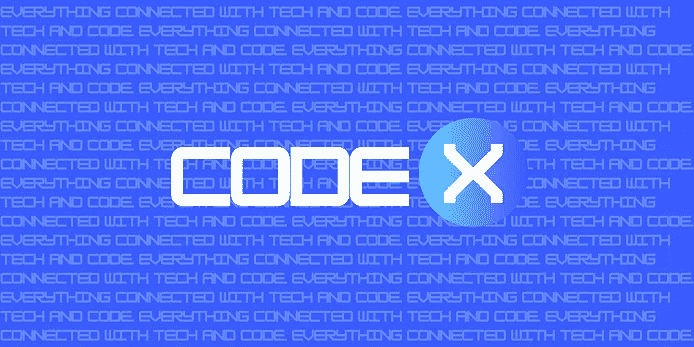
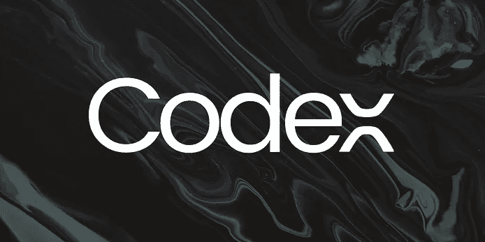

# 法典:2021 年回顾

> 原文：<https://medium.com/codex/codex-2021-year-in-review-bb53d04852b5?source=collection_archive---------2----------------------->

## 迄今为止我们的旅程和成就

作者图片

食品法典委员会成立将满一年，对我们来说，这是一个杀手年。在 CodeX，我们秉承“为所有人提供教育”的原则，只有在优秀敬业的作者和出色的编辑团队的帮助下，我们才能实现这一目标。所以在继续之前，我想感谢所有的作家和志愿者，他们是法典的支柱，肩负着和我们一样的责任，全心全意，无私奉献。向我们了不起的读者大声呼喊，他们非常支持我们的作者写更多的内容，特别是支持我们扩大我们的出版物。

# 作家

我们开始时有大约 5 到 10 名作家，现在我们一直到 2000 多名作家，我们预计到明年年底这个数字会增加两倍。为了提高我们的作家的地位和扩大基地，我们非常兴奋地宣布未来的计划，这些计划将很快实施。

首先，我们正在考虑每月或每季度举办不同主题的写作比赛，获胜者可以获得一定的金钱奖励。安排这种竞赛的主要目的是帮助作者接触到不同的作者，他们在各自的领域有不同的经验水平，如何处理他们文章的主题。作家也将面临许多高质量的内容，这些内容可以作为他们未来作品的灵感。

第二，食典委涵盖的类别有望扩大。这个特别的计划是为了扩大我们的作家群，给作家更多的自由去报道他们感兴趣的话题。这样做还可以帮助出版物提供尽可能多的技术和编程内容，以确保读者不局限于某些主题或类别。

这些是作家们明年可以期待的一些想法。还有其他不同的计划，但它们仍在讨论中。

# 编辑团队

我们的编辑勤奋工作，使食典蓬勃发展，它不可能达到我们现在的水平没有他们的帮助。我们慢慢建立了这个团队，目前，它由五名出色的编辑组成，他们是[内文·卡茨](https://medium.com/u/62fbee41aad2?source=post_page-----bb53d04852b5--------------------------------)、[斯图尔特·伍利博士](https://medium.com/u/a435b5883828?source=post_page-----bb53d04852b5--------------------------------)、[阿提拉·瓦戈](https://medium.com/u/2053aaf853f5?source=post_page-----bb53d04852b5--------------------------------)、[奥马尔·扎赫兰](https://medium.com/u/74d56154f1f9?source=post_page-----bb53d04852b5--------------------------------)和[克里斯蒂安劳](https://medium.com/u/2696f801a31a?source=post_page-----bb53d04852b5--------------------------------)。他们不仅仅是编辑，还是了不起的作者，他们的故事对法典产生了重大影响。以下是每位编辑对法典的评价:

## 内文·卡茨:

“我最初是作为一名作家来到 CodeX 出版物的，很快就被它涵盖的技术和编码主题的广度所打动。加入编辑团队增强了我对我们的作者对他们的主题的深刻了解和通过他们的写作抓住读者兴趣的能力的欣赏。对我来说，通过 CodeX 发布是分享我使用 Drupal 和 JavaScript 的经验的一个很好的方式。我期待看到我们的作家如何描绘 2022 年的技术概念和趋势。"

## 斯图尔特·伍利博士:

“在我被邀请加入 2021 年的编辑团队之前，我已经作为一名作家与 CodeX 接触了一段时间，并且一直认为它是软件工程领域中一份有趣和信息丰富的技术出版物。对我来说，最突出的是发表的文章的多样性和质量，特别是在我自己的特定兴趣中——作为一名软件工程师工作是什么样的，每天的高潮和低谷，以及这个行业内外的人。

重要的是，我们都分享我们的知识和经验，以便我们可以共同成长，当我每天查看提交的文章时，我可以看到提交的质量和数量都在不断提高。

我非常期待自己在 CodeX 上发表更多的文章，并在 2022 年评论你的文章，所以请继续关注它们——不要犹豫，因为你会惊讶于其他人是多么欣赏和重视你的想法！为 2022 年我们所有人——为 CodeX，为软件工程的大游戏，为世界——的更大更好的一年干杯。"

## **阿提拉·瓦格:**

“作为一名作家兼编辑，我目睹了食品法典委员会在过去一年里的巨大发展。这是一份真诚希望更多人通过他们的故事和对软件和技术的热情联系起来的出版物。毫不奇怪，我们的一些作家和他们的文章会像病毒一样传播。关于苹果、智能家居技术、可访问性、Python 等许多主题，都以发人深省的方式撰写，以促进对话和发展社区。2021 年是很棒的一年，我只能对所有接受我邀请在 technology 下发表的作家说谢谢。愿我们在 2022 年收获更多。”

## 奥马尔·扎赫兰:

“作为 CodeX 编辑团队的一名新成员，我最初是以投稿人的身份加入该出版物的。即使在担任编辑的短暂时间里，我已经能够看到新作家为 CodeX 贡献各种关于技术、创新和计算机编程的观点的兴奋之情。我们作家的这种多样性是我很自豪能够参与其中的一部分，并期待着帮助发现更多有才华的作家，原因有二。首先是从不同的角度看到新的观点。第二是利用这些不同的视角来帮助我成为一名更好的作家。我期待明年在食典委看到更多这些独特的观点。”

## 克里斯蒂安劳:

“我最近刚刚加入食典委的编辑团队，我很高兴看到这份出版物迄今为止取得的持续发展。对我来说，CodeX 是分享我在数据科学和大数据领域的兴趣的完美平台。我对新的一年为食典准备的东西感到非常兴奋，并希望我能帮助使该出版物更加成功。”

# 品牌宣传

今年，我们经历了两次品牌推广，每次都传达了特定的信息。现在，我们想分解每一个迭代，让我们的读者和作者认识到我们的标志的信息和经历这些迭代的原因。

左上角:第一个 logo，中间:第一次迭代(第二个 logo)，右上角:第二次迭代(现在的 logo)。作者提供的图片

## 第一个标志

从第一个标志开始，使用的主要颜色是鲜艳的红色和经典的白色，代表我们内容的新鲜感。我们想确保标志看起来科技，这解释了这里使用的字体类型的原因。我们在这里试图描绘的是，法典是一个生产新鲜内容的技术出版物。

## 第一次迭代(第二个徽标)

随着时间的推移，第一个标志没有很好地传达信息。在 CodeX 的头几个月，我们没有策划内容，但接受了我们收到的每一个提交。但后来我们开始接受基于我们形成的某些标准的文章。

所以，我们想传达的是，CodeX 现在是一个只刊登高质量文章的科技出版物。我们决定带来这种高级外观，首先将我们的主色调从红色和白色改为明亮的蓝色和白色，因为蓝色是带来这种高品质外观的最佳颜色之一。然后我们使用了几种字体，最后选择了一种我们认为可以让 logo 看起来更醒目的字体。

## 第二次迭代(当前徽标)

这一次，我们想做得专业些。我们咨询了设计师和 logo 专家来寻找最好的 logo，最终我们选择了现在的这个。我们想通过这个标志表达的主要意思是，CodeX 现在已经成为科技领域的一个更高级的出版物。

我们决定继续使用哑光黑和银白色的调色板，因为这两种颜色结合起来会带来经典的外观，而这是许多原始颜色所没有的。我们仔细寻找合适的字体，因为它必须代表一种高级的外观，同时保持高科技的外观，并带有一点现代感。经过一番艰苦的搜索，我们终于找到了完全符合我们标准的字体。我们还对字母 X 做了一点小改动，让它看起来更科技化，最终增加了更多的优雅。

# 未来计划

我们更关心我们未来的增长，我们为更好的发展制定了几个不同的计划。

*   为提交他们的文章以成为作家建立更好的体验
*   通过不同的社交媒体渠道扩大我们的受众
*   创办一份时事通讯
*   举办写作比赛
*   所涵盖主题的扩展
*   更好地组织和分类不同类别页面中的文章
*   扩大我们的作家群，建立一个更大更强的社区

我们非常高兴能够实施我们的计划和想法，这些计划和想法是在我们的编辑团队的帮助下手工制作的，我们牢记我们的读者和作者，并最终提升他们对我们出版物的体验。

# 结束语

今年对我们团队来说是过山车，也是令人兴奋的一年，因为我们一起讨论和思考问题。我们从作者和读者那里得到的支持是无法衡量的，它激励我们去做更多更伟大的事情。在离开之前，看看由最伟大的头脑在 CodeX 上写的一些 2021 年最伟大的作品(根据粉丝数量):

1.  哈佛最受欢迎的在线免费课程—[弗雷德里克·巴斯勒](https://medium.com/u/16c852692647?source=post_page-----bb53d04852b5--------------------------------)
2.  [C#快死了](/codex/c-is-dying-fa21a96107c5)——作者[左](https://medium.com/u/426137a1abbf?source=post_page-----bb53d04852b5--------------------------------)
3.  [老实说，我们不应该使用微服务](/codex/honestly-we-shouldnt-have-used-microservices-443582def48b)—[米卡·耶普](https://medium.com/u/1065aec0ee45?source=post_page-----bb53d04852b5--------------------------------)
4.  [网络应用不是未来](/codex/web-apps-arent-the-future-f71476087e92)—[米卡·耶普](https://medium.com/u/1065aec0ee45?source=post_page-----bb53d04852b5--------------------------------)
5.  [如何在数据科学和机器学习领域一年赚 100 万美元——一种简单易行的方法](/codex/how-to-make-1-000-000-a-year-in-data-science-and-machine-learning-a-fool-proof-method-59f50665f6e9)——作者[杰森·贝尔](https://medium.com/u/ea1ed9e4aba?source=post_page-----bb53d04852b5--------------------------------)
6.  [我的 Macbook Air 没电了](/codex/my-macbook-air-m1-is-dead-a394e3581e95)—[韩菼·魏](https://medium.com/u/512da8c7cd8f?source=post_page-----bb53d04852b5--------------------------------)

希望你能在阅读这些珍贵的宝石时度过一段美好的时光，并从中获得灵感。感谢我们的 10K+追随者和 650，000+月读者帮助我们走到现在这一步。我们将始终不懈地努力为您获取与技术和代码相关的正确内容。从法典，我们希望你有一个伟大的一年！