# 用 Java 实现一元线性回归模型预测房价

> 原文：<https://medium.com/codex/coding-a-univariate-linear-regression-model-in-java-to-predict-house-pricing-f2a412bbc91e?source=collection_archive---------16----------------------->

沙哈达特·拉赫曼在 [Unsplash](https://unsplash.com?utm_source=medium&utm_medium=referral) 上拍摄的照片

本周的帖子将会与往常有所不同。虽然我们通常在这里谈论网络，但今天我们将深入研究一下机器学习算法——更具体地说，如何实现一个线性回归模型，使我们能够根据单个变量(每 1000 平方英尺的大小)预测房屋价格。我们可以开始了吗？

**简介**

在机器学习中我们可以利用的训练模型的方法主要有两种——***监督学习*** 和 ***非监督学习*** 。

在监督学习中，我们通常将正确标记的数据提供给算法。也就是说，我们明确地告诉算法什么是“正确的”答案。例如，如果我们正在使用*(一种监督学习的类型)，我们通知算法一张图片(*输入值*或*特征*)是否包含一辆汽车、一只猫或一只蜥蜴(*目标*)。基于训练集，模型能够预测未来图片中的元素是猫、汽车还是蜥蜴。*

*或者，在一个*模型(也是另一种监督学习)中，我们提供输入(比如每 1000 平方英尺的房子大小)及其对应的目标值(房子的成本)。使用这些信息，该算法只需输入一个信息(房子的大小)，就可以正确预测训练集之外的房价。**

**回归模型和分类模型的主要区别在于，回归模型的预测范围可以是无限的，而分类模型的预测值相比之下要有限得多。**

**我不会过多地研究无监督学习，因为这超出了本文的范围，但这种类型的机器学习算法会查看提供的数据，并根据观察到的常见模式得出结论(而不是我们告诉它我们到底在寻找什么)。无监督学习的一些例子包括*聚类*、*异常检测*、**、**和*维度缩减*。**

****入门****

**我们将实现一个算法，该算法将获取每 1000 平方英尺的房屋大小，并根据训练集生成其相应的价格。**

**更具体地说，我们将使用**线性回归模型**。线性回归模型通常在数据集的正中间“画”一条线，并试图根据这条线进行预测。**

**我们需要知道几个等式来实现它:**

****线性回归模型方程** = *f* (x)=w*x + b **或** *f w，b = w*x + b***

**这个等式将在数据中间画一条线。**

****成本函数方程**=*j*(x)= 1/2m * mσI = 1(*f*(x)^(i)-y^(i))**

**这个等式计算了我们的线性回归模型的*成本*。也就是说，它告诉我们预测值(ŷ或模型预测的值)与目标值(我们明确输入算法的值)之间的差异。**

****梯度下降算法****

**这将允许我们通过不断迭代 w 和 b 的值来减少 *J(* x *)* 的*成本*，直到成本最小。**

**重复直到收敛(意味着直到每个未来迭代对 w 和 b 的值的影响最小){**

**w = w- *α(学习率)* 1/m **mσI = 1(f(x)^(i)——y^(i))x^(i)**

**b = w- *α(学习率)* 1/m **mσI = 1(f(x)^(i)——y^(i))**

**}**

****实施****

**我将使用 Java 作为我的编程语言，BlueJ 作为我的 IDE。你可以使用 Python 或者任何你觉得舒服的语言。使用的语法将根据所使用的语言而有所不同。**

**首先，我将创建一个名为 PricePredictor 的新类。**

**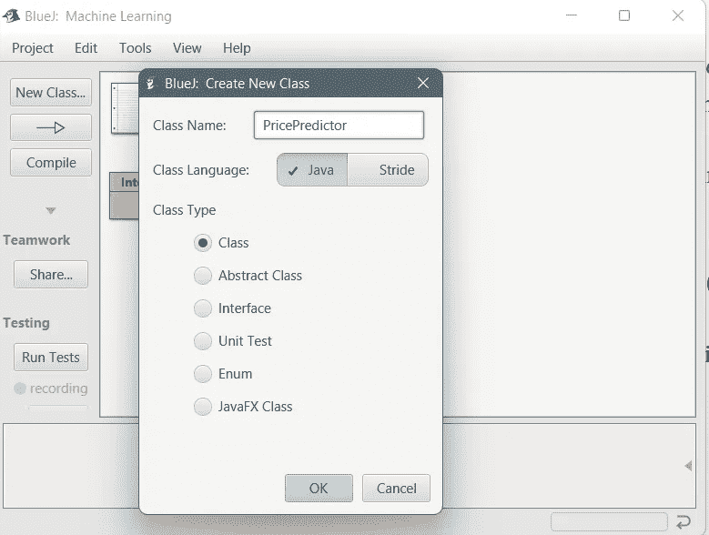**

**接下来，我将为 PricePredictor 类分配一些字段，并创建一个构造函数。**

****x_train** 是一个数组，包含每 1000 平方英尺房屋大小的输入值。**

**y_train 是一个包含房屋价格目标值的数组。**

**1.0 平方英尺是 300.0 美元，而 2.0 平方英尺是 500.0 美元(理论上)。**

****w** 来自 w*x+b**

****b** 来自 w*x+b**

****m** 是代表训练集中行数的变量。我将 m 的值指定为 x_train.length，这将返回数组中元素的数量(2)。**

**因为我们不知道 w 和 b 的最佳值应该是多少，才能得到完全符合数据的线性回归模型，所以我们将 w 和 b 初始化为 0 作为起点。**

**请注意，这种实现主要是演示性的——在现实世界的场景中，您很少对训练集进行硬编码。**

**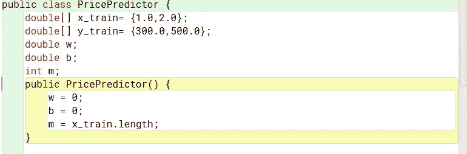**

**接下来，我将实现一个名为 *CostFunction* 的公共 double 方法，它将表示我们的成本函数*j*(x)= 1/2m * mσI = 1(*f*(x)^(i)-y^(i)。**

**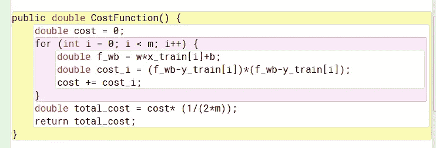**

**首先，我创建一个名为 **cost** 的变量，并将其初始化为 0。**

**接下来，我运行一个 for 循环，其中 *i* 从 0 开始，到 m-1 结束(实际上是 *m* 次)。**

**我将变量 **f_wb** 赋给 w*x_train[i] + b，其中 I 代表迭代次数。**

****f_wb** 是我们对特征 x^(i 的预测值，假设 w 和 b 当前为 0。**

**然后我将 **cost_i** 赋值给(f_wb — y_train[i])。**

****cost_i** 表示预测值(f_wb 给定 x^( *i* 且 w=0，b=0)与实际目标值(y_train at *i* )的平方之间的成本。**

**最后，对于每次迭代，我将变量**成本**加上**成本 _i** 。**

**所有迭代完成后，我退出循环，我创建一个名为 **total_cost** 的变量，将 **cost** 乘以 1/2m 并赋值给它，就像等式中一样。**

**然后我通过让它返回变量 **total_cost** 来完成这个方法。**

**接下来，我们将计算成本函数 J 相对于 w 和 b 的偏导数。更具体地说，我们将找到括号中以粗体显示的运算值。方法 *GradientValues* 将具有参数 w 和 b，并将返回一个 double 类型的数组。**

**w = w-*α*****(1/m **mσI = 1(f(x)^(i)—y^(i))x^(i))****

**b = w-*α*****(1/m * mσI = 1(f(x)^(i)—y^(i)))*****

**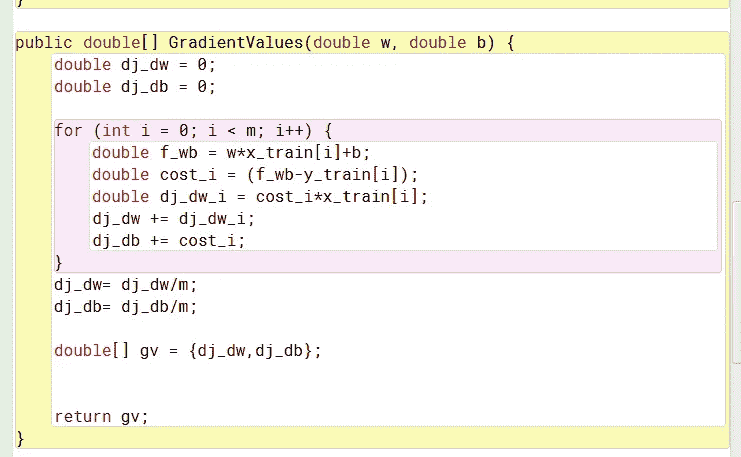**

**将 **dj_dw** 和 **dj_db** 初始化为 0。**

**创建一个 for 循环，就像前面的方法一样，它将运行 m 次。**

****f_wb** = w*x_train[i] + b 得到预测值或ŷ.**

****cost_i** 获得ŷ和目标值之间的差异(y)。**

****dj_dw_i** 将给出成本函数 J 相对于参数 w 的导数(因为它乘以 x_train[i])，而我们可以只使用**成本 _i** 作为成本函数 J 相对于参数 b 的导数。**

**然后，我们可以将这些值分别添加到 dj_dw 和 dj_db 中。**

**一旦我们脱离了循环，我们就可以像等式中那样将其乘以(1/m)。**

**然后，我将创建一个 double 类型的数组 **gv** ，在其中存储 **dj_dw** 和 **dj_db** ，并返回 **gv** ，以便稍后可以使用这些值。**

**接下来，方法 *GradientFinal* 返回一个 double 类型的数组，带有参数 int *inters* (迭代次数)和 *alpha* (学习速率)。**

**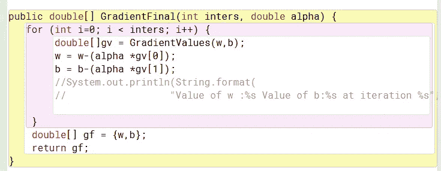**

**我们将从迭代 *inters* 乘以*的 for 循环开始。*在循环内部，我们将调用我们之前构造的方法 *GradientValues* 来获得成本函数 J 相对于之前存储在数组中的 w 和 b 的导数，并将它们赋给 gv。**

**我们现在将更新 w 和 b 的值，就像等式中一样。**

**w = w- (alpha * gv[0](存储在 **gv** 中的成本函数 J 相对于 w 的导数)**

**b= b- (alpha* gv[1](存储在 **gv** 中的成本函数 J 相对于 b 的导数)**

**在循环执行了 *inters* 次之后，让我们退出循环，然后将这些新更新的值存储在一个名为 **gf** 的新数组中，并将其返回**。****

**所以，我们做了所有这些工作，我们不确定是否一切都是正确的。让我们通过创建一个名为 **tester** 的新类来测试它。**

**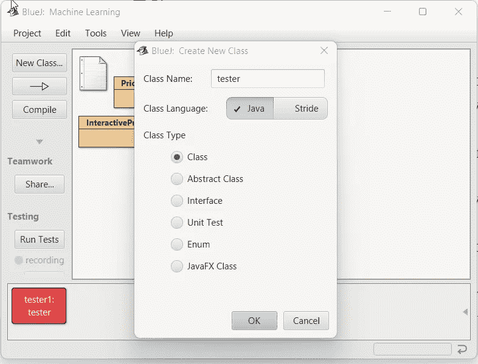**

**在这个类中，我创建了一个名为 testgf 的 void 方法:**

**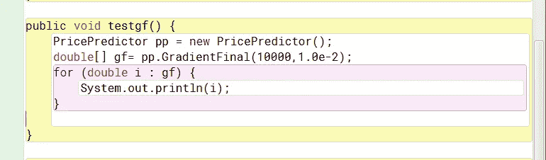**

**我将创建 PricePredictor 的一个新实例，调用 GradientFinal 方法，进行 10000 次迭代，学习率(alpha)为 1.0e-2 或大约 0.010。**

**然后，我将遍历数组 gf 中的每个值，以获得我们的线性回归模型的 w 和 b 的优化值，并将它们打印出来。**

**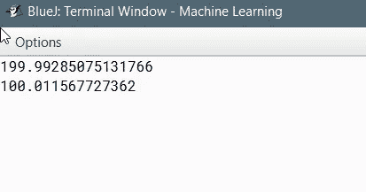**

**如您所见，经过 10000 次迭代后，w 的优化值大约为 199.992，b 的优化值大约为 100.0011。让我们把这些值代入我们的等式，看看我们是否能得到我们的目标输出。
f(x)= w * x+b
300 = w *(1.0)+b>>300 =(199.99)* 1+(100.011)= 300
500 = w *(2.0)+b>>500 =(199.99)* 2+(100.011)= 499.997(基本上 500**

**恭喜你！我们现在已经找到了 w 和 b 的值，这将使我们的线性回归模型非常适合数据。**

**最后，让我们创建一个将作为迷你程序运行的方法，并将所有这些概念放在一起:**

**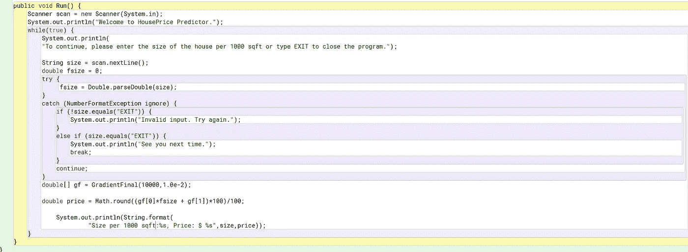**

**在这个程序中，我们将询问用户每 1000 平方英尺的房屋大小，调用 GradientFinal 来计算 w 和 b 的最佳值，插入这些值，预测房屋的价格，并将其打印出来。如果用户输入的不是数字，我们将显示一条错误消息，并允许用户再试一次。
让我们运行它，看看它看起来像什么:**

**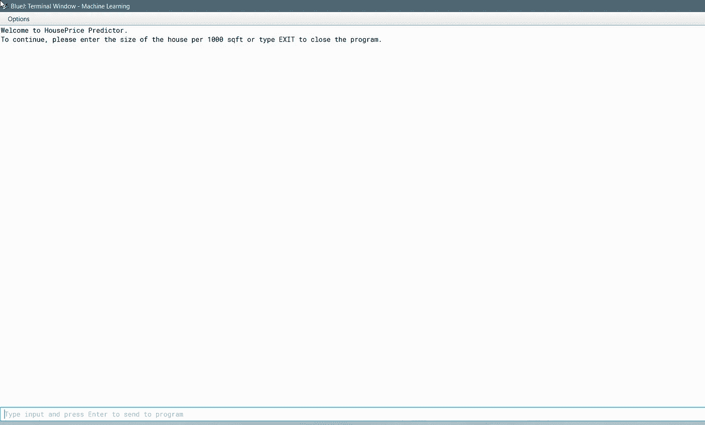**

**我将输入 1.2 作为我的尺寸，然后是 1 和 2(这是我们的目标值)。**

**如你所见，我们得到的预测价格是 340 美元。我们知道它是正确的，因为当我们输入 1 或 2 时，预测值确实与我们的目标值一致。**

**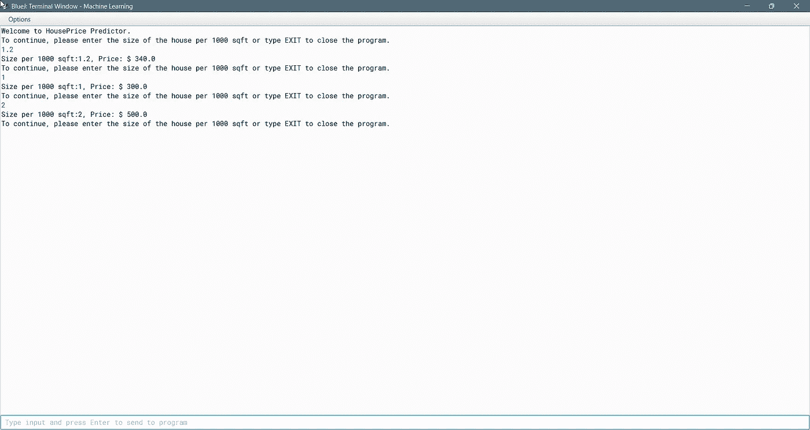**

**让我们尝试使用一些非数字字符:**

**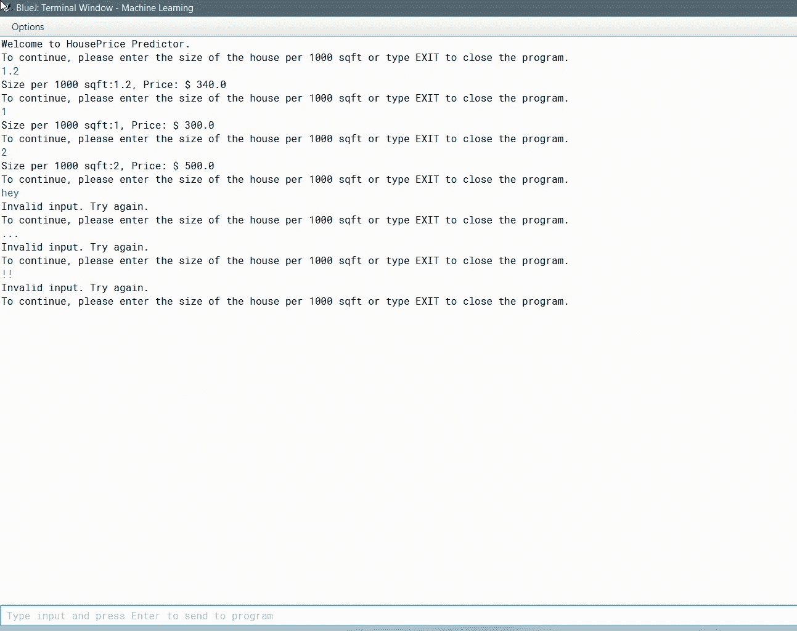**

**正如您所看到的，提示符只是按计划重新启动。现在让我们键入“exit”退出程序。**

**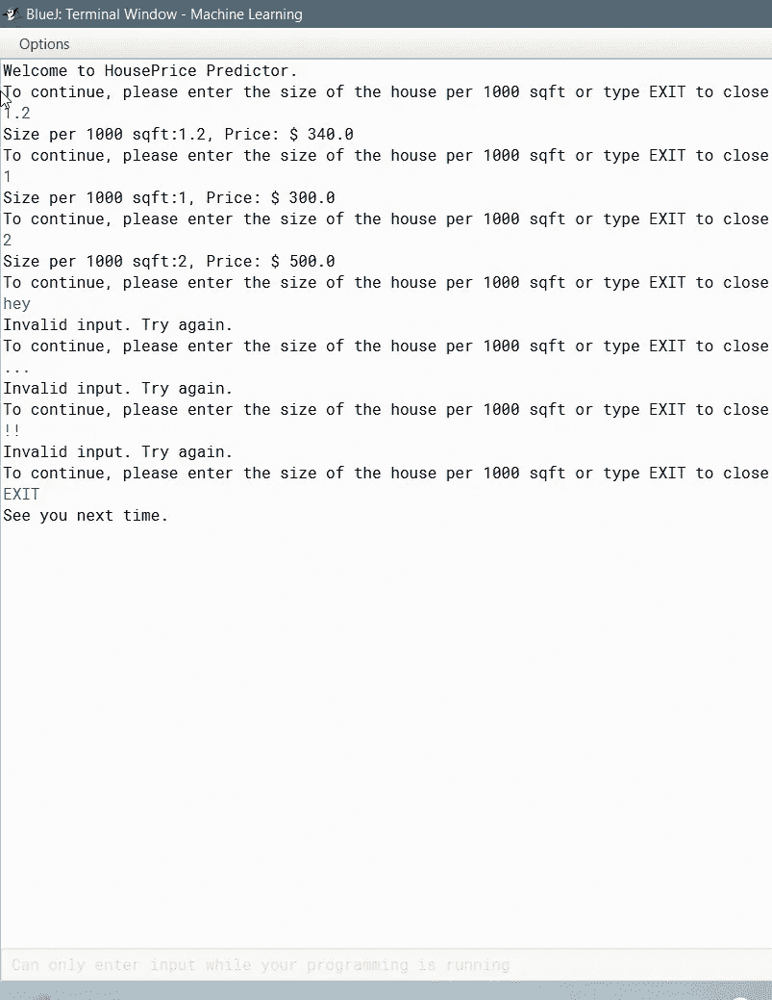**

**正如你所看到的，程序已经停止运行，我们得到一个“下次见”的消息。**

**恭喜你！您刚刚使用 Java 实现了一个单变量线性回归模型，根据面积来预测房价。**

**如果您想要一个更具预测性和适用性的模型，您必须修改代码，以便使用具有真实数据的训练集，并添加更多变量(浴室数量、地板等。)那会促成除了房子大小以外的最终定价。本教程只是展示了如何实现它的粗略轮廓。**

**为深度学习大声呐喊。人工智能和斯坦福创造了机器学习专业化。本教程深受其启发(尽管最初的课程使用 Python 而不是 Java)。**

**想了解更多？请访问:**

**[https://www . coursera . org/specializations/机器学习-简介](https://www.coursera.org/specializations/machine-learning-introduction)**