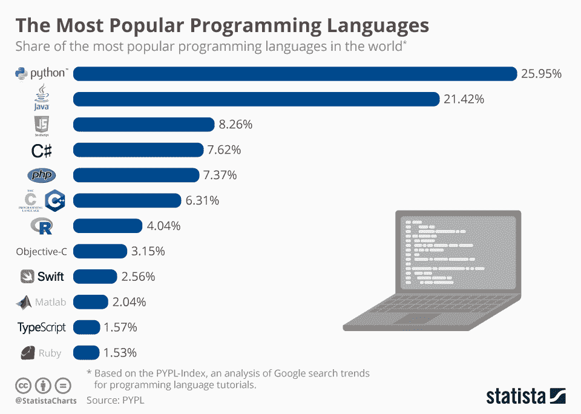

# 编码及其助手

> 原文：<https://medium.com/codex/coding-and-its-helping-hand-7ae8cc76ef3e?source=collection_archive---------27----------------------->

[编码](https://marblecomputer.com/a-brief-timeline-of-computer-programming-and-its-possible-future/)，所谓的未来，我们问题的解决方案，将继续让我们的日常生活变得更加轻松。

> “学习编码是任何人都可以做的最好的事情，以最大限度地利用我们面前的美好未来。”—马克·安德森，著名企业家、投资人、软件工程师。

你能想象一个 [AI](https://www.britannica.com/technology/artificial-intelligence) 版本的自己或者拥有知道别人在想什么的能力吗？这些现实将很快通过 [AI、](https://www.britannica.com/technology/artificial-intelligence)编码的诸多方面之一成为可能。

## 什么是编码，它有什么用处？

世界上许多人都想知道，“什么是编码？”简单来说，编码是一种编程或指导 IDE(一种编码环境)执行大量任务的方式。

代码正被用于在各种领域和职业中使生活变得更容易，更有效，对人们更好，例如，面对医疗问题。编码现在被用于许多新的发展。代码发展如此之快，以至于出现了许多独特的编码语言。每种语言都有不同的方式列出程序员如何执行代码的指令。这些年来，语言的数量呈指数增长。结果，编码工作的数量显著增加。

编码是一门新兴学科，许多人都应该学习。技术是未来，编码是它最大的伙伴。编码也被用来创建应用程序和有用的软件。你可以给每天都在使用的网站编码，比如 Youtube。编码有无限的可能性。

## **编码是怎么开始的，怎么流行起来的？**

有史以来第一种编码语言 Fortran 是由迄今为止最大的硬件和软件公司之一 IBM 的人设计的。Fortran 最初发布时非常流行。这种语言被用来做很多事情，但没有你用今天更简单更快的语言所能做的那么多。

虽然，同样的语言被许多美国宇航局的科学家使用！甚至在像 Fortran 这样著名的编码语言出现之前，有一种更流行的非官方语言叫做 Auto-code。

大多数人认为阿达·洛芙莱斯是第一位计算机程序员，她是著名诗人拜伦的女儿。这几乎比 Fortran 时代早了一个世纪。仅仅一年后，其他人都在争先恐后地创造新的编码语言。快进一点，我们现在有超过 9000 种语言，几乎有无限的可能性；事实上，编码不断显示出总有更多的事情要做。

## 能够编码的原始资源有哪些？

在只有几种编码语言的时代，很难找到一种用于编码的设备。即使你做了，它也是巨大的，不可移植的，并且很难操作。现在，甚至大多数孩子都有某种可以在线编码或下载许多编码应用的设备。在那个年代做编程的很多编码员肯定不是这样。在当今世界，几乎任何人都可以获得的资源使得编码变得极其容易。像著名的程序员和商人比尔·盖茨这样的人不得不用这些有限的资源来编码。许多人认为，如果新一代人不得不在这种情况下编码，他们就找不到打印一个简单语句的方法。

## **有哪些流行的编码语言**

有许多编码语言，但是它们中的许多还没有流行到可以使用的程度。像 python 一样，它很容易学习，你可以做大量不同的事情，特别是大量的数据分析。Javascript/Java(用于许多游戏开发)被用来创建有史以来最受欢迎的视频游戏《《我的世界》》。

编码语言、HTML 和 CSS 也常用于 web 开发编码。python 中的模块对 web 开发非常有用，并创造了一些当今最著名的网站，如 Instagram 和 Spotify。大多数从 Python，或者 JavaScript 和 HTML 中的简单模块开始。一些更流行和更有挑战性的语言是 C++、LISP 和 C#。

现在，你知道流行的编码语言和不同时期可用的平均资源，它是如何开始的，最重要的是，什么是编码！既然任何人都可以开始编码，帮助我们的未来，为什么不能是你？你可以有所作为。你可以让世界变得更好，你可以成为一名编码员。谁知道呢，你甚至可能对我们的世界产生模范影响！

*Samar Bhowmick(*[*@ Samar syntax*](https://www.tiktok.com/@samarsyntax)*)是一名中学生，喜欢编写代码、解决复杂的挑战，并使用编程技能让这个世界充满乐趣。所有观点都是我自己的。*