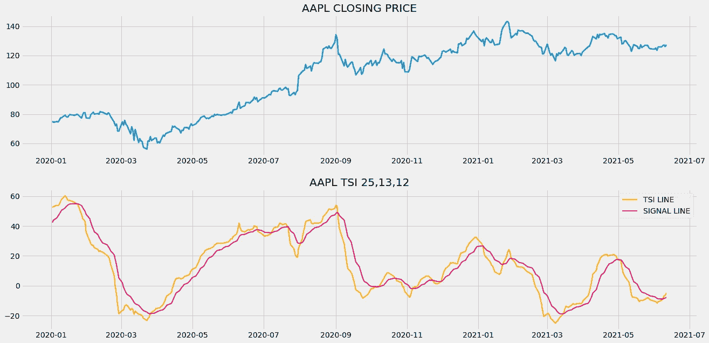
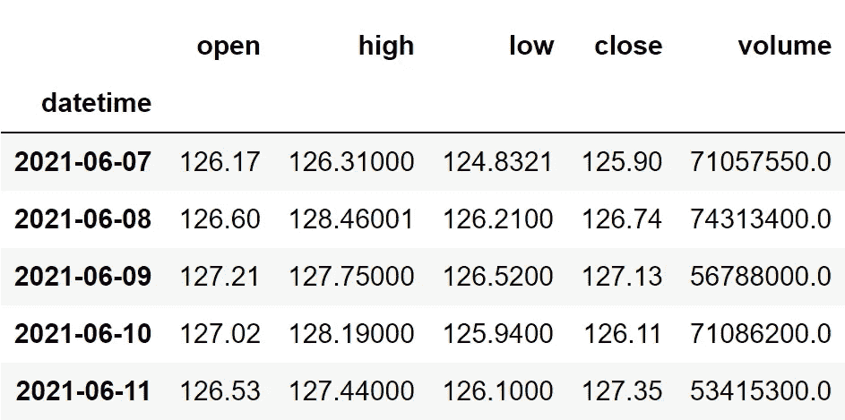
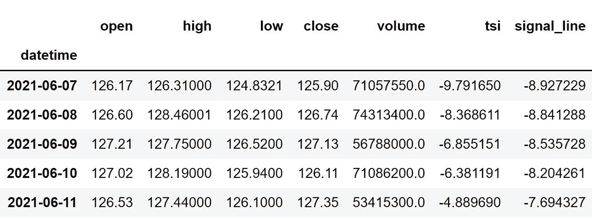
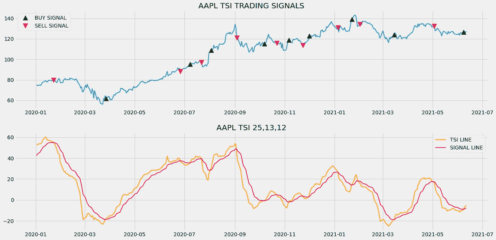
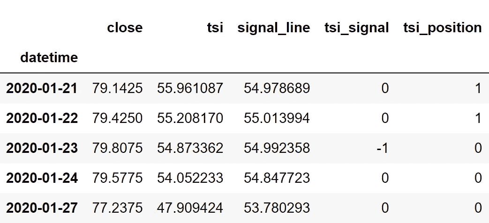

# 用 Python 编写真实力量指数代码和回测交易策略

> 原文：<https://medium.com/codex/coding-the-true-strength-index-and-backtesting-a-trading-strategy-in-python-24cb24b796be?source=collection_archive---------0----------------------->

## 在 python 中实现强大指标和交易策略的完整过程，以便在市场中进行更好的交易


照片由 [JJ 英](https://unsplash.com/@jjying?utm_source=medium&utm_medium=referral)在 [Unsplash](https://unsplash.com?utm_source=medium&utm_medium=referral)

有一个领域存在着奇特的技术指标，如相对强弱指数、随机振荡器、MACD 等。，我们今天要讨论的指标肯定会添加到这个列表中，因为它的性能超过了上述指标。这就是真正的力量指数，简称 TSI。

在本文中，我们将首先建立一些关于该指标的基本直觉，以及它是如何计算的或其背后的数学。然后，我们将进入编程部分，在这里我们将使用 Python 从头构建指标，构建交易策略，对策略进行回溯测试，并将结果与 SPY ETF(一种专门用于跟踪标准普尔 500 市场指数运动的 ETF)的结果进行比较。事不宜迟，让我们跳入文章吧！

在继续之前，如果你想在没有任何代码的情况下回溯测试你的交易策略，有一个解决方案。这是[的后验区](https://www.backtestzone.com/)。这是一个平台，可以免费对不同类型的可交易资产的任意数量的交易策略进行回溯测试，无需编码。点击这里的链接，你可以马上使用这个工具:[https://www.backtestzone.com/](https://www.backtestzone.com/)

# 真实强度指数

真实力量指数(TSI)是一个动量振荡器，主要由交易者用来确定市场是向上还是向下的动量，并随之交易。它还用于识别市场的当前状态，超买或超卖，但这不是该指标的主要优势。真实强度指数由两部分组成:

*   TSI 线:第一部分是 TSI 线本身，通过首先确定实际价格变化(当前收盘价减去前一收盘价)和绝对价格变化(实际价格变化的绝对值)来计算。然后，实际价格变化和绝对价格变化都采用周期数为 25 的均线(多头)。然后这两个 EMA 被 13 天的指数移动平均线平滑。用两个 EMA 平滑数据序列的过程称为双重平滑，这样做的目的是消除数据中的噪声。现在，双重平滑的实际价格变化除以双重平滑的绝对价格变化，然后乘以 100，以获得 TSI 线的读数。请注意，我们考虑的参数(25，13)是典型设置，但可以相应调整。计算可能很模糊，但如果我们以公式或图示的形式来解释，就很容易理解:

```
**TSI LINE** = [ **DS. ACTUAL PC** / **DS. ABSOLUTE PC** ] * **100**where,**DS. ACTUAL PC** = Double smoothed actual price change with the length of 25 and 13**DS. ABSOLUTE PC** = Double smoothed absolute price change with the length of 25 and 13
```

*   信号线:下一个组件是信号线组件，它只是 TSI 在指定周期数(在 7 到 12 个周期内)的指数移动平均值。大多数交易者喜欢日交易周期接近 7，长期投资周期接近 12。在本文中，我们将周期数定为 12，因为我们将处理每日时间段的股票数据，而不是分钟时间段的数据。该计算可以表示如下:

```
**SIGNAL LINE** = **EXP.MA 13** [ **TSI LINE** ]
```

这就是该指标的全部内容及其背后的数学原理。现在，让我们分析一个图表，其中真实力量指数的读数与苹果的收盘价数据一起绘制，以建立对该指标及其工作方式的更多理解。



作者图片

上面的图表分为两个面板:上面的面板显示了苹果公司的收盘价数据，下面的面板显示了 TSI 的成分读数。正如我之前所说，TSI 主要用于发现市场的动力，这可以在图表中清楚地看到，TSI 读数高于正区域(大于零)直接表明市场处于上升势头，低于负区域表明市场处于下降势头。

现在，让我们看看 TSI 如何被用来确定市场是处于超买还是超卖的状态。通常，像 RSI 这样的指标有一个超买和超卖水平的标准阈值，分别是 70 和 30，这些阈值适用于任何可交易的资产。然而，在使用真实力量指数时，超买和超卖的水平因资产而异，在我们的情况下，我们可以认为-10 是超卖水平，10 是超买水平。但是，它不会像其他流行的动量振荡器那样有效。

说到交易策略，据我所知，我们可以根据真正的实力指数运用三种策略。第一个是超买和超卖水平。这是动量振荡器中最常见的策略，每当 TSI 的成分低于超卖水平时，就会显示买入信号，每当两个成分的读数都高于超买水平时，就会产生卖出信号。我个人不使用这种策略，因为我相信真正的力量指数没有超买和超卖的概念。

第二个交易策略是零线交叉，当 TSI 的成分从零以下交叉到零以上时，显示买入信号，同样，当 TSI 的成分从零以上交叉时，显示卖出信号。这个策略是有效的，但不如我们将要讨论的下一个交易策略有效。

最后一个交易策略，也是我们将在本文中实施的策略是信号线交叉，每当 TSI 线从信号线的下方交叉到上方时，它显示买入信号，同样，每当 TSI 线从信号线的上方交叉到下方时，它显示卖出信号。这种策略是最常用的交易策略之一，同时使用真正的力量指数，因为它在市场上的效率。这种交易策略可以表示如下:

```
IF **PREV.TLINE** < **PREV.SLINE** AND **CUR.TLINE** > **CUR.SLINE** ==> **BUY SIGNAL**
IF **PREV.TLINE** > **PREV.SLINE** AND **CUR.TLINE** < **CUR.SLINE** ==> **SELL SIGNAL**
```

就是这样！这就结束了我们关于真实强度指数的理论部分。现在让我们继续编程，我们将首先使用 Python 从头构建指标，构建信号线交叉交易策略，对苹果股票数据进行回溯测试，并将结果与 SPY ETF 的结果进行比较。来做点编码吧！在继续之前，关于免责声明的一个注意事项:本文的唯一目的是教育人们，必须被视为一个信息，而不是投资建议等。

# 用 Python 实现

编码部分分为以下几个步骤:

```
**1\. Importing Packages
2\. Extracting Stock Data from Twelve Data
3\. True Strength Index Calculation
4\. Creating the Signal line crossover Trading Strategy
5\. Plotting the Trading Lists
6\. Creating our Position
7\. Backtesting
8\. SPY ETF Comparison**
```

我们将按照上面列表中提到的顺序，系好安全带，跟随每一个即将到来的编码部分。

# 步骤 1:导入包

将所需的包导入 python 环境是一个不可跳过的步骤。主要的包是处理数据的 Pandas，处理数组和复杂函数的 NumPy，用于绘图的 Matplotlib，以及进行 API 调用的请求。二级包是数学函数的 Math 和字体定制的 Termcolor(可选)。

**Python 实现:**

```
**# IMPORTING PACKAGES** 
import pandas as pd
import requests
import matplotlib.pyplot as plt
import numpy as np
from math import floor
from termcolor import colored as cl

plt.style.use('fivethirtyeight')
plt.rcParams['figure.figsize'] = (20,10)
```

现在我们已经将所有需要的包导入到 python 中。我们用十二数据的 API 端点来拉一下苹果的历史数据。

## 步骤 2:从 12 个数据中提取数据

在这一步，我们将使用由[twelvedata.com](https://twelvedata.com/)提供的 API 端点提取苹果的历史股票数据。在此之前，请注意 twelvedata.com:十二数据公司是领先的市场数据提供商之一，拥有大量各种市场数据的 API 端点。它非常容易与十二数据提供的 API 进行交互，并且拥有有史以来最好的文档。此外，确保你有一个 twelvedata.com[的账户，只有这样，你才能访问你的 API 密匙(用 API 提取数据的重要元素)。](https://twelvedata.com/)

**Python 实现:**

```
**# EXTRACTING STOCK DATA** 
def get_historical_data(symbol, start_date):
    api_key = 'YOUR API KEY'
    api_url = f'https://api.twelvedata.com/time_series?symbol={symbol}&interval=1day&outputsize=5000&apikey={api_key}'
    raw_df = requests.get(api_url).json()
    df = pd.DataFrame(raw_df['values']).iloc[::-1].set_index('datetime').astype(float)
    df = df[df.index >= start_date]
    df.index = pd.to_datetime(df.index)
    return df

aapl = get_historical_data('AAPL', '2019-01-01')
aapl.tail()
```

**输出:**



作者图片

**代码解释:**我们做的第一件事是定义一个名为‘get _ historical _ data’的函数，该函数将股票的符号(‘symbol’)和历史数据的起始日期(‘start _ date’)作为参数。在函数内部，我们定义了 API 键和 URL，并将它们存储到各自的变量中。接下来，我们使用“get”函数提取 JSON 格式的历史数据，并将其存储到“raw_df”变量中。在对原始 JSON 数据进行清理和格式化之后，我们将以干净的 Pandas 数据帧的形式返回它。最后，我们正在调用创建的函数来提取苹果从 2019 年开始的历史数据，并将其存储到‘AAPL’变量中。

## 步骤 3:真实强度指数计算

在这一步中，我们将按照之前讨论的方法和公式计算真实强度指数的组成部分。

**Python 实现:**

```
**# TRUE STRENGTH INDEX CALCULATION** 
def get_tsi(close, long, short, signal):
    diff = close - close.shift(1)
    abs_diff = abs(diff)

    diff_smoothed = diff.ewm(span = long, adjust = False).mean()
    diff_double_smoothed = diff_smoothed.ewm(span = short, adjust = False).mean()
    abs_diff_smoothed = abs_diff.ewm(span = long, adjust = False).mean()
    abs_diff_double_smoothed = abs_diff_smoothed.ewm(span = short, adjust = False).mean()

    tsi = (diff_double_smoothed / abs_diff_double_smoothed) * 100
    signal = tsi.ewm(span = signal, adjust = False).mean()
    tsi = tsi[tsi.index >= '2020-01-01'].dropna()
    signal = signal[signal.index >= '2020-01-01'].dropna()

    return tsi, signal

aapl['tsi'], aapl['signal_line'] = get_tsi(aapl['close'], 25, 13, 12)
aapl = aapl[aapl.index >= '2020-01-01']
aapl.tail()
```

**输出:**



作者图片

**代码解释:**首先，我们定义一个名为“get_tsi”的函数，它将股票的收盘价数据(“close”)、长均线的回望期(“long”)、短均线的回望期(“short”)和信号线的回望期(“signal”)作为参数。在函数内部，我们首先计算实际价格变化(' diff ')和绝对价格变化(' abs_diff ')并将其存储到各自的变量中。

然后，使用 Pandas 软件包提供的“ewm”函数来确定指数移动平均值，我们对之前计算的价格变化进行双重平滑，以获得双重平滑的实际价格变化(“diff_double_smoothed”)和双重平滑的绝对价格变化(“abs_diff_double_smoothed”)。

然后，我们将双平滑值代入 TSI 线的公式，以确定其读数。为了计算信号线的值，我们采用特定周期数的已确定 TSI 线读数的 EMA。最后，我们将返回计算出的组件，并调用创建的函数来存储 Apple 的 TSI 组件的值。

## 步骤 4:创建交易策略

这一步，我们要用 python 实现讨论过的真实力指标信号线交叉交易策略。

**Python 实现:**

```
**# TRUE STRENGTH INDEX STRATEGY** 
def implement_tsi_strategy(prices, tsi, signal_line):
    buy_price = []
    sell_price = []
    tsi_signal = []
    signal = 0

    for i in range(len(prices)):
        if tsi[i-1] < signal_line[i-1] and tsi[i] > signal_line[i]:
            if signal != 1:
                buy_price.append(prices[i])
                sell_price.append(np.nan)
                signal = 1
                tsi_signal.append(signal)
            else:
                buy_price.append(np.nan)
                sell_price.append(np.nan)
                tsi_signal.append(0)
        elif tsi[i-1] > signal_line[i-1] and tsi[i] < signal_line[i]:
            if signal != -1:
                buy_price.append(np.nan)
                sell_price.append(prices[i])
                signal = -1
                tsi_signal.append(signal)
            else:
                buy_price.append(np.nan)
                sell_price.append(np.nan)
                tsi_signal.append(0)
        else:
            buy_price.append(np.nan)
            sell_price.append(np.nan)
            tsi_signal.append(0)

    return buy_price, sell_price, tsi_signal

buy_price, sell_price, tsi_signal = implement_tsi_strategy(aapl['close'], aapl['tsi'], aapl['signal_line'])
```

**代码解释:**首先，我们定义一个名为‘implement _ TSI _ strategy’的函数，它将股票价格(‘prices’)和真实强度指数的成分(‘TSI’，‘signal _ line’)作为参数。

在该函数中，我们创建了三个空列表(buy_price、sell_price 和 tsi_signal ),在创建交易策略时，将在这些列表中追加值。

之后，我们通过 for 循环实施交易策略。在 for 循环内部，我们传递某些条件，如果条件得到满足，相应的值将被追加到空列表中。如果购买股票的条件得到满足，买入价将被追加到“buy_price”列表中，信号值将被追加为 1，表示购买股票。类似地，如果卖出股票的条件得到满足，卖价将被追加到“sell_price”列表中，信号值将被追加为-1，表示卖出股票。

最后，我们返回附加了值的列表。然后，我们调用创建的函数并将值存储到各自的变量中。除非我们画出这些值，否则这个列表没有任何意义。所以，让我们画出创建的交易列表的值。

## 第五步:绘制交易信号

在这一步，我们将绘制已创建的交易列表，以使它们有意义。

**Python 实现:**

```
**# TRUE STRENGTH INDEX TRADING SIGNALS PLOT** 
ax1 = plt.subplot2grid((11,1), (0,0), rowspan = 5, colspan = 1)
ax2 = plt.subplot2grid((11,1), (6,0), rowspan = 5, colspan = 1)
ax1.plot(aapl['close'], linewidth = 2)
ax1.plot(aapl.index, buy_price, marker = '^', markersize = 12, color = 'green', linewidth = 0, label = 'BUY SIGNAL')
ax1.plot(aapl.index, sell_price, marker = 'v', markersize = 12, color = 'r', linewidth = 0, label = 'SELL SIGNAL')
ax1.legend()
ax1.set_title('AAPL TSI TRADING SIGNALS')
ax2.plot(aapl['tsi'], linewidth = 2, color = 'orange', label = 'TSI LINE')
ax2.plot(aapl['signal_line'], linewidth = 2, color = '#FF006E', label = 'SIGNAL LINE')
ax2.set_title('AAPL TSI 25,13,12')
ax2.legend()
plt.show()
```

**输出:**



作者图片

**代码解释:**我们在绘制真实力量指数的成分，以及信号线交叉交易策略产生的买入和卖出信号。我们可以观察到，每当 TSI 线的前一个读数低于信号线的前一个读数，而 TSI 线的当前读数高于信号线的当前读数时，就会在图表中绘制绿色的买入信号。类似地，只要 TSI 线的前一个读数高于信号线的前一个读数，而 TSI 线的当前读数低于信号线的当前读数，图表中就会出现红色的卖出信号。

## 步骤 6:创建我们的职位

在这一步中，我们将创建一个列表，如果我们持有股票，该列表将指示 1；如果我们不拥有或持有股票，该列表将指示 0。

**Python 实现:**

```
**# STOCK POSITION** 
position = []
for i in range(len(tsi_signal)):
    if tsi_signal[i] > 1:
        position.append(0)
    else:
        position.append(1)

for i in range(len(aapl['close'])):
    if tsi_signal[i] == 1:
        position[i] = 1
    elif tsi_signal[i] == -1:
        position[i] = 0
    else:
        position[i] = position[i-1]

close_price = aapl['close']
tsi = aapl['tsi']
signal_line = aapl['signal_line']
tsi_signal = pd.DataFrame(tsi_signal).rename(columns = {0:'tsi_signal'}).set_index(aapl.index)
position = pd.DataFrame(position).rename(columns = {0:'tsi_position'}).set_index(aapl.index)

frames = [close_price, tsi, signal_line, tsi_signal, position]
strategy = pd.concat(frames, join = 'inner', axis = 1)

strategy
```

**输出:**



作者图片

**代码解释:**首先，我们创建一个名为‘position’的空列表。我们传递两个 for 循环，一个是为“位置”列表生成值，以匹配“信号”列表的长度。另一个 for 循环是我们用来生成实际位置值的循环。在第二个 for 循环中，我们对“signal”列表的值进行迭代，而“position”列表的值被附加到满足哪个条件上。如果我们持有股票，头寸的价值仍为 1；如果我们卖出或不持有股票，头寸的价值仍为 0。最后，我们正在进行一些数据操作，将所有创建的列表合并到一个数据帧中。

从显示的输出中，我们可以看到，在前两行中，我们在股票中的位置保持为 1(因为真实强度指数信号没有任何变化)，但是当真实强度指数交易信号代表卖出信号(-1)时，我们的位置突然变为-1。我们的头寸将保持为 0，直到交易信号发生一些变化。现在是时候实现一些回溯测试过程了！

## 步骤 7:回溯测试

在继续之前，有必要知道什么是回溯测试。回溯测试是查看我们的交易策略在给定股票数据上表现如何的过程。在我们的例子中，我们将对苹果股票数据的真实实力指数交易策略实施回溯测试过程。

**Python 实现:**

```
**# BACKTESTING** 
aapl_ret = pd.DataFrame(np.diff(aapl['close'])).rename(columns = {0:'returns'})
tsi_strategy_ret = []

for i in range(len(aapl_ret)):
    returns = aapl_ret['returns'][i]*strategy['tsi_position'][i]
    tsi_strategy_ret.append(returns)

tsi_strategy_ret_df = pd.DataFrame(tsi_strategy_ret).rename(columns = {0:'tsi_returns'})
investment_value = 100000
number_of_stocks = floor(investment_value/aapl['close'][0])
tsi_investment_ret = []

for i in range(len(tsi_strategy_ret_df['tsi_returns'])):
    returns = number_of_stocks*tsi_strategy_ret_df['tsi_returns'][i]
    tsi_investment_ret.append(returns)

tsi_investment_ret_df = pd.DataFrame(tsi_investment_ret).rename(columns = {0:'investment_returns'})
total_investment_ret = round(sum(tsi_investment_ret_df['investment_returns']), 2)
profit_percentage = floor((total_investment_ret/investment_value)*100)
print(cl('Profit gained from the tsi strategy by investing $100k in AAPL : {}'.format(total_investment_ret), attrs = ['bold']))
print(cl('Profit percentage of the tsi strategy : {}%'.format(profit_percentage), attrs = ['bold']))
```

**输出:**

```
**Profit gained from the tsi strategy by investing $100k in AAPL : 71095.33**
**Profit percentage of the tsi strategy : 71%**
```

**代码解释:**首先，我们使用 NumPy 包提供的‘diff’函数计算苹果股票的回报，并将其作为数据帧存储到‘AAPL _ ret’变量中。接下来，我们传递一个 for 循环来迭代' aapl_ret '变量的值，以计算我们从 TSI 交易策略中获得的回报，这些回报值被附加到' tsi_strategy_ret '列表中。接下来，我们将“tsi_strategy_ret”列表转换为数据帧，并将其存储到“tsi_strategy_ret_df”变量中。

接下来是回溯测试过程。我们将通过投资 10 万美元到我们的交易策略中来回测我们的策略。首先，我们将投资金额存储到“投资值”变量中。之后，我们正在计算使用投资金额可以购买的苹果股票数量。你可以注意到，我使用了 Math 软件包提供的“floor”函数，因为当投资金额除以苹果股票的收盘价时，它会输出一个十进制数。股票数量应该是整数，而不是小数。使用“底数”函数，我们可以去掉小数。请记住,“floor”函数比“round”函数要复杂得多。然后，我们传递一个 for 循环来查找投资回报，后面是一些数据操作任务。

最后，我们打印了我们通过投资 10 万到我们的交易策略中得到的总回报，并且显示我们在一年中获得了大约 71，000 美元的利润。那还不错！现在，让我们将我们的回报与 SPY ETF(一种旨在跟踪标准普尔 500 股票市场指数的 ETF)的回报进行比较。

## 第八步:间谍 ETF 对比

这一步是可选的，但强烈推荐，因为我们可以了解我们的交易策略相对于基准(间谍 ETF)的表现如何。在这一步，我们将使用我们创建的“get_historical_data”函数提取 SPY ETF 数据，并将我们从 SPY ETF 获得的回报与我们在 Apple 上的 TSI 信号线交叉交易策略回报进行比较。

你可能已经注意到，在我所有的算法交易文章中，我没有将策略结果与标准普尔 500 市场指数本身进行比较，而是与 SPY ETF 进行比较，这是因为大多数股票数据提供商(如 12 Data)不提供标准普尔 500 指数数据。所以，我别无选择，只能选择间谍 ETF。如果你有幸得到标准普尔 500 市场指数数据，建议用它来做比较，而不是任何 ETF。

**Python 实现:**

```
**# SPY ETF COMPARISON** 
def get_benchmark(start_date, investment_value):
    spy = get_historical_data('SPY', start_date)['close']
    benchmark = pd.DataFrame(np.diff(spy)).rename(columns = {0:'benchmark_returns'})

    investment_value = investment_value
    number_of_stocks = floor(investment_value/spy[-1])
    benchmark_investment_ret = []

    for i in range(len(benchmark['benchmark_returns'])):
        returns = number_of_stocks*benchmark['benchmark_returns'][i]
        benchmark_investment_ret.append(returns)

    benchmark_investment_ret_df = pd.DataFrame(benchmark_investment_ret).rename(columns = {0:'investment_returns'})
    return benchmark_investment_ret_df

benchmark = get_benchmark('2020-01-01', 100000)
investment_value = 100000
total_benchmark_investment_ret = round(sum(benchmark['investment_returns']), 2)
benchmark_profit_percentage = floor((total_benchmark_investment_ret/investment_value)*100)
print(cl('Benchmark profit by investing $100k : {}'.format(total_benchmark_investment_ret), attrs = ['bold']))
print(cl('Benchmark Profit percentage : {}%'.format(benchmark_profit_percentage), attrs = ['bold']))
print(cl('TSI Strategy profit is {}% higher than the Benchmark Profit'.format(profit_percentage - benchmark_profit_percentage), attrs = ['bold']))
```

**输出:**

```
**Benchmark profit by investing $100k : 23370.75**
**Benchmark Profit percentage : 23%**
**TSI Strategy profit is 48% higher than the Benchmark Profit**
```

**代码解释:**这一步中使用的代码几乎与前一个回溯测试步骤中使用的代码相似，但我们不是投资苹果，而是通过不实施任何交易策略来投资 SPY ETF。从输出可以看出，我们的真实力指数信号线交叉交易策略已经跑赢了 SPY ETF 48%。太好了！

# 最后的想法！

在经历了压倒性的理论和编程过程后，我们已经成功地了解了真正的实力指数是什么，指标背后的数学原理，以及基于它的盈利交易策略的实施。尽管我们成功超越了间谍 ETF 的业绩，但我们仍落后于一个特定领域。

在本文中，我们的算法在所有交易中买入和卖出相同数量的股票，但在现实世界中交易时，这不是一个最佳决策，因为它是任意的，这就是头寸规模的概念发挥作用的地方。对于那些对这个概念没有概念的人来说，头寸规模是将我们投资组合的一部分分配给我们想要交易的特定股票的过程。我们可以做的是，我们可以部署一个头寸规模系统，评估每笔交易的风险，并相应地分配股票数量。这不仅能大幅提升业绩，还能防止我们面临意外损失。所以，我强烈建议你跟进这个概念，并尝试把它应用到交易策略中。

话虽如此，你已经到了文章的结尾。如果您忘记了遵循任何编码部分，不要担心。我在最后提供了完整的源代码。希望你能从这篇文章中学到一些新的有用的东西。

## 完整代码:

```
# IMPORTING PACKAGES

import pandas as pd
import requests
import matplotlib.pyplot as plt
import numpy as np
from math import floor
from termcolor import colored as cl

plt.style.use('fivethirtyeight')
plt.rcParams['figure.figsize'] = (20,10)

# EXTRACTING STOCK DATA

def get_historical_data(symbol, start_date):
    api_key = 'YOUR API KEY'
    api_url = f'https://api.twelvedata.com/time_series?symbol={symbol}&interval=1day&outputsize=5000&apikey={api_key}'
    raw_df = requests.get(api_url).json()
    df = pd.DataFrame(raw_df['values']).iloc[::-1].set_index('datetime').astype(float)
    df = df[df.index >= start_date]
    df.index = pd.to_datetime(df.index)
    return df

aapl = get_historical_data('AAPL', '2019-01-01')
aapl.tail()

# TRUE STRENGTH INDEX CALCULATION 

def get_tsi(close, long, short, signal):
    diff = close - close.shift(1)
    abs_diff = abs(diff)

    diff_smoothed = diff.ewm(span = long, adjust = False).mean()
    diff_double_smoothed = diff_smoothed.ewm(span = short, adjust = False).mean()
    abs_diff_smoothed = abs_diff.ewm(span = long, adjust = False).mean()
    abs_diff_double_smoothed = abs_diff_smoothed.ewm(span = short, adjust = False).mean()

    tsi = (diff_double_smoothed / abs_diff_double_smoothed) * 100
    signal = tsi.ewm(span = signal, adjust = False).mean()
    tsi = tsi[tsi.index >= '2020-01-01'].dropna()
    signal = signal[signal.index >= '2020-01-01'].dropna()

    return tsi, signal

aapl['tsi'], aapl['signal_line'] = get_tsi(aapl['close'], 25, 13, 12)
aapl = aapl[aapl.index >= '2020-01-01']
aapl.tail()

# TRUE STRENGTH INDEX PLOT

ax1 = plt.subplot2grid((11,1), (0,0), rowspan = 5, colspan = 1)
ax2 = plt.subplot2grid((11,1), (6,0), rowspan = 5, colspan = 1)
ax1.plot(aapl['close'], linewidth = 2.5)
ax1.set_title('AAPL CLOSING PRICE')
ax2.plot(aapl['tsi'], linewidth = 2, color = 'orange', label = 'TSI LINE')
ax2.plot(aapl['signal_line'], linewidth = 2, color = '#FF006E', label = 'SIGNAL LINE')
ax2.set_title('AAPL TSI 25,13,12')
ax2.legend()
plt.show()

# TRUE STRENGTH INDEX STRATEGY

def implement_tsi_strategy(prices, tsi, signal_line):
    buy_price = []
    sell_price = []
    tsi_signal = []
    signal = 0

    for i in range(len(prices)):
        if tsi[i-1] < signal_line[i-1] and tsi[i] > signal_line[i]:
            if signal != 1:
                buy_price.append(prices[i])
                sell_price.append(np.nan)
                signal = 1
                tsi_signal.append(signal)
            else:
                buy_price.append(np.nan)
                sell_price.append(np.nan)
                tsi_signal.append(0)
        elif tsi[i-1] > signal_line[i-1] and tsi[i] < signal_line[i]:
            if signal != -1:
                buy_price.append(np.nan)
                sell_price.append(prices[i])
                signal = -1
                tsi_signal.append(signal)
            else:
                buy_price.append(np.nan)
                sell_price.append(np.nan)
                tsi_signal.append(0)
        else:
            buy_price.append(np.nan)
            sell_price.append(np.nan)
            tsi_signal.append(0)

    return buy_price, sell_price, tsi_signal

buy_price, sell_price, tsi_signal = implement_tsi_strategy(aapl['close'], aapl['tsi'], aapl['signal_line'])

# TRUE STRENGTH INDEX TRADING SIGNALS PLOT

ax1 = plt.subplot2grid((11,1), (0,0), rowspan = 5, colspan = 1)
ax2 = plt.subplot2grid((11,1), (6,0), rowspan = 5, colspan = 1)
ax1.plot(aapl['close'], linewidth = 2)
ax1.plot(aapl.index, buy_price, marker = '^', markersize = 12, color = 'green', linewidth = 0, label = 'BUY SIGNAL')
ax1.plot(aapl.index, sell_price, marker = 'v', markersize = 12, color = 'r', linewidth = 0, label = 'SELL SIGNAL')
ax1.legend()
ax1.set_title('AAPL TSI TRADING SIGNALS')
ax2.plot(aapl['tsi'], linewidth = 2, color = 'orange', label = 'TSI LINE')
ax2.plot(aapl['signal_line'], linewidth = 2, color = '#FF006E', label = 'SIGNAL LINE')
ax2.set_title('AAPL TSI 25,13,12')
ax2.legend()
plt.show()

# STOCK POSITION

position = []
for i in range(len(tsi_signal)):
    if tsi_signal[i] > 1:
        position.append(0)
    else:
        position.append(1)

for i in range(len(aapl['close'])):
    if tsi_signal[i] == 1:
        position[i] = 1
    elif tsi_signal[i] == -1:
        position[i] = 0
    else:
        position[i] = position[i-1]

close_price = aapl['close']
tsi = aapl['tsi']
signal_line = aapl['signal_line']
tsi_signal = pd.DataFrame(tsi_signal).rename(columns = {0:'tsi_signal'}).set_index(aapl.index)
position = pd.DataFrame(position).rename(columns = {0:'tsi_position'}).set_index(aapl.index)

frames = [close_price, tsi, signal_line, tsi_signal, position]
strategy = pd.concat(frames, join = 'inner', axis = 1)

strategy
strategy[12:17]

# BACKTESTING

aapl_ret = pd.DataFrame(np.diff(aapl['close'])).rename(columns = {0:'returns'})
tsi_strategy_ret = []

for i in range(len(aapl_ret)):
    returns = aapl_ret['returns'][i]*strategy['tsi_position'][i]
    tsi_strategy_ret.append(returns)

tsi_strategy_ret_df = pd.DataFrame(tsi_strategy_ret).rename(columns = {0:'tsi_returns'})
investment_value = 100000
number_of_stocks = floor(investment_value/aapl['close'][0])
tsi_investment_ret = []

for i in range(len(tsi_strategy_ret_df['tsi_returns'])):
    returns = number_of_stocks*tsi_strategy_ret_df['tsi_returns'][i]
    tsi_investment_ret.append(returns)

tsi_investment_ret_df = pd.DataFrame(tsi_investment_ret).rename(columns = {0:'investment_returns'})
total_investment_ret = round(sum(tsi_investment_ret_df['investment_returns']), 2)
profit_percentage = floor((total_investment_ret/investment_value)*100)
print(cl('Profit gained from the tsi strategy by investing $100k in AAPL : {}'.format(total_investment_ret), attrs = ['bold']))
print(cl('Profit percentage of the tsi strategy : {}%'.format(profit_percentage), attrs = ['bold']))

# SPY ETF COMPARISON

def get_benchmark(start_date, investment_value):
    spy = get_historical_data('SPY', start_date)['close']
    benchmark = pd.DataFrame(np.diff(spy)).rename(columns = {0:'benchmark_returns'})

    investment_value = investment_value
    number_of_stocks = floor(investment_value/spy[-1])
    benchmark_investment_ret = []

    for i in range(len(benchmark['benchmark_returns'])):
        returns = number_of_stocks*benchmark['benchmark_returns'][i]
        benchmark_investment_ret.append(returns)

    benchmark_investment_ret_df = pd.DataFrame(benchmark_investment_ret).rename(columns = {0:'investment_returns'})
    return benchmark_investment_ret_df

benchmark = get_benchmark('2020-01-01', 100000)
investment_value = 100000
total_benchmark_investment_ret = round(sum(benchmark['investment_returns']), 2)
benchmark_profit_percentage = floor((total_benchmark_investment_ret/investment_value)*100)
print(cl('Benchmark profit by investing $100k : {}'.format(total_benchmark_investment_ret), attrs = ['bold']))
print(cl('Benchmark Profit percentage : {}%'.format(benchmark_profit_percentage), attrs = ['bold']))
print(cl('TSI Strategy profit is {}% higher than the Benchmark Profit'.format(profit_percentage - benchmark_profit_percentage), attrs = ['bold']))
```