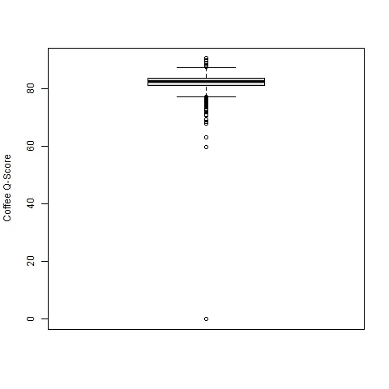
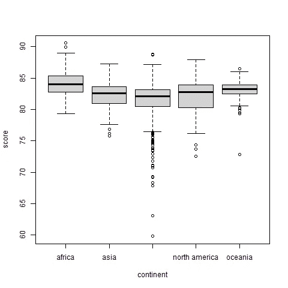
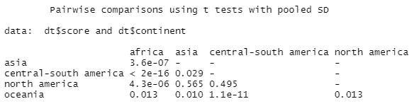
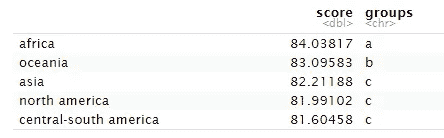

# 各大洲的咖啡质量

> 原文：<https://medium.com/codex/coffee-continents-and-quality-37fb318ba491?source=collection_archive---------32----------------------->

## 方差分析在咖啡 Q 值中的应用

丹尼尔·林肯在 [Unsplash](https://unsplash.com?utm_source=medium&utm_medium=referral) 上的照片

# 介绍

我曾经认为世界上有两种人:喝咖啡的人和悲伤的人。这种普遍的世界观引导我度过了大学的大部分时光，对我来说，这似乎是一个观察人的非常合理的视角。不过没过多久，我就意识到我的观点需要更多的细微差别。有悲伤的人，喝咖啡的人，和咖啡势利者。

这一发现是大学期间和毕业后在专业咖啡行业工作的结果。我可能不喜欢咖啡势利者这个词，但我绝对是一个。我在一家咖啡公司做过咖啡师、培训师和烘焙师，专注于轻度烘焙的单一产地咖啡。在那段时间里，我学到了很多关于咖啡的知识，从阅读烘焙简介到输入咖啡的冲泡参数。不过，我工作中最重要的一个方面是学习如何客观地衡量一杯咖啡的质量。

这是通过一个叫做拔罐的过程完成的。它包括对几种咖啡进行盲品，以评估不同的方面，如风味、香味、口感、甜度和酸度。目的是评估咖啡的质量，并给咖啡专业人士一个谈论他们产品的通用语言。烘焙师用它来评估烘焙批次和生咖啡本身，但它在咖啡送到烘焙师之前也起着重要的作用。在从原产国出口之前，咖啡会经过评估，并根据 10 个属性进行质量评分。分数范围从 0 到 100，任何高于 80 的分数都被认为是“专业”。

# 问题是

所有这一切的棘手之处在于，味觉是一种内在的主观体验。如果我给你一杯咖啡，而你讨厌它，你可能不会在意我是否告诉你这是一种极其稀有、昂贵、高分的咖啡。价值在于喝咖啡和咖啡因的主观体验，如果这种体验不愉快，你可能不会太在意其他的。

像大多数人一样，我倾向于对什么使咖啡“好”有强烈的感觉。我首先关注的是咖啡生长在哪个地区。与葡萄酒类似，风土在咖啡种植过程中起着非常重要的作用，不同的地区会产生不同的风味。各地区之间有很大的差异，但有一个广泛的共识，即某些种植区更有可能生产出具有某些特征的咖啡。这些地区可以大致分为中南美洲、非洲和东南亚。根据我的经验，我坚信一些国家生产的咖啡客观上比其他国家更好(平均而言),这是由于那里的土壤条件和种植的品种。

因此，我们知道有评估咖啡质量的标准化方法，味道是主观的，个人偏好在决定某人是否真的喜欢咖啡时会发挥很大的作用。我知道我倾向于更喜欢一些产区的咖啡。现在，如果有某种方法来测试种植区域是否真的影响质量就好了——事实证明，是有影响的！

# **数据**

我在 Kaggle 上找到了[这个数据集](https://www.kaggle.com/datasets/ankurchavda/coffee-beans-reviews-by-coffee-quality-institute)。它是从咖啡质量研究所收集来的，包含了许多有趣的变量，值得探索。然而，我只对质量和生长地区之间的关系感兴趣。如果我们看一下质量的箱线图，我们会得到一些有趣的结果。

我们的数据非常接近 80。我们得到了一些 80 以上的值，一些在 60-80 范围内。我们还在 0 左右得到一个观察值。根据该值有多低，我猜这是一个数据输入错误，我将在继续之前删除该值。通常我也会检查异常值，但在这种情况下我不会这样做，原因有二。这些数据围绕着一个小范围的值聚集在一起，我从经验中知道，如果我们从整体上看咖啡产量，我们在箱线图中看到的较低分数并不算低。

该数据集包含每种咖啡的原产地记录。然而，我有兴趣从整体上对质量和种植区域之间的关系有一个更高层次的了解。我编写了一个快速函数来修改数据，添加了一个*松散定义的“大陆”列，包含每个条目的增长区域。根据数据集中咖啡的来源，我最终得到了 5 个可能的选择:中南美洲、非洲、北美、东南亚和大洋洲。让我们来看看不同种植区域的质量细分:*

同样，我们的数据似乎没有很大的范围。中南美洲是个例外，它的一些表现不佳的咖啡拖累了它在这个数据集中的平均质量分数。每个区域都有异常值，但是它们都没有不切实际或令人担忧的值。我们可以看到所有五个区域的中位数都集中在 80 到 85 之间。如此相似的结果，如何判断是否有显著差异？

# 方差分析(ANOVA)

方差分析正是为此目的而存在的一种技术。它着眼于数据子集之间的均值差异，以确定数据中的差异发生在哪里。在这种情况下，我们希望根据分类特征(洲)预测一个定量变量(质量),这是非常理想的。这非常容易实现，应该能够告诉我们哪些地区生产最好的咖啡，以及每个群体之间的差异是否真的重要。

一旦方差分析模型适合数据，我们可以进行一些事后测试，看看我们学到了什么。有很多选项可供选择，但我喜欢使用成对 t 检验和邓肯多重范围检验(MRT)。我在下面包含了测试的输出。

成对 T 检验

t 检验显示了生长区域的每个组合之间的差异的 p 值。如果 p 值小于 0.05，这意味着两个区域之间没有有意义的差异的可能性只有 5%。例如，我们可以看到亚洲和非洲的咖啡质量有很大的差异，但是亚洲和北美的咖啡质量可能非常相似。

邓肯捷运

邓肯捷运提供了一些额外的见解。我们可以看到，非洲属于自己的一组，平均得分为 84，其次是大洋洲，平均得分为 83，然后是亚洲和美洲，平均得分在 81-82 之间。看起来咖啡的产地确实会影响质量！

# 解释结果

根据我们现有的数据和我们做的简要分析，看起来种植区域确实影响了咖啡的质量。自从我最喜欢的增长地区非洲拔得头筹后，我觉得自己特别有道理。然而，我不认为我们可以概括这些结果，甚至相信它们是具体的。有几个原因。

我们已经看到，在我们的数据集中，大部分品质值徘徊在 80 左右，但来自中美洲和南美洲的咖啡有一个更大的数值范围。当我在 R Studio 中进行分析时，我还注意到只有少数来自巴布亚新几内亚的作品，这是我们在大洋洲类别中唯一的国家。长话短说，我们没有可以从中得出结论的代表性数据样本。这个数据集不是由咖啡质量研究所策划和发布的——它是从网上刮来的，并由一个陌生人在互联网上发布到 Kaggle 上，所以我想我不能让我的期望太高。

另一个让我犹豫是否接受我们发现的因素是邓肯 MRT 的结果。根据我的经验，我本以为中南美洲的咖啡会有更高的平均质量分数，而大洋洲和亚洲的咖啡会被归为最后一类。测试结果与我的经验不符。这并不是说我的经验是正确的，数据是错误的，但结合上面列出的数据质量问题，这是不要轻信结果的另一个原因。

# 结论

那么我们能从中得出什么结论呢？鉴于我们确实发现了基于种植区域的质量统计上的显著差异，我认为我们可以暂时说种植区域确实影响质量。然而，由于我们的数据质量问题，我不认为我们可以对哪个地区生产最好的咖啡做出任何明确的断言。要做到这一点，我们需要更多的数据和更好的采样。在那之前，我们只能凭自己的偏见和偏好来决定哪个地区出产“最好”的咖啡。

不管你喜欢哪种咖啡，或者如果你是少数几个不喝咖啡也能正常工作的神秘人之一，感谢你花时间阅读这篇文章。现在你可能需要续杯了——这是你应得的。

艾萨克·本赫瑟德在 [Unsplash](https://unsplash.com?utm_source=medium&utm_medium=referral) 上的照片