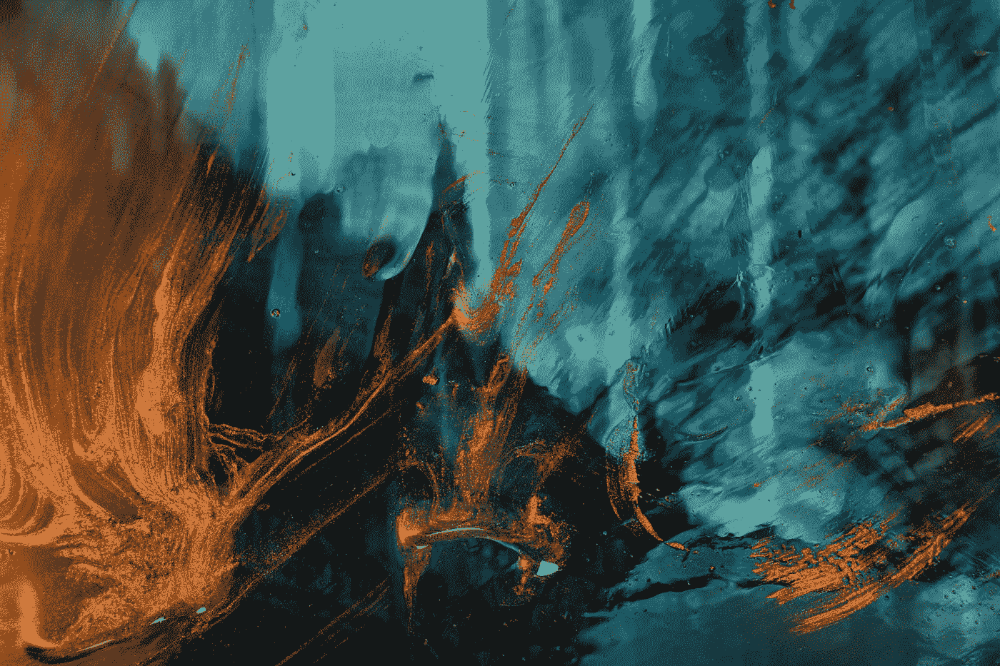

# 认知梦的模式，分析和解释梦的数据

> 原文：<https://medium.com/codex/cognitive-dream-patterns-analysis-and-interpretation-of-dream-data-dee136fc4cd1?source=collection_archive---------2----------------------->

## [法典](http://medium.com/codex)

梦是图像，情感和思想按顺序缝合在一起，有一个模式，可以分析和解释，对认知行为有用的见解。

[Jr Korpa](https://unsplash.com/@korpa?utm_source=medium&utm_medium=referral) 在 [Unsplash](https://unsplash.com?utm_source=medium&utm_medium=referral) 上的照片

认知梦模式的研究、分析和解释是有趣的领域，有助于人脑的认知分析…