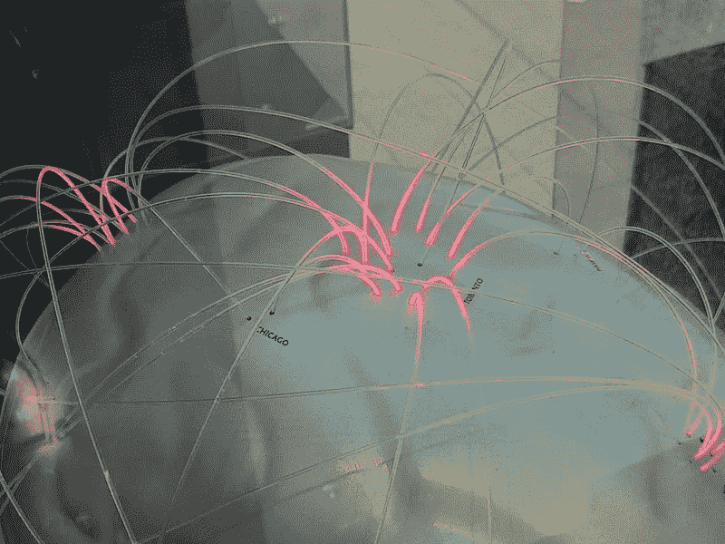

# 神经技术:精神健康中的思想混乱

> 原文：<https://medium.com/codex/cognitive-tech-mental-health-as-chaos-of-thoughts-70a8b3225eaa?source=collection_archive---------41----------------------->

脑艺术经由[莎伦·范德开](https://www.flickr.com/people/77662096@N06)，脑项目

有多少思想是可以控制的？为什么到目前为止，在神经科学、认知科学和相关领域的每种情况下，都没有自动和受控思维的近似度量？

在许多场景中，有些事情是被期待的，而思想会衡量这些事情——比如举起重物、集中注意力、做决策等等，但大多数时候，思想没有边界，按照它们的选择来指挥和驱动头脑。

思想的指挥中心是记忆。每一个想法都有力量到达一个目的地，产生感觉效果——快乐、孤独、恐惧等等。

自动和受控认知[在刚性和灵活性](https://www.ncbi.nlm.nih.gov/pmc/articles/PMC7909205/)上有所不同，但它们仍然取决于记忆所获取的内容。在一个地方，有些声音会自动引起在那里长大的人的恐慌，而在同一时间，这些声音对其他地方的人来说毫无意义。

自动是主观的。

记忆是如何挑选并给出想法的？主动思维和被动思维优于自动思维和受控思维。积极的想法是在任何时候头脑中最高注意力的想法。消极的想法是可以转变成积极想法的持续想法。

从理论上来说，正是由于[主动和被动思维](/mlearning-ai/ml-neuroscience-genetic-memory-thoughts-active-passive-5f0c55d08e62)，记忆决定了自动和受控思维。当一个感觉效果来自一个活跃的想法时，其他活跃的想法可能会去那个目的地，效果会一直存在，直到一个人移动它。

因为消极的想法是众多的，大多数自动过程停留在那里，持续到需要变得积极。多种感觉无时无刻不在出现，但是大多数感觉的思想等价物变成了被动的思想，在任何时刻，只有一种感觉获得了绝对的优先权——或者说是主动的。

一秒钟内活跃思想的交流可以说是造成精神健康混乱的原因。

思想涌现，记忆提供了一条高速公路，一个人的感觉，行为或假设，有时可能会难以承受。

大多数[的心灵干预](/codex/thought-pathway-of-ventral-tegmental-area-and-nucleus-accumbens-for-data-viz-of-addictions-93e59707cba7)——不管批准与否——都是为了增强被控制的思想。

那么为什么不寻求度量呢？

进步对精神护理意味着什么？在复杂的思维中，还有什么是在特定的方向上寻求的呢？

认知技术可以提供一条进入大脑思维路径的途径，从思维扭曲中提取所有可能的机会来控制思维，进行认知重构或重组。