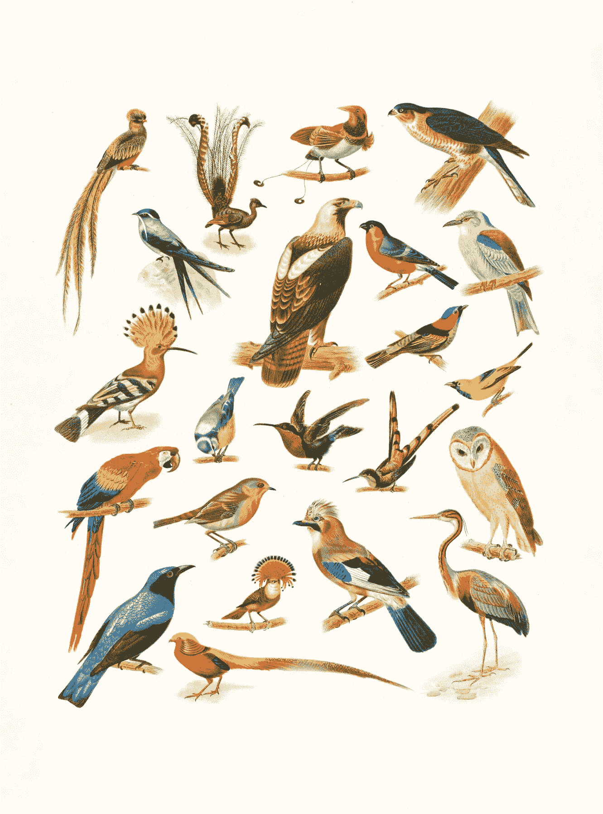

# 在 Python 中为机器学习收集图像数据

> 原文：<https://medium.com/codex/collecting-image-data-for-machine-learning-in-python-6334474d0e23?source=collection_archive---------4----------------------->

*如何使用 Flickr 生成结构合理的数据集*

由[波士顿公共图书馆](https://unsplash.com/@bostonpubliclibrary?utm_source=unsplash&utm_medium=referral&utm_content=creditCopyText)在 [Unsplash](https://unsplash.com/s/photos/bird-collage?utm_source=unsplash&utm_medium=referral&utm_content=creditCopyText) 上拍摄的照片

当我开始为我热爱羽毛朋友的岳父制作人工智能喂鸟器时，我遇到的最大问题之一不是像我天真地预期的那样训练或创建图像识别模型。相反，它收集了足够多的高质量数据，并以功能性的方式进行了格式化。