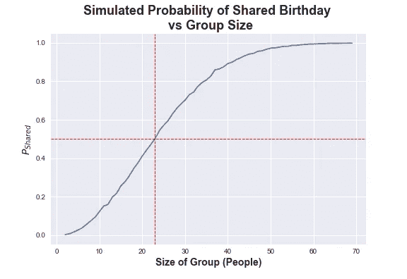
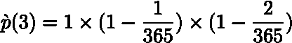
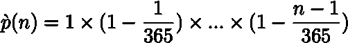
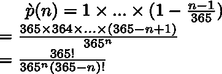
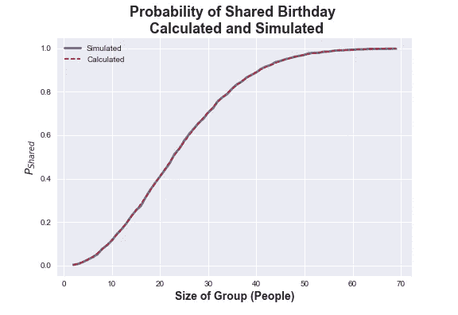
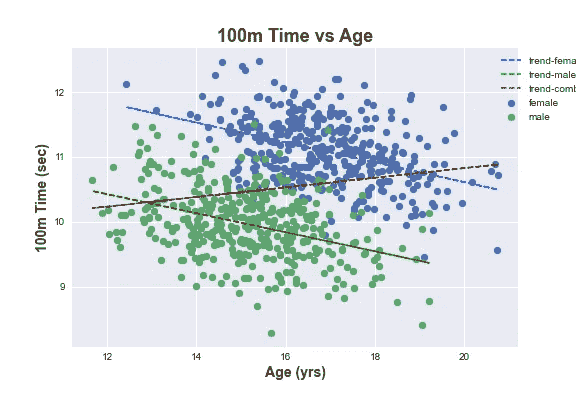
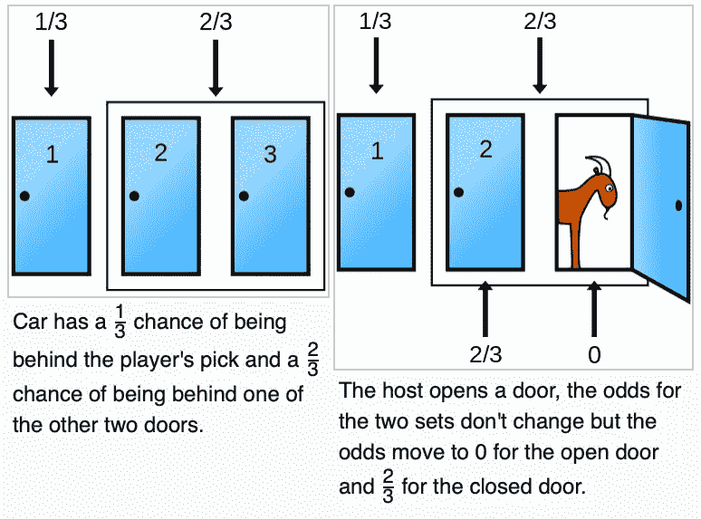

# 概率悖论集(附代码)

> 原文：<https://medium.com/codex/collection-of-probability-paradoxes-with-code-c02a523bff2e?source=collection_archive---------14----------------------->

人类对概率没有很好的直觉。如果你在这里，你可能已经知道了这一点，你可能已经看到了一些悖论，它们说明了我们在概率性思维上的困难。悖论和应用概率论得出违反直觉的结论让我意识到概率分析和思考能让我们做什么。

在这篇文章中，我将简要总结几个最著名的悖论，并包括一些基本的 python 代码和图表，以帮助用例子和模拟来说明。这些都是老生常谈的悖论，你可以找到无数的文章和解释。我想简要地收集其中的三个，并重新审视直觉、基本理论，并提供一些代码，让读者能够使用经验方法并直接将理论可视化。

# **生日悖论**

**描述**:生日悖论提出了这样一个问题:给定一组人数为 *n.* 的人，任何两个人同一天生日的概率 p(n)是多少？更具体地说，我们都在问需要多少人才能有 ***至少 50%*** 的机会让两个人同一天生日，或者说 ***当 p(n) > 0.5*** 时。

**答案:** 23 人

**常见谬误:**上面的答案似乎与直觉相悖，因为很少有人能达到 50%。我们可能会认为它更接近 365 的一半，或者肯定大于 23。问题描述中的关键词是‘任何’。这个问题是组合逻辑的一个很好的例子，我们可以更好地问“在一群人当中不存在重复生日的可能性有多大？”。

悖论模拟显示 23 人时概率超过 50%。下面显示并链接了代码

**计算**

还是那句话，我们来想一想共享生日不存在的概率，称之为***【ṕ(n】***，n 为人数。让我们从一个非常简单的例子开始:如果 n = 1，那么ṕ(n = 1，因为我们绝对肯定没有生日是只和一个人过的。用 2 呢？第二个人生日不同的概率是 364/365，我们可以写成 1-(1/365)。第三个人不共享前两个生日的概率是 1-(2/365)，因此为了计算三个人不共享生日的概率，我们得到这个等式:

没有和 3 个人一起过生日的概率。

请注意，右边的第一个“1”代表确定没有与一个人共享生日，我们也可以认为是 1-(0/365)。你可能会注意到出现的模式，上面的等式对所有 n 的推广是:

没有与 n 个人共享生日的概率。

上述等式使用阶乘简化如下:

方程的简化广义形式。

最后，记住我们是在计算 p(n) = 1-ṕ(n)，当我们代入 n=23 时，我们得到~0.5073，或略高于 50%。下图显示了叠加在模拟原始图顶部的经验计算。我们可以看到两者几乎完全一致，如果你通过这种方式学得更好，我鼓励你使用下面链接的代码。

根据上面所示的经验曲线计算概率。

**模拟代码**

完整的代码链接在[这个 Jupyter 笔记本](https://github.com/SunayBhat1/Writing-Code/blob/main/Paradoxes/Paradoxes.ipynb)的‘生日悖论’标题下。

# **辛普森悖论**

**描述:**辛普森悖论是一个经常被提及的悖论，其中当数据片段被组合时**洞察力或趋势发生逆转**。经典的现实例子是加州大学伯克利分校因性别歧视被起诉，因为只有 35%的女性申请人被录取，而 44%的男性被录取。有趣的是，当按部门查看数据时，这一趋势发生了逆转，因为女性申请总体录取率较低的部门的比例过高。您可以单击该链接查看详细信息，但是我们将关注一个更简单的具有模拟数据的案例。

**玩具示例**

让我们考虑一个非常简单的玩具问题，关于高中运动员(男性和女性)的 100 米短跑成绩和他们的年龄。I [引用顶尖高中运动员的时间](https://www.athletic.net/TrackAndField/)作为平均时间，但数据是使用跨时间和年龄的两个多元高斯函数模拟的(两个分布的平均年龄被移动以更好地说明这一点)。

男女运动员的模拟高中 100 米短跑时间，按性别和组合列出趋势线

在制造的例子中很明显**性别** **是**一个明确的 [***混杂的***](https://en.wikipedia.org/wiki/Confounding) ，但这也是因为我们绘制它的方式。如果我们在单一颜色下绘制数据集，仅使用组合趋势线，我们可能会认为时间随着年龄增长，这肯定与我们在高中年龄范围内的直觉相矛盾。但是如果我们将数据按性别分类，很明显我们虚构的高中运动员随着年龄的增长变得越来越快(时间减少),正如人们所料。

**结论**

这一悖论背后没有复杂的计算或理论，而是一个关于**数据分段**和在整个数据集上仅使用汇总统计数据的风险的教训。重要的是要仔细考虑数据中的所有变量和正在分析的内容，以确保没有混杂因素扭曲数据。在玩具示例中，我们的混淆因素很明显(并作为变量提供给我们)，但在现实应用中，混淆变量可能更难看到、测量和调节。

**模拟代码**

完整的代码链接在[这个 Jupyter 笔记本](https://github.com/SunayBhat1/Writing-Code/blob/main/Paradoxes/Paradoxes.ipynb)的“辛普森悖论”标题下。

# 蒙蒂·霍尔问题

**描述:**在这个游戏节目问题中，主持人要求参赛者从三扇门中选择一扇门，其中一扇门后有奖品，两扇门后有山羊(想必你不想要)。在参赛者选择之后，主持人打开另外两扇门中没有奖品的一扇门，并问参赛者是否愿意交换。这里的关键问题是， ***你是否通过转行来增加自己的胜算概率？***

**回答:**切换，你的胜算从 1/3 到 2/3

**常见谬误:**人们往往第一次听到这个问题，就假设概率不变。如果奖品毕竟是随机放置的，你现在不是有 50/50 的机会在移除一扇门的情况下赢得它吗？关键是门的拆除在问题中是如何提出的。**主持人知道奖品在哪里**为了移除一扇没有奖品的门。所以你可以把门分成两组，你选择的门和你没有选择的门。在这个阶段，我们意识到奖品在你门后的概率是 1/3，有 2/3 的机会在剩下的两扇门中的一扇门后。主持人必须从剩下的两扇门中选择，因为他们知道奖品在哪里，所以移除不会影响两组的潜在概率(主持人的选择绝不是随机的)。我将遵从维基百科的插图和下面的标题来进一步说明这一点。

**极端例子:1000 扇门**

如果这看起来仍然有点不可靠，让我们用两个集合的概念来举一个更极端的例子。我们假设有 1000 扇门，只有一扇门再次包含了奖品。你再次选择一个门，但是 ***现在主持人去掉了 998 个门*** ， ***所有肯定没有奖品的*** ，再次询问你是否切换。这里更明显的是，你最初的随机选择有 1/1000 的机会是正确的，所以剩下的门必须有 1-p，或 999/1000 的机会包含奖品。

**模拟代码**

以 100，000 次迭代运行下面的模拟代码块，我得到的结果是切换成功了 99902 次，或者说大约是预期的 99.9%。

***作者注:***

这是我的第一篇 Medium 文章，我当然希望您会觉得它很有用，而且内容丰富。如果您注意到任何错误，请评论或联系，我会尽快纠正它。

**来源:**

[1][https://en.wikipedia.org/wiki/Birthday_problem](https://en.wikipedia.org/wiki/Birthday_problem)

[https://en.wikipedia.org/wiki/Simpson%27s_paradox](https://en.wikipedia.org/wiki/Simpson%27s_paradox)

[3][https://www . Brookings . edu/blog/social-mobility-memos/2015/07/29/when-average-not-not-good-when-less-when-Simpsons-paradox-in-education-and-earnings/](https://www.brookings.edu/blog/social-mobility-memos/2015/07/29/when-average-isnt-good-enough-simpsons-paradox-in-education-and-earnings/)

[https://www.athletic.net/TrackAndField/](https://www.athletic.net/TrackAndField/)

[5][https://en.wikipedia.org/wiki/Monty_Hall_problem](https://en.wikipedia.org/wiki/Monty_Hall_problem)