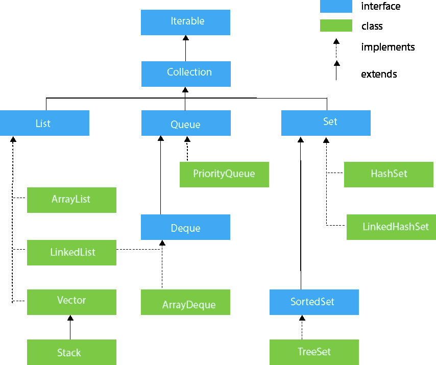
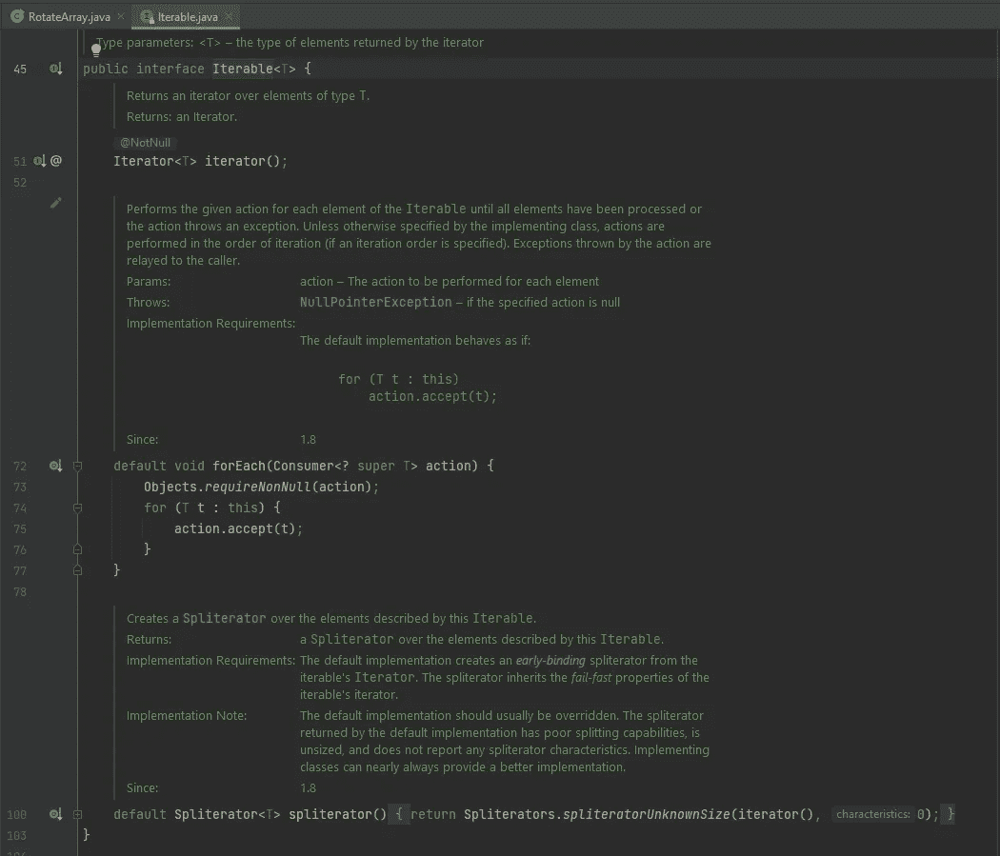
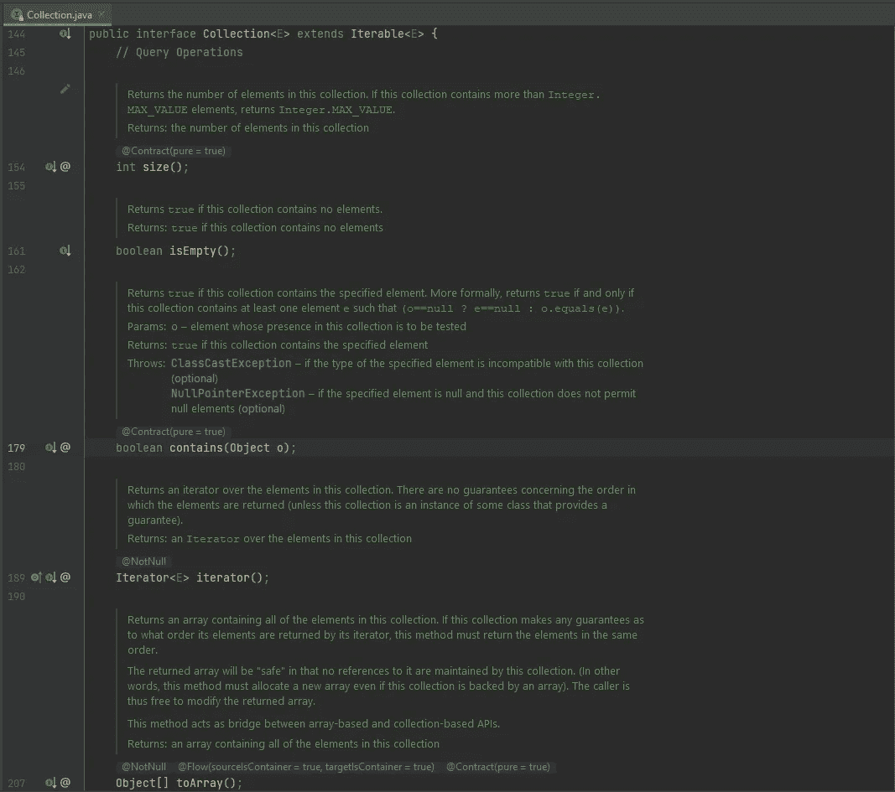
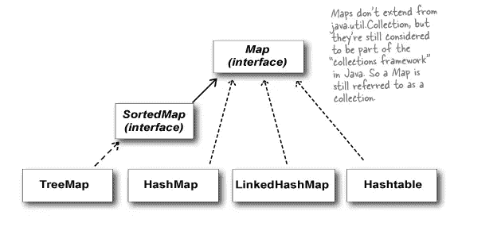

# 集合框架

> 原文：<https://medium.com/codex/collections-framework-f8c4ac5415d9?source=collection_archive---------22----------------------->

# JAVA 集合框架

JAVA 集合框架实现了我们在编写应用程序时使用的所有数据结构，并包含一个集合类。collections 类包括一些重要的方法，如 sort()、binarySearch()、max()、min()来执行排序、搜索等基本功能，以便开发人员在开发应用程序时节省时间。

# JAVA 集合层次结构

***注意:*** *集合接口和集合类是有区别的。集合接口包含所有重要的函数声明，如 add、size 等。，被数组列表、优先级队列等很多数据结构使用。Collections 类包含所有必要的函数，如 sort、min、max、binarySearch，使开发人员的工作更加轻松。*

**可迭代接口:**该接口主要包含两个功能:

*   迭代器 →这给了你一个迭代器，它实现了这些集合。每个实现 iterable 接口的集合都应该给你一个迭代器，通过这个迭代器你可以遍历你的集合，修改和删除一个元素。
*   *forEach* →该方法用于迭代集合中的每个元素。

**集合接口:**集合接口实现 iterable 接口。虽然集合框架的真正根应该是 iterable 集合接口，但它被认为是集合框架的根，因为它包含了所有集合实现的大多数方法。集合接口包含了所有的基本功能，如添加，大小，删除等。，所有集合都实现它。

**列表接口:**列表接口是集合接口的子接口，通过 ArrayList、LinkedList、Vectors、Stack 类实现。堆栈是通过扩展 Vector 类实现的。

**队列接口:**该接口是集合接口的子接口，包含了队列特有的所有函数，是一种先进先出(FIFO)的数据结构。这个队列接口由 Priority Queue 类实现，它用于创建最大和最小堆。

**队列接口:**该接口是队列接口的子接口。除了队列方法之外，它还包含从最后一个队列中删除元素的方法，因为 deque 是一个双端队列。该接口由 ArrayDeque 和 LinkedList 类实现。

**集合和排序集合接口:**集合接口是集合的子接口，排序集合接口是集合的子接口。Set 接口增加了一个条件，即集合中的元素应该是唯一的。有序集合实现了用于实现自平衡 BST 的比较器方法，使得存储在有序集合中的元素是有序的。集合接口由 HashSet 和 LinkedHashSet 实现，而树集合实现排序集合。

## 地图层次

用 JAVA 实现的 Map 不是从 Iterable 或 Collection 接口实现的。在 HashMap 和 LinkedHashMap 的情况下，它们是从 Map 接口实现的。对于排序的映射，它们是从 SortedMap 接口实现的，该接口以 Map 接口为父接口，并包含一个比较器方法。映射是键值对，也可以有副本。

**注意:** *所有这些接口和类都存在于 java.util 包中。*

**注意:** *这些集合在创建时不使用原始数据类型。它们是使用原始数据类型包装类创建的。*