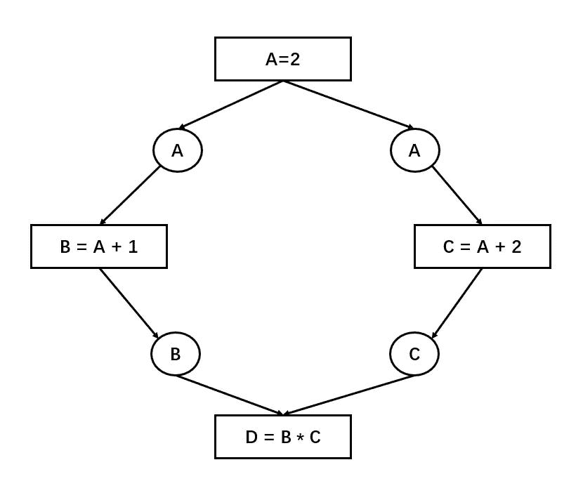
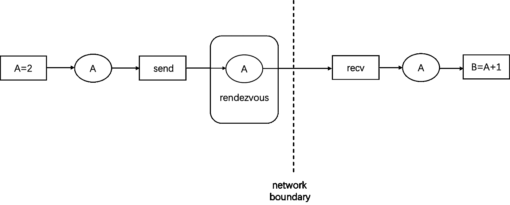
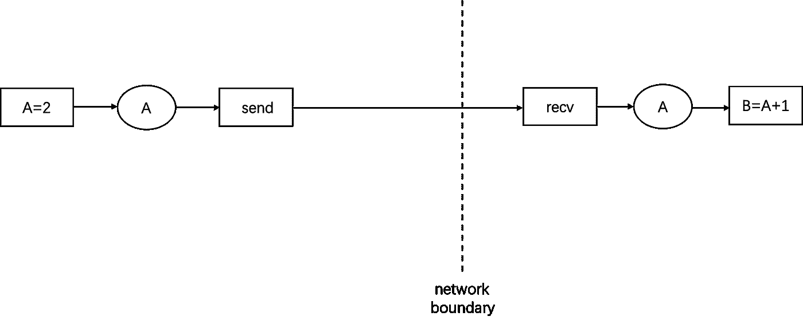
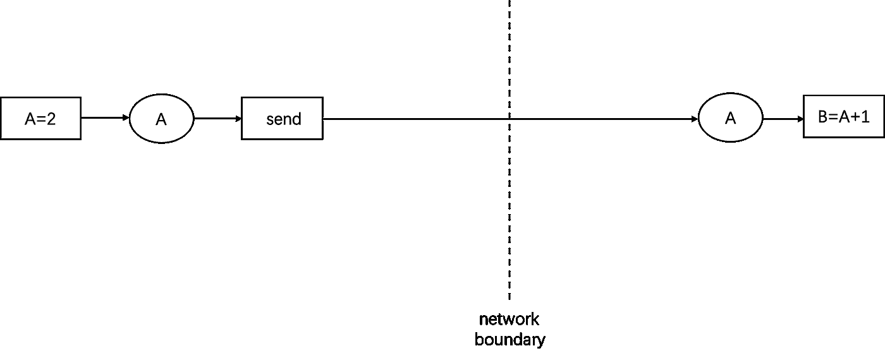
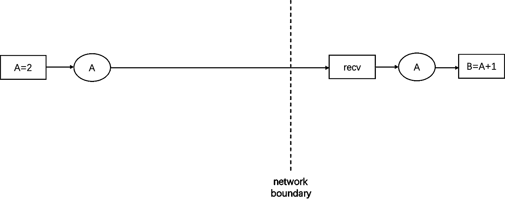

# 对抗软件系统的复杂性:实体不应该被不必要的增加

> 原文：<https://medium.com/codex/combating-software-system-complexity-entities-should-not-be-multiplied-unnecessarily-f42eada0befd?source=collection_archive---------7----------------------->


xresch 的 Pixabay 大街

***袁锦辉写的；*董译著**

如何评价一个大型软件系统的质量是我们经常面临的问题。主要的评估标准无疑是功能性和软件是否满足主要需求(做正确的事情)。如果有多种技术途径来实现相同的功能，人们倾向于选择更简单的方法。

奥卡姆剃刀准则“实体不应该被不必要地相乘”很好地总结了对简单的偏好，这是为了应对复杂性的挑战。这种偏好的潜在逻辑是:“简单做对事情。

# 软件开发的老问题:对抗复杂性

在 20 世纪 60 年代，软件危机([软件危机—维基百科](https://en.wikipedia.org/wiki/Software_crisis))曾被称为软件危机，因为软件开发跟不上硬件的发展和现实问题复杂性的增长，无法在计划的时间内交付。

曾在 IBM 领导 System/360 和 OS/360 开发的图灵奖获得者弗雷德·布鲁克斯(Fred Brooks)在软件工程圣经《人月神话》中描述了一头巨兽在焦油坑中垂死挣扎的困境，以此与深陷软件复杂性而无法脱身的软件开发人员进行类比。他还介绍了著名的布鲁克斯定律，“给落后于计划的项目增加人员只会让它更加落后于计划”。

在他的论文“没有银弹——软件工程的本质和意外”中，他进一步将软件开发的困难分为本质的和偶发的，并确定了本质困难的几个主要原因:复杂性、不可见性、一致性和可变性，其中复杂性占主导地位。

2006 年，一篇名为“[走出焦油坑](https://s3.amazonaws.com/systemsandpapers/papers/outofthetarpit.pdf)的论文呼应了布鲁克斯的观点。本文认为复杂性是阻碍成功的大规模软件开发的唯一主要困难，Brooks 提出的其他几个原因是由不可管理的复杂性导致的次生灾害，复杂性是根本原因。这篇论文也引用了几位图灵奖获得者对复杂性的精彩讨论。

“……如果我们拒绝被自己制造的复杂事物压垮，我们就必须保持简洁、清晰和简单……”

```
 ----by Dijkstra
```

"雄心勃勃的系统的普遍问题是复杂性."“……强调简单和优雅的价值是很重要的，因为复杂会加剧困难”

```
 ----by Corbato
```

“迫切需要一种强大的方法论来帮助我们思考程序。…传统语言在我们思考程序的方式上制造了不必要的混乱”

```
 ----by Backus
```

“……有一种品质是买不到的……那就是可靠性。可靠性的代价是追求最大的简单性”

“我的结论是，有两种方法来构建一个软件设计:一种方法是让它简单到没有明显的缺陷，另一种方法是让它复杂到没有 T2 明显的缺陷。第一种方法要困难得多。”

```
 ---- by Hoare
```

把事情变得简单是最难做到的，也是对抗复杂的唯一方法:一方面，简单蕴含着可理解性，而可理解性对于大型软件的维护和迭代至关重要；另一方面，虽然简单的抽象不能保证简单的实现，但是过于复杂的抽象几乎肯定意味着复杂的实现。

本文将讨论 TensorFlow 中“依赖引擎”的设计是如何违反奥卡姆剃刀准则的。

# 背景:深度学习框架的依赖引擎

DL 框架和其他分布式计算引擎更喜欢使用数据流模型，它只是一个有向无环图(DAG ),节点分为两种类型，op 和 data。

在数据流模型中，一个操作是否可以开始执行取决于该操作的输入数据的准备情况，因此所有操作都是按照有向无环图的拓扑顺序执行的。



比如上图中，长方形代表 op，一共 4 个 op，圆圈代表数据(从生产者的角度看实际上只有一份 A，从消费者的角度看有两份，所以画了两次)。如图所示，{B=A+1}和{C=A+2}之间没有依赖关系，它们之间的执行顺序没有规定，只要计算资源足够，就可以并行执行。如果翻译成命令式程序，以下两个代码片段都是合法的:

A = 2 | A = 2

B = A + 1 | C = A + 2

C = A + 2 | B = A + 1

D = B * C | D = B * C

基于静态图的 DL 框架依靠依赖引擎模块来管理操作之间的依赖关系以及每个操作的触发时间。

依赖引擎的通常实现是为表示数据的每个圆圈设置一个计数器，以指示数据是否就绪。计数器的初始值是 0。当数据的生产者完成执行时，它将把计数器改为 1。当数据的使用者看到计数器变成 1 时，它也可以读取数据。在上面的例子中，当 B 和 C 的计数器都变成 1 时，{D=B*C}被触发。

基于静态图机制的 DL 框架，包括 TensorFlow 和 MXNet，执行引擎(executor)使用这样的机制来管理 op 之间的依赖关系和每个 op 的触发时机。

如果在同一进程的不同线程上执行不同的操作，则多个线程可以通过共享内存机制同时访问计数器，除非为了解决并发读取和写入之间的竞争，每个计数器都需要被锁定或使用原子变量。

如果不同的 op 分布在不同的进程甚至不同的机器上，那么跨机器的依赖关系应该如何表示和管理？

# 问题:分布式版本的依赖引擎

对于分布式场景(数据并行、模型并行等。)可以由集群通信原语(全部减少、全部聚集、减少分散等)支持。)像 NCCL 一样，每台机器上的子图并不“看起来”在计算图级别具有依赖性。每个节点都可以作为一个完全独立的计算图来管理(这种依赖性是通过底层的中继通信隐式实现的)，执行引擎级别的复杂度相当小。

然而，当面对“不规则的通信模式”时，其中跨机器的依赖性是通过生产者-消费者交互的对等通信来实现的(生产者在一台机器上，消费者在另一台机器上)，它引入了一些微妙的问题，这些问题比可以通过中继通信原语解决的场景更复杂。下面只讨论这种情况。

当计算图中的 op 以对等的方式被划分到不同的机器上时，该功能需要支持:(1)将数据从生产者的机器发送到消费者的机器。(2)状态计数器应该放在生产者的流程上还是消费者的流程上？(3)如果放在消费者的流程上，生产者通过什么手段修改这个计数器？

# TensorFlow 对跨机器数据移动的抽象

我们来看看 TensorFlow 是如何解决生产者-消费者跨网问题的。



图中的虚线表示机器之间的边界。{A=2}在左半部分的机器上执行，{B=A+1}在右半部分的机器上执行。左边的机器生产出 A 后，需要运到右边的机器上才能消费。

跨机器状态同步的一个自然实现是“消息传递”。TensorFlow 在计算图中插入了一对 send 和 recv 操作，将普通用户编写的 op 与计算图中的跨机数据移动解耦，使得普通 op 不需要担心和处理跨机通信的麻烦。比如在生产者端，执行{A=2}后，生产者知道 A 正在被 send 消耗，只需要把数据交给 send 就可以了。在消费者端，{B=A+1}知道它依赖于从 recv 中获取 A，只需要等待 recv 完成执行。

为了解决 send 和 recv 的执行不匹配问题，TensorFlow 还在生产者端引入了 rendezvous 的概念，以下是大概的逻辑。

1.  send 将数据放入 rendezvous 的 KV 字典中，如果 recv 端已经发送了取数据的需求，并且两者恰好连接，那么会立即启动底层数据传输；如果此时 recv 端没有发送请求，它只需将数据放入 KV 字典中，等待 recv 发送请求。
2.  recv 端请求数据汇合，如果发现数据已经在 KV 字典中，立即启动底层数据传输；如果发现字典中没有需要的数据，那么启动封装到 KV 字典中的回调函数的数据传输，等待回调函数被触发时 send 将数据放入 KV 字典。

让我们想一想:为了让依赖引擎支持跨机器的生产者和消费者问题，TensorFlow 抽象是最小的吗？它是否做到了奥卡姆剃刀准则所描述的那样:“实体不应该被不必要的相乘”？它有冗余的概念吗:**交会有必要吗？send 和 recv 都有必要吗？**

# “幽会”是必须的吗？

Rendezvous 主要设计用于满足生产者和消费者之间的“握手”需求，将它放在消费者端也是可行的，例如:

一旦生产者生成了数据 A，它就可以将数据发送到消费者的机器上，而不关心消费者端的执行是否已经开始。如果数据到了消费者的机器但消费者子图还没有启动，就等消费者子图开始使用数据；如果当数据到达消费者的机器时，消费者子图已经启动并正在等待，那么只需触发包含消费者子图的回调函数。

考虑到我们处理的是静态图，其中要在每台机器上执行的子图是预先知道的，生产者-消费者关系也是预先知道的，rendezvous 就没有必要了，为什么？

在静态图机制中容易实现的一点是:在数据开始流入系统之前，每台机器上的子图都已经初始化了(OneFlow 这样做是为了在所有节点上对应于所有子图的所有 actor 都被初始化时，允许来自源的数据向下流动，这实际上是通过一个屏障来实现的)。只要保证了这一点，就可以去掉 rendezvous，因为生产者肯定知道消费者的子图在另一端等待数据。

事实上，即使在使用动态图机制的 PyTorch 中，在执行对等传输时也只引入了 send 和 recv 抽象，而没有引入 rendezvous 的概念。

去掉冗余的集合点后，生产者-消费者网络的概念可以简化如下图所示。



# 发送或接收:选择其中之一

在抽象层次上，如果我们定义发送操作的职责是将数据推送到另一台机器，接收操作的职责是将数据从另一台机器拉送到本地，我们会发现生产者发起的推送和消费者发起的拉取、发送和接收都只需要其中之一。如果两者都引入，send 和 recv 中总有一个只是起到占位符的作用，不做实际操作。

此外，引入 send 和 recv 不仅仅是引入冗余概念的问题，它打破了系统一致性(回想一下“神话人月”是如何强调概念一致性的重要性的):使用数据流抽象的系统可以使用 Push 语义和 Pull 语义，但同时使用 Push 语义和 Pull 语义会使系统难以理解。



如果生产端主动将数据推送到消费端，那么 recv 就是多余的。PyTorch 的 send 和 recv 可以被认为是采用了 Push 语义，但是引入了冗余的 recv，它仅仅是一个占位符。



如果消费端主动把数据拉过来，那么发送就是多余的。TensorFlow 的发送端总是等待 recv 端发送请求来拉取数据，所以可以认为是采取了拉取语义。在这种情况下，send 是多余的，它只是一个占位符。

# 推还是拉？

纯粹就跨机器数据移动的功能需求而言，两者都没有优势。(推而广之，RDMA 提供了读和写两种单边操作)要做出选择，需要在更大的上下文中考察哪种语义更好，这里我们要使用一种既能涵盖单边机内操作又能涵盖跨机操作的语义。

单个机器内部的 op 之间的交互有两种类型，一种是状态的传递，这是这个层次的推送语义，比如生产者在执行后会主动修改消费者所依赖的计数器，从而将状态推送给消费者；另一个是数据的传递，这是这个层面的拉语义，比如生产者不把数据推给消费者，但是消费者根据自己的需要读取生产者生产的数据。这种拉语义的出发点是零拷贝，这是高效的。

显然，当我们在 send op 或 recv op 之间选择时，功能需求是数据传输，我们应该选择 Pull 语义。从这个角度来看，PyTorch 的 Push 语义是低效的，TensorFlow 的 Pull 语义是高效的，尽管它的 send 是多余的。

OneFlow 在机器内部和机器之间的关系中使用拉语义，其中消费者 op 总是从生产者 op 拉数据，因此只引入 recv，而不引入 send。

通过采用拉语义，在计算图级别上实现了概念上的一致性。系统的数据流机制可以用一句话来解释:机器内部的消费者读取生产者产生的数据，跨机器拉取的数据在语义上是相同的，只是当生产者和消费者在同一台机器上时，消费者从它所在的机器读取并写入同一台机器，而当生产者和消费者不在同一台机器上时，消费者(recv)从另一台机器读取并写入它所在的机器。

这种概念上的一致性将减少认知负担，只需要最简单的拉规则来解释单机和多机情况。

上面的讨论是在抽象的层面上，在实现的层面上是一个不同的问题。如果底层通信使用 RDMA，那么 READ 的单边操作将支持 Pull 如果底层是 socket，那么底层就要通过 send 和 recv 的配合来实现 Pull 语义，这也正是 OneFlow 的 CommNet 模块所实现的。

# 结论

依赖引擎是 DL 框架的核心模块，基于共享内存的计数器机制是实现独立依赖引擎的常用方法。

当引入分布式计算时，跨机器依赖通常借助于“消息传递”来实现(当然，如果分布式共享内存机制支持，也可以继续使用共享内存计数器机制)。

TensorFlow 使用“消息传递”实现分布式依赖引擎，引入了几个冗余概念，不符合“实体不应进行不必要的相乘”。

当冗余的抽象被移除时，张量流实现可以被简化。

借助这个“找茬”的过程，我想分享一下:只有对极简主义的偏执追求，才会通向事物的本质。

您可能已经注意到了:一个编程模型依赖于单个机器内的共享内存，另一个编程模型使用跨机器的消息传递，这再次引入了不一致性。这是个问题吗？我们将在下一篇文章中继续讨论，敬请关注。

***相关文章:***

1.  [***OneFlow v0.5.0RC 出来了！***](https://oneflow2020.medium.com/oneflow-v0-5-0rc-came-out-44d1e184ca03)
2.  [***现有深度学习框架的局限性:动态调度***](https://oneflow2020.medium.com/the-limitations-of-existing-deep-learning-frameworks-dynamic-scheduling-a1811c4dbbc0)

*欢迎访问 one flow on**[***GitHub***](https://github.com/Oneflow-Inc/oneflow)**并关注我们 on**[***Twitter***](https://twitter.com/home)**和*****

**还有，欢迎加入我们的 [***Discord 群***](https://discord.gg/4kpjGA5bZY)*讨论提问 OneFlow 相关问题，与 OneFlow 贡献者和全球用户连线。***