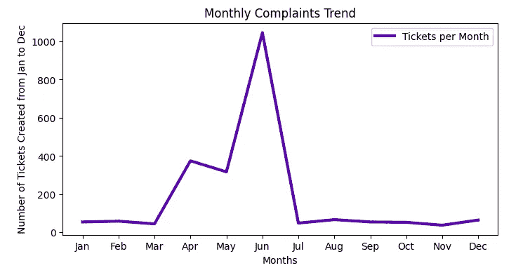

# 客户流失分析和预测

> 原文：<https://medium.com/codex/comcast-telecom-consumer-complaints-af0d2cbb04d0?source=collection_archive---------8----------------------->

## **分析找出康卡斯特客服的问题**

由[大卫·哈恩](https://unsplash.com/@hahn_david_com?utm_source=medium&utm_medium=referral)在 [Unsplash](https://unsplash.com?utm_source=medium&utm_medium=referral) 上拍摄

欢迎来到我的故事！对于各种服务困难，电信消费者可以通过邮件/呼叫中心/短信向服务提供商投诉。解决投诉非常重要，因为这是一个竞争非常激烈的行业。在这里，我们将分析康卡斯特电信消费者投诉的数据。

## 数据集描述

康卡斯特是一家美国全球电信公司。这家公司一直在提供糟糕的客户服务。尽管一再承诺要改进，但他们仍然做得不够。仅在上个月(2016 年 10 月)，在接到 1000 多起消费者投诉后，该机构就对他们罚款 230 万美元。现有的数据库将作为公众投诉康卡斯特的资料库。这将有助于确定康卡斯特的客户服务出了什么问题。

 [## 使用沃尔玛数据的零售分析—第 1 部分

### 沃尔玛 45 家门店的机器学习模型分析与构建

medium.com](/codex/retail-analysis-with-walmart-data-part-1-5fe1c81e9617)  [## 使用沃尔玛数据的零售分析—第二部分

### 为沃尔玛的 45 家商店建立机器学习模型

medium.com](/codex/retail-analysis-with-walmart-data-part-2-21934aeb0d77) 

我从导入库开始，然后导入数据集并清理数据集。我删除了重复项，并将“日期”和“日期 _ 月 _ 年”列的数据类型更改为 datetime64。没有空值，所以我可以进行探索性数据分析(EDA)。

> 从 EDA，我发现大多数投诉是在 6 月份收到的，从佐治亚州，康卡斯特收到的投诉最多。

在这里找到我的 Kaggle 笔记本*。*

# *统计任务*

> ***(1)提供月度和每日粒度级别的投诉数量趋势图***

**

***月度投诉趋势***

**

***每日投诉趋势***

> *六月是投诉最多的月份*

> ***(2)提供投诉类型频率表***

**

***投诉类别***

**

***%收到的投诉***

> ****与互联网相关的投诉最多(34.36%)****

> ***(3)用 Open 和 Closed 值创建一个新的分类变量。未决的打开&被归类为打开，已解决的关闭&被归类为关闭***

**

> ****未结投诉 517 件，已结投诉 1707 件****

> ***(4)以堆积条形图的形式提供投诉的状态。使用 Q3 中的分类变量***

**

***州级投诉***

> ***(5)哪个州的投诉最多***

**

***州级投诉***

> *康卡斯特收到的来自格鲁吉亚的投诉最多*

> ***(6)哪个州的未解决投诉比例最高***

**

***%投诉***

> ****佐治亚州的未解决投诉比例最高****

> ***(7)提供迄今为止通过互联网和客户服务电话解决的投诉的百分比***

**

> ****分别有 50.62%和 49.42%的投诉通过客服电话和互联网得到解决****

*我得出了一些见解—*

***(1)六月投诉最多，十一月投诉最少***

***(2)与互联网相关的投诉最多***

***(3)大约 30 %的投诉是公开的***

***(4)从格鲁吉亚收到的投诉最多(288/2224)***

***(5)格鲁吉亚的未解决投诉比例最高***

***(6)分别有 50.62%和 49.42%的客户服务电话和互联网投诉得到解决***

*感谢您的阅读！如果您关注我或与他人分享这篇文章，我将不胜感激。最美好的祝愿。*

## *你会支持 awesome❤️*