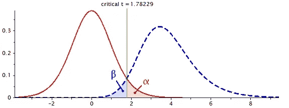

# 如何在受试者内研究设计中比较两组

> 原文：<https://medium.com/codex/compare-two-groups-in-a-within-subjects-study-design-a5b038aec4ec?source=collection_archive---------4----------------------->

## 如何估计样本大小，执行配对 t 检验并在 Python 中绘制数据

用 [G*Power](https://www.psychologie.hhu.de/arbeitsgruppen/allgemeine-psychologie-und-arbeitspsychologie/gpower) 进行统计功率分析。来源:作者

使用统计测试，我们可以比较不同的组，看看它们之间是否有显著差异。

例如，我们可能开发了一个新版本的应用程序(版本 A ),我们…