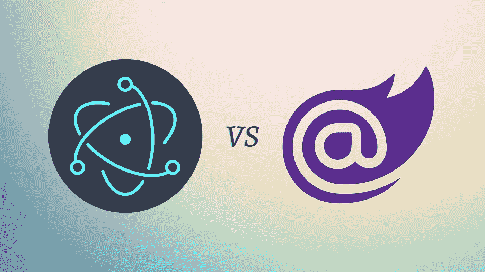

# 比较 Blazor 毛伊岛和电子:利弊

> 原文：<https://medium.com/codex/comparing-blazor-maui-and-electron-pros-and-cons-3d59da50d48d?source=collection_archive---------7----------------------->

嗨，今天我将尝试回答这个问题，我们应该使用 Blazor 毛伊岛或电子，而发展。

作为一个两者都经历过的人，我可以说我认为 Blazor 在很多方面都领先于 electronic。让我们一起来看看这些不同之处。

在构建跨平台桌面应用程序时，开发人员可以在两个流行的框架之间进行选择，比如:Blazor Maui 和 electronic。两者都有自己独特的优点和缺点，所以在做决定之前了解它们之间的区别是很重要的。

Blazor Maui 和 Electron 之间的一个关键区别是它们使用的编程语言。Blazor Maui 允许开发者使用 **C#和 Razor 语法**构建桌面应用，而 Electron 使用 **JavaScript 和 HTML** 。这意味着已经熟悉 C#和 Razor 的开发人员可能会发现 Blazor Maui 更容易使用，而那些更熟悉 JavaScript 的开发人员可能更喜欢 electronic。

另一个关键区别是两个框架的性能。Blazor Maui 应用程序被编译成**本地代码**，这意味着它们比电子应用程序运行得更快，性能更好。另一方面，**电子应用建立在铬**之上。

在部署方面，Blazor Maui 允许开发人员构建可以在 Windows、macOS 和 Linux 上安装和运行的应用程序，而电子应用程序可以部署在所有主要的操作系统上。然而，电子应用程序往往更大，需要更多的资源，这使得它们更难分发和安装。

最终，Blazor Maui 和 Electron 之间的决定将取决于您项目的具体需求和您作为开发人员的个人偏好。两种框架都有各自的优点和缺点，所以在做出决定之前仔细评估它们是很重要的。