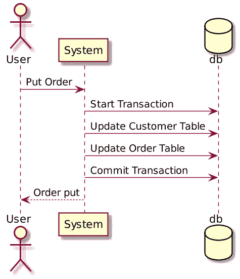
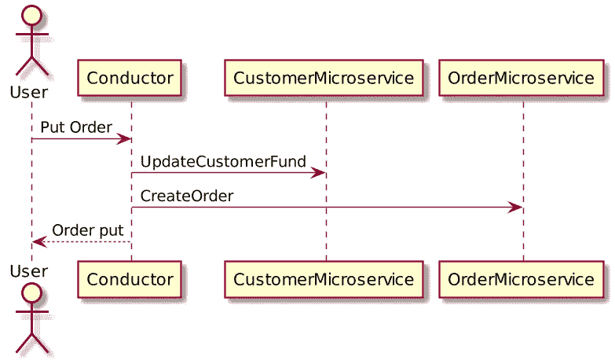
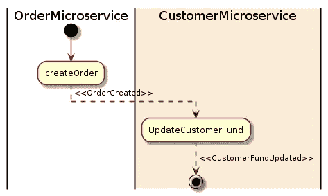

# 微服务中的补偿事务

> 原文：<https://medium.com/codex/compensating-transaction-in-microservices-15b1f88a7c29?source=collection_archive---------0----------------------->

# 什么是分布式事务？

当微服务架构将单块系统分解成自封装的服务时，它可能会中断事务。这意味着单片系统中的**本地事务**现在被**分配**到多个服务中，这些服务将按顺序被调用。

下面是一个使用本地交易的单体系统的客户订单示例:

在上面的客户订单示例中，如果用户向单块系统发送一个 **Put Order** 动作，系统将创建一个本地数据库事务，该事务处理多个数据库表。如果任何一步失败，事务可以**回滚**。这就是所谓的酸。

当我们分解这个系统时，我们创建了`CustomerMicroservice`和`OrderMicroservice` **，**，它们有独立的数据库。以下是微服务的客户订单示例:

在单片应用程序中，我们有数据库系统来确保酸性，但问题是在微服务应用程序中如何确保原子事务？

在这个模型中，典型的业务操作由一系列独立的步骤组成。在执行这些步骤时，系统状态的整体视图可能不一致，但是当操作完成并且所有步骤都已执行时，系统应该会再次变得一致。所以在微服务中，想法是实现最终的一致性。

最终一致性模型中的一个挑战是如何处理失败的步骤。在这种情况下，可能需要撤消操作中前面步骤完成的所有工作。然而，数据不能简单地回滚，因为应用程序的其他并发实例可能已经更改了它。即使在数据没有被并发实例更改的情况下，撤销一个步骤可能不仅仅是恢复原始状态的问题。

# **解决方案:**

解决方案是实现一个补偿事务。补偿事务中的步骤必须撤消原始操作中步骤的效果。补偿事务可能无法简单地用操作开始时系统所处的状态替换当前状态，因为这种方法可能会覆盖应用程序的其他并发实例所做的更改。相反，它必须是一个智能过程，考虑到并发实例所做的任何工作。

使用 SAGA 设计模式可以实现补偿事务。

Saga 模式是另一种广泛用于分布式事务的模式。它不同于 2pc，2pc 是同步的。Saga 模式是异步和反应式的。在 Saga 模式中，分布式事务由所有相关微服务上的异步本地事务来完成。

下面是客户订单示例的 Saga 模式图:

在上面的例子中，`OrderMicroservice`收到一个下订单的请求。它首先启动一个本地事务来创建一个订单，然后发出一个`OrderCreated`事件。`CustomerMicroservice`监听该事件，并在接收到该事件后更新客户资金。如果成功地从资金中扣除，那么将发出一个`CustomerFundUpdated`事件，在这个例子中，这意味着交易的结束。

如果任何微服务未能完成其本地事务，其他微服务将运行补偿事务来回滚更改。以下是薪酬交易的传奇模式图:

在上面的例子中，`UpdateCustomerFund`由于某种原因失败了，然后它发出了一个`CustomerFundUpdateFailed`事件。`OrderMicroservice`监听事件，并启动其补偿事务来恢复已创建的订单。