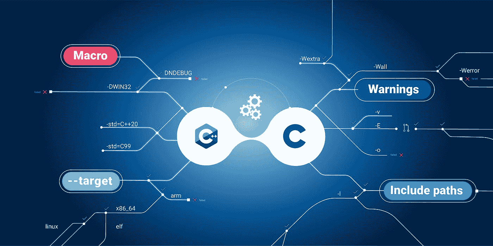
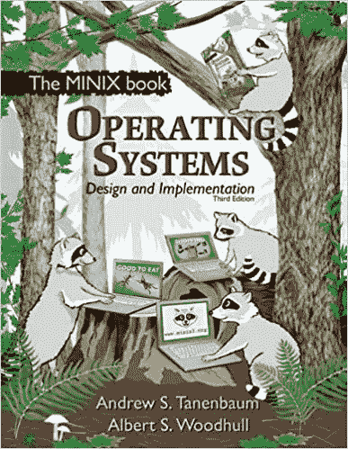

# 编译操作系统

> 原文：<https://medium.com/codex/compilation-operating-system-f464bcf8f25a?source=collection_archive---------14----------------------->

## 最低限度的可操作系统和最低限度的可行观众

先编译 C 和 C++代码

要实现编译即服务，您可以使用最小可操作系统(MOS ),它由安装了编译系统的 Linux 发行版和编译任务调度服务器组成，编译任务调度服务器会将编译请求定向到一个可用的编译服务器，但最有效的可操作系统(MEOS)是构建我所说的编译操作系统，这是一个专门为编译代码而开发的操作系统，因为除了网络模块之外，您与 MOS 一起使用的操作系统的所有其他组件对于代码编译都是无用的。有了 EOS，您将节省存储和内存空间并优化计算能力，因为所有在裸机或虚拟服务器上运行的托管您的系统的内容都是关于编译的。这一段是关于如何像我一样实现这种编译即服务，我已经在本文的[中写道，目的是为了分享和讨论，就像如何尝试在我周围讨论和分享这个想法。](/nerd-for-tech/next-generation-compilers-1346af6cdc51)

例如，两天前，我与一位技术行业的专业人士谈论了这位 SaaS 的新国王，他可能被称为 CaaS，虽然这个缩写词还没有被使用，但他担心这个市场掌握在亚马逊云、微软 Azure 和谷歌计算等云提供商的手中。他的反馈告诉我们，由于这三家提供商的垄断力量以及收购和维护数据中心的成本，没有空间去争夺云市场的份额。他的担心是真诚的，因为他不知道如何将商业模式分解并定制给一组特定的受众，这些受众是最低限度的可行受众，他知道凭借这种最低限度的可行受众及其较小的市场规模，就有可能像小型钢铁厂那样进入高端市场

我刚刚收到了来自这个最小可行受众群体中的一个成员的邮件，这就是[采访蛋糕](https://www.interviewcake.com/)，这封邮件提醒我，过去几十年来，通过免费添加一些可以改善电子邮件用户体验的功能，如将日期和时间转换为我们使用电子邮件的时区，我们在改进电子邮件客户端方面缺乏努力。随着最近远程工作的兴起，这种根据最终用户位置的时间和日期转换对于其他平台来说甚至是至关重要的。阅读 interviewCake 的电子邮件向我强调了将该编译服务公开给电子邮件系统的必要性，因为 interviewCake 的用户可以通过他们为编译服务器实现的代码解决方案来回复他们收到的电子邮件，该编译服务器运行我正在编写的编译操作系统，通过向 interview Cake 用户发送邮件响应来编译它并返回结果。然后，我要感谢 [interviewCake](https://www.interviewcake.com/) 展示了这个用例，再次感谢你，因为你在一年前向我提供了免费使用你的服务的机会，我希望这个编译服务将很快准备好，我也会相应地让你免费使用它。

上面的段落表明，当我们专注于狭窄的受众时，我们会发现我们可以解决的用例，而这些用例很少被市场领导者解决，因为对于寻求标准化、规模化和批量化的大公司或初创公司来说，定制是昂贵且难以管理的。

对于这个编译即服务系统的 MOS 来说，MINIX 可能是一个很好的发行版，因为它是按照 Tanenbaum 的概念用微内核架构设计的，并且它具有非常高的容错能力。但对我来说，下一步是看看 GCC 和 G++是否能在 Minix 的最新版本中完美运行，因为真诚地说，我是这个发行版的真正倡导者，但不是它的用户，也不是它的专家和贡献者网络的成员。支持这个发行版是因为我学到的关于操作系统架构和设计的大部分东西，都是从这本书里学来的。

[操作系统](https://www.amazon.com/Operating-Systems-Design-Implementation-3rd/dp/0131429388) Andrew S. Tanenbaum