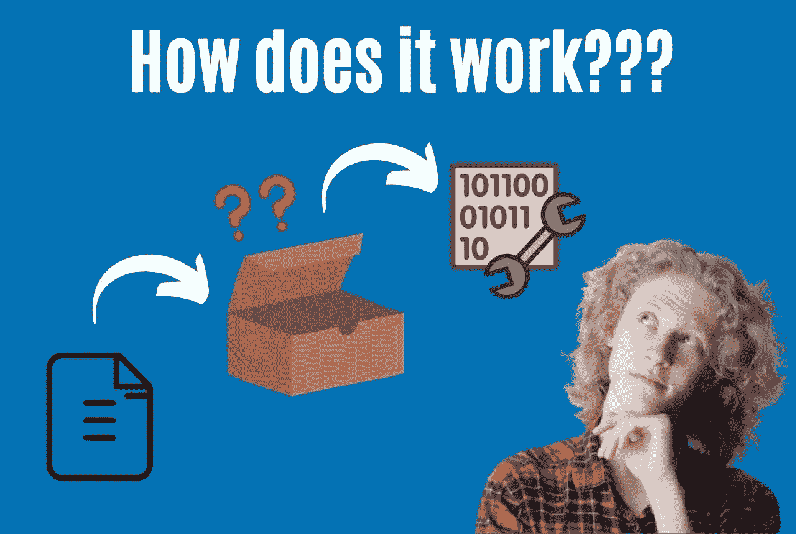
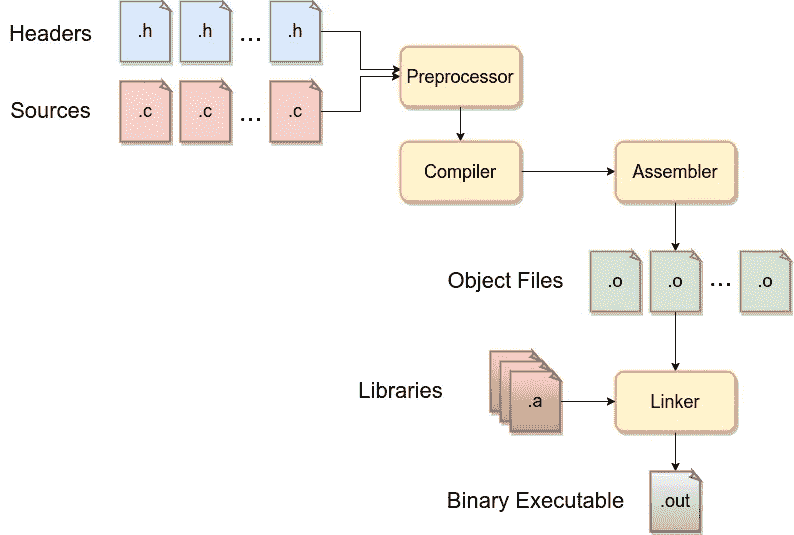

# C 语言编译过程:简单介绍— StackZero

> 原文：<https://medium.com/codex/compilation-process-in-c-easy-introduction-stackzero-9a2b1720576?source=collection_archive---------14----------------------->



# 定义

c 语言(更一般地说是编译语言)中的编译是从人类可读的源代码开始，生成可执行二进制文件的过程。

在 C 语言中，整个编译过程由四个阶段组成，可以概括如下:

许多编译器合并了一些阶段。



# 预处理

除了非常简单的程序，C 中的编译过程必须管理许多源文件。每个源文件都包含*宏*(**#定义**)和*包含*(**#包含**)。
预处理器负责扩展 **#define** 和 **#include** 指令，换句话说，就是用相应的代码替换指令。

为了更好地理解，我们可以看到一个简单的 C 语言 HelloWorld 程序，并尝试使用 [GCC](https://www.gnu.org/software/gcc/) 对其进行预处理。

*helloworld.h*

```
int helloworld();
```

*helloworld.c*

```
#include <stdio.h> 
#include "helloworld.h" #define HELLOWORLD "Hello World!\n" 
int helloworld() 
{ 
    printf("%s", HELLOWORLD); 
    return 0; 
} int main(){ 
    helloworld(); 
    return 0; 
}
```

一旦我们编写了这段代码，我们就可以用 GCC 以这种方式进行预处理，而不需要完全编译:

```
gcc -E -P helloworld.c
```

它会打印出这样的内容:

```
typedef long unsigned int size_t; 
typedef __builtin_va_list __gnuc_va_list; 
int helloworld();
typedef unsigned char __u_char; 
typedef unsigned short int __u_short; 
typedef unsigned int __u_int; 
typedef unsigned long int __u_long; 
typedef signed char __int8_t; 
typedef unsigned char __uint8_t; 
typedef signed short int __int16_t; 
typedef unsigned short int __uint16_t; 
typedef signed int __int32_t; .... 
int helloworld();

int helloworld() 
{ 
    printf("%s", "Hello World!\n"); 
    return 0; 
} 
int main()
{ 
    helloworld(); 
    return 0; 
}
```

为简洁起见，跳过的第一部分是对 *stdio* *头*的扩展，第二部分正是对我们的头和宏的扩展。

# 汇编

接下来就是编译，简单来说就是从源代码到汇编的转换。
显然，这似乎没有意义，为什么不直接输出二进制呢？这个中间步骤使得下一步工作变得更容易，只需要为所有编程语言编写一个独特的汇编程序。

在编译过程中，编译器会进行一些优化并保留符号(除了剥离的情况)。

为了更好地理解，我们可以将汇编输出传递给 GCC 选项-S.
出于可读性的原因，我们不做任何优化

```
gcc -S helloworld.c
```

输出将是一个. s 文件，这是 ASM 文件的默认扩展名。

你好，世界

```
.LC0:
 .string "Hello World!"
 .text
 .globl helloworld
 .type helloworld, [@function](http://twitter.com/function)
helloworld:
.LFB0:
 .cfi_startproc
 endbr64
 pushq %rbp
 .cfi_def_cfa_offset 16
 .cfi_offset 6, -16
 movq %rsp, %rbp
 .cfi_def_cfa_register 6
 leaq .LC0(%rip), %rdi
 call puts@PLT
 movl $0, %eax
 popq %rbp
 .cfi_def_cfa 7, 8
 ret
 .cfi_endproc
.LFE0:
 .size helloworld, .-helloworld
 .globl main
 .type main, [@function](http://twitter.com/function)
main:
.LFB1:
 .cfi_startproc
 endbr64
 pushq %rbp
 .cfi_def_cfa_offset 16
 .cfi_offset 6, -16
 movq %rsp, %rbp
 .cfi_def_cfa_register 6
 movl $0, %eax
 call helloworld
 movl $0, %eax
 popq %rbp
 .cfi_def_cfa 7, 8
 ret
 .cfi_endproc
```

如果您更喜欢英特尔语法而不是美国电话电报公司，正确的命令是:

```
gcc -S masm=intel
```

# 装配

汇编器的工作是将 ASM 文件转换成目标文件，也称为“*模块*”。
输出是机器码，每个 ASM 文件对应一个目标文件。

让我们在实践中试试:

```
gcc -c helloworld.c -o helloworld.o
```

它会输出目标文件，如果我们想更好的理解它，可以使用[文件](https://man7.org/linux/man-pages/man1/file.1.html)命令。

```
file helloworld.out #OUTPUT 
helloworld.out: ELF 64-bit LSB relocatable, x86-64, version 1 (SYSV), not stripped
```

它说这是一个 ELF 文件(可执行和可链接格式),并且是可重定位的。

这意味着它不需要固定的内存地址，编译独立于其他对象运行。这也清楚地表明，我们面对的是一个对象，而不是一个可执行文件。
对象可以包含对其他对象函数的引用，而在链接之前，它们只是被替换为重定位符号，所以显然一个对象在链接到其他对象之前是无法工作的。

但是现在是时候进入链接阶段了。

# 连接

链接器负责执行最后一步:将所有对象合并到一个可执行文件中。

一眼看去，它合并了所有对象，甚至解析了对库的符号引用。
Linux 中的库有两种类型:

*   **静态**(每个可执行文件的一个实例)
*   **共享/动态**(所有进程共享的实例)

链接器将静态库合并到可执行文件中，但是不知道共享/动态库的地址，所以，在这种情况下，留下符号引用。

通常情况下，链接器和编译器是分离的实体，不管怎样，GCC 会在编译过程结束时自动调用它。

我们将看到所有阶段，包括链接，只需编写以下命令:

```
gcc helloworld.c -o helloworld.out
```

在这种情况下，[文件](https://man7.org/linux/man-pages/man1/file.1.html)命令的输出将是:

```
file helloworld.out #OUTPUT 
a.out: ELF 64-bit LSB executable, x86-64, version 1 (SYSV), dynamically linked, interpreter /lib64/ld-linux-x86-64.so.2, BuildID[sha1]=c5cc275bf56a938597e5a05fc410eaa9e519f422, for GNU/Linux 3.2.0, not stripped
```

所以最终我们获得了我们的可执行文件，也许我们更好地理解了整个过程。

我希望您喜欢这篇文章的内容，在这种情况下，我邀请您阅读关于 [Stackzero](https://www.stackzero.net) 的其他文章，并随时提出任何问题或建议任何改进。

*原载于 2022 年 6 月 1 日 https://www.stackzero.net*[](https://www.stackzero.net/compilation-process-in-c/)**。**