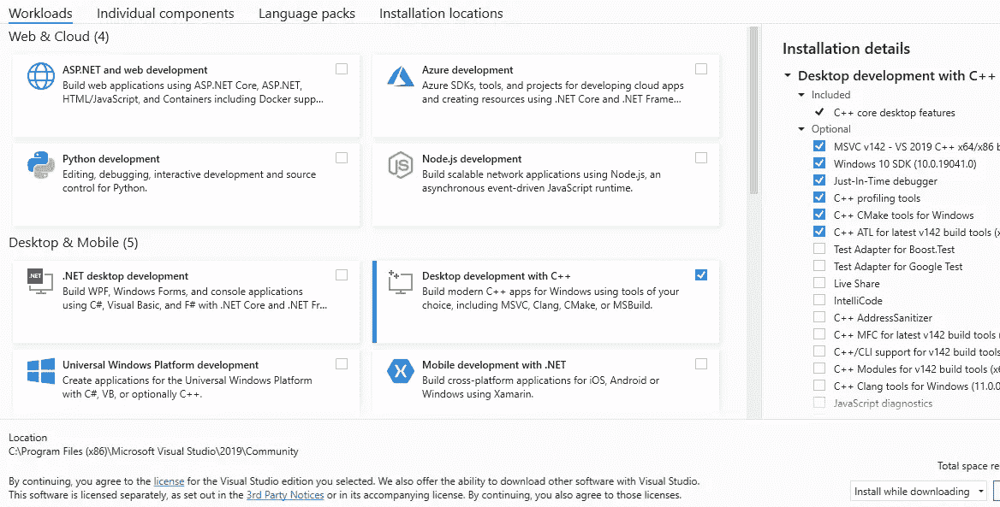
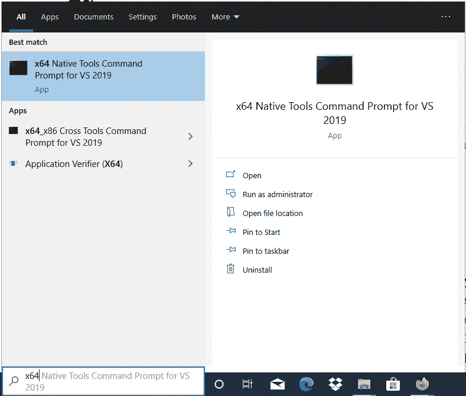
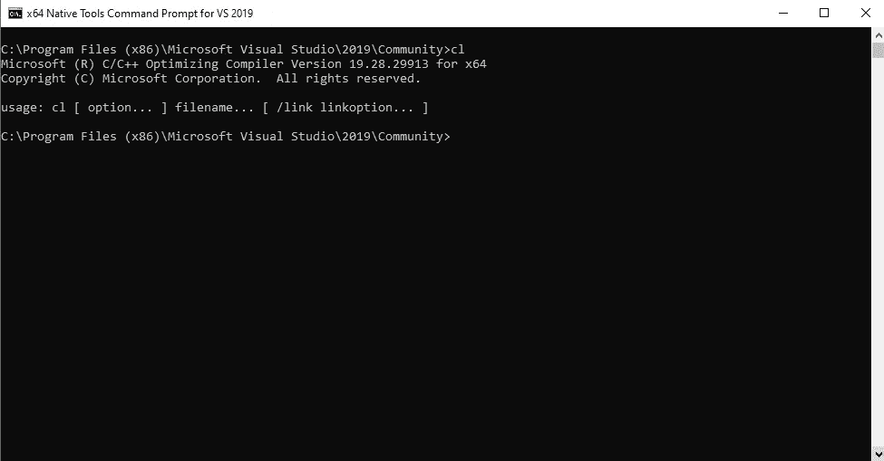
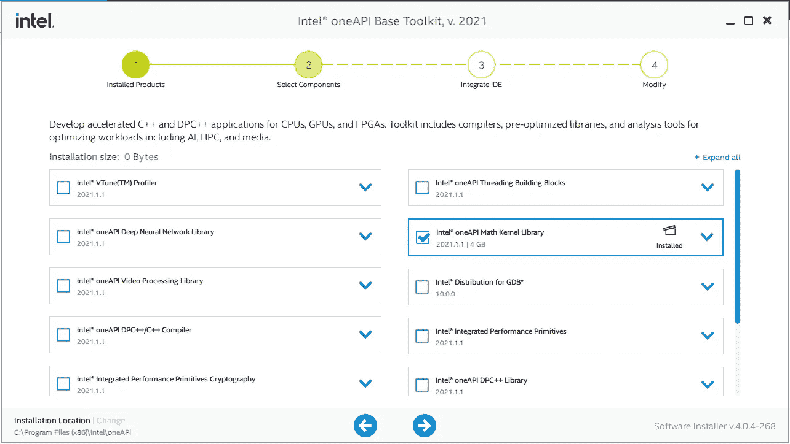
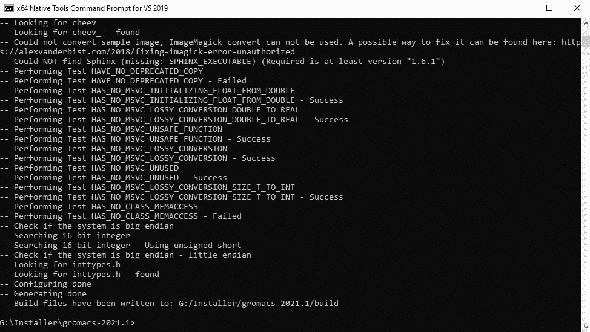
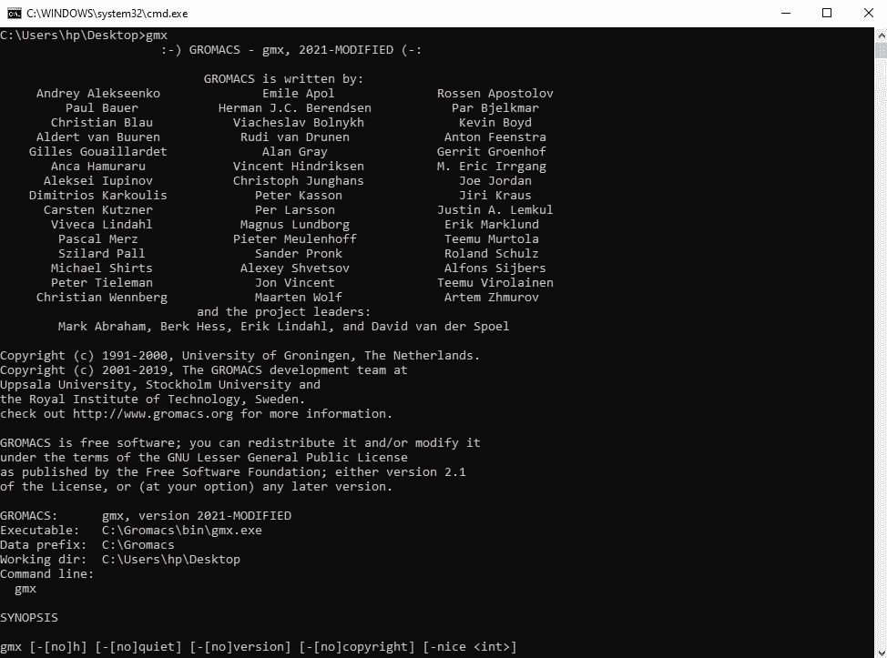

# 在 Windows 上编译和运行 GROMACS

> 原文：<https://medium.com/codex/compiling-and-running-gromacs-natively-on-windows-9bc40d9bc830?source=collection_archive---------0----------------------->

我已经在分子动力学(MD)模拟项目上工作了几个月。在此之前，我对分子动力学模拟并不特别熟悉，但我必须学会使用 NAMD 和格罗马科斯——这两个非常流行的软件可以使用力场运行各种类型的计算(即原子被视为服从牛顿动力学的经典粒子，它们之间的力由参数化方程表示)。还有其他用于 MD 模拟的软件，比如 OpenMM，但是我猜想 GROMACS 和 NAMD 占据了发表的关于 MD 的论文的绝大部分。

NAMD 为 Windows 提供了预编译的二进制文件，但 GROMACS 没有，所以需要编译。在 Linux 或类似 POSIX 的系统上，编译非常容易。在 Windows 上，可以编译，但是程序有点难。

**TL，**博士:如果你只想要编译好的二进制文件，不想进一步阅读，那么请访问[这个](https://github.com/ShoubhikRaj/gromacs-windows) github 仓库，我在那里放了 GROMACS 的预编译 Windows 二进制文件。

下面是如何为 Windows 原生编译 GROMACS(即没有 Cygwin 或 WSL):

## 要求—

1.  Windows 10 (Windows 8 和 7 应该也可以运行，但还没有经过测试)
2.  微软 Visual Studio 2019 (2017 也可以，旧版本可能可以)
3.  [英特尔 oneAPI 基本工具包(MKL 版)]或[FFTW3 库]
4.  (可选)介子和忍者

## 正在安装 Visual Studio 2019

Visual Studio 2019(或 2017)的社区版可以从微软网站免费下载。社区版足以满足我们的目的。(下载页面:[最新版本(VS2019)](https://visualstudio.microsoft.com/downloads/) 、 [VS2017 及更老版本](https://visualstudio.microsoft.com/vs/older-downloads/))

下载并运行安装程序。当安装程序询问应该安装哪些组件时，请确保选择“使用 C++进行桌面开发”。其他选项对于安装 GROMACS 来说不是必需的，所以如果您愿意，可以不选中它们。



Visual Studio 2019 安装程序

我建议不要改变右侧的任何可选安装。构建 GROMACS 需要“C++ CMake tools for Windows”。单击“安装”下载并安装 Visual Studio。

我们将使用命令行编译。为此，必须启动编译器命令行环境。请检查“开始”菜单中是否有“用于 VS2019 的 x64 本机工具命令提示符”选项，如下所示:



打开编译器命令提示符，检查运行`cl`是否给出如下输出:(cl.exe 是 MSVC++编译器)



测试命令行上是否存在 cl.exe(MSVC ++编译器)

## 安装面向 MKL 的英特尔 oneAPI(FFT w3 的替代产品)

GROMACS 需要快速傅立叶变换库用于许多模拟选项，如粒子网格 ewald 静电学。这些库可以由英特尔 MKL(数学内核库)提供。英特尔 MKL 非常快，尤其是在英特尔芯片上。(我不确定在 AMD 之类的其他芯片上是否一样快；前段时间有报道称，英特尔在 MKL 中插入代码，检查处理器是否是英特尔的，如果不是，则运行速度较慢的代码。但是在 2020 年的更新 3 中，英特尔声称已经修复了它们。)

如果你为 GROMACS 选择 MKL，MKL 也将用于线性代数(BLAS 和 LAPACK)。英特尔 MKL 现已作为英特尔 oneAPI 基础工具包的一部分免费提供(下载页面:[基础工具包](https://software.intel.com/content/www/us/en/develop/tools/oneapi/base-toolkit/download.html))。选择 Windows 作为操作系统。我建议下载在线安装程序，因为本地安装程序有完整的 oneAPI 基础工具包，这是不必要的。然后点击下载，网站会提示你登录——如果没有账号就点击下载为访客。

下载后运行安装程序。请确保仅选择“英特尔 oneAPI 数学内核库”选项，因为其他选项并不需要。



英特尔 oneAPI 安装程序 2021(它显示安装在 MKL 旁边，因为我已经安装了它)

请注意左下角的安装位置。确保可以从安装目录中找到库`mkl_intel_lp64.lib`、`mkl_sequential.lib`和`mkl_core.lib`。如果保留默认值，那么这些库应该在`C:\Program Files (x86)\Intel\oneAPI\mkl\latest\lib\intel64\`中。

## **使用 FFTW3 库(替代 MKL)**

如果你用的是英特尔芯片，MKL 会给你最好的性能。MKL 也在 AMD 芯片上工作，但有可能其他库会提供更快的性能。您必须运行基准测试并亲自检查。FFTW3 就是这样一个开源库，它提供了快速傅立叶变换功能。

要使用 FFTW3，请从[https://www.fftw.org/install/windows.html](https://www.fftw.org/install/windows.html)下载库。遗憾的是，FFTW3 默认提供源代码，没有官方的 windows 预编译库。链接的页面提供了由其他用户编译的窗口库。请注意，windows 库是旧版本(3.3.5)而不是最新版本(3.3.9)。如果您希望使用 FFTW3，请下载 64 位版本的 zip 文件并解压到一个文件夹中。

对于 GROMACS 的普通构建，需要单精度 FFTW3 库。因为这里使用了 MSVC++编译器，所以这个库需要以导入库格式存在。lib)，这在档案中没有提供。

来制造。lib 文件，打开 MSVC++的编译器命令提示符(“x64 本机工具……”)。导航到 FFTW3 文件所在的文件夹，然后运行`lib /machine:x64 /def:libfftw3f-3.def`。这将生成一个`libfftw3f-f.lib`文件。这是我们在编译 GROMACS 时需要的单精度 FFTW3 导入库。

## (可选)介子和忍者

Ninja 是一个构建系统，它可以获取从 CMake 生成的构建文件，并执行编译和链接以准备最终的可执行软件。忍者和介子通常在一个[安装程序](https://mesonbuild.com/Getting-meson.html)中一起发布。(我们其实对介子没有任何需求)

我们需要用忍者来建造格鲁马克吗？不会，因为 Visual Studio 已经有一个可以完成相同工作的生成系统(nmake ),并且默认情况下与 Visual Studio 一起安装。然而，ninja 可以使用 PC 的所有内核来运行并行编译作业，而 nmake 只能顺序运行编译，因此需要的时间稍长。出于这个目的，时差不是很大，所以你可以使用`nmake`或`ninja`，随你喜欢。

## 下载 GROMACS

GROMACS 以非常频繁的间隔发布源代码。不同版本的源代码可以从[这个页面](https://manual.gromacs.org/documentation/)下载。由于他们在每个版本中都会对源代码稍作修改，因此将来的版本可能会在编译过程中出错。本指南使用的是 2021.1 [版本](https://manual.gromacs.org/documentation/2021.1/download.html)。

下载 tar.gz 档案，然后将其解压缩到一个文件夹中。

## 一些修改

对于某些版本，可能需要进行修改。

对于 2021.1 版本，需要更改一个文件名。转到解压后的源文件所在的文件夹，找到文件 src \ gro Macs \ nbn XM \ kernels _ SIMD _ 2 xmm \ kernel _ ElecQSTabTwinCut _ VdwLJEwCombGeom _ vgr pf . CPP 0000666，这个文件的扩展名应该只是。cpp，所以去掉那些数字。(我不确定为什么这个文件有一个奇怪的扩展名，但是如果没有这个文件，我会在链接时遇到无法解决的外部错误。)2021.2 或更高版本不存在此问题。

对于 2021 版本，不需要任何更改。我相信这同样适用于旧版本。

## 运行 CMake 以生成生成文件

CMake 与 Visual Studio 捆绑在一起，可以从 x64 本机工具命令提示符运行。在编译器命令提示符下，导航到 GROMACS 源文件被解压缩的文件夹。

按顺序运行以下命令(如果使用 MKL):

```
set CC=cl
set CXX=clcmake -G"NMake Makefiles" -S. -B./build -DGMX_GPU=off -DGMX_FFT_LIBRARY=mkl -DCMAKE_BUILD_TYPE=Release -DBUILD_SHARED_LIBS=off -DMKL_INCLUDE_DIR="C:/Program Files (x86)/Intel/oneAPI/mkl/latest/include" -DMKL_LIBRARIES="C:/Program Files (x86)/Intel/oneAPI/mkl/latest/lib/intel64/mkl_intel_lp64.lib;C:/Program Files (x86)/Intel/oneAPI/mkl/latest/lib/intel64/mkl_sequential.lib;C:/Program Files (x86)/Intel/oneAPI/mkl/latest/lib/intel64/mkl_core.lib"
```

前几行设置了一些环境变量(这些变量并不总是必需的，但我设置它们只是为了安全起见)。CC 和 CXX 变量分别存储 CMake 将使用的 C 和 C++编译器的名称(这里 MSVC++用于两者)。

(注意:cmake 命令是一个完整的命令，即没有分成几行)

这里有几点需要注意。`-G`选项决定编译使用的构建系统。这里的参数“NMake Makefiles”指定了`nmake`。如果你想使用忍者，使用参数忍者(没有引号，即`-GNinja`)。`-S`选项告诉 cmake 当前目录(`.`)是源目录。`-B`选项告诉它创建一个文件夹`./build`并将所有已配置的构建文件放在那里。`-DGMX_GPU=off`表示不使用 GPU 加速(因为我目前没有 GPU；如果我得到一个，我会用一个 GPU 加速构建指南来更新它)。

然后`DGMX_FFT_LIBRARY=mkl`选择英特尔 MKL 作为傅里叶变换库。`-DCMAKE_BUILD_TYPE=Release`表示使用最高优化，没有任何调试工具。`-DBUILD_SHARED_LIBS=off`意味着 GROMACS 二进制文件被静态链接到 gromacs 库(`gromacs.lib`)并且更具可移植性。

因为我们已经将英特尔 MKL 指定为快速傅立叶变换库，所以我们需要指定它的位置。`-DMKL_INLCUDE_DIR`给出包含文件的位置(如`mkl.h`这样的头文件)。英特尔 oneAPI 的默认安装目录是`C:/Program Files (x86)/Intel/oneAPI/mkl/latest/include`。如果您将它安装在不同的位置，请确保相应地更改路径。

`-DMKL_LIBRARIES`给出了库的位置。MKL 静态链接需要三个库:`mkl_intel_lp64.lib`、`mkl_sequential.lib`和`mkl_core.lib`。必须给出每个库的完整路径，用分号隔开。和以前一样，如果您在不同的位置安装了 oneAPI，请进行相应的更改。

注意，每个路径参数必须在一对双引号(`“ ”`)内，因为它们包含空格。还要注意在路径中使用了正斜杠(`/`)，而不是 Windows 风格的反斜杠(`\`)。这是因为 CMake 采用带正斜杠的路径，因为它将反斜杠视为转义字符。您必须使用正斜杠，否则 CMake 将无法找到文件。

运行此命令后，CMake 将测试许多不同的选项，并尝试在您的 PC 上选择最佳的编译选项。如果有几条“—失败”的消息，不要担心。最后，它应该向您显示消息“生成完成”和“构建文件已被写入…”。这意味着 CMake 配置成功。



CMake 编译成功完成时的命令行输出

使用 FFTW3 库时，运行以下命令:

```
set CC=cl
set CXX=clcmake -G"Nmake Makefiles" -S. -B./build -DGMX_GPU=off -DGMX_FFT_LIBRARY=fftw3 -DCMAKE_BUILD_TYPE=Release -DBUILD_SHARED_LIBS=off -DFFTWF_INCLUDE_DIR="G:/Installer/gromacs-2021.1/fftw/fftw-3.3.5-dll64" -DFFTWF_LIBRARY="G:/Installer/gromacs-2021.1/fftw/fftw-3.3.5-dll64/libfftw3f-3.lib"
```

这里，`-DFFTWF_INCLUDE_DIR`应该指向包含文件`fftw3.h`所在的目录。`-DFFTWF_LIBRARY`应该指向单精度 FFTW3 ( `libfftw3f-3.lib`)的库文件

同样，CMake 应该能够成功地生成构建文件。

## 最终编译和链接

最终的编译和链接可以通过`nmake`或`ninja`完成。NMake 可以从 x64 本机工具命令提示符运行。如果您使用了 Windows 的 meson-ninja 安装程序，那么`ninja`会在安装过程中自动添加到路径中，因此 ninja 可以从任何命令提示符下运行。

导航到 GROMACS 源文件夹中的 build 文件夹，然后运行 NMake:

```
cd build
nmake
```

对于忍者，运行:

```
cd build
ninja -j 4
```

这里，`-j 4`表示 Ninja 将使用 4 个内核来运行并行编译进程。如果您的芯片中有更多的内核，则更改该值。

编译需要一些时间(大约 20 分钟)。您将看到一个很长的输出，并且可能会有一些编译器警告——可以忽略它们。除非有任何错误消息，否则在最后你会看到“链接 gmx.exe”或类似的消息。如果链接成功，可以在构建文件夹中找到二进制 gmx.exe。

如果你用的是 Ninja，`gmx.exe`一般在 build/bin 文件夹下。如果您使用 NMake，那么`gmx.exe`可能就在构建文件夹本身中。

## (可选)MPI 并行构建

GROMACS 的默认构建可以使用 OpenMP 并行化，和/或它自己的基于线程的并行化(称为 thread-MPI)。两者都相当高效。但是，如果有非常多的处理器，或者您在多个处理器(节点)上运行它，那么 MPI 并行化会更好。在笔记本电脑或家用台式机上使用基于 MPI 的构建，您不太可能获得任何优势。然而，如果你想使用 MPI 并行的 GROMACS 二进制文件，首先从[这里](https://www.microsoft.com/en-us/download/details.aspx?id=100593)安装 MS-MPI。然后将参数`DGMX_MPI=on`添加到 CMake 调用命令中。CMake 会自动检测 MS-MPI 的位置，并用它进行编译。

注意，打开 MPI 会自动关闭 thread-MPI。您仍将获得 OpenMP 支持。还要注意，编译完成后，可执行文件将被命名为`gmx_mpi.exe`。

## 为运行设置 GROMACS

首先，选择运行 GROMACS 的目录。例如，您可以将它保存在“C:\gromacs”中。确保目录名中没有任何空格。

在这个文件夹里面创建一个文件夹“bin”，然后把`gmx.exe`放到“bin”子文件夹里面。

然后转到您解压缩 gromacs 源文件的文件夹。找到“共享”文件夹。将“共享”文件夹复制到 GROMACS 目录中。然后在共享文件夹中创建一个名为“gromacs”的新文件夹，并将模板和顶层目录放入其中。(如果比较混乱就看看下面的目录树)。

GROMACS 使用 OpenMP 并行化和 Microsoft Visual C/C++运行时。这些是由提供的。dll 文件(动态链接库)。我不完全确定 Visual Studio 是否会自动安装它们。如果没有安装，程序将不会运行。您也可以在这里只安装 Visual C++可再发行软件包[中的 dll 文件。](https://support.microsoft.com/en-us/topic/the-latest-supported-visual-c-downloads-2647da03-1eea-4433-9aff-95f26a218cc0)

**如果您使用英特尔 MKL:**

GROMACS 可执行文件静态链接到英特尔 MKL，因此不需要 dll。

**如果您使用 FFTW3:**

在解压 FFTW3 的目录中找到`libfftw3f-3.dll`文件。将该文件复制到`gmx.exe`所在的“bin”子文件夹中。

**(可选)复制 gromacs 库**

当您完成编译时，在“lib”文件夹 insider build 文件夹中应该有一个 gromacs.lib 或 gmx.lib 库。只有当您要在另一个程序中使用 GROMACS 时，才需要这样做。你可以将这些文件复制到 GROMACS 安装目录下的“lib”子文件夹中，但我认为这是不必要的。

(注意:如果你在编译时没有使用`-DBUILD_SHARED_LIBS=off`，那么可以创建一个 gromacs.dll 或 gmx.dll 文件。你必须将这些文件复制到“bin”文件夹中。)

最后，您的 GROMACS 目录树应该如下所示:

```
C:\gromacs\
├───bin
│   ├───gmx.exe
│   ├───vcomp140.dll
│   └───[libfftw3f-3.dll] (only if you used FFTW3)
├───lib
│   └───gromacs.lib
│
└───share
    └───gromacs
        ├───template
        │   └───cmake
        └───top
            ├───amber03.ff
            ├───amber94.ff
            ├───amber96.ff
            ├───amber99.ff
            ├───amber99sb-ildn.ff
            ├───amber99sb.ff
            ├───amberGS.ff
            ├───charmm27.ff
            ├───gromos43a1.ff
            ├───gromos43a2.ff
            ├───gromos45a3.ff
            ├───gromos53a5.ff
            ├───gromos53a6.ff
            ├───gromos54a7.ff
            └───oplsaa.ff
```

一旦所有的文件都准备好了，我们需要创建一种方法来从命令行访问 GROMACS 二进制文件和那些文件。

为此，创建一个名为“GMXRC.bat”的文件，其内容如下:

```
@set "PATH=C:\Gromacs\bin;%PATH%"
@set GMXDATA=C:\Gromacs\share\gromacs
@cmd
```

如果使用不同的位置，请更改路径。保存这个。蝙蝠文件放在方便的地方。

无论何时，你需要运行 GROMACS，只要双击 bat 文件，它就会打开一个命令提示窗口，你可以在那里运行 GROMACS。键入`gmx`并按回车键；您应该会看到类似这样的内容:



格罗马科斯跑了！

对于 MPI 并行构建，您必须使用 MS-MPI `mpiexec`命令来启动二进制文件。因此，如果您的计算机上有 4 个处理器，您将使用`mpiexec -np 4 gmx_mpi.exe <commands>`。安装 MS-MPI 时,`mpiexec`命令会自动安装到您的路径中。

## 回归测试

您可以通过运行回归测试来测试您是否正确编译了 GROMACS。这些测试可以从与 GROMACS 源代码相同的网页上下载(例如，v2021.1 下载[这里](https://manual.gromacs.org/documentation/2021.1/download.html))。

您还需要 Perl 来运行测试。测试时间不长，最多 3 分钟。因此，我建议运行一次测试。如果一切正常，那么最后您会看到消息“所有 7 个重要的动态测试都通过了”。

如果任何一个测试失败了，可能是编译出错了。

就这样吧！您已经在 Windows PC 上启动并运行了 GROMACS。

## 值得吗？

正如您所看到的，在 Windows 上编译相当痛苦，因为您需要显式地指定库和包含文件等的路径。

经历这些麻烦值得吗？当我进入计算建模领域时，我经常被告知“你为什么不买 Linux？”当面对不能在 Windows 上运行的软件时。我的笔记本电脑安装了 Windows，我有所有我经常需要的文件和实用程序。试图安装一个双引导的 Linux 太冒险了。尽管 Linux 是一个相当健壮和古老的操作系统，但许多实用程序仍然不存在于 Linux 上。例如，我的大学工作需要使用 VPN，而 VPN 客户端只安装在 Windows 或 Mac 上。

承认，对于任何主要的生产计算，您都需要使用 HPC(即超级计算机)。但是大量的测试和准备工作必须在我自己的电脑上完成，如果你的电脑足够强大，小批量生产甚至可以完成。所以我认为在 Windows 上编译 GROMACS 或其他软件是值得的，如果它们能在 Windows 上运行的话。

一提到在 Windows 上编译源代码(针对 Linux)就有很多人提到 Cygwin 和 WSL。但是它们都是 Linux 兼容层，并且非常慢，尤其是在涉及文件 I/O 的情况下。使用它们应该是最后的手段，而不是第一选择。

正如开始提到的，我已经把我编译的 GROMACS 可执行文件放在我的 github repo [这里](https://github.com/ShoubhikRaj/gromacs-windows)。这些是预编译的二进制文件，但是仍然需要安装 Visual C++的可再发行文件(因为二进制文件依赖于 Visual C/C++ OpenMP 运行时库)。存储库中的自述文件中提供了相关说明。

以上所有指南都是在只考虑 64 位机器(x64)的情况下编写的。对于 32 位机器，会有一些变化。