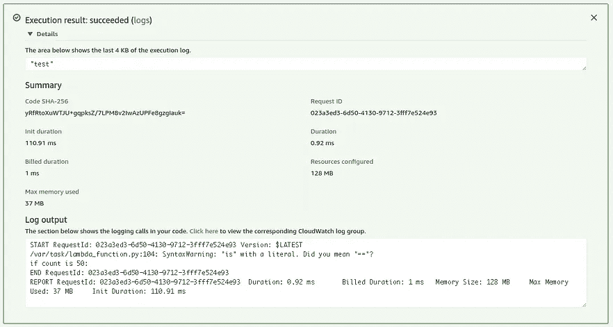

# 关于如何使用 AWS Lambda & DynamoDB 进行网页抓取的完整指南

> 原文：<https://medium.com/codex/complete-guide-on-how-to-use-aws-lambda-dynamodb-for-web-scraping-bb95f9f038b?source=collection_archive---------2----------------------->

数据收集是数据科学中的一个必要步骤。你既可以下载预先收集的数据，也可以自己收集。收集数据的方式之一是[网络抓取](/codex/whats-and-how-s-about-web-scraping-baaf9b619ec2)。通常，这需要您定期运行代码。为此，您有两个选择。首先，你可以每小时坐下来运行你的代码。第二，你可以在云平台上上传并运行你的代码。第一种选择会更快更容易实现，但第二种选择更可靠。所以我建议你试试云服务之一的亚马逊网络服务( [AWS](https://aws.amazon.com) )。

照片由[克里斯蒂安·威迪格](https://unsplash.com/@christianw?utm_source=medium&utm_medium=referral)在 [Unsplash](https://unsplash.com?utm_source=medium&utm_medium=referral) 上拍摄

# 什么是 AWS？

AWS 是亚马逊支持的云计算平台，包括基础设施即服务(IaaS)、平台即服务(Paas)和打包软件即服务(SaaS)产品[【5】](https://www.guru99.com/what-is-aws.html)。简单地说，AWS 让你在他们的服务器上运行复杂的程序或服务，这样你就不需要一台尖端的计算机。有许多服务可供你选择。其中，今天我们需要 Lambda、EventBridge、Dynamodb 和 Identity&Access Management(IAM)来进行 web 抓取和保存数据。

# 什么是 AWS Lambda，EventBridge，DynamoDB，IAM

## 希腊字母的第 11 个

简而言之，AWS Lambda 允许你编写或上传代码和依赖项，这样你就可以使用亚马逊的基础设施来运行代码，而不是用你的计算机。这样做的好处是，您可以运行任何代码，而不管您的计算机具体情况如何，并且不需要打开计算机来运行您的代码。此外，您可以将它与其他 AWS 服务集成，以完成更高级的工作。

默认情况下，它设置 60 秒的运行时间，但这通常不足以进行网络抓取。幸运的是，它允许您将时间延长到最长 15 分钟，因此当您稍后编写代码时，您需要小心不要让您的代码超过这个限制。

AWS Lambda 主页

## 事件桥

在官方文档上，它说 AWS EventBridge 允许您将应用程序与来自各种来源的数据连接起来。这意味着它实时检测来自其他服务的事件，并在检测到事件时激活操作。因此，使用这个服务，您可以轻松地在服务之间建立连接或监控您的流程。

AWS EventBridge 主页

## DynamoDB

Dynamodb 是一个 NoSQL 数据库服务，您可以从 AWS 使用它。因为 AWS 负责数据库的配置过程，所以您可以轻松地创建表、存储数据和查询行。使用它的好处之一是可伸缩性，因为它使用云来存储数据。

AWS DynamoDB 主页

## InternationalAssociationofMachinists 国际机械师协会

但是，出于安全原因，默认情况下不能从其他服务访问这些服务。您需要首先从 IAM 创建角色，并将这些角色分配给每个服务，以便与其他服务进行连接。

AWS IAM 主页

# 如何使用这些来抓取网页

在我们进入步骤之前，这篇文章写于 2022 年 4 月，AWS 网站可以随时更改。因此，你应该知道，如果你在遥远的将来读到这篇文章，下面的过程可能是不准确的。此外，在下面的步骤中，我将使用 Python 3.9 进行网络抓取。

## 1.构建 web 抓取代码

在您开始使用 AWS 之前，在别处构建一个有效的 web 抓取代码是一个好主意。这可以是 Google Colab 或本地 IDE，具体取决于您的情况。

下面的代码是我从一个卖旧货的网站收集数据的版本。它使用 sqlite3 来存储数据，但稍后会更改为 DynamoDB。

[Daangn](https://www.daangn.com/) 网站的网页抓取代码

## 2.在 Lambda 中创建函数

要将代码上传到 AWS 服务器，首先需要在 AWS Lambda 中创建一个函数。

1.  点击 Lambda Dashboard 中的“创建函数”

2.写下你的函数名并选择你的网络抓取代码的运行时间。然后，点击“创建函数”。

## 3.修改您的代码

根据您的编码方式，代码的结构可能会有所不同。但是 AWS lambda 要求您遵循某些规定，因此您应该相应地更改您的代码。你需要遵循的一条规则是 Lambda 运行单个函数。默认情况下，它被命名为 lambda_handler()。所以你要么调用 lambda_handler()中所有必要的函数

在 lambda_handler()中添加 scrape()后的屏幕截图

或者通过在运行时设置中编辑处理程序来更改其名称。函数名前面的“lambda_function”表示 python 文件名。

更改处理程序后的样子。

## 4.添加依赖关系

另一件需要注意的事情是，不能在 AWS 默认不支持的包中使用 import 语句。因此，您应该上传包文件和代码，以便使用导入语句。在我的例子中，要使用 bs4 包，

1.  从 [Python 包索引](https://pypi.org/)网站下载 bs4 zip 文件

[PyPI 网站](https://pypi.org/)

2.解压文件夹&找到一个包含 __init__ 的文件夹。py 文件。通常，带有包名的文件夹就是。

3.将依赖文件夹和代码文件一起压缩

4.通过“上传自”→”上传到 Lambda。zip 文件"

当一切都完成后，您可以在代码的左侧找到依赖文件。

注意，我删除了 sqlite3 import 语句和相关代码，因为我打算使用 DynamoDB。

## 5.测试您的功能

即使您在步骤 1 中确认了您的代码可以工作，但是在您上次检查之后，事情发生了很大的变化。所以最好再检查一遍，你可以按照下面的步骤来做。

1.  选择您的功能

2.单击测试选项卡

3.写下活动名称并选择 hello-world 模板。然后，省省吧。

4.通过单击“测试”选项卡中的“测试”来测试您的活动

5.下图显示了您的活动进展情况

6.您也可以从“代码”选项卡→测试按钮测试您的代码

## 6.在 DynamoDB 中创建表

既然我已经删除了存储收集到的数据的行，我需要继续工作。首先要做的是在 DynamoDB 中创建一个表。

1.  从 DynamoDB 仪表板中，单击创建表

2.写表名、分区键、排序键&为分区和排序键选择数据类型

如果您是 DynamoDB 的新手，您会想知道分区和排序键是什么。简单地解释一下，哈希函数中使用分区键来确定使用哪个分区来存储数据。相比之下，排序键用于对每个分区内的值进行排序。你可以在两种情况下使用这两个。

首先，您只能使用分区键。在这种情况下，分区键在表中应该是唯一的，这样每个条目都是可区分的。因此，它在 SQL 表中充当主键，用于访问行。

第二，两者都可以用。在这种情况下，分区和排序键值的组合应该是唯一的。因此，有可能有相同的分区键值，除非通过不同的排序键值使组合是唯一的。

例如，当您在 DynamoDB 中存储一个以作者和书名为关键字的图书列表时，您可以将每个作者和书名设置为分区和排序关键字。这允许你有相同的作者名，但是在同一作者下的标题应该是唯一的。所以最后，作者-标题组合对于每一行都是唯一的。

在我的例子中，我的代码从 Time 列中包含 1 的行中找到最近的 ArticleNum 值。因此，我将 Time 设置为分区键，将 ArticleNum 设置为排序键。

3.在“设置和创建表格”下选择默认设置

## 6-1.向表中添加项目

这不是一个必要的步骤，但是我需要这样做，因为我的代码是这样工作的。如上所述，我的代码通过从包含“1”的行中查找最高的 ArticleNum 来查找最近的文章。所以我的代码不会开始，除非至少有一行给出了起点。所以我需要添加一个虚拟行。

1.  从您创建的表中单击浏览表项目

2.单击创建项目

3.通过单击添加新属性，输入属性名称、值和类型

381392502 表示我写这个帖子时最近的一个帖子

然后，您可以看到该项目被添加到表中。

## 7.用 Lambda 函数连接 DynamoDB 表

目前，您有一个 web 抓取功能和一个准备存储数据的表。你还没有的是两者之间的联系，你可以用 boto3 来实现，它允许你用 Python 来管理 AWS 服务。如果你想深入了解它的文档，请点击[链接](https://boto3.amazonaws.com/v1/documentation/api/latest/index.html)。但是如果你只是想知道如何用 Lambda 连接表，请看下面的代码。

从上面的代码来看，第一行意味着它将调用位于“ap-northeast-2”地区的 DynamoDB 服务。然后，第二行从第一行建立的连接中调用“table_name”表。

在我的例子中，我在 Seoul 服务器上创建了我的表。这就是我将“ap-northeast-2”传递给 region_name 参数的原因。因此，当您在代码中应用它时，应该从表的一般信息中找到您所在的地区，并相应地进行更改。

在哪里找到表格的区域

## 7-1.从 Lambda 函数对 DynamoDB 表使用查询

可以在 DynamoDB 表上执行的两个操作是查询和扫描。虽然它们似乎执行类似的任务，但它们之间的差异是至关重要的。

Query 直接从用作条件的分区中查找值，而 Scan 则从表中的每一行中查找符合条件的行。因此，查询可以保证比扫描更快的速度。所以通常建议使用查询而不是扫描，除非您不知道表的分区和排序键。你可以在 Rafal Wilinski 写的 Dynobase [文章](https://dynobase.dev/dynamodb-scan-vs-query/)中找到更详细的解释。要简要了解如何使用 python 进行查询，请参见下面的代码。

需要从 boto3.dynamodb.conditions 导入密钥进行查询

如您所见，代码非常简单。第一行代码返回 Time 列中值为 1 的每一行，Time 列是分区键。所以我在我的例子中使用了 eq，但是如果你希望一个条件是一个取值范围，你可以用 le，lt，ge，gt，begins_with，between 代替 eq。每个 le、lt、ge、gt 代表小于或等于、小于、大于或等于、大于。然后，我将 ScanIndexForward 设置为 False，以降序对返回的行进行排序。默认值为 True，按升序排列。

在第二行中，["Items"]允许您访问查询返回的行列表。然后，从每一行中，您可以使用列名来访问它的值。在我的例子中，我只从第一项中检索值，因为我只需要最高的 ArticleNum。

关于您可以使用的功能的更详细的解释，请查看 Boto3 [文档](https://boto3.amazonaws.com/v1/documentation/api/latest/reference/services/dynamodb.html)。

## 7-2.授予访问权限

即使您正确地编写了每一行代码，它也不会工作，除非您提供对 lambda 函数的访问权来处理该表。

1.  从 IAM 的策略选项卡中，单击创建策略

2.在第一页中，选择 JSON，复制并粘贴以下代码，并根据表中的常规信息修改资源参数

要粘贴到策略中的代码。123456789012 代表账户 ID。您应该用自己的名称替换那个和 REGION _NAME。

3.跳过添加标签

4.写下策略名称和描述，然后单击创建策略

5.从 IAM 下的角色选项卡中，单击创建角色

6.选择 AWS 服务和 Lambda

7.搜索并单击您在步骤 4 中创建的策略的复选框

8.键入角色名称并创建角色

9.从您为网页抓取创建的功能中，单击配置→权限→编辑

10.将超时延长到 15 分钟&选择您在步骤 8 中创建的角色

11.然后，当您运行代码时，您可以通过检查从表中检索的值来确认连接已建立

## 7-3.确认你的网页抓取工作

最后，现在是检查整个过程的时候了:从抓取网页数据到将数据存储到 DynamoDB。

当它按预期工作时，您可以看到行被添加到表中。

## 8.从 EventBridge 调度 Lambda 函数

最后，你需要安排你的函数自动运行。

1.  从 EventBridge 中，单击创建规则

2.键入规则名称和描述，并在规则类型下选择时间表

3.在计划模式下定义您的计划

4.在目标类型下选择 AWS 服务&在选择目标下选择 Lambda 函数和您的 web 抓取函数

5.跳过第 4 步，创建您的规则

## 9.检查调度是否有效

当然，在你添加一个特性后，你需要检查它是否工作。你可以从 CloudWatch 查看这个。

1.  从 CloudWatch 转到日志组

2.选择您在 Lambda 中创建的函数

3.查找与 EventBridge 连接相关的日志流。如果你按照步骤，它会是最新的。

4.查看日志事件中的时间戳和消息，以确认 EventBridge 是否成功工作

为了检查 EventBridge 是否工作，我每分钟运行一次代码

# 从 DynamoDB 导出数据

一旦你收集了大量的数据，现在是时候下载它们进行检查了。其中一个方法是通过 S3。

1.  从 S3 存储桶中，单击创建存储桶

2.写下您的桶名并选择您所在的地区

3.选择禁用 ACL 并阻止所有公共访问，以防其他人试图使用它。然后，单击底部的“创建”按钮。

4.从数据管道服务中，单击创建新管道

5.键入管道的名称，选择“将 DynamoDB 表从源导出到 S3 ”,并记下参数。对于输出文件夹，您应该选择您在步骤 3 中创建的 bucket，并在最后键入'/exports '来创建一个文件夹。

6.在“管道配置”下，为日志选择相同的存储桶，并在末尾键入“/logs”。然后，在标签下，在 Key 下键入“dynamodbdatapipeline ”,在 Value 下键入“true”。完成设置后，单击激活。这需要一段时间。

7.现在，你需要做的就是导出。所以转到您想要提取的表。然后，转到导出和流选项卡，并单击导出到 S3。

8.对于目的地 S3 时段，选择您创建的时段

9.状态变为“已完成”后，单击目标 S3 时段下的链接

10.单击 AWSDynamoDB/ →最近的文件夹→数据/文件夹

11.选择文件，然后单击下载

12.解压缩文件时，可以检查数据是否为 JSON 格式。

数据的输出可能是什么样子

一旦你完成了所有的步骤，现在你知道如何使用云服务进行网络抓取并下载收集到的数据。但你应该记住，你是在向亚马逊支付使用这些服务的费用。因此，你从 AWS 使用的资源越多，你在月底支付的费用就越多。因此，如果你的预算有限，我强烈建议你定期查看 AWS 账单页面。

# 参考

[1] Boto3。“Boto3 文档。” *Boto3 文档— Boto3 文档 1.21.32 文档*，[https://boto 3 . Amazon AWS . com/v1/Documentation/API/latest/index . html](https://boto3.amazonaws.com/v1/documentation/api/latest/index.html.)

[2]克罗塞特，莱克斯。“Ko。” *AWS* ，AWS 数据库博客，2019 年 1 月 23 日，[https://AWS . Amazon . com/ko/blogs/Database/how-to-determine-if-Amazon-dynamo db-is-just-for-your-needs and then-plan-your-migration/。](https://aws.amazon.com/ko/blogs/database/how-to-determine-if-amazon-dynamodb-is-appropriate-for-your-needs-and-then-plan-your-migration/.)

[3] MongoDB。“Nosql 的优点。” *MongoDB* ，[https://www.mongodb.com/nosql-explained/advantages.](https://www.mongodb.com/nosql-explained/advantages.)

[4]安德鲁·鲁滨逊。“Ko。”*亚马逊*，quintenz-Verl。，2018 年 1 月 23 日，[https://AWS . Amazon . com/ko/blogs/security/how-to-create-an-AWS-iam-policy-to-grant-AWS-lambda-access-to-an-Amazon-dynamo db-table/。](https://aws.amazon.com/ko/blogs/security/how-to-create-an-aws-iam-policy-to-grant-aws-lambda-access-to-an-amazon-dynamodb-table/.)

5 戴维·泰勒。“什么是 AWS？亚马逊云(Web)服务教程。” *Guru99* ，2022 年 2 月 12 日，【https://www.guru99.com/what-is-aws.html. 

[6]拉斐尔·威林斯基。" DynamoDB 扫描与查询—您需要知道的一切."2020 年 5 月 15 日，https://dynobase.dev/dynamodb-scan-vs-query/.