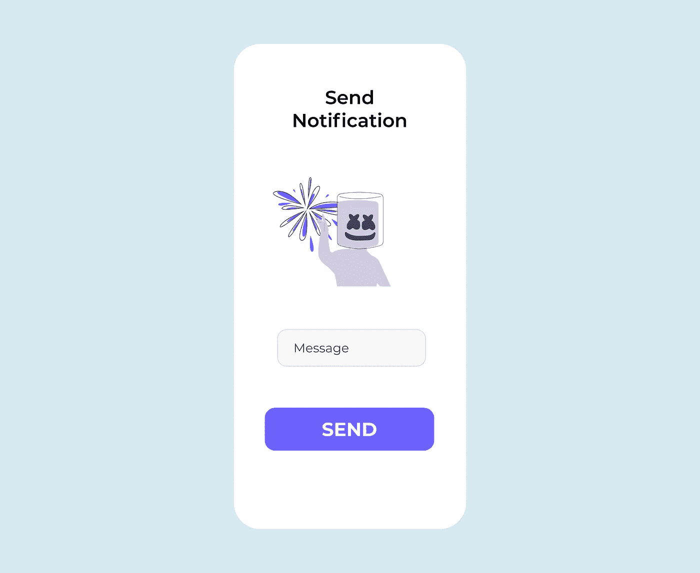
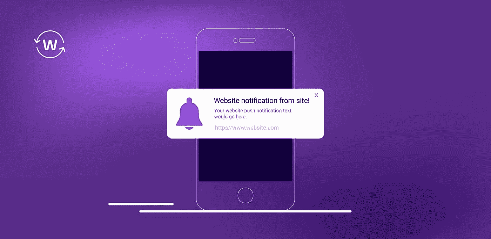
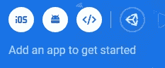
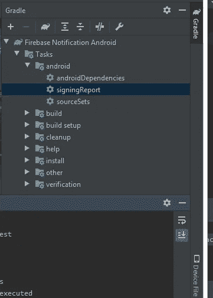
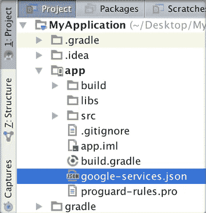
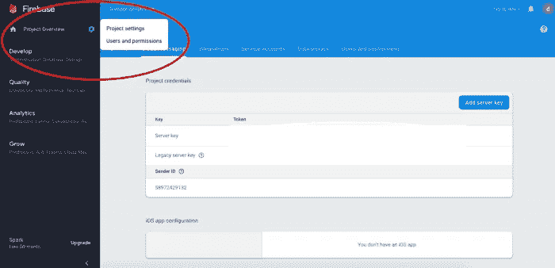

# 使用 Firebase 在 Android 上发送推送通知的完整指南

> 原文：<https://medium.com/codex/complete-guide-on-sending-push-notifications-on-android-using-firebase-82a4c2f7f3a7?source=collection_archive---------0----------------------->

## 药典



你好。👋，我将解释如何使用`Firebase Cloud Messaging`在 android 上发送推送通知。

推送通知是在用户设备上弹出的消息。用户不必在应用程序上就可以看到这些通知。这对用户的保留很重要。

**我们正在建造什么**

我们只是要构建一个应用程序，让用户输入一条消息，并向该用户发送包含该消息的推送通知。简单！😄

这是最终应用程序的样子


点击那个按钮的

*   推送通知会发送给用户，其中包含您输入的消息



**使用的技术**

1.  Firebase(云消息)
2.  Kotlin(适用于 Android)
3.  节点(后端)
4.  Android Studio IDE

**步骤**

*   设置 android studio
*   建立 firebase 项目
*   添加依赖关系
*   设置刀柄和翻新
*   设置 Firebase 云消息传递
*   构建视图
*   设置存储库视图模型和视图
*   用 NodeJS 设置我们的后端

好的，让我们一个一个的看

**建立 ANDROID 工作室**

**创建项目**

*   首先下载 android studio 并安装。
*   创建新项目—选择`Empty Activity`
*   给你的项目起任何名字，我给我的命名为`Firebase Notification Android`
*   点击`Finish`

**结构工程**

我们正在为这个项目使用 MVVM 建筑模式

*   创建 **7** `new packages`给它们命名——`di`、`firebase`、`helper`、`model`、`view`、`viewmodel`、`network`
*   将`MainActivity`移至`view`包装

**设置 FIREBASE 项目**

*   转到[https://console.firebase.google.com/](https://console.firebase.google.com/)
*   登录并点击`Add Project`
*   输入项目的名称——随便取什么名字，
*   点击`Continue`
*   在谷歌分析页面，点击`Continue`
*   选择一个 Google 帐户—选择`Default Account For Firebase`
*   点击`Create Project`
*   你会看到——“`Your new project is ready`”
*   点击`Continue`

恭喜你，你已经成功创建了一个 firebase 项目。现在，让我们把这个项目和我们的 android 应用程序联系起来

**连接 Firebase 和 Android**

*   在您的控制台主页上，单击 Android 徽标



*   安卓包名——去你的`Manifest.xml`，把`package`复制粘贴在那里，应该是这样的——`com.name.firebasenotificationandroid`
*   应用昵称—放入任何内容
*   调试签名证书—转到`Android Studio`，点击`gradle`—`Tasks`— `Android`—`signingReport`—复制 SHA-1 密钥并粘贴



*   点击`Register App`
*   下载`google-services.json`并粘贴到你的`project`文件夹`app directory`



*   添加所有必需的 firebase 依赖项
*   同步项目，你就完成了👏

**添加依赖关系**

这个应用程序利用协程，刀柄，翻新，云消息等。

*   打开您的`build.gradle(app)`文件并添加它们

打开 `build.gradle(project)`添加刀柄类路径

```
.........dependencies *{
    ........*//firebase
    classpath 'com.google.gms:google-services:4.3.4'

    //hilt
    classpath 'com.google.dagger:hilt-android-gradle-plugin:2.28-alpha'
}
............
```

**刀柄**

*   在`di`包下创建 **2** 新类，命名为`AppModule`和`MyApplication`
*   **AppModule** —该类用于执行注入类型，例如我们不拥有的外部库的接口和类，例如翻新。

*   **MyApplication —** 这个类扩展了 Application 类。这将生成所有需要的句柄代码，并作为一个依赖容器。应该是这样的。

```
//Make sure you add this
@HiltAndroidApp
class MyApplication: Application*() {

}*
```

*   最后，转到您的 Manifest.xml 文件，在`application`标记中添加`android:name=”.di.MyApplication”`

**改装**

*   在`helper`包下，创建一个名为`EndPoints`的类

**端点—** 我们的基本 url 和所有 api 调用端点所在的类

```
class EndPoints *{* companion object *{* //BASE
        const val BASE_URL = "https://put-your-base-url-here/"

        //SAVE_TOKEN
        const val SAVE_TOKEN = "save"

    *}

}*
```

*   在`model`包下，创建一个类名`AuthResponse` **AuthResponse —** 的类，该类模拟从服务器获得的响应，以便我们可以采取适当的行动

```
data class AuthResponse*(* val message: String,
    val status: String
*)*
```

*   在`network`包下，创建一个名为`ApiService`的`interface`和两个新类，分别命名为`ApiDataSource`、`BaseDataSource`

**ApiService -** An `interface`，在这里我们将对我们的服务器发出一个`Post Request`来保存用户名和通知令牌。

**ApiDataSource-** 一个公开了`ApiService`的类，这样我们就可以在我们的存储库中使用它

我们完成了改造和刀柄。

**设置 FIREBASE 云消息传递**

*   在`firebase`包下，创建一个新的类——**myfirebasemesagingservice——**这个类扩展了`FirebaseMessagingService`，处理消息，在前台接收通知，接收数据负载，发送流消息

*   在`helper`下创建一个`object` — `Utility` **实用程序**——一个具有构建我们的通知功能的实用程序类——处理诸如——当用户点击通知时的动作，定制通知的外观等等

*   打开`Manifest.xlm`，在关闭应用程序标签之前，添加此

```
*<*service
    android:name=".firebase.MyFirebaseMessagingService"
    android:exported="false"*>
    <*intent-filter*>
        <*action android:name="com.google.firebase.MESSAGING_EVENT"*/>
    </*intent-filter*>
</*service*>
...
</application>*
```

*   添加默认的通知图标、颜色和通道，添加到`application`标签内的`manifest.xml`

```
*<*meta-data  android:name="com.google.firebase.messaging.default_notification_icon"
    android:resource="@drawable/ic_bell" */>

<*meta-data
    android:name="com.google.firebase.messaging.default_notification_color"
    android:resource="@color/colorAccent" */>**<*meta-data
android:name="com.google.firebase.messaging.default_notification_channel_id"
android:value="@string/default_notification_channel_id" */>*
```

这应该就是配置云消息的全部内容

**构建视图/布局**

打开`main_activity.xml`并使用该代码

好了，现在我们有了并不漂亮的视图，一切都设置好了，现在让我们设置我们的存储库和视图模型。

## **设置存储库、视图模型和视图**

*   打开`viewmodel`包，创建 **2** 新类— `MainRepo`和`MainViewModel` **MainRepo —** 这个类作为我们的 viewModel 使用的数据源。

**MainViewModel —** 这个类与存储库通信，api 调用的结果作为 LiveData(生命周期感知)返回，然后由我们的视图(MainActivity)观察

*   打开`MainActivity`

这是这门课的内容

*   通过 ViewBinding 获取视图
*   初始化视图
*   听按钮上的咔哒声
*   与 viewModel 通信以注册用户
*   观察视图模型中的数据，并显示适当的消息

**设置 NODEJS 后端**

*   到你的 firebase 控制台，点击`settings icon`->-`Project settings`



*   切换到`Service Account`选项卡，点击`Generate new private key`
*   确认并下载它
*   现在，在您的 pc 中创建一个文件夹，用您的终端导航到该文件夹
*   `npm init` 并填写所有必需的详细信息。这将创建一个 package.json 文件
*   `npm i firebase-admin` 在您的终端上安装 firebase 依赖项
*   亦作`npm i express` 和`npm i bodyparser`
*   创建配置文件

*   创建 index.js 文件

好了，我们结束了。深呼吸！😫

这是完整项目的链接，请查看

[](https://github.com/ibrajix/FirebaseNotificationAndroid) [## ibrajix/firebase notification Android

### 通过在 GitHub 上创建帐户，为 ibrajix/firebasenotification Android 开发做出贡献。

github.com](https://github.com/ibrajix/FirebaseNotificationAndroid) 

您可以更进一步，首先将针对用户的通知令牌存储在 users 表中，以针对特定用户。

此外，可以使用“主题”向一组用户发送通知

 [## 向 Android | Firebase 上的设备组发送消息

### 设备组消息允许您将多个设备添加到一个组中。这类似于主题消息，但是…

firebase.google.com](https://firebase.google.com/docs/cloud-messaging/android/device-group) 

谢谢大家！

**联系我**

[https://linktr.ee/ibrajix](https://linktr.ee/ibrajix)