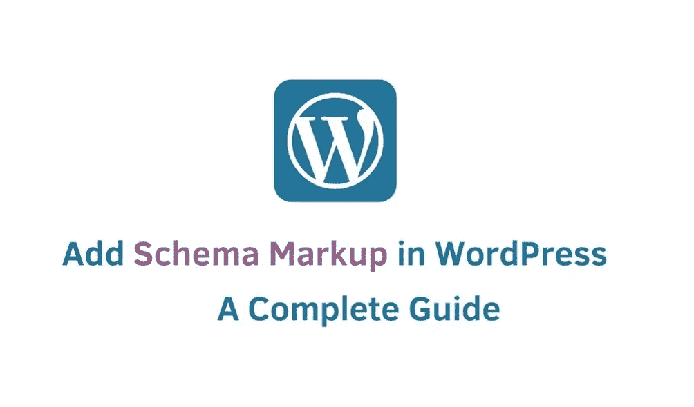
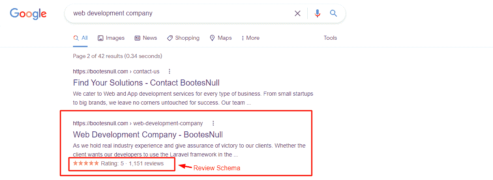
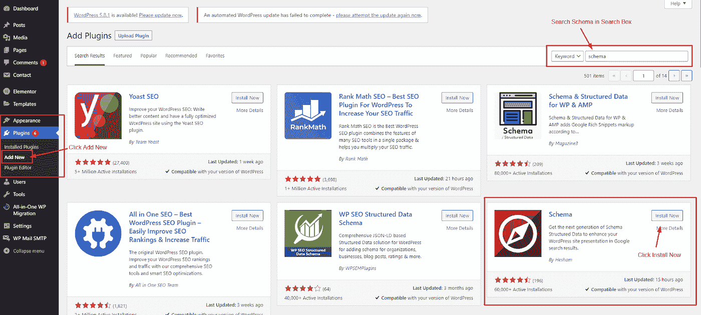
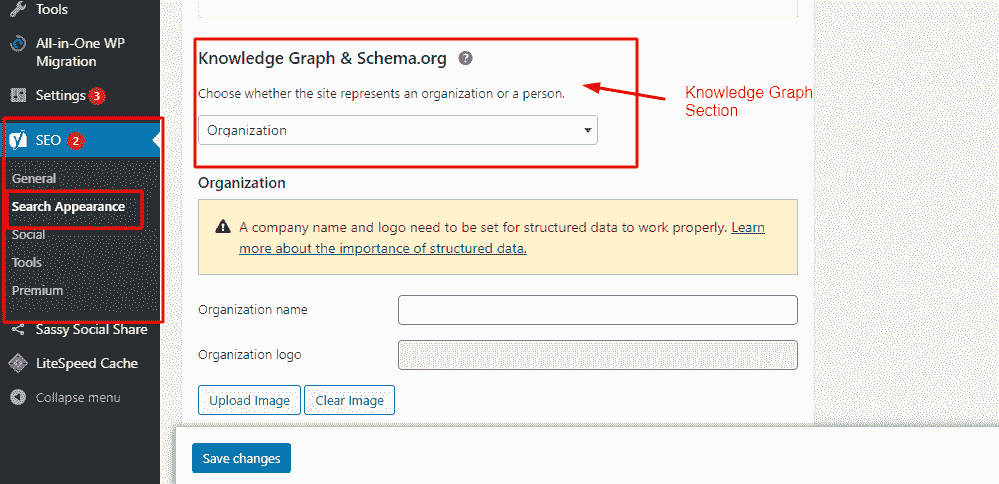
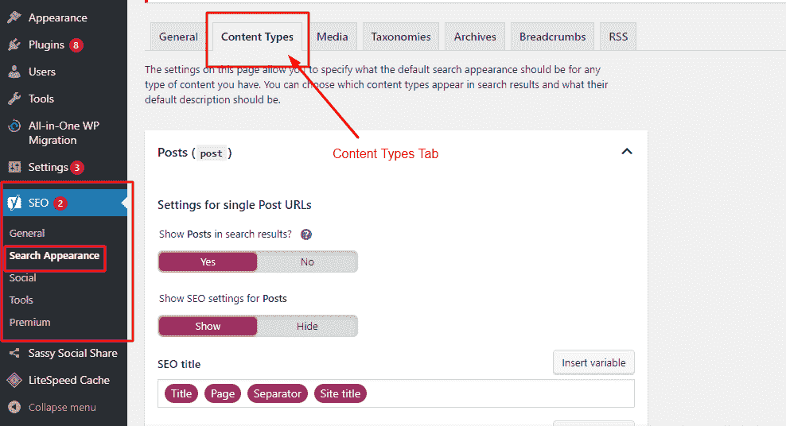
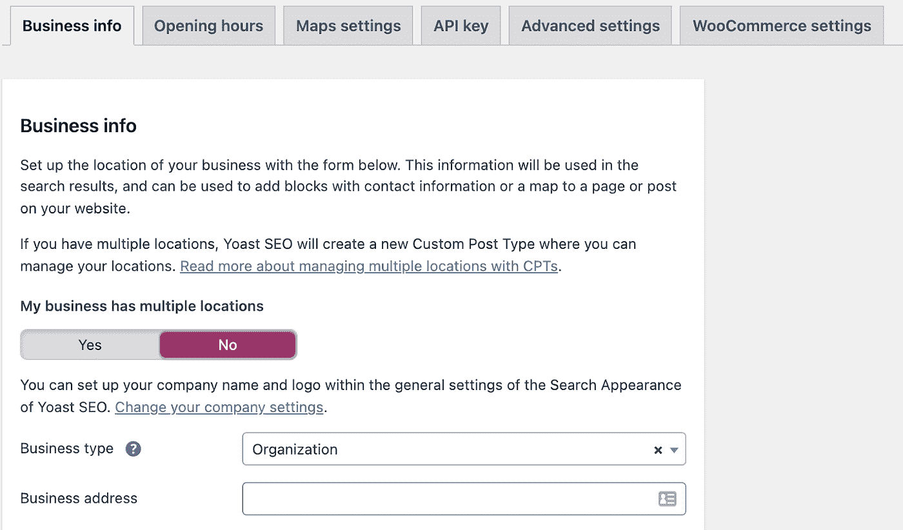

# 在 WordPress 中添加模式标记的完整指南

> 原文：<https://medium.com/codex/complete-guide-to-add-schema-markup-in-wordpress-a3bad832accc?source=collection_archive---------13----------------------->

平均而言，当人们访问谷歌网站时，他们是对产品最感兴趣的人，是在网站上停留时间最长的人，也是购买最多的人！

在 WordPress 中添加模式标记

你想知道为什么和如何吗？你们中的一些人可能知道这背后的技术原因。另一方面，大多数人可能没有意识到这种魔力。让我们一起来发现这个魔法背后的奥秘。开始吧！

**图式！**是的，方案是将受众引向正确产品或网站的主要原因。通过使用模式标记，您可以向 Google 提供与产品相关的结构化数据，以提高搜索引擎结果页面(SERPs)的可见性。

现在，你一定很兴奋也很好奇想知道**如何添加模式标记**！因此，让我们开始这个过程，看看如何在 WordPress 中轻松地添加模式标记。我们开始吧！

在深入探讨**之前，如何在 WordPress** 中添加模式标记？让我们了解一下什么是模式以及它是如何工作的。

# 什么是模式标记？

模式标记是一种代码，它可以告诉搜索引擎你的网站是关于什么的。所以 Schema 不仅仅是出于 SEO 的原因；这也是为了最终用户的利益。

来源:[谷歌](https://www.google.com/)

在搜索结果中，你网站的位置对你获得多少和什么样的访问者有着重要的影响。因此，重要的是找到方法来提高你的网站在搜索引擎中的表现，从而为你带来更多高质量的流量。此外，这些天来，这是绝对的基础，以优化网站更好的搜索引擎优化结果津津乐道的伟大成果。

# 如何在 WordPress 中添加模式标记？

Yoast for WordPress 是向你的 WordPress 站点添加模式标记的最简单的方法。这是迄今为止最好的 WordPress SEO 插件，它可以让你毫不费力地添加模式标记到你的 WordPress 站点。

为了开始，你需要安装并激活 WordPress 的 Yoast SEO。一旦插件被激活，插件将启动一个安装向导，它将引导你完成所有的步骤。

一旦设置完成，插件将生成模式标记并将其应用到您的网站。无论如何，我们建议您手动检查所有模式标记设置，以便在需要时进行更改。

**注意** —要添加模式标记，请遵循以下步骤。

**插件>添加新的并搜索模式**。单击安装，然后激活。

来源:digibharata.com

# 在 WordPress 中设置站点范围的模式标记

第一步是向搜索引擎提供一些关于你的 WordPress 网站的基本信息。你可以通过进入 Yoast SEO **搜索外观>搜索外观进入知识图谱部分。**

来源:digibharata.com

下一步是选择网页是关于一个人还是一个组织。对于组织，您可以提供公司名称、公司电话号码、公司联系信息和徽标。

当您建立一个关于某人的网站(如博客、简历或作品集网站)时，您可以单击下拉列表选择他们的用户帐户或手动输入他们的信息。如果你选择现有用户，你可以从[用户档案页面](https://learnwoo.com/detailed-guide-wordpress-admin-dashboard/)编辑现有用户的档案。此外，你可以添加用户的 Twitter 或脸书个人资料的网址。此外，您需要确保正确添加了名字和姓氏，因为这在搜索用户时起着至关重要的作用。最后，您需要将用户的个人资料照片设置为 Gravatar，并保存您所做的所有最新更改。

# 在 WordPress 中设置默认模式标记

在下一步中，选择 WordPress 默认标签设置，用于为所有的 WordPress 文章和页面生成模式标记。这将确保每个 WordPress 页面、文章、产品或其他内容类型都有一个合适的模式标记设置。

要查看你所有的文章类型，进入 **Yoast SEO 搜索外观页面**和**切换到内容类型标签**。

来源: [BootesNull](https://bootesnull.com/)

每种文章类型都有一个模式标记选项卡。如果切换到它，您可以选择 post 类型将使用的默认模式。如果您需要进行更改，可以在此编辑此网站的设置。例如，如果你运行一个使用 [WordPress posts](https://learnwoo.com/best-free-wordpress-related-posts-plugins/) 的新闻网站，你可能需要将文章类型改为新闻文章。

# WordPress 中文章和页面的模式标记更改

您设置的默认架构设置将确保您的大部分内容不需要任何手动更改。但是，在某些情况下，您可能需要手动更改单个帖子或页面的模式设置。

如果你遇到这个问题，只需编辑你想修改的文章或页面。接下来，在编辑器下面的 AIO SEO 设置框中选择 Schema 选项卡。

或者，您可以选择一个不同的模式，并在本节中为该文章指定微数据。您可以从各种模式类型中进行选择。

# 为本地 SEO 添加模式标记

超过 36%的谷歌搜索是本地搜索。这意味着人们正在附近寻找商业和服务。本地搜索对小企业来说非常有利可图，因为他们通常会做出购买决定。

如果你使用本地搜索引擎优化将你的企业放在地图上，你的企业有可能出现在本地谷歌搜索结果中。此外，你的业务会出现在谷歌的其他产品中，比如谷歌地图，它鼓励人们直接来到你的店面。您可以使用 Yoast SEO 附带的本地 SEO 插件，针对本地搜索结果优化您的网站。

要激活本地 SEO，进入 **Yoast SEO 本地 SEO** 页面，点击激活本地 SEO 按钮。如果您有多个位置，您应该在激活本地 SEO 后启用此选项。

来源: [Yoast](https://yoast.com/)

之后，您可以通过输入位置的详细信息来添加位置。在下面，您可以输入有关您企业的信息，包括企业名称、徽标、电话号码、企业类型、支付选项等。接下来，转到“营业时间”选项卡，输入您每天的工作时间，并标记您的业务关闭的日期。最后，确保通过单击 Save Changes 按钮保存更改。在你在 WordPress 中设置了本地 SEO 之后，你也可以注册一个 Google My Business 账户。

# **最终想法**

一个企业经常想方设法名列前茅。然而，如果不付出正确的努力，要在市场上获得想要的位置绝非易事。目前，处于业务模式标记的顶端是至关重要的，也是必要的。由于使用了模式标记，您可以为搜索引擎提供所有最重要的信息，这些信息将增强搜索结果中的列表。因此，你可以毫不费力地在很短的时间内为你的企业带来巨大的收益。为了给你的网站添加模式标记 [**雇佣 wordpress 开发者**](https://bootesnull.com/hire-developers/hire-wordpress-developers/) 并且不要忘记考虑这篇文章。

文章来源:[https://learn woo . com/add-schema-markup-WordPress-woo commerce/](https://learnwoo.com/add-schema-markup-wordpress-woocommerce/)