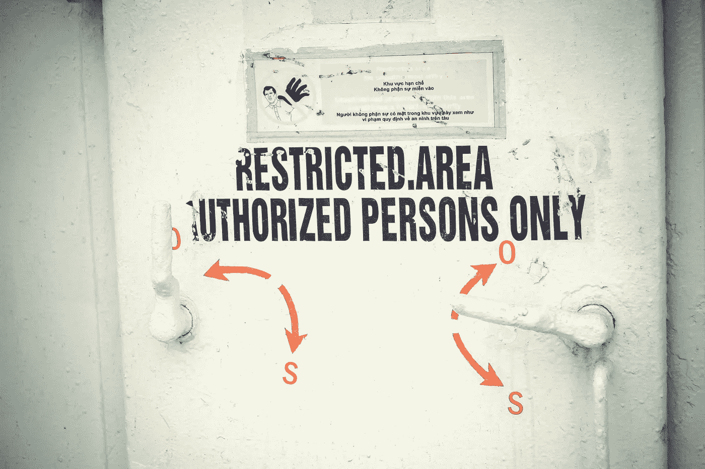

# 企业级安全测试完全指南

> 原文：<https://medium.com/codex/complete-guide-to-enterprise-level-security-testing-12e52c571b0b?source=collection_archive---------12----------------------->

随着全球技术领域的最新发展，所有大公司都在向更新的系统迁移。这些系统可能包括云系统、更新的 ERP 系统、SAP HANA 系统等。到更基本的迁移，比如从 Google 迁移到 Outlook 电子邮件服务。

这种迁移或公司向更先进的技术系统的发展增加了数据泄露的风险，并为恶意攻击者提供了更多的机会来入侵您公司的系统。

上面提到的是您确保在您的企业中建立高效的安全测试系统的数千个原因之一。

我将在下面更详细地向您介绍更多这样的原因…

# **安全测试对组织的重要性**

当今世界高度互联，因为消费者现在自信地依赖在线渠道进行交易。对于这样的设置，任何形式的安全漏洞都会降低客户的信心，并最终导致收入损失。根据研究结果，全球范围内的安全攻击数量呈指数级增长。

在这种情况下，安全测试的价值得到了提高，因为它被视为帮助组织识别其漏洞并进一步纠正安全错误的唯一权威。多年来，许多组织已经注册完成了他们的安全审计。这些措施对于保护关键应用程序免受意外渗透或破坏是必要的。

## **通常，安全测试有以下主要属性，这些属性是大多数安全测试公司提供的，也是客户寻求的:**

*   批准
*   证明
*   机密
*   有效性
*   不可否认性
*   弹性
*   完整

因此，用通俗的语言来说，组织的安全测试安排越广泛，在日益威胁的技术领域中维持下去的可能性就越大。以下是[软件测试公司](https://www.impactqa.com/)推动任何组织进行安全测试的最主要原因:

*   失去客户信任和忠诚度
*   网站宕机、时间损失和从损坏中恢复的成本
*   在线收入收集/生成方式的障碍
*   实施宽松的安全措施会产生相关的法律影响和费用

安全测试的主要目的是识别系统的脆弱性，并检查其数据和资源是否受到保护，以防潜在的入侵者。安全测试本质上是为了确保被测软件足够健壮，即使在恶意攻击的情况下也能按照设定的标准运行。

## **简单来说，安全测试的主要目标可以是:**

*   确保对识别安全风险给予足够的关注
*   确保 set 安全测试流程或方法的正常运行(稍后将详细介绍)
*   确保定义和实施系统访问的功能机制到位
*   确保您的团队有足够的资格来处理企业级安全测试项目(如果没有，您总是可以外包一个[安全测试服务](https://www.impactqa.com/services/security-testing/)提供商)
*   以确保您的组织不会面临关键数据意外泄露的风险并承担后果
*   通过简化数据审计将合规成本降至最低
*   通过积极防止他人非官方使用来维护您的数据完整性
*   遵守您所在国家的法律和合规标准

 [## DAST 与 SAST —选择最佳安全测试方法

### DAST 和 SAST 的主要区别是:开发人员普遍使用的应用程序测试方法。

impactqa.medium.com](https://impactqa.medium.com/dast-vs-sast-choose-the-best-security-testing-method-bbe3fbe29bfc) 

# ***想知道一个安全测试人员会做些什么来完成所有这些目标吗？***

他们识别威胁！

让我们跳到您的安全测试合作伙伴在您的安全测试过程中会发现的一些最常见的安全威胁

## **威胁 1 — SQL 注入**

当黑客将降级的 SQL 语句插入到输入字段中执行时，就会发生这样的安全攻击。SQL 注入的后果是最糟糕的，因为它会导致服务器数据库中机密信息的泄露。通过彻底检查几个输入字段，如注释、文本框等，可以很容易地防止这种情况。

## **威胁 2 — URL 操纵**

这是黑客操纵您的 URL 查询字符串来访问关键信息的过程。使用 HTTP GET 方法在客户机和服务器之间传递关键信息的应用程序通常容易受到这种攻击。

为了防止这种情况，测试人员必须更改参数，以确定服务器是否接受它。

## **威胁 3 —特权提升**

在这种攻击中，黑客使用他们现有的帐户将权限增加到最高级别，这有助于他们运行代码并最终使系统崩溃。

## **威胁 4 —数据操纵**

这是一种安全攻击，包括黑客获得对网站或应用程序数据的访问权，并为自己的利益修改这些数据。这主要是通过访问网站的 HTML 页面来完成的。

## **威胁 5 —未经授权的数据访问**

这是众所周知的安全攻击，黑客通过未经授权的手段获取数据。这些手段可以包括:

*   数据提取操作
*   访问评估
*   访问可重复使用的客户端认证信息

## **威胁 6 —身份欺骗**

在欺骗安全攻击的情况下，黑客使用合法用户或设备的凭证来攻击网络主机，以获得对数据的访问。您的公司需要完善的 IT 基础设施以及网络级别的缓解措施来防止此类攻击。

## **威胁 7 —拒绝服务**

拒绝服务(DoS)是一种主要的安全风险或攻击，攻击者的目的是使合法用户无法使用网络或系统资源。当软件或应用程序容易受到这种威胁时，应用程序或整个系统可能会在关键时刻崩溃。

## **威胁 8 —跨站点脚本(XSS)**

跨站点脚本或 XSS 风险使攻击者能够在网页中注入客户端脚本，并操纵它们点击 URL。一旦点击，代码会自动改变您的网站的行为方式，并给予攻击者从您的网站窃取关键信息和其他个人数据的权限。

 [## 安全测试自动化指南

### DevSecOps 是内置了安全性的 DevOps。阅读以了解这是一项如何将开发运维效率扩展到…

impactqa.medium.com](https://impactqa.medium.com/guide-to-devsecops-security-testing-automation-cc0119e91cce) 

# **安全测试方法**

下面提到的是一种有效的安全测试方法，它包括建立一个全面的系统来抵御针对软件应用程序的模拟网络攻击，以识别系统漏洞并进一步提出纠正建议。

## **1。创建威胁模型**

突出风险和威胁，并将其进一步细分

## **2。制定测试计划**

安全测试流程和所需资源的路线图

## **3。运行测试用例**

设计安全性的实现。用户界面安全性和发现系统漏洞

## **4。创建漏洞报告**

验证漏洞的存在，分析它们对系统的影响

## **5。执行 RCA(根本原因分析)**

分析已验证的错误并确定其根本原因，以提高项目质量

 [## 安全测试“威胁”和“方法”- ImpactQA

### 应用程序或软件容易受到各种类型的安全威胁，这些威胁可能会让您的…

www.impactqa.com](https://www.impactqa.com/blog/security-testing-threats-and-methodologies/) 

接下来，让我们快速浏览一下 10 大最佳安全测试工具，它们可以帮助您加快测试过程，加快产品上市时间

# **五大安全测试工具:**

*   浏览器开发框架
*   强力二进制测试仪
*   司闸员
*   低湿平原
*   Google Nogotofail
*   CROSS (Codenomicon 健壮开源软件)计划
*   Ettercap
*   Flawfinder
*   宪兵
*   敲门子域扫描
*   ZED 攻击代理(ZAP)等。
*   微焦点(Fortify)
*   编码安全性
*   怀特哈特安全公司

# **总之，安全测试是测试应用程序的一个非常重要的方面，原因如下-**

1.  对于支付网关应用来说，保护敏感信息至关重要
2.  您需要确保数据隐私，以获得客户的信任和忠诚，并围绕它建立良好的信誉
3.  及时的安全测试有助于降低发布后测试应用程序和修复错误的成本

您需要确保您的应用程序不会受到黑客的任何攻击，您的机密客户端数据受到保护，并且您的应用程序在市场上使用时不会停止工作。获得客户的信任、支持和进一步的推荐将有助于公司树立良好的声誉，并反过来获得更多的客户；理想情况下，帮助您将应用和业务扩展到新的高度。

希望你喜欢这篇报道！请在下面的评论区告诉我们你的想法。

*测试愉快！*

 [## 为什么您的业务需要移动测试自动化？

### 随着千禧一代移动应用使用水平的提高，几乎没有任何商业实体…

impactqa.medium.com](https://impactqa.medium.com/why-you-need-mobile-test-automation-for-your-business-87c73c31245b)