# 完整的 Kotlin 教程:第 8 部分(掌握 Kotlin 中的字符串)

> 原文：<https://medium.com/codex/complete-kolin-tutorial-part-8-mastering-strings-7727d9e85007?source=collection_archive---------11----------------------->

> 如果你是这个系列的新手，从这里的[](https://ajitsahoo29.medium.com/complete-kotlin-tutorial-part-1-introduction-to-kotlin-a8868fd9c0b9)**开始**
> 
> **上一篇帖子， ***第七部分*** 就是这里的[](https://ajitsahoo29.medium.com/complete-kolin-tutorial-part-7-conditions-with-conditionals-9686310d5816)**

****现在，让我们继续我们的旅程，了解琴弦如何在科特林中发挥作用。****

********

****字符串是一种数据类型。一系列字符组成一个**字符串**。每当我们想要处理字符串时，我们必须将它们括在**双引号**(" ")或**三引号**(" " " ")中。请记住，在字符数据类型的情况下使用单引号。在 Kotlin 中，字符串通常是不可变的。如果你想重新分配字符串变量，那么你必须在初始化字符串变量时使用 **var** 而不是 **val** 关键字。****

****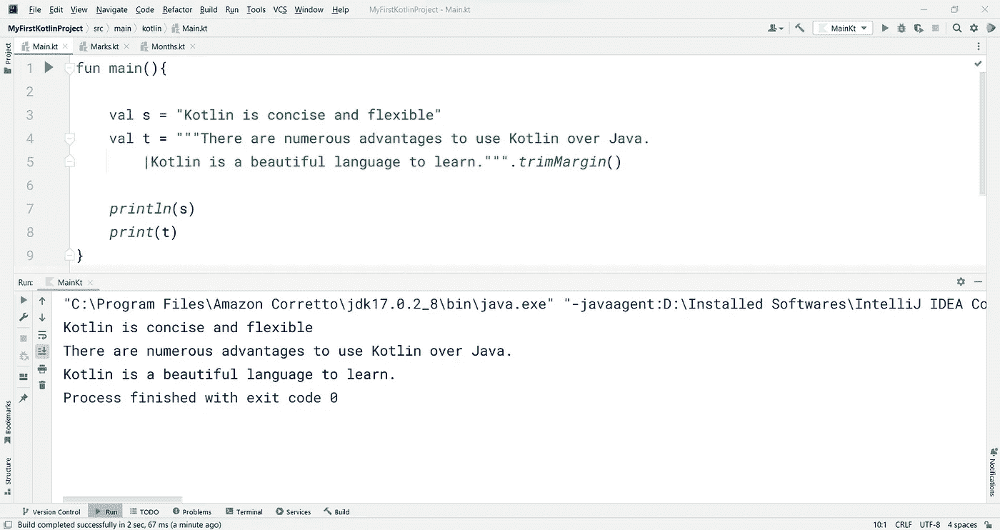****

****这是代码-****

```
**fun main(){

    val s = "Kotlin is concise and flexible"
    val t = """There are numerous advantages to use Kotlin over Java. 
        |Kotlin is a beautiful language to learn.""".*trimMargin*()

    *println*(s)
    *print*(t)
}**
```

****如果您尝试指定字符串的三重引号变体，每当您按下键盘上的 enter 键以移动到下一行时，IntelliJ IDEA 会自动以一种使用名为 ***trimMargin()*** 的函数的方式进行格式化。该函数删除前导空格。换句话说，这个函数格式化多行字符串。****

# ****转义字符串和原始字符串****

****如果你想对某个字符进行转义，以使它保持原样，我们在字符串中使用转义字符。这种类型的字符串被称为**转义字符串**。****

********

```
**fun main(){

    val s = "Kotlin is concise!\nIt is much better than Java."
    *print*(s)
}**
```

****在上面的代码中，很明显可以使用 */n* 转义符来完成多行字符串。****

****这些是科特林中可用的转义字符-****

*   ****`\t` - *插入标签*****
*   ****`\b` - *插入一个退格键*****
*   ****`\n` - *插入新的一行*****
*   ****`\r` - *插入回车*****
*   ****`\'` - *插入一个单引号字符*****
*   ****`\"` - *插入一个双引号字符*****
*   ****`\\` - *插入反斜杠*****
*   ****`\$` - *插入一个美元字符*****

******原始字符串**使用不带转义字符的多行字符串。这就是我们在上一节中使用三重引号的原因。这是一个原始字符串的例子。****

# ****查找字符串索引****

****在 Kotlin 中，字符串中的每个字符都从 0 开始进行索引。这意味着，0 是字符串中的第一个字符，1 是第二个字符，依此类推…****

****语法看起来像这样-****

> ****<string variable="">【索引号】</string>****

```
**fun main(){

    val s = "Kotlin is concise"

    *println*(s[0])
    *println*(s[1])
    *println*(s[2])
    *println*(s[3])
    *println*(s[4])
    *println*(s[5])
    *print*(s[6])
    *print*(s[7])
}**
```

****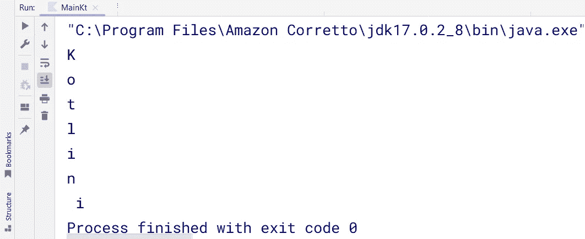****

****我已经将每个字符打印为 **K** ， **o** ， **t** ， **l** ， **i** ， **n** …我们的输出一切正常，如预期的那样。但是，为什么在 **i** 前有一个空格。只需查看代码的最后两行，我已经使用 print()函数在同一行中进行了打印。当我编码-***print(s[6])****它打印一个空格(空格也是 Kotlin 中的一个字符)到输出窗口，程序光标停留在那一行。然后我打印了第 7 个索引字符，即 **i** 。*****

*****如果你想得到字符串中最后一个字符的索引，那么你可以使用 Kotlin-的 **lastIndex** 属性*****

*****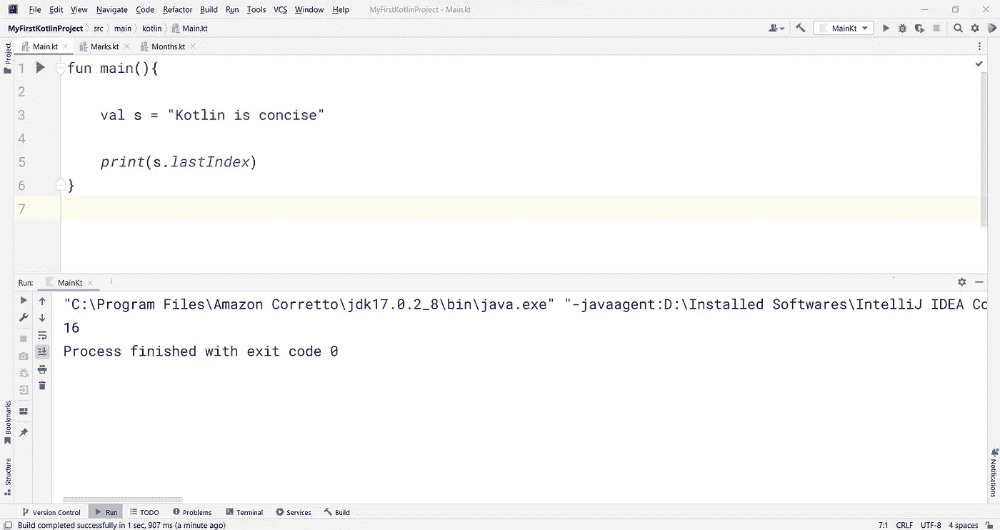*****

```
***fun main(){

    val s = "Kotlin is concise"

    *print*(s.*lastIndex*)
}***
```

# *****求字符串的长度*****

*****为了找到字符串的长度，即字符串中有多少个字符，我们使用了 **length** 属性。*****

*****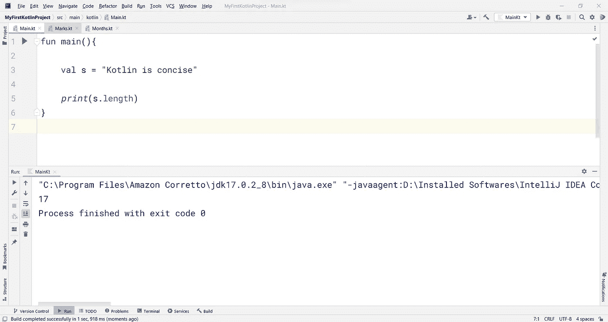*****

```
***fun main(){

    val s = "Kotlin is concise"

    *print*(s.length)
}***
```

*****同样，请注意空格也被计算在内。而且这里的编号是从 1 开始的，不是 0。*****

*****上述程序可以使用 Kotlin 的 **count()** 函数以另一种方式编码-*****

*****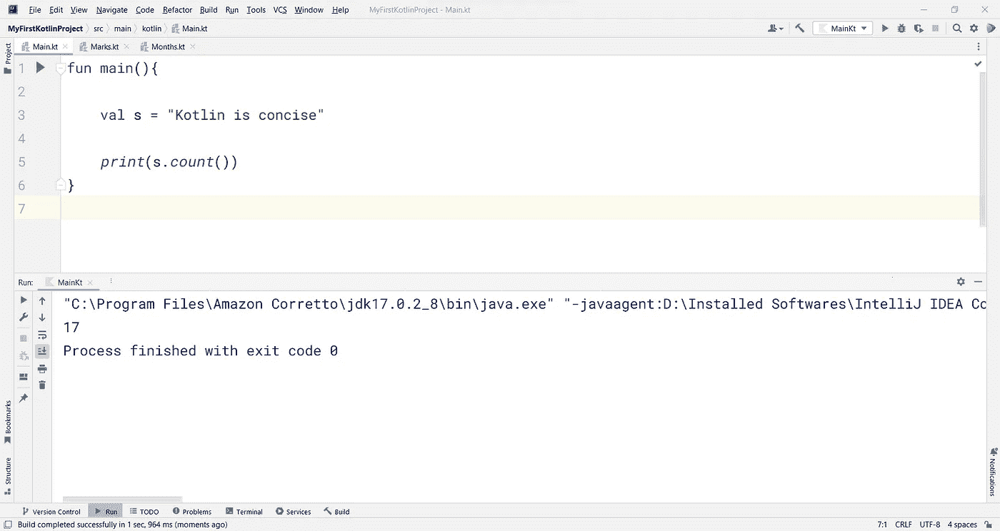*****

```
***fun main(){

    val s = "Kotlin is concise"

    *print*(s.*count*())
}***
```

# *****更改字符串中的大小写*****

*****我可以分别使用 **lowercase()** 和 **uppercase()** 函数，将字符串中所有字符的大小写转换为等价的小写或大写。*****

*****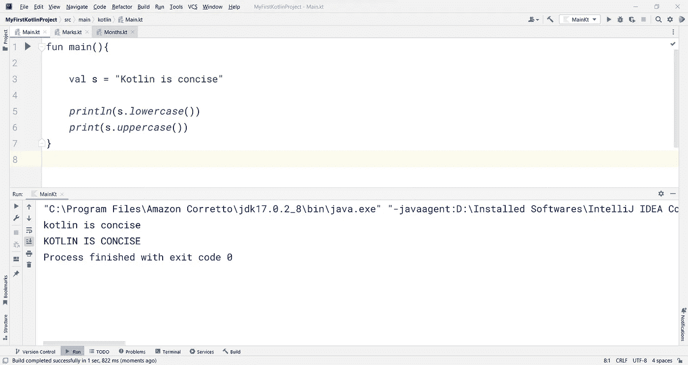*****

```
***fun main(){

    val s = "Kotlin is concise"

    *println*(s.*lowercase*())
    *print*(s.*uppercase*())
}***
```

# *****在字符串中切片*****

*****我们可以使用 **drop()** 和 **dropLast()** 函数从字符串中截取一些字符。 **drop()** 函数删除字符串的前几个字符， **dropLast()** 删除最后几个字符。*****

*****必须在 **drop()** 和 **dropLast()** 函数中传递一个数字，以便相应地删除该数量的字符。*****

*****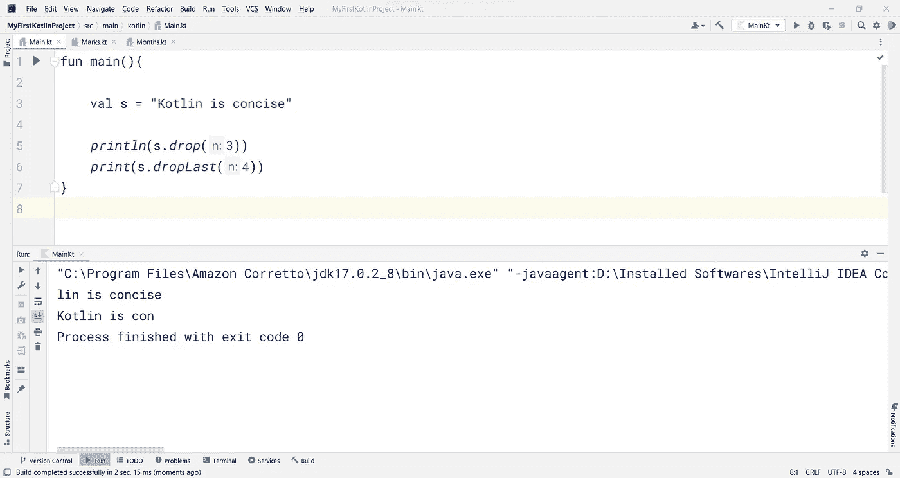*****

```
***fun main(){

    val s = "Kotlin is concise"

    *println*(s.*drop*(3))
    *print*(s.*dropLast*(4))
}***
```

*****类似地，切片可以从原始字符串创建子字符串，如下所示*****

*****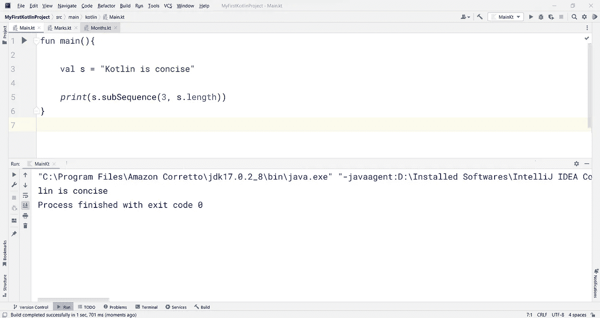*****

```
***fun main(){

    val s = "Kotlin is concise"

    *print*(s.subSequence(3, s.length))
}***
```

*****subSequence()函数的语法如下-*****

> *****<string variable="">。子序列(开始索引，结束索引)</string>*****

*****在上面的代码中，我将结束索引设置为字符串的长度。因此，它将从第三个索引(即，从字符串的第四个字符)开始，直到字符串的结束字符。*****

# *****比较两个字符串*****

*****假设我们想比较两个字符串是否相等。为此，我们可以使用 **compareTo()** 函数。如果两个字符串相等，该函数将返回 **0** ，否则，它将返回一个非零值。*****

*****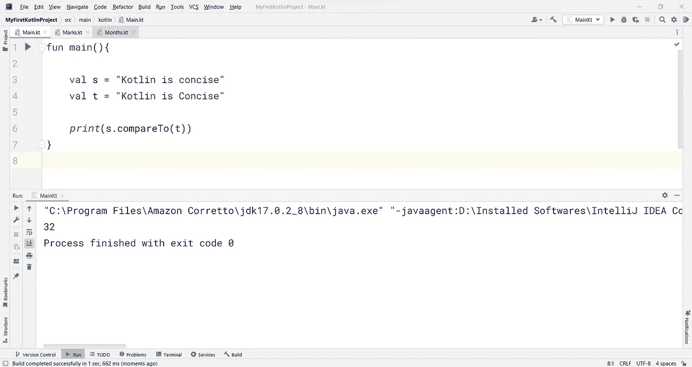*****

```
***fun main(){

    val s = "Kotlin is concise"
    val t = "Kotlin is Concise"

    *print*(s.compareTo(t))
}***
```

# *****使用字符串串联*****

*****每当我们想要连接两个字符串，我们通常使用加号(+)操作符连接，如下所示*****

*****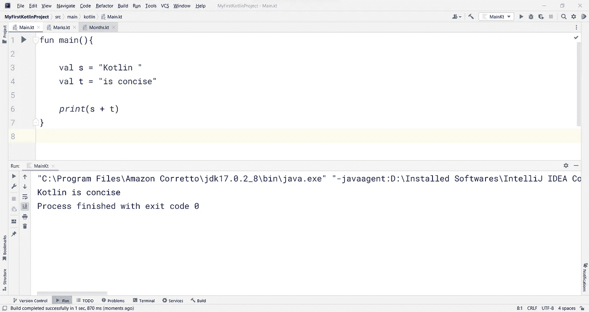*****

```
***fun main(){

    val s = "Kotlin "
    val t = "is concise"

    *print*(s + t)
}***
```

*****同样的代码可以使用 **plus()** 函数重写为-*****

*****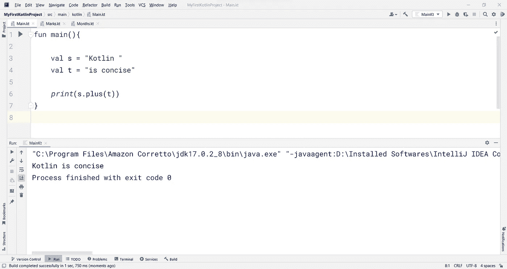*****

```
***fun main(){

    val s = "Kotlin "
    val t = "is concise"

    *print*(s.plus(t))
}***
```

# *****字符串模板*****

*******字符串模板**是一种将标识符的内容插入字符串的方式。*****

> *******例#1*******

*****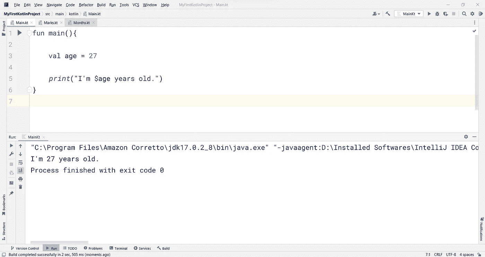*****

```
***fun main(){

    val age = 27

    *print*("I'm $age years old.")
}***
```

*****在上面的代码中，您可以在标识符(即变量的名称)前看到一个小小的美元符号($)。我使用这个字符串模板将年龄值插入到字符串中。*****

*****相同的代码可以使用字符串串联方法(如上所述)重写*****

*****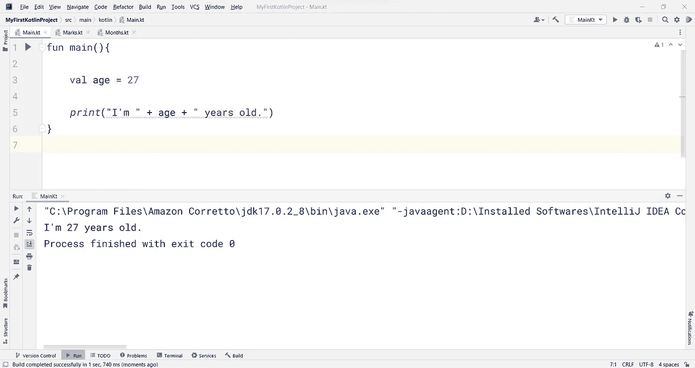*****

```
***fun main(){

    val age = 27

    *print*("I'm " + age + " years old.")
}***
```

*****你可以在上面的代码中看到一条曲线。这是因为我们的 IDE 说，“*字符串连接可以转换成模板*”。因此，建议在必要时使用字符串模板。*****

> *******例 2*******

*****您还可以在美元符号($)后的大括号中插入一个要计算的表达式。*****

**********

```
***fun main(){ *print*("The sum of 764 and 236 is ${764 + 236}")
}***
```

*****聪明的办法，对！😉*****

# *****从用户那里获得输入*****

*****我们可以在需要时从用户那里获取输入，并使用 **readln()** 或 **readLine()** 函数轻松地将其存储在一个变量中。*****

*****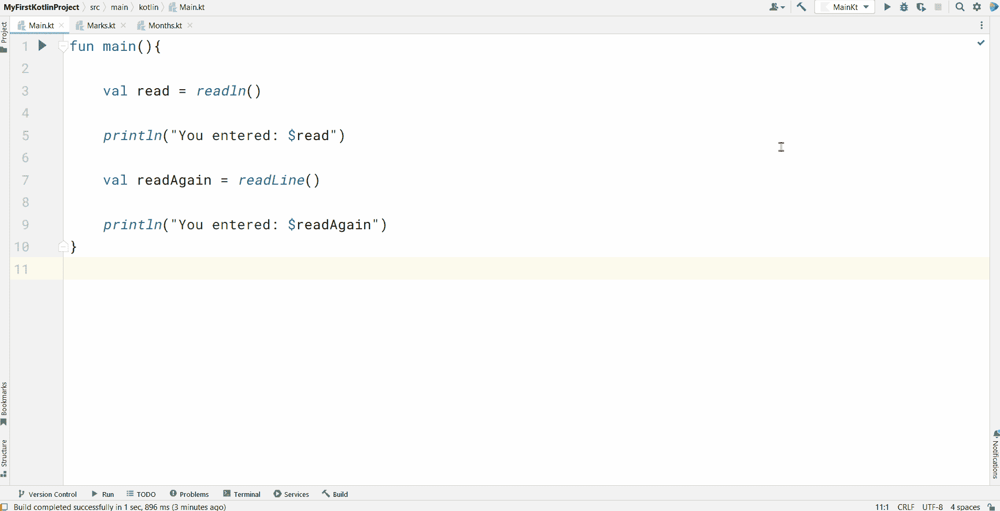*****

```
***fun main(){

    val read = *readln*()

    *println*("You entered: $read")

    val readAgain = *readLine*()

    *println*("You entered: $readAgain")
}***
```

*****因此，当我单击 run 按钮时，会出现一个提供输入的提示(来自用户)。然后将这个值存储在相应的变量中，最后打印出来。*****

*****这都是关于科特林的弦乐。*****

**********

*****照片由[沙哈达特·拉赫曼](https://unsplash.com/@hishahadat?utm_source=medium&utm_medium=referral)在 [Unsplash](https://unsplash.com?utm_source=medium&utm_medium=referral) 上拍摄*****

> *****→继续旅程[***第九部分***](https://ajitsahoo29.medium.com/complete-kolin-tutorial-part-9-playing-with-loops-aca47a70ddd1)*****

*******感谢阅读到目前为止…*******

*****✍️ *阿吉特·库马尔·萨胡******